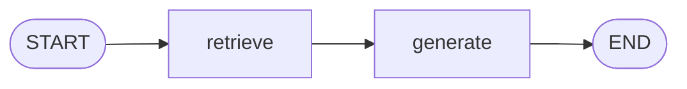
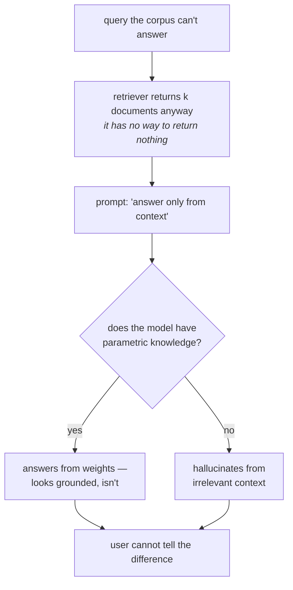

Ordinary RAG has three steps, and you already know them: **retrieval** (embed the query, search the vector store, get documents back), **augmentation** (staple those documents onto the query with a prompt), and **generation** (hand the whole thing to an LLM and let it answer).

Now look closely at what the augmentation prompt actually says. In its most common form it is some version of:

> *"Answer only from the context. If it is not in the context, say you don't know."*

Read that as an instruction and it sounds like a safety rail. Read it as an *architecture* and it says something else entirely: **the LLM must trust the retrieved documents blindly.** It has no licence to doubt them. Whatever the retriever handed over is, by construction, the truth of the matter.

That is fine exactly as long as the retriever is right. The rest of this note is about what happens when it isn't.

---

## The retriever always returns something

Here is the structural problem underneath everything.

A vector store asked for the top `k` documents **returns `k` documents**. Always. It has no way to say *"nothing in here is about that."* It computes distances and hands back the `k` smallest, however large those distances happen to be.

So imagine a vector store containing three machine-learning textbooks, and a user asking:

> *What is an LLM?*

There is nothing about large language models in those books. But the search still runs, still ranks, still returns four chunks. What comes back might be about **random forests**, or **XGBoost** — the least-far things it could find in a corpus that simply doesn't contain the answer.

Now feed that into the augmentation prompt. The LLM is told: *here is the question "what is an LLM", here are some documents about random forests, answer only from these documents.* It has been **forced to build an answer out of the wrong material**.

> [!danger] Scale this to a business.
> An employee asks the internal assistant what the leave policy is in some specific situation. That document does not exist in the vector store. The retriever returns the four least-unrelated HR chunks it can find. The assistant answers confidently. The employee believes it and acts on it.
>
> The implications, as the lecture puts it, can be very dangerous — not because the system crashed, but because it **failed silently and fluently.**

---

## Watching it happen

The lecture does not argue this abstractly; it builds the failure and shows it. The setup is worth knowing because every iteration that follows is built on top of this same code.

**The corpus** is three classic textbooks — *Hands-On Machine Learning*, *Deep Learning*, and *Pattern Recognition and Machine Learning*. Loaded as PDFs, they come to roughly **2,000 document objects** (one per page).

```python
docs = (
    PyPDFLoader("./documents/book1.pdf").load()
    + PyPDFLoader("./documents/book2.pdf").load()
    + PyPDFLoader("./documents/book3.pdf").load()
)

chunks = RecursiveCharacterTextSplitter(chunk_size=900, chunk_overlap=150).split_documents(docs)

# PDF extraction leaves stray surrogate characters that blow up on encode
for d in chunks:
    d.page_content = d.page_content.encode("utf-8", "ignore").decode("utf-8", "ignore")
```

Splitting takes it from ~2,000 pages to **over 6,000 chunks**. That `encode`/`decode` line is not decoration — PDF text extraction produces characters that raise a `UnicodeEncodeError` downstream, and stripping them is the cheapest fix.

```python
embeddings = OpenAIEmbeddings(model="text-embedding-3-large")
vector_store = FAISS.from_documents(chunks, embeddings)
retriever = vector_store.as_retriever(search_type="similarity", search_kwargs={"k": 4})

llm = ChatOpenAI(model="gpt-4o-mini", temperature=0)
```

**The graph is as simple as a graph gets** — two nodes, one edge between them:

```python
class State(TypedDict):
    question: str
    docs: List[Document]
    answer: str

def retrieve(state):
    return {"docs": retriever.invoke(state["question"])}

prompt = ChatPromptTemplate.from_messages([
    ("system", "Answer only from the context. If not in context, say you don't know."),
    ("human", "Question: {question}\n\nContext:\n{context}"),
])

def generate(state):
    context = "\n\n".join(d.page_content for d in state["docs"])
    out = (prompt | llm).invoke({"question": state["question"], "context": context})
    return {"answer": out.content}
```



That is traditional RAG in full. Everything CRAG adds will be inserted into the gap between those two nodes.

---

## Three questions, three different outcomes

### 1. A question the books answer

> *Explain the bias–variance tradeoff.*

The answer comes back solid — defines bias, defines variance, explains the tradeoff between them. And inspecting `res["docs"]` confirms why: **all four retrieved chunks genuinely discuss bias and variance.** The query was well served by the corpus, so the pipeline worked. Nothing to see.

### 2. A question the books obviously cannot answer

> *What are the top AI news from last month?*

Output: **"I don't know."**

The guardrail held. This is the case people point at when they say the prompt is enough.

### 3. The question that breaks it

> *What is a transformer in deep learning?*

The answer comes back fluent and, on its face, correct — a model architecture effective on sequential data, uses self-attention and feed-forward networks, unlike RNNs it doesn't process sequentially so it parallelises well, has become foundational in NLP.

Nothing about that is wrong. **And it is entirely ungrounded.**

Inspect the four retrieved chunks and none of them mentions transformers at all:

| Chunk | What it is actually about |
|---|---|
| 1 | multi-layer perceptrons |
| 2 | convolutional neural networks |
| 3 | regularization |
| 4 | index pages — bare heading text |

These three books are classics, written before transformers were a standard textbook topic. The architecture is not discussed in them. The retriever, having nothing better, returned the four nearest neighbours in a corpus that does not contain the answer.

---

## Where the answer actually came from

The model's **parametric knowledge** — the facts baked into its weights during training. It knows what a transformer is. It was told to answer only from the context, it found nothing usable in the context, and it quietly answered from memory instead.

> [!important] This is the failure, and its defining property is that **it is invisible**. The output does not look different from a correctly grounded one. There is no flag, no lower confidence, no note in the response. The only way to catch it is to read the retrieved documents yourself and notice they have nothing to do with the answer — which is exactly what nobody does in production.

So why did question 2 refuse and question 3 not? Because the model *had* parametric knowledge about transformers and *didn't* about last month's news. The refusal in case 2 was not the guardrail working. It was the model having nothing to fall back on.

Which sets up the genuinely dangerous version. Replace *"what is a transformer"* with *"what is our company's leave policy for X"*:

- The document is not in the vector store — so retrieval fails, exactly as before.
- The model has **no parametric knowledge** of your company's HR policy either.
- But it has been instructed to answer from the context, and the context contains four HR-flavoured chunks about something else.

Now it does not recite from memory. It **hallucinates**. And in a business setting, as the lecture puts it, that can be very, very bad.



---

## What is missing

Trace the pipeline again and find the step that checks retrieval quality.

There isn't one. Retrieval happens, and its output goes straight into generation. **Nothing in traditional RAG ever asks whether the retrieved documents are any good.** The architecture has no place to put that question.

That is the gap Corrective RAG fills.

---

> [!tip] Interview framing
> "The problem with traditional RAG is that the prompt tells the LLM to trust the retrieved documents blindly, and a vector store always returns `k` documents whether or not any of them are relevant — it has no way to say 'nothing here'. So on an out-of-corpus query you get the `k` least-unrelated chunks, and the model is forced to answer from the wrong material. In the demo, asking three ML textbooks about transformers returned chunks on MLPs, CNNs, regularization and an index page, and the model still produced a correct-sounding answer — from its parametric knowledge, not the context. That's the dangerous case, because the output is indistinguishable from a grounded one. And it gets worse when the model *doesn't* have parametric knowledge either — an internal HR policy, say — because then it hallucinates instead of reciting. The structural gap is that nothing in the pipeline ever evaluates retrieval quality before generating."
