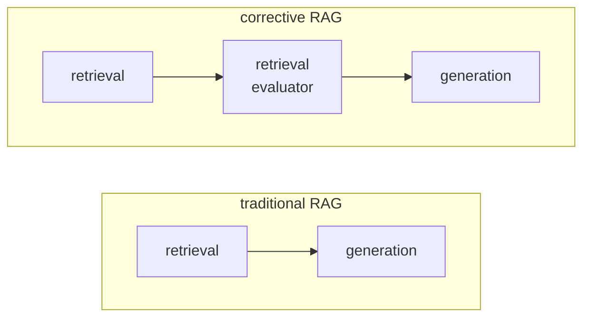
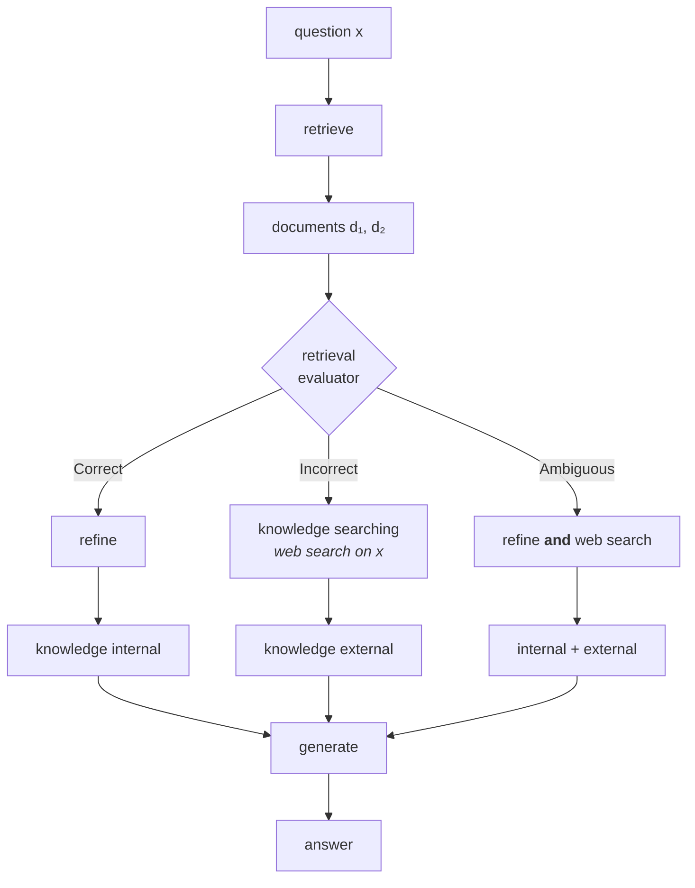

The gap is between retrieval and generation. That is where CRAG puts something.

In traditional RAG, the retrieved documents go straight to the LLM. **Corrective RAG intercepts them.** In that gap it seats a model whose only job is to look at the query and the retrieved documents and decide one thing: **are these documents actually useful for answering this question?**

That model is called the **retrieval evaluator**.

If the query is **what is an LLM** and the retrieved documents are about random forests, the evaluator's job is to notice that and say so — before anything reaches the generator.

---

## Three verdicts, three corrections

The evaluator does not answer yes or no. It sorts the retrieval into one of **three cases**, and each case gets a different corrective action. That structure is the whole design.

| Verdict | What it means | What CRAG does |
|---|---|---|
| **Correct** | the retrieved documents are relevant | proceed like normal RAG — but refine the documents first |
| **Incorrect** | none of them are relevant | discard them, go to an **external knowledge source** (web search) |
| **Ambiguous** | partly relevant, partly noise | do **both** — use what's good, and top it up from the web |

Take them one at a time.

**Correct.** Nothing exotic. The documents go to the LLM, the LLM answers from them. The only addition is a cleanup pass — see [[03-Knowledge-Refinement]].

**Incorrect.** This is where CRAG stops behaving like RAG. Rather than forcing the LLM to answer from documents it already knows are wrong, CRAG **leaves the corpus**. If the system has a web search tool attached, it searches the internet and answers from what comes back. Asked **what is an LLM** over a corpus of ML textbooks, the retriever returns random forests, the evaluator flags the retrieval as incorrect, and the system goes and looks it up instead.

**Ambiguous.** Some of the retrieved material genuinely addresses the query and some of it is junk. Neither pure path is right, so CRAG runs both: the good documents go forward as normal, a web search fills the rest, and the two are **merged into a single context** before generation.

---

## The naming that makes the paper readable

Two terms recur throughout, and they are worth fixing now because the code uses them too:

- **Knowledge internal** — context derived from your own retrieved documents.
- **Knowledge external** — context derived from web search.

Correct uses internal only. Incorrect uses external only. Ambiguous uses both.

---

## The paper's architecture

CRAG comes from a 2024 paper, and the lecture stays deliberately close to it. The architecture diagram reduces to this:

Note that even on the **correct** path the documents are not used as-is — they pass through a **refine** step first. That step is not a formality, and it is the subject of the next note.

---

## The one-sentence difference

> [!important] **Traditional RAG assumes retrieval succeeded. Corrective RAG checks.**
>
> Everything else — the refinement, the web search, the merging — follows from having somewhere to put that check. The three cases exist because once you are allowed to say retrieval failed, you need something to do about it.

---

## How the rest of these notes are built

The lecture does not construct the full architecture in one go — it starts from the two-node traditional RAG graph of [[01-Why-Corrective-RAG]] and adds **one feature at a time**, five iterations, each a working system:

| Iteration | Feature added | Note |
|---|---|---|
| 1 | knowledge refinement | [[03-Knowledge-Refinement]] |
| 2 | retrieval evaluation and the three verdicts | [[04-Retrieval-Evaluation]] |
| 3 | web search on the **incorrect** path | [[05-Web-Search-Fallback]] |
| 4 | query rewriting before web search | [[06-Query-Rewriting-For-Search]] |
| 5 | the **ambiguous** path | [[07-The-Ambiguous-Path]] |

Reading them in order is worth it. Each iteration's code is the previous iteration's code plus one node, and the diffs are small enough to hold in your head — which is the point of building it this way rather than presenting the finished graph.

---

> [!tip] Interview framing
> **Corrective RAG puts a retrieval evaluator between retrieval and generation. It looks at the query and the retrieved chunks and returns one of three verdicts. If the retrieval is correct, you proceed like normal RAG. If it's incorrect, you discard the chunks entirely and fall back to an external knowledge source — typically web search. If it's ambiguous, you keep the usable chunks, search the web for the rest, and merge both into one context. The one-line difference from traditional RAG is that traditional RAG assumes retrieval succeeded and CRAG checks. The paper's terms are 'knowledge internal' for the corpus side and 'knowledge external' for the web side, and the three verdicts map onto internal-only, external-only, and both.**
