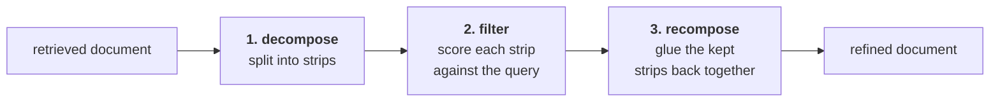

Start with the case where nothing went wrong. Retrieval was **correct** — the documents genuinely address the query. Traditional RAG would send them straight to the LLM. CRAG doesn't. It refines them first.

Why bother, if they're already the right documents?

---

## Because chunking has no idea what a topic is

Go back to how those documents came into existence. The splitter was told:

```python
RecursiveCharacterTextSplitter(chunk_size=900, chunk_overlap=150)
```

Every 900 characters, a new chunk begins. **No thought is given to whether one topic belongs in one chunk.** The boundary lands where the character count says it lands.

Two things follow, and both are common:

- one topic gets **split across two chunks**
- one chunk ends up **covering more than one topic**

The second is the one that matters here. A chunk that is genuinely relevant can carry irrelevant material along with it — not because retrieval was wrong, but because the chunk boundary was arbitrary.

### The example

Query: *What is gradient descent?*

The retrieved chunk `D1` reads roughly:

> Gradient descent is an optimization algorithm used to minimize a loss function. It iteratively updates parameters in the direction of the negative gradient. **Neural networks are composed of layers of neurons with non-linear functions. Convolutional neural networks are particularly effective for image processing tasks.**

The first half answers the question. The bolded half is about something else entirely — it arrived because the 900-character window happened to straddle a paragraph boundary. The chunk was correctly retrieved *and* is half noise.

That noise goes into the context window, costs tokens, and gives the generator material to wander into. Refinement removes it.

---

## Decompose → filter → recompose

Three steps, in the paper's phrasing a **decompose-then-recompose** algorithm:



**Step 1 — decomposition.** Break the document into **strips**. The paper doesn't specify the mechanics in detail; it says a strip is roughly one sentence, or a group of two. The gradient-descent chunk above breaks into four:

| Strip | Content |
|---|---|
| S1 | gradient descent is an optimization algorithm… |
| S2 | it iteratively updates parameters… |
| S3 | neural networks are composed of layers… |
| S4 | convolutional neural networks are effective for images… |

**Step 2 — filtration.** Send the query and each strip, one at a time, to a model. It returns a **confidence score**: how relevant is this strip to answering this query? Here S1 and S2 score as useful; S3 and S4 do not. Four strips in, two survive.

**Step 3 — recomposition.** Merge the surviving strips back into a single passage. That passage — not the original chunk — is what goes to generation.

And this runs **per retrieved document**. Every document that survives to this stage gets decomposed, filtered and recomposed independently.

---

## The model doing the filtering

The paper does not use a general-purpose LLM here. It uses **T5-large** — a Google encoder–decoder transformer, **770 million parameters** — **fine-tuned specifically for this filtering task**, and gives two reasons for it:

- it is **lightweight and free** to run, next to an API-billed LLM
- on this particular task its performance is **better than an LLM's**, precisely because it was fine-tuned for it

> [!warning] The authors never released the fine-tuned checkpoint. They state which base model they used and nothing more, so there is no weight file to download. The lecture substitutes `ChatOpenAI` out of necessity, not preference — and the same substitution recurs for the retrieval evaluator in [[04-Retrieval-Evaluation]].
>
> Worth carrying into an interview: a small fine-tuned scorer beating a large general model on a narrow classification task is the expected result, not a surprise. The obstacle to reproducing the paper here is availability, not architecture.

---

## In code

The state grows three fields, all of them intermediate products of the three steps:

```python
class State(TypedDict):
    question: str
    docs: List[Document]

    strips: List[str]          # output of decomposition
    kept_strips: List[str]     # what survived filtering
    refined_context: str       # the recomposed passage

    answer: str
```

### Decomposition is a regex

```python
def decompose_to_sentences(text: str) -> List[str]:
    text = re.sub(r"\s+", " ", text).strip()
    sentences = re.split(r"(?<=[.!?])\s+", text)
    return [s.strip() for s in sentences if len(s.strip()) > 20]
```

Collapse whitespace, split on sentence-ending punctuation followed by a space, and **drop anything under 20 characters**. That length filter is doing quiet work — PDF extraction produces fragments, page numbers and stray headings, and none of them are worth paying an LLM call to evaluate.

The lookbehind `(?<=[.!?])` splits *after* the punctuation rather than consuming it, so the sentences come out with their full stops intact.

### Filtration is a structured-output chain

```python
class KeepOrDrop(BaseModel):
    keep: bool

filter_prompt = ChatPromptTemplate.from_messages([
    ("system",
     "You are a strict relevance filter.\n"
     "Return keep=true only if the sentence directly helps answer the question.\n"
     "Use ONLY the sentence. Output JSON only."),
    ("human", "Question: {question}\n\nSentence:\n{sentence}"),
])

filter_chain = filter_prompt | llm.with_structured_output(KeepOrDrop)
```

The schema is a single boolean, which is as narrow as a decision can be made. Three phrases in that prompt are load-bearing:

- **"strict"** — the default failure mode of an LLM judge is generosity; almost any sentence *could* be argued relevant
- **"directly helps answer the question"** — sets the bar at direct help, not topical adjacency
- **"Use ONLY the sentence"** — judge the strip in isolation, don't reason about what the surrounding document probably said

> [!note] The paper scores each strip with a **confidence score** and thresholds it. The implementation asks for a **boolean** instead. Same decision, thresholded inside the model rather than outside it — simpler, but it means there is no knob to tune here later. The evaluator in the next note keeps the score.

### The refine node

```python
def refine(state: State) -> State:
    q = state["question"]

    context = "\n\n".join(d.page_content for d in state["docs"]).strip()

    strips = decompose_to_sentences(context)          # 1) DECOMPOSE

    kept: List[str] = []                              # 2) FILTER
    for s in strips:
        if filter_chain.invoke({"question": q, "sentence": s}).keep:
            kept.append(s)

    refined_context = "\n".join(kept).strip()         # 3) RECOMPOSE

    return {"strips": strips, "kept_strips": kept, "refined_context": refined_context}
```

Notice it **joins all retrieved documents into one context string first**, then decomposes that. So in practice the strips come from the whole retrieval, not document by document — a simplification of the paper's per-document loop that produces the same set of strips.

The generator now reads `refined_context` rather than the raw documents:

```python
answer_prompt = ChatPromptTemplate.from_messages([
    ("system",
     "You are a helpful ML tutor. Answer ONLY using the provided refined bullets.\n"
     "If the bullets are empty or insufficient, say: "
     "'I don't know based on the provided books.'"),
    ("human", "Question: {question}\n\nRefined context:\n{refined_context}"),
])
```

### One node, inserted

```python
g.add_edge(START, "retrieve")
g.add_edge("retrieve", "refine")
g.add_edge("refine", "generate")
g.add_edge("generate", END)
```


That is the entire diff from traditional RAG: one node between the two that were already there.

---

## What it does to the output

Running *"Explain the bias–variance tradeoff"*, the answer is **almost the same** as before — slightly more point-wise in structure, because it is now built from a list of surviving sentences rather than flowing prose.

The visible change is in the context. Four full 900-character chunks go in; what comes out as `refined_context` is a fraction of that. The lecture's framing is the right one to keep: *out of four documents, how much was actually useful? This much.*

---

## The cost this introduces

Read the filter loop again and count the calls.

```python
for s in strips:
    if filter_chain.invoke(...).keep:
```

**One LLM call per sentence.** Four retrieved chunks of 900 characters each is a few dozen sentences, so a single query now costs a few dozen small model calls before generation even starts, and they run sequentially.

This is precisely why the paper reaches for a 770M fine-tuned T5 rather than an API-billed LLM: the design assumes the filter is cheap. Substituting an LLM keeps the behaviour and loses that assumption.

---

## Guarantees

**It guarantees** the generator sees only sentences that a model judged directly relevant — noise introduced by arbitrary chunk boundaries is stripped before generation.

**It does not guarantee** the documents were the right ones. Refinement operates *inside* whatever retrieval returned; if retrieval was wrong, refinement produces a cleaner version of the wrong thing. Checking that is the next iteration's job.

---

> [!tip] Interview framing
> "Knowledge refinement exists because chunking is arbitrary — you split every 900 characters, so a chunk that's genuinely relevant often carries unrelated material that just happened to fall inside the same window. The paper's fix is decompose-then-recompose: break each document into strips of roughly a sentence, score each strip against the query, drop the ones that don't help, and glue the survivors back into a passage. The paper used a fine-tuned T5-large — 770M parameters, cheaper than an LLM and better at this specific task because it was fine-tuned for it — but the checkpoint was never released, so implementations substitute an LLM with structured output. The thing to notice about that substitution is cost: it's one model call per sentence, sequentially, and the paper's design assumed that call was nearly free."
