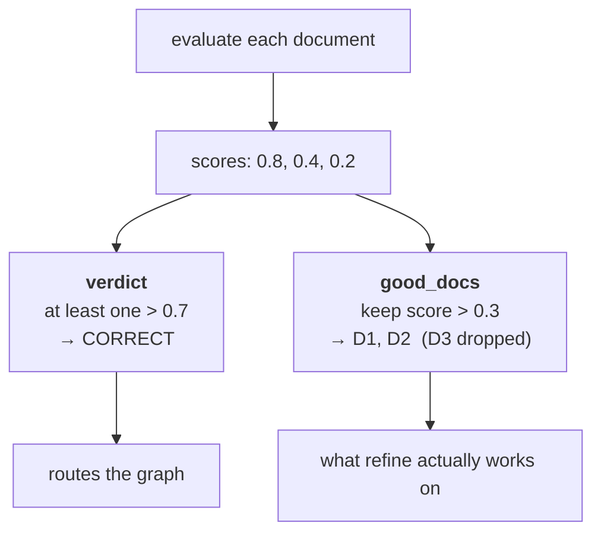
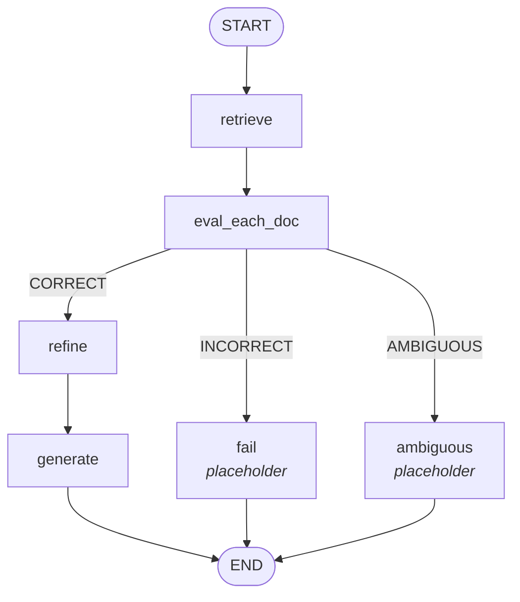

Refinement cleans up documents. It never asks whether they should have been retrieved at all. This iteration adds that question.

The goal: after retrieval, decide whether the retrieval was **good, bad, or somewhere in between** — and store that verdict so the graph can route on it.

---

## Scoring one document at a time

The mechanism is deliberately simple. Send the evaluator **one document and the question**, and ask it for a **relevance score between 0 and 1**:

- **1.0** — this chunk alone is enough to answer the question fully
- **0.0** — this chunk is irrelevant

Repeat for every retrieved document. Four documents, four scores.

So if `k=4` returned two documents, you might get `D1 = 0.8` and `D2 = 0.5`. Those two numbers are all the verdict is derived from.

> [!note] The lecture speaks these as bare digits — *"eight"*, *"five"*, *"nine"* — but the scale is **0 to 1** throughout, and the code confirms it. Read every spoken digit as a decimal: 8 is 0.8, 5 is 0.5.

---

## Two thresholds, three verdicts

```python
UPPER_TH = 0.7
LOWER_TH = 0.3
```

Both are tunable, and the paper does not say what values the authors used — these are the lecture's choices.

The rules:

| Verdict | Criterion |
|---|---|
| **Correct** | **at least one** document scores **> 0.7** |
| **Incorrect** | **no** document scores **> 0.3** |
| **Ambiguous** | anything else |

Work through the examples.

**`D1 = 0.8`, `D2 = 0.5`** → D1 is above 0.7, so **Correct**. One strong document is enough to say the retrieval succeeded; the weaker one doesn't drag the verdict down.

**`D1 = 0.1`, `D2 = 0.2`** → neither clears 0.3, so **Incorrect**. Nothing retrieved is sufficient to answer the question, which is the trigger to go and search the web.

**A single document at 0.55** → above the lower threshold, below the upper. **Ambiguous.**

> [!important] The two rules are deliberately asymmetric.
>
> **Correct** needs only *one* document to be strong. **Incorrect** needs *every* document to be weak. Both bars are hard to reach, which pushes borderline retrievals into the ambiguous bucket rather than letting them be confidently mislabelled either way.
>
> Ambiguous is not a leftover category. It is where the system deposits the cases it is not sure about, and [[07-The-Ambiguous-Path]] gives it a genuine strategy.

---

## The rule that is easy to miss

Here is a second, separate rule, and the lecture flags it as an important point from the paper.

Suppose three documents come back: `D1 = 0.8`, `D2 = 0.4`, `D3 = 0.2`.

The verdict is **Correct** — D1 clears 0.7. But you do **not** use all three documents for generation.

> **Only documents scoring above the lower threshold are used for generation.**

So D1 (0.8) is used. D2 (0.4) is used. **D3 (0.2) is dropped**, even though the retrieval as a whole was judged correct.

The verdict and the document set are two different outputs of the same step. The verdict decides which *path* the graph takes; the threshold decides which *documents* travel down it. A retrieval can be correct overall and still contain individual chunks that deserve to be thrown away.



---

## Which model evaluates

Same story as refinement. The paper uses the **fine-tuned T5-large** — the very same one, doing double duty as evaluator and filter — for the same two reasons: it is cheaper, and being fine-tuned for the task it outperforms an LLM at it. And again the checkpoint was never released, so an LLM stands in.

---

## In code

### The schema asks for a reason too

```python
class DocEvalScore(BaseModel):
    score: float
    reason: str
```

The `reason` is not used for routing. It exists so that when a verdict looks wrong you can see *why* a chunk got 0.5, rather than staring at a bare float. Worth copying — a scoring judge without an explanation field is very hard to debug.

### The prompt

```python
doc_eval_prompt = ChatPromptTemplate.from_messages([
    ("system",
     "You are a strict retrieval evaluator for RAG.\n"
     "You will be given ONE retrieved chunk and a question.\n"
     "Return a relevance score in [0.0, 1.0].\n"
     "- 1.0: chunk alone is sufficient to answer fully/mostly\n"
     "- 0.0: chunk is irrelevant\n"
     "Be conservative with high scores.\n"
     "Also return a short reason.\n"
     "Output JSON only."),
    ("human", "Question: {question}\n\nChunk:\n{chunk}"),
])

doc_eval_chain = doc_eval_prompt | llm.with_structured_output(DocEvalScore)
```

**"ONE retrieved chunk"** in capitals, and **"chunk *alone* is sufficient"** — both insist the chunk is judged in isolation, not as part of a set. That is what makes the scores independent enough to threshold.

**"Be conservative with high scores"** is the calibration knob. Without it an LLM judge inflates, and since the *correct* verdict fires on a single score above 0.7, inflation would route almost everything down the correct path and quietly restore the original problem.

### The evaluator node

```python
def eval_each_doc_node(state: State) -> State:
    q = state["question"]
    scores, reasons, good = [], [], []

    for d in state["docs"]:
        out = doc_eval_chain.invoke({"question": q, "chunk": d.page_content})
        scores.append(out.score)
        reasons.append(out.reason)

        if out.score > LOWER_TH:          # the drop rule, applied here
            good.append(d)

    if any(s > UPPER_TH for s in scores):
        return {"good_docs": good, "verdict": "CORRECT",
                "reason": f"At least one retrieved chunk scored > {UPPER_TH}."}

    if len(scores) > 0 and all(s < LOWER_TH for s in scores):
        return {"good_docs": [], "verdict": "INCORRECT",
                "reason": f"All retrieved chunks scored < {LOWER_TH}. No chunk was sufficient."}

    return {"good_docs": good, "verdict": "AMBIGUOUS",
            "reason": f"No chunk scored > {UPPER_TH}, but not all were < {LOWER_TH}. "
                      f"Mixed relevance signals."}
```

The three returns are the three verdicts, in order, and the ordering matters: `CORRECT` is tested first, `INCORRECT` second, and `AMBIGUOUS` is the fall-through. On the `INCORRECT` branch `good_docs` is explicitly `[]` — there is nothing worth keeping.

### State and the refine change

```python
class State(TypedDict):
    question: str
    docs: List[Document]

    good_docs: List[Document]     # NEW — survived the lower threshold
    verdict: str                  # NEW — CORRECT / INCORRECT / AMBIGUOUS
    reason: str                   # NEW — why

    strips: List[str]
    kept_strips: List[str]
    refined_context: str
    answer: str
```

And one line inside `refine` changes:

```python
# before
context = "\n\n".join(d.page_content for d in state["docs"]).strip()
# after
context = "\n\n".join(d.page_content for d in state["good_docs"]).strip()
```

Refinement now operates on the documents that survived the lower threshold, not on everything retrieved. That is the drop rule taking effect.

### The graph, with two paths stubbed out

Only the **correct** path is wired for real at this stage. Incorrect and ambiguous get placeholder nodes that print the verdict and stop — the web search that belongs on the incorrect path arrives in [[05-Web-Search-Fallback]].

```python
def fail_node(state):      return {"answer": f"FAIL: {state['reason']}"}
def ambiguous_node(state): return {"answer": f"Ambiguous: {state['reason']}"}

def route_after_eval(state) -> str:
    if state["verdict"] == "CORRECT":
        return "refine"
    elif state["verdict"] == "INCORRECT":
        return "web_search"
    else:
        return "ambiguous"

g.add_conditional_edges(
    "eval_each_doc",
    route_after_eval,
    {"refine": "refine", "web_search": "fail", "ambiguous": "ambiguous"},
)
```

The routing function already returns `"web_search"`, but the edge map points that label at `fail`. A named placeholder now, a real node later, with no change to the router.



---

## All three verdicts, demonstrated

The same three books, three queries chosen to land in three different buckets:

**`Bias variance tradeoff`** → **CORRECT**. Reason: *at least one retrieved chunk scored > 0.7*. The topic is squarely covered by all three textbooks, so at least one chunk was always going to score high. Answer generated normally.

**`AI news from last week`** → **INCORRECT**. Reason: *all retrieved chunks scored < 0.3*. Nothing in decades-old textbooks resembles recent news. At this stage the output is just the failure message — there is nowhere else to go yet.

**`What are attention mechanisms and why are they important in current models?`** → **AMBIGUOUS**. And this one was found by experimentation, not by luck. It is deliberately two questions bolted together: attention mechanisms are touched on in one of the books, while *why they matter in current models* is not covered anywhere. So no chunk clears 0.7, but not everything falls below 0.3. Reason: *mixed relevance signals*.

> [!info] That third query is the useful one to remember. Ambiguity in practice is rarely a query the corpus half-understands — it is a query with **more than one part**, where the corpus covers some parts and not others. That is also why merging internal and external knowledge is the right correction for it.

---

## Guarantees

**It guarantees** the system now has an explicit, inspectable judgement about retrieval quality — available as `verdict` and `reason` in state, before any answer is generated.

**It does not guarantee** the judgement is right. It is an LLM scoring text against text, subject to every LLM-judge failure: inflation, sensitivity to phrasing, inconsistency across runs. The `reason` field and the "be conservative" instruction are mitigations, not fixes. And the thresholds are two magic numbers with no principled derivation — the paper does not supply them.

---

> [!tip] Interview framing
> "The retrieval evaluator scores each retrieved chunk against the question on a 0-to-1 relevance scale, then applies two thresholds. Correct means at least one chunk cleared the upper threshold — 0.7 here. Incorrect means no chunk cleared the lower one, 0.3. Everything else is ambiguous. Those rules are deliberately asymmetric: correct needs one strong chunk, incorrect needs every chunk to be weak, so borderline cases fall into ambiguous rather than being confidently mislabelled. There's a second rule that's easy to miss — even on the correct path, only chunks above the lower threshold are actually used for generation, so a retrieval can be judged correct and still have individual chunks discarded. The verdict routes the graph; the threshold picks the documents. The paper used the same fine-tuned T5-large as the refiner; implementations substitute an LLM with a structured output of score plus a short reason, and the reason field is what makes a bad verdict debuggable."
