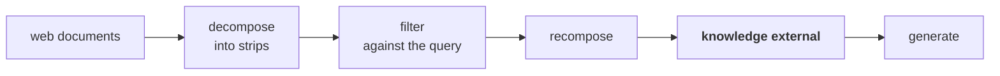
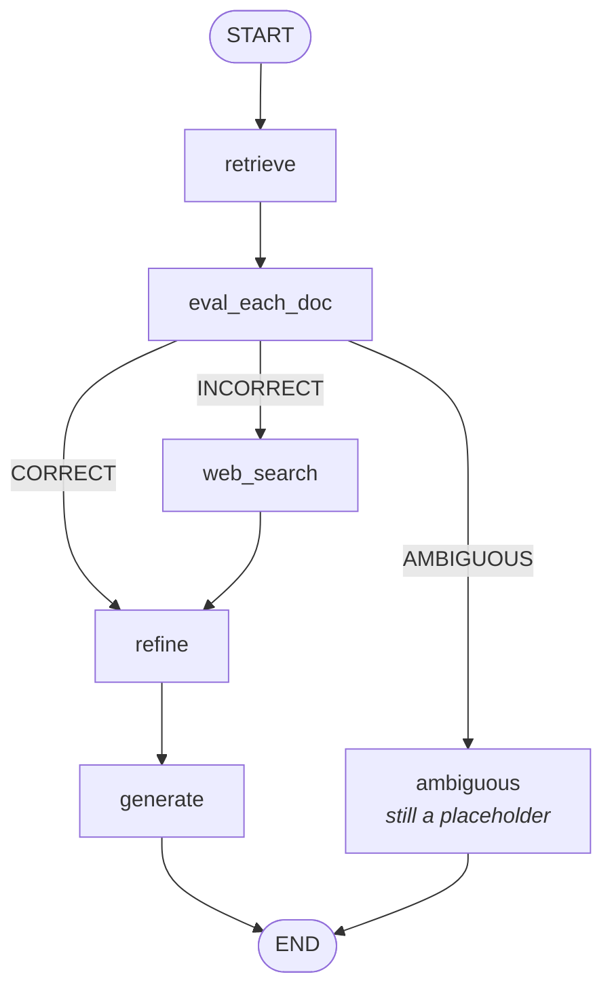

The evaluator can now say **incorrect**. So far that verdict does nothing except print a failure message and stop. This iteration gives it somewhere to go.

The principle is worth stating before the mechanism:

> Even when the retrieved documents cannot answer the question, we do not want to send the user away empty-handed. We want to show them the right result — **even if we have to go to the web to find it.**

That is what makes the system robust rather than merely honest. Traditional RAG at its best says **I don't know.** CRAG treats **I don't know from my corpus** as a reason to look elsewhere.

---

## The complication

Connecting a search API to a LangGraph node is not the hard part. The hard part is what comes back.

A web search returns **multiple results** — like a page of search hits, one after another. And there is no reason to expect all of them are useful for answering the question. Some will be on point, some will be tangential, some will be a listicle that happened to rank well.

Which is the same problem as before: **retrieved material that needs filtering.**

Reading the paper closely, that is exactly what it prescribes. Documents that come back from web search are **also put through knowledge refinement** — and generation runs only on the refined result:



That is **the identical three-step process** from [[03-Knowledge-Refinement]] — decompose, filter, recompose. The only difference is where the documents came from.

---

## Which means you reuse the nodes

Once you see that both paths end in the same refinement, the graph shape follows:

| Verdict | Path |
|---|---|
| **Correct** | retrieve → evaluate → **refine → generate** |
| **Incorrect** | retrieve → evaluate → web search → **refine → generate** |

The `refine` and `generate` nodes are shared. There is no need for a second refinement implementation and a second generation implementation for the web branch — the two paths differ only in **which documents** reach `refine`, and state can carry that difference.



---

## In code

### State grows one field

```python
web_docs: List[Document]     # NEW — what came back from the web
```

### Refine learns to branch

This is the only change to an existing node, and it is three lines:

```python
def refine(state: State) -> State:
    q = state["question"]

    if state.get("verdict") == "CORRECT":
        context = "\n\n".join(d.page_content for d in state["good_docs"]).strip()
    else:
        context = "\n\n".join(d.page_content for d in state["web_docs"]).strip()

    # decompose → filter → recompose, exactly as before
```

`refine` reads the verdict out of state and picks its input accordingly: the corpus documents that survived the lower threshold, or the web documents. **Everything below that branch is untouched** — same decomposer, same filter chain, same recomposition.

### The web search node

```python
tavily = TavilySearchResults(max_results=5)

def web_search_node(state: State) -> State:
    q = state["question"]              # not rewritten yet — that's the next iteration
    results = tavily.invoke({"query": q})

    web_docs = []
    for r in results or []:
        title   = r.get("title", "")
        url     = r.get("url", "")
        content = r.get("content", "") or r.get("snippet", "")

        text = f"TITLE: {title}\nURL: {url}\nCONTENT:\n{content}"
        web_docs.append(Document(page_content=text, metadata={"url": url, "title": title}))

    return {"web_docs": web_docs}
```

Nothing difficult here. Take the question, hand it to **Tavily**, pull `title`, `url` and `content` out of each result, and wrap each one in a `Document` so that everything downstream can treat web results and corpus chunks identically.

Two details worth noticing:

- The URL goes into **both** `page_content` and `metadata`. In the page content it becomes part of what the filter sees; in metadata it survives as a citation handle.
- `r.get("content", "") or r.get("snippet", "")` — a fallback for results that carry a snippet instead of full content.

### The graph edit

The `fail` node is deleted; `web_search` takes its place, and gains an outgoing edge into `refine`:

```python
g.add_node("web_search", web_search_node)

g.add_conditional_edges(
    "eval_each_doc",
    route_after_eval,
    {
        "refine":     "refine",       # CORRECT   → refine(good_docs)
        "web_search": "web_search",   # INCORRECT → web_search
        "ambiguous":  "ambiguous",    # AMBIGUOUS → still stops here
    },
)

g.add_edge("web_search", "refine")    # the new edge
g.add_edge("refine", "generate")
```

`route_after_eval` is unchanged from the previous iteration — it was already returning `"web_search"`; only the node it maps to is real now.

The ambiguous branch still terminates in a placeholder. It gets built in [[07-The-Ambiguous-Path]].

---

## The query that used to fail

> **AI news from the last month**

**Verdict: INCORRECT** — as before, no chunk in three ML textbooks scores above 0.3 on a question about last month.

But the output is **no longer empty**. It now reports what the web returned: an open-source AI assistant that gained substantial popularity, and physical AI having a strong presence at CES 2026.

Same question, same corpus, same verdict — different outcome, because the verdict is now actionable.

---

## What this actually bought

> [!important] The system now has **two knowledge sources and a rule for choosing between them**. That is the real structural change, and it is bigger than **we added web search**.
>
> Traditional RAG has exactly one place to look and no way to know it looked in the wrong place. CRAG has a corpus, an external source, and an evaluator that decides which one the question belongs to.

---

## Guarantees

**It guarantees** that a query the corpus cannot answer still produces a grounded answer rather than a dead end — grounded in web results, refined the same way corpus documents are.

**It does not guarantee** the web result is any better. It inherits everything wrong with web search: stale pages, SEO spam, contradictory sources, and no notion of authority. The refinement pass filters for **relevance**, not for **truth**.

And it does not distinguish between **the corpus doesn't cover this** and **the corpus covers it but retrieval missed it**. Both look like `INCORRECT`, and both get sent to the web — so a retrieval bug quietly turns into a web search instead of surfacing as a bug.

> [!warning] There is also a silent assumption in this iteration, flagged in the code's own comment: **web search does not fail.** There is no fallback node on this branch. If Tavily errors or returns nothing, `web_docs` is empty, refinement produces an empty context, and the generator falls back on **I don't know** — which is survivable, but it is not the same as handling the failure.

---

> [!tip] Interview framing
> **When the evaluator returns incorrect, CRAG doesn't stop — it goes to an external knowledge source, web search via Tavily in this implementation. The non-obvious part is that web results get the same knowledge-refinement treatment as corpus chunks: decompose into strips, filter against the query, recompose. The paper is explicit about that, and it's what lets you reuse the refine and generate nodes rather than writing a parallel branch. The only change to `refine` is three lines reading the verdict out of state to decide whether it works on `good_docs` or `web_docs`. The structural point is that the system now has two knowledge sources and a rule for choosing between them. The caveat is that the evaluator can't tell 'the corpus doesn't cover this' from 'retrieval missed it' — both look incorrect, so a retrieval bug silently becomes a web search.**
