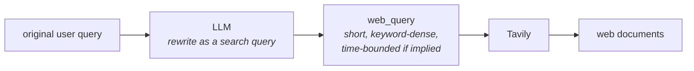
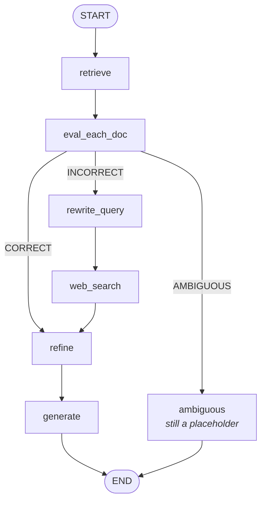

This is a small addition, and the lecture is candid that it is a small addition. But the paper's authors press for it, so it belongs in a faithful implementation.

Look again at the incorrect path. The user's original question `x` goes to the evaluator, gets flagged, and is then handed straight to the search engine. The paper does something in between: it **rewrites the query first**.

The example from the paper:

| | |
|---|---|
| **Original query `x`** | **Who was the screenwriter for Death of a Batman?** |
| **Rewritten query** | **Death of a Batman screenwriter wikipedia** |

Nothing was added that wasn't implied. The sentence was compressed into keywords and given a destination hint.

---

## Why that helps

Because the two retrieval systems in this pipeline want **different kinds of input**, and until now they have been given the same input.

Your vector store wants a query that carries semantic meaning; a full natural-language sentence is fine, and often better. A **search engine wants keywords** — specific, unambiguous, no filler.

User questions tend to arrive in a form that suits neither especially well. The lecture's example:

> **LLM and recent developments**

and lists what is wrong with a query like that as a search input:

- **vague**
- **under-specified**
- **missing keywords**
- **missing time constraints**

That last one is the sharpest. **Recent** means nothing to a search index. **Last 30 days** means something.

> [!important] The framing worth keeping: **a query optimised for one retrieval system is not optimised for another.** The user's phrasing was never tuned for either — the rewrite exists because the incorrect path changes retrieval systems mid-pipeline, and nobody adjusted the query when it did.

Feed a search engine a query where everything is clearly specified, the vagueness is gone, and the keywords are dense, and the results come back richer. So before the web search, put an LLM in front of it: give it the original question, ask for a better search query, and search with that instead.



---

## In code

### One new field

```python
web_query: str      # NEW — the rewritten search query
```

### The rewrite node

```python
class WebQuery(BaseModel):
    query: str

rewrite_prompt = ChatPromptTemplate.from_messages([
    ("system",
     "Rewrite the user question into a web search query composed of keywords.\n"
     "Rules:\n"
     "- Keep it short (6–14 words).\n"
     "- If the question implies recency (e.g., recent/latest/last week/last month), "
     "add a constraint like (last 30 days).\n"
     "- Do NOT answer the question.\n"
     "- Return JSON with a single key: query"),
    ("human", "Question: {question}"),
])

rewrite_chain = rewrite_prompt | llm.with_structured_output(WebQuery)

def rewrite_query_node(state: State) -> State:
    out = rewrite_chain.invoke({"question": state["question"]})
    return {"web_query": out.query}
```

Each rule earns its place:

- **composed of keywords** — the target form, stated first
- **6–14 words** — a hard length bound, because an unconstrained LLM will happily produce another full sentence
- **the recency rule** — the one substantive transformation, converting an implied time constraint into an explicit one
- **Do NOT answer the question** — the necessary guard. Hand a chat model a question and its default behaviour is to answer it. Without this line you get an essay where you wanted a search string.

### Tavily switches inputs

```python
def web_search_node(state: State) -> State:
    q = state.get("web_query") or state["question"]   # fallback if empty
    results = tavily.invoke({"query": q})
    ...
```

One line changed. Note the `or` fallback: if the rewrite produced nothing, the node reverts to the original question rather than searching for an empty string. Cheap insurance on a node that can now be reached with an unpopulated field.

### The graph

`rewrite_query` slots in **before** `web_search`, and the router points the incorrect branch at it:

```python
def route_after_eval(state: State) -> str:
    if state["verdict"] == "CORRECT":
        return "refine"
    elif state["verdict"] == "INCORRECT":
        return "rewrite_query"      # changed — was "web_search"
    else:
        return "ambiguous"

g.add_edge("rewrite_query", "web_search")
g.add_edge("web_search", "refine")
g.add_edge("refine", "generate")
```



---

## What it produced

> **Recent AI news**

A very user-shaped query — barely any information in it, someone who just wants an answer quickly. Sent to Tavily as-is, the results would be mediocre.

Inspecting `res["web_query"]` after the run:

> **recent AI news last 30 days**

The model recognised that the query implied a time window and made it explicit. **That constraint was not in the original query.** It was inferred, and it is the kind of thing that measurably changes what a search index returns.

---

## The honest caveat

The lecture does not oversell this. In the instructor's own experimentation, query rewriting **does not help much in a lot of situations** — the results with and without it were often comparable.

It is implemented anyway for two reasons: the paper's authors pressed for it as a worthwhile improvement to include in the architecture, and the goal of the exercise is to stay close to the original paper. It is also cheap — one LLM call, on a path that is already going to make a network round-trip.

> [!note] That is a useful posture to be able to describe. Not every component of a published architecture carries its weight in every deployment. Knowing **which** parts of a paper you reproduced faithfully, which ones you measured and found marginal, and which ones you dropped is a stronger position than either blind fidelity or silent omission.

---

## Guarantees

**It guarantees** the search engine receives a query in the form search engines are good at — short, keyword-dense, with implied time constraints made explicit.

**It does not guarantee** better results. And it adds a failure mode of its own: the rewrite is a **lossy compression** of the user's question. Squeeze a nuanced question into 6–14 keywords and a qualifier that mattered can disappear, sending the search somewhere subtly wrong — with the original question no longer in play to catch it.

---

> [!tip] Interview framing
> **On the incorrect path, CRAG rewrites the query before searching the web. The reason is that you've switched retrieval systems mid-pipeline: a vector store wants semantic meaning, a search engine wants keywords, and the user's phrasing was tuned for neither. The paper's example turns 'who was the screenwriter for Death of a Batman' into 'Death of a Batman screenwriter wikipedia'. In code it's one LLM call with a tight prompt — keywords, 6 to 14 words, convert implied recency into an explicit window like 'last 30 days', and explicitly don't answer the question, because a chat model's default is to answer. It turned 'recent AI news' into 'recent AI news last 30 days'. I'd be honest that this is the weakest component: in the instructor's own testing it rarely changed much, and it's a lossy compression of the question, so a nuance can be dropped. It's in there because the paper pressed for it and it's cheap on a path that's already making a network call.**
