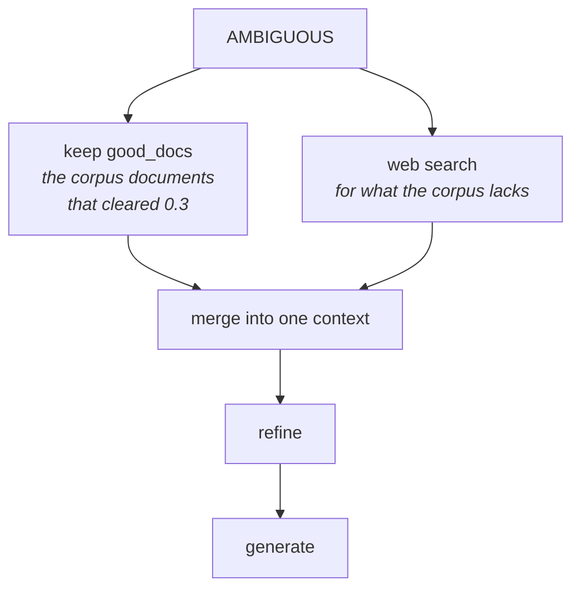
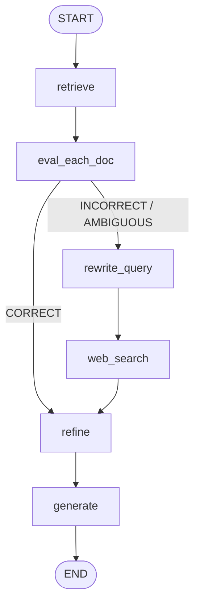

One branch has been a placeholder since [[04-Retrieval-Evaluation]]. This iteration builds it, and finishing it completes the architecture.

Recall exactly what ambiguous means. Three documents come back, `D1`, `D2`, `D3`. **None of them scores above 0.7.** But it is also not the case that all of them fall below 0.3.

Translate that out of thresholds:

> These documents, **on their own, cannot fully justify the query** — they cannot completely answer what the user asked. But they are **not weak enough to ignore either.**

Both halves matter. Treat ambiguous as correct and you generate from material that was never sufficient. Treat it as incorrect and you throw away documents that genuinely contained part of the answer.

---

## The authors' correction

Do both.

Keep the documents — specifically the ones that cleared the lower threshold, the `good_docs`. **And also** run the web search. Then merge the two into a single context and generate from that.



This is why the definition of ambiguous in the previous note mattered: it typically arises from a **multi-part question** where the corpus covers some parts and not others. Merging internal and external knowledge is not a hedge — it is the shape of the answer such a question actually needs.

---

## The implementation is smarter than the diagram

The obvious way to build this is a third branch: a route to a node that does the corpus thing and the web thing and combines them.

The lecture does the opposite. **It deletes the ambiguous branch entirely.**

The graph goes from three routes to two:

| Verdict | Route |
|---|---|
| **CORRECT** | → refine → generate |
| **INCORRECT or AMBIGUOUS** | → rewrite_query → web_search → refine → generate |

```python
def route_after_eval(state: State) -> str:
    if state["verdict"] == "CORRECT":
        return "refine"
    else:
        return "rewrite_query"
```

So how does the third case get handled at all, if it no longer has a path of its own?

**Through state.** And this is the genuinely instructive part of the whole lecture.

Follow an ambiguous query through:

1. `retrieve` → four documents land in `docs`.
2. `eval_each_doc` → scores them, sets `verdict = "AMBIGUOUS"`, and — critically — **populates `good_docs`** with everything above 0.3. It does this regardless of verdict.
3. Router sends it down the non-correct route.
4. `rewrite_query` → `web_search` → `web_docs` now populated.
5. Arrive at `refine`. **`good_docs` is still sitting in state.** Nothing consumed it, nothing cleared it. It has been there since step 2.

So `refine` has both sets available, and the merge happens there — not in a dedicated node.

> [!important] The ambiguous case did not need its own path because **the work it requires had already been done on the paths that exist.** `good_docs` is computed by the evaluator for every verdict; the web branch computes `web_docs`. Merging is a choice about *which state keys to read*, and that choice lives naturally in the node that consumes documents.
>
> This is the general lesson about graph state, and it transfers well beyond CRAG: **state persists across nodes, so branches that need a combination of earlier results often collapse into a single path plus a conditional read.** Three visual branches became two real ones with no loss of behaviour.

---

## All the magic is in one node

Everything upstream is unchanged from the previous iteration — imports, loading, chunking, the vector store, the retriever, the LLM, the thresholds, the state, `retrieve`, `eval_each_doc`, `rewrite_query`, `web_search`, `generate`. The diff is a three-way branch at the top of `refine`:

```python
def refine(state: State) -> State:
    q = state["question"]

    if state.get("verdict") == "CORRECT":
        docs_to_use = state["good_docs"]                          # internal only
    elif state.get("verdict") == "INCORRECT":
        docs_to_use = state["web_docs"]                           # external only
    else:                                                          # AMBIGUOUS
        docs_to_use = state["good_docs"] + state["web_docs"]      # both

    context = "\n\n".join(d.page_content for d in docs_to_use).strip()

    strips = decompose_to_sentences(context)                       # 1) decompose

    kept: List[str] = []                                           # 2) filter
    for s in strips:
        if filter_chain.invoke({"question": q, "sentence": s}).keep:
            kept.append(s)

    refined_context = "\n".join(kept).strip()                      # 3) recompose

    return {"strips": strips, "kept_strips": kept, "refined_context": refined_context}
```

Note what the merged case gets for free: the combined internal + external material goes through the **same decompose → filter → recompose** pass as everything else. Whatever the web contributed that duplicates or contradicts the corpus is subject to the same relevance filter. The merge is not a naive concatenation into the prompt — it is a concatenation into the refiner.

### The final graph

```python
g.add_edge(START, "retrieve")
g.add_edge("retrieve", "eval_each_doc")

g.add_conditional_edges(
    "eval_each_doc",
    route_after_eval,
    {"refine": "refine", "rewrite_query": "rewrite_query"},
)

g.add_edge("rewrite_query", "web_search")
g.add_edge("web_search", "refine")
g.add_edge("refine", "generate")
g.add_edge("generate", END)
```



The `ambiguous` node is gone. So is `fail`.

---

## Running it

> *Batch normalization vs layer normalization*

Chosen because of what is and isn't in the three textbooks: **batch normalization is covered; layer normalization is not.** A textbook case of a two-part question that the corpus half-answers.

**Verdict: AMBIGUOUS.** Both `good_docs` (the batch-norm chunks) and `web_docs` (the layer-norm material) feed the refiner, and the answer is built from the merged context.

> [!warning] The printed `reason` string on that run is worded wrong, and the lecture calls it out. It reads *"No chunk scored > 0.7, but not all were < 0.3"* — which is the code's f-string, and it is easy to misread as *"all were above 0.3"*. The actual criterion is just the fall-through: **nothing above 0.7, and not everything below 0.3.** Some documents may well sit below the lower threshold; they were dropped by the `good_docs` filter and never reach generation.

---

## The architecture, complete

Put the finished graph next to the paper's diagram and the correspondence is exact:

| Verdict | Knowledge used | Path |
|---|---|---|
| **Correct** | internal only | refine(good_docs) → generate |
| **Ambiguous** | internal **and** external | web search → refine(good_docs + web_docs) → generate |
| **Incorrect** | external only | web search → refine(web_docs) → generate |

Retrieval happens. Evaluation happens. Three cases are produced and all three are properly handled. That is Corrective RAG, built from traditional RAG in five iterations.

### Where the implementation departs from the paper

Worth stating plainly, because it is the first thing a good interviewer will probe:

- **T5-large was not used**, for the retrieval evaluator or the strip filter. The fine-tuned checkpoint was never released, so `gpt-4o-mini` stands in for both. The paper's claim — that a 770M fine-tuned model is cheaper *and* better at these two narrow tasks — goes untested here.
- **The strip filter returns a boolean**, where the paper scores each strip and thresholds it.
- **The thresholds (0.7 / 0.3) are invented.** The paper does not state what it used.
- **Refinement operates on the joined context**, not per-document as the paper describes. Same strips, different loop.

---

## What kind of system this is

> [!info] Notice what is *not* here: nothing loops, and nothing decides at runtime what to do next. The evaluator emits one of three labels and a hand-written router maps each label to a fixed sequence of nodes. The control flow was designed in advance and cannot vary.
>
> That is worth naming, because CRAG is usually filed under "agentic RAG" and it is the least agentic thing in that category. It is a classifier plus a decision tree. **Agentic RAG proper** — where an LLM holds the controller role and decides at runtime whether to retrieve, how many times, and when to stop — is a different design, covered separately. CRAG's fixed control flow is a feature, not a limitation: it is inspectable, testable, and its cost is bounded.

---

## Guarantees

**It guarantees** that retrieval quality is explicitly judged before generation, and that each of the three outcomes has a defined correction — so the pipeline never silently generates from documents it has already scored as irrelevant.

**It does not guarantee** correctness. Every judgement in the loop is made by an LLM: the relevance score, the strip filter, the rewritten query. A mis-scored retrieval routes wrongly, and the failure looks exactly like the traditional-RAG failure from [[01-Why-Corrective-RAG]] — fluent, confident, ungrounded.

**And it is expensive.** Count the model calls for one query: one per retrieved document in the evaluator, one per sentence in the refiner, one for the rewrite, one for generation. That is dozens of sequential calls where traditional RAG made one, plus a network round-trip on two of the three paths. The paper's design assumed the two heaviest of those were a cheap fine-tuned 770M model. Substituting an LLM preserves the behaviour and discards the economics — which is the real question to ask before putting this in production.

---

> [!tip] Interview framing
> "The ambiguous case means no chunk was strong enough to answer on its own, but they're not all weak enough to discard — usually a multi-part question where the corpus covers some parts. The correction is to use both: keep the chunks that cleared the lower threshold and also run the web search, then merge. The implementation detail I'd highlight is that they *deleted* the ambiguous branch rather than building it. The graph has two routes — correct, and everything else — because `good_docs` is populated by the evaluator regardless of verdict, so by the time an ambiguous query reaches the refine node after web search, both document sets are already sitting in state. The merge is a three-way conditional inside `refine`, not a node. That's the general lesson about graph state: branches that need a combination of earlier results usually collapse into one path plus a conditional read. I'd also be upfront about the cost — an evaluator call per document plus a filter call per sentence means dozens of sequential LLM calls per query, and the paper only got away with that because it used a fine-tuned 770M T5 for both."
