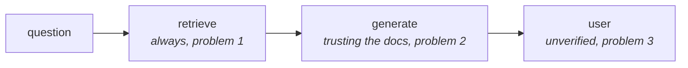

Corrective RAG asked one question — *were the retrieved documents any good?* Self-RAG asks four, and the first one comes **before retrieval happens at all**.

To see why four are needed, start with what is wrong with the traditional pipeline. There are precisely three problems, and only one of them overlaps with what [[01-Why-Corrective-RAG]] covered.

---

## Problem 1 — it retrieves even when retrieval is unnecessary

This is the biggest flaw, and it is the one CRAG never touched.

Imagine a chatbot built for children. You load it with encyclopedia volumes so that kids can chat with it and pull out facts. Then a child asks:

> *How many seconds are there in a minute?*

Obviously no encyclopedia is required. The LLM's **parametric knowledge** — what it absorbed during training — answers this comfortably. But the LLM is wrapped inside a RAG chatbot, so retrieval fires first regardless, and three chunks come back:

| Chunk | Content |
|---|---|
| A | a minute is a unit of time equal to 60 seconds |
| B | in some contexts, "a minute" can colloquially mean a short period of time |
| C | the concept of time units evolved historically |

Chunk B is from a different volume. Chunk C from another. Now the model must answer *from these three*, and what comes out is something like:

> *"A minute typically consists of about 60 seconds, depending on the context."*

Read that sentence and notice the damage. **Typically. About. Depending on the context.** The model has been handed material suggesting that "minute" is ambiguous, so it hedges. A question with an exact, universally-known answer produced a wobbly one.

So two costs, not one:

- **Confidence loss.** Unnecessary extra context made the model *less* sure of something it knew perfectly well. More context is not monotonically better.
- **Wasted computation.** An embedding call, a vector search, and a much larger prompt, all for a question that needed none of it.

> [!important] The lecture gives this a name worth remembering: **indiscriminate retrieval**. In traditional RAG, no matter what the question is, retrieval *has* to happen — the pipeline has no branch that skips it. There is no way to express "this one doesn't need the corpus."

---

## Problem 2 — it blindly trusts the retrieved documents

This one you have met before, but the example is sharper than the transformer one.

> *What causes diabetes?*

The retrieved document says, roughly: *diabetes is a chronic medical condition that affects how the body processes blood sugar.*

Read it against the question. The document describes an **effect** — what diabetes does. The question asks about a **cause** — what brings it about. Those are different things, and the document does not contain the answer.

But the LLM is instructed to answer from this chunk, so it produces:

> *"Diabetes is caused by problems in how the body processes blood sugar."*

Which is not factually correct, and is faintly circular besides — it has restated a symptom as an origin.

**Why was that document retrieved?** Because retrieval works on **semantic similarity**. The question is about diabetes; the document is about diabetes; the meanings overlap, so the distance is small and the chunk comes back.

> [!warning] That is the deeper lesson here. Semantic similarity matches the **topic**, not the **question type**. A document about the right subject that answers the wrong *kind* of question — causes vs. effects, definitions vs. procedures, current vs. historical — scores just as well as one that answers correctly. Embedding distance has no notion of "this is about X but not the X-shaped thing you asked for."

---

## Problem 3 — it never verifies its own answer

Once the answer is generated, that is the end of it. It goes to the user unchecked.

Ideally, something should look at the generated text and ask: *is this actually right? Is it hallucinated? Does it even answer what was asked?* Traditional RAG has no such step, and no place to put one.

---

## What that adds up to

Three failures at three different points in the pipeline:

| | Where | Traditional RAG's assumption |
|---|---|---|
| **1** | before retrieval | every question needs the corpus |
| **2** | after retrieval | whatever came back is usable |
| **3** | after generation | whatever was generated is final |

CRAG attacked only the middle one. Self-RAG attacks all three — which is why it needs four reflection points rather than one evaluator, and why its graph contains **loops** rather than a decision tree.

---

> [!tip] Interview framing
> "Self-RAG targets three problems. First, traditional RAG retrieves indiscriminately — there's no branch that skips retrieval, so a question like 'how many seconds in a minute' still triggers a vector search, and the extra context actually makes the answer *worse*: the model hedges with 'typically' and 'depending on the context' on a fact it knew exactly. That costs both confidence and compute. Second, it blindly trusts what came back — asking 'what causes diabetes' can retrieve a chunk describing what diabetes *does*, because semantic similarity matches the topic, not the question type, and the model is then forced to restate an effect as a cause. Third, it never verifies its own output; whatever is generated is final. Those are three failures at three different points — before retrieval, after retrieval, after generation — which is why Self-RAG needs four reflection points and a looping graph rather than CRAG's single evaluator and decision tree."
