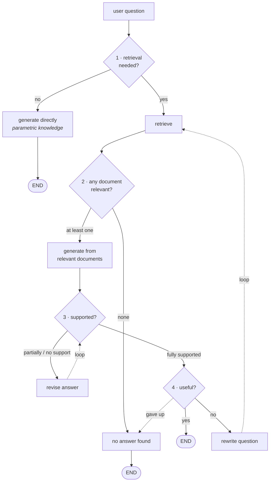

The lecture's definition:

> **Self-RAG** stands for **self-reflective RAG**, where the LLM actively judges its own retrieval, evidence and answers instead of blindly trusting retrieved documents.

The unique selling point is that one word — **self-reflection**. At every step, the architecture judges its own actions and asks whether it did the thing correctly. And it does that by answering **four questions**, in order.

| # | Question | When it fires |
|---|---|---|
| 1 | Is retrieval needed for this query at all? | before retrieving |
| 2 | Are the retrieved documents relevant? | after retrieving |
| 3 | Is the generated response grounded in those documents? | after generating |
| 4 | Does the response actually answer the user's question? | after grounding is confirmed |

Questions 1 and 2 are self-explanatory from [[08-Why-Self-RAG]]. Questions 3 and 4 need examples, because they are easy to confuse with each other.

---

## Question 3 — is the answer grounded?

The concern here is **fabrication**. The documents were handed to the model as evidence; did the answer stay inside that evidence, or did the model add things of its own?

> *What are the side effects of Drug X?*

Retrieved documents:

- Drug X is commonly prescribed for hypertension.
- Clinical trials report mild dizziness and nausea as observed side effects.

Generated answer:

> *"Drug X may cause dizziness, nausea, fatigue and headaches, especially in older patients."*

Split that answer against its sources:

| Claim | Source |
|---|---|
| dizziness | ✅ document 2 |
| nausea | ✅ document 2 |
| fatigue | ❌ **fabricated** |
| headaches | ❌ **fabricated** |
| "especially in older patients" | ❌ **fabricated** |

Where did the extras come from? **Parametric knowledge.** Plenty of drugs list fatigue and headaches alongside dizziness and nausea, so the model — trying to be helpful, trying to make the answer *better* — filled in what it expected to be there.

> [!danger] That is exactly what hallucination is. You gave the model evidence and asked it to answer from that evidence; it answered from the evidence **plus some it invented**. In a medical context the fabricated half is indistinguishable in tone from the sourced half.

---

## Question 4 — is the answer useful?

Different concern entirely. Here the answer may be **perfectly grounded** and still worthless.

> *Why does ice float on water?*

Retrieved document: *ice is the solid form of water.*

Generated answer:

> *"Ice is the solid form of water that occurs at low temperatures."*

Every word traces back to the document. Zero hallucination. And it does not answer the question — it never mentions density, never explains *why* floating happens.

> [!important] Questions 3 and 4 are independent axes, and this is the distinction to hold on to.
>
> **Grounded** asks: *did everything I said come from the evidence?*
> **Useful** asks: *did I answer what was asked?*
>
> An answer can be grounded and useless (this one). It can be useful and ungrounded (the Drug X one — it did address side effects). Checking one tells you nothing about the other, which is why Self-RAG runs two separate checks in sequence rather than one combined "is this a good answer" judgement.

---

## The architecture, walked through

Take a company chatbot — documents about a company, employees asking questions.

### Step 1 · Does this need retrieval?

Two questions, two answers:

- *"How many paid leave days do employees at our company get per year?"* → needs the company documents. **Retrieve.**
- *"What is a paid leave?"* — a fresher who simply doesn't know the term → general knowledge. **Don't retrieve.**

If retrieval is not needed, the question goes straight to the LLM, a direct answer is generated, and the flow **ends there**. That branch is short and it is the whole answer to problem 1.

### Step 2 · Is each document relevant?

Retrieval returns documents; each is asked individually whether it helps answer the question. The relevant ones survive, the rest are eliminated.

For *"how many paid leaves per year"*, suppose these come back:

- the company observes 12 public holidays each year
- employees may work remotely up to two days per week
- leave requests must be approved by a reporting manager

All three are about company policy. **None answers the question.** If not a single document is relevant, the flow prints *no answer found* and terminates.

Now a second scenario:

| Document | Verdict |
|---|---|
| all full-time employees are entitled to 24 paid leaves per calendar year | **very** relevant — the answer is right there |
| employees may take different types of leaves including sick and casual leave | related; not clearly irrelevant |
| leave approval is managed through the HR portal | irrelevant |

**At least one** document is relevant, so the flow continues, and the answer is generated from the relevant ones:

> *"All full-time employees at our company are entitled to 24 paid leaves per calendar year."*

### Step 3 · Is the answer supported?

Every fact in the answer must come from the retrieved documents. Three possible verdicts:

**Fully supported** — every fact traces to a document. The 24-paid-leaves answer above qualifies: the number comes from document 1, and nothing else has been added.

**Partially supported** — some facts are sourced, some are invented:

> *"All full-time employees receive 24 leaves per year, which includes sick leaves and casual leaves, and these leaves are managed through the HR portal."*

Every individual piece appears somewhere in the three documents. But the **relationship between them does not**. Nothing says the 24 paid leaves *include* sick and casual leave — the model read two documents and manufactured a link between them.

> [!note] Worth pausing on, because it is a subtler kind of hallucination than an invented fact. The model fabricated a **correlation**, not a claim. Each ingredient was real; the recipe was not. This is the failure mode that survives naive "is every entity in the answer present in the context?" checks.

**No support** — nothing in the answer comes from the documents at all:

> *"Employees are entitled to 30 paid leaves per year with additional carry-forward benefits."*

Neither the 30 nor the carry-forward appears anywhere. Pure hallucination.

**What happens next:** fully supported answers are accepted and move on. Partially supported and unsupported ones go to a **revise answer** node, whose prompt says, in effect: *this answer contains facts not present in the retrieved documents — remove them.* The goal is to convert partial/no support into full support.

And then the revised answer goes **back to the support check**. That is a loop.

### Step 4 · Is the answer useful?

Only fully-supported answers reach this check.

Using the same three leave documents, suppose the model somehow ignores document 1 entirely and answers:

> *"Employees may take different types of leaves such as sick leave and casual leaves, and leave requests are managed through the HR portal."*

Factually correct. Zero hallucination. Every claim sits on evidence. **And it never says how many paid leaves there are**, which is what was asked.

Useful → show it to the user, done. Not useful → **rewrite the user's question** and go all the way back to retrieval, fetch different documents, and run the entire cycle again.

That is a second, much larger loop.

---

## The full picture

Two loops, and both need a brake. Left unchecked, the revise loop can spin forever without ever reaching *fully supported*, and the rewrite loop can keep fetching new documents that are never useful. Both get a **max-tries counter** — five, ten, whatever you pick — and on exhaustion the flow exits to *no answer found*.

---

## Before the code: what this implementation is not

The lecture is explicit about this, and it matters.

> [!warning] The original paper used a **different model, fine-tuned by the authors**, and built the architecture on top of it. This implementation uses no fine-tuned model — it uses OpenAI LLMs for every reflection point.
>
> So conceptually everything matches: the same four questions, the same routing, the same loops. **The finer implementation details differ.** That is a deliberate substitution, stated up front, and the same one [[03-Knowledge-Refinement]] had to make for CRAG's T5.

---

> [!tip] Interview framing
> "Self-RAG is self-reflective RAG — the model judges its own retrieval, evidence and answers at every step, via four questions. Does this query even need retrieval. Are the retrieved documents relevant. Is the generated answer grounded in them. Does the answer actually address the question. The third and fourth are independent, which is the bit people collapse: an answer can be perfectly grounded and useless — 'why does ice float' answered with 'ice is the solid form of water that occurs at low temperatures' cites the document faithfully and never explains floating. And grounding failures aren't only invented facts; the subtler case is an invented *relationship* between two real documents, which is why the support check has three levels rather than a boolean. Architecturally it's two loops — revise-and-recheck for grounding, rewrite-and-re-retrieve for usefulness — both with max-try counters so they terminate."
