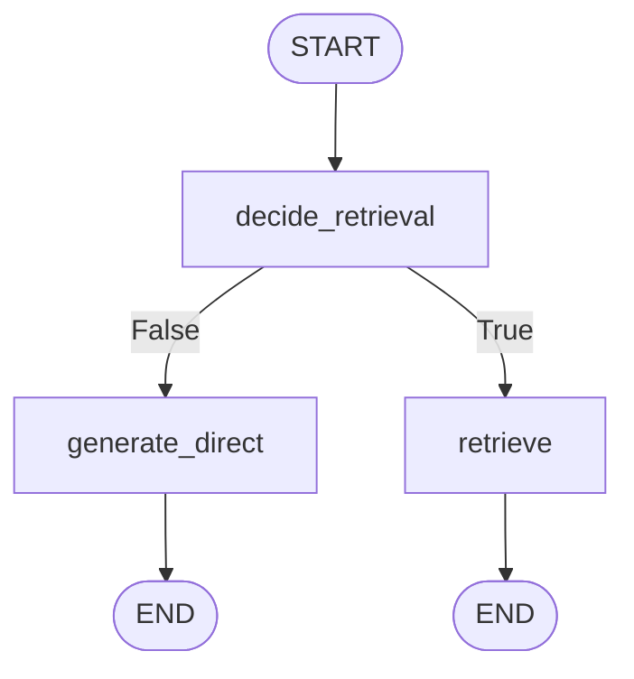

The whole architecture is built one node at a time, and the first iteration builds only the top of it: a question arrives, something decides whether the corpus is needed, and control goes down one of two routes.



The retrieve branch deliberately stops at `END` with documents fetched and **no answer generated**. That is the point of building in iterations — this step is only about proving the routing works.

---

## The corpus

A hypothetical company, **NexaAI** (Nexa AI Solutions), which does not exist — the documents were generated for the exercise. Three PDFs:

| Document | Contents |
|---|---|
| **Company Profile** | overview, founding, headquarters, employee count, vision, mission, core values, founder, leadership team |
| **Company Policies** | HR policies, leave policy, workplace conduct, disciplinary actions |
| **Product and Pricing** | NexaAI's main products, and their pricing |

```python
docs = (
    PyPDFLoader("./documents/Company_Policies.pdf").load()
    + PyPDFLoader("./documents/Company_Profile.pdf").load()
    + PyPDFLoader("./documents/Product_and_Pricing.pdf").load()
)

chunks = RecursiveCharacterTextSplitter(chunk_size=600, chunk_overlap=150).split_documents(docs)

embeddings = OpenAIEmbeddings(model="text-embedding-3-large")
vector_store = FAISS.from_documents(chunks, embeddings)
retriever = vector_store.as_retriever(search_kwargs={"k": 4})

llm = ChatOpenAI(model="gpt-4o-mini", temperature=0)
```

`chunk_size=600` here, against CRAG's 900. The lecture says this was found by experimentation — these documents are short policy pages rather than textbook prose, so smaller chunks retrieved better. Worth copying the **habit**, not the number.

---

## State

```python
class State(TypedDict):
    question: str
    need_retrieval: bool
    docs: List[Document]
    answer: str
```

Four fields. `need_retrieval` is the boolean the router reads.

---

## The decision node

```python
class RetrieveDecision(BaseModel):
    should_retrieve: bool = Field(
        ...,
        description="True if external documents are needed to answer reliably, else False."
    )

decide_retrieval_prompt = ChatPromptTemplate.from_messages([
    ("system",
     "You decide whether retrieval is needed.\n"
     "Return JSON that matches this schema:\n"
     "{{'should_retrieve': boolean}}\n\n"
     "Guidelines:\n"
     "- should_retrieve=True if answering requires specific facts, citations, "
     "or info likely not in the model.\n"
     "- should_retrieve=False for general explanations, definitions, or reasoning "
     "that doesn't need sources.\n"
     "- If unsure, choose True."),
    ("human", "Question: {question}"),
])

should_retrieve_llm = llm.with_structured_output(RetrieveDecision)

def decide_retrieval(state: State):
    decision = should_retrieve_llm.invoke(
        decide_retrieval_prompt.format_messages(question=state["question"])
    )
    return {"need_retrieval": decision.should_retrieve}
```

The guidelines draw the line in a specific place: **specific facts and citations → retrieve; general explanations, definitions and reasoning → don't.** That is exactly the **what is a paid leave** versus **how many paid leaves do we get** split from [[09-The-Four-Reflection-Questions]] — one is a definition, the other is a company fact.

> [!important] The last guideline is the one to notice: **If unsure, choose True.**
>
> The two errors are not symmetric. Retrieving unnecessarily costs a little latency and some hedging — the problem this whole node exists to reduce. Failing to retrieve when you needed to means answering a company-specific question from parametric knowledge, which is a **confident, plausible, wrong answer**. Cheap failure versus expensive failure, so the tie-break goes to the cheap one.
>
> That is a general pattern for LLM routers: work out which side of the branch degrades gracefully, and bias the prompt toward it explicitly.

Also note `.with_structured_output(RetrieveDecision)` and the absence of `.content` afterwards. A structured-output call returns the parsed Pydantic object directly, not a message — reaching for `.content` on it is a common early mistake, and the notebook flags it in a comment.

---

## The direct-answer node

```python
direct_generation_prompt = ChatPromptTemplate.from_messages([
    ("system",
     "Answer the question using only your general knowledge.\n"
     "Do NOT assume access to external documents.\n"
     "If you are unsure or the answer requires specific sources, say:\n"
     "'I don't know based on my general knowledge.'"),
    ("human", "{question}"),
])

def generate_direct(state: State):
    out = llm.invoke(direct_generation_prompt.format_messages(question=state["question"]))
    return {"answer": out.content}
```

Two things this prompt is doing. **Do NOT assume access to external documents** stops the model producing text like **according to the provided policy…** when there is no policy in front of it. And the escape hatch gives it somewhere to go if the router was wrong — a second line of defence behind the **if unsure, choose True** bias.

---

## Retrieve, and the router

```python
def retrieve(state: State):
    return {"docs": retriever.invoke(state["question"])}

def route_after_decide(state: State) -> Literal["generate_direct", "retrieve"]:
    if state["need_retrieval"]:
        return "retrieve"
    return "generate_direct"
```

```python
g.add_conditional_edges(
    "decide_retrieval",
    route_after_decide,
    {"generate_direct": "generate_direct", "retrieve": "retrieve"},
)

g.add_edge("generate_direct", END)
g.add_edge("retrieve", END)      # temporary END for the retrieval path
```

---

## Two runs

**`Who is the CEO of NexaAI?`**

- `need_retrieval` → **True**
- `docs` → populated; inspecting them shows the CEO is named
- `answer` → **empty**, because the retrieval branch doesn't generate yet

**`What is Machine Learning?`**

- `need_retrieval` → **False**
- `answer` → a real answer, produced from parametric knowledge
- `docs` → **empty**, because retrieval never ran

That second run is problem 1 from [[08-Why-Self-RAG]] solved. In traditional RAG, **what is machine learning** would have triggered a vector search against three company PDFs, retrieved four chunks about leave policies and pricing tiers, and forced the model to answer a general question from irrelevant company documents. Here it simply doesn't retrieve.

---

## Guarantees

**It guarantees** that questions the corpus cannot help with skip retrieval entirely — no wasted search, no irrelevant context diluting the prompt.

**It does not guarantee** the routing decision is right. It is one LLM call with no evidence beyond the question text, made **before** seeing any documents. A question phrased generically but actually company-specific will route wrong. The **if unsure, choose True** bias mitigates that; it does not remove it.

**And it introduces a new cost:** an extra LLM call on the front of every single query, including the ones that were always going to retrieve. This node pays for itself only if a meaningful share of your traffic genuinely doesn't need the corpus.

---

> [!tip] Interview framing
> **The first reflection point is a router that decides whether to retrieve at all, before any search happens. It's a structured-output call returning a single boolean, with guidelines that split on specific-facts-and-citations versus general-explanations-and-definitions. The design detail worth calling out is the tie-break: 'if unsure, choose True.' The two errors aren't symmetric — retrieving unnecessarily costs latency and a bit of hedging, while failing to retrieve on a company-specific question gives you a confident wrong answer from parametric knowledge. So you bias the router toward the failure that degrades gracefully. The honest cost is that this adds an LLM call to the front of every query, so it only pays for itself if a real share of your traffic doesn't need the corpus.**
