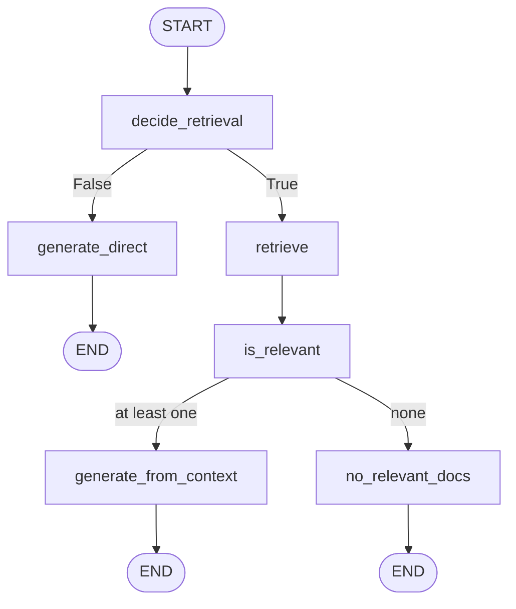
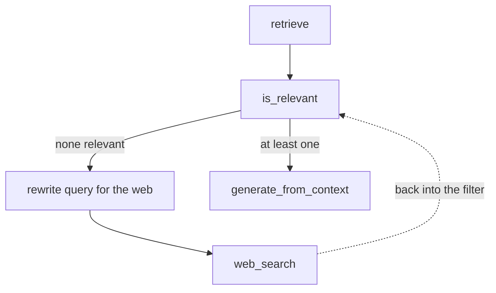

The retrieval branch currently fetches documents and stops. Two iterations turn that into a working answer: first filter the documents by relevance, then generate from what survives.



---

## Filtering, one document at a time

A new state field holds the survivors:

```python
relevant_docs: List[Document]
```

`docs` holds everything retrieval returned. `relevant_docs` holds only what passed.

```python
class RelevanceDecision(BaseModel):
    is_relevant: bool = Field(
        ...,
        description="True if the document helps answer the question, else False."
    )

is_relevant_prompt = ChatPromptTemplate.from_messages([
    ("system",
     "You are judging document relevance.\n"
     "Return JSON that matches this schema:\n"
     "{{'is_relevant': boolean}}\n\n"
     "A document is relevant if it contains information useful for answering the question."),
    ("human", "Question:\n{question}\n\nDocument:\n{document}"),
])

relevance_llm = llm.with_structured_output(RelevanceDecision)

def is_relevant(state: State):
    relevant_docs: List[Document] = []

    for doc in state["docs"]:
        decision = relevance_llm.invoke(
            is_relevant_prompt.format_messages(
                question=state["question"],
                document=doc.page_content,
            )
        )
        if decision.is_relevant:
            relevant_docs.append(doc)

    return {"relevant_docs": relevant_docs}
```

A loop, one call per document, a boolean each time. Same shape as CRAG's evaluator in [[04-Retrieval-Evaluation]] — but note the difference in what comes back. CRAG returns a **score** and thresholds it; Self-RAG returns a **boolean** and keeps or drops. Self-RAG has no notion of **somewhat relevant**, because it has no ambiguous branch to send such a document down.

### What it does to the CEO question

`Who is the CEO of NexaAI?` retrieves **four** documents. After filtering, **one** survives — the chunk that actually names the CEO.

The other three were about the company but not about its leadership. The lecture's phrasing is the useful one: they are **semantically close but not relevant to answering the question**. Vector search brought them because they discuss NexaAI; the filter drops them because they don't discuss **who runs it**.

That is problem 2 from [[08-Why-Self-RAG]] being addressed — noise filtered before it can distort generation.

---

## Generating from what's left

Another state field, this time a plain string:

```python
context: str
```

All surviving documents merge into it.

```python
rag_generation_prompt = ChatPromptTemplate.from_messages([
    ("system",
     "You are a business RAG assistant.\n"
     "Answer the user's question using ONLY the provided context.\n"
     "If the context does not contain enough information, say:\n"
     "'No relevant document found.'\n"
     "Do not use outside knowledge.\n"),
    ("human", "Question:\n{question}\n\nContext:\n{context}\n"),
])

def generate_from_context(state: State):
    context = "\n\n---\n\n".join(
        [d.page_content for d in state.get("relevant_docs", [])]
    ).strip()

    if not context:
        return {"answer": "No relevant document found.", "context": ""}

    out = llm.invoke(
        rag_generation_prompt.format_messages(question=state["question"], context=context)
    )
    return {"answer": out.content, "context": context}
```

Two details worth lifting:

- Documents are joined with `\n\n---\n\n`, not bare newlines. A visible separator tells the model where one source ends and the next begins, which matters for the grounding check that comes later — it needs to attribute claims to documents.
- `context` is **returned into state**, not just used locally. Every downstream reflection node — support, revision — needs the exact text that produced the answer. Recomputing it later would risk drift.

---

## The routing, and a node that does nothing

```python
def no_relevant_docs(state: State):
    return {"answer": "No relevant document found.", "context": ""}

def route_after_relevance(state: State) -> Literal["generate_from_context", "no_relevant_docs"]:
    if state.get("relevant_docs") and len(state["relevant_docs"]) > 0:
        return "generate_from_context"
    return "no_relevant_docs"
```

**At least one** relevant document is enough to proceed. Zero means stop.

And `no_relevant_docs` genuinely does nothing useful — it sets a string and ends. Which invites the obvious question: why is it a node at all, rather than an edge straight to `END`?

---

## Why the empty node exists

Because it is a **placeholder you can swap for a web search node**.

Suppose retrieval ran and not one document was relevant. Rather than giving up, you could go to the web, and then — the important part — bring those results **back to the relevance check** rather than straight to generation:



The web results get judged by the same relevance filter as corpus documents. If any of them pass, generation proceeds normally.

```python
tavily = TavilySearchResults(max_results=5)

def web_search_node(state: State):
    q = state.get("web_query") or state["question"]
    results = tavily.invoke({"query": q})

    docs = []
    for r in results or []:
        title   = r.get("title", "")
        url     = r.get("url", "")
        content = r.get("content", "") or r.get("snippet", "")
        text = f"TITLE: {title}\nURL: {url}\nCONTENT:\n{content}"
        docs.append(Document(
            page_content=text,
            metadata={"source": "web", "url": url, "title": title},
        ))
    return {"docs": docs}
```

Nearly identical to CRAG's web node in [[05-Web-Search-Fallback]], with one addition: `"source": "web"` in the metadata, so downstream you can tell corpus material from web material.

> [!note] **This is not part of the Self-RAG architecture.** The lecture ships it as a separate notebook and explicitly says it will not be wired into the main build — it is shown as a possibility, which is why the placeholder node is there rather than a direct edge.
>
> The structural observation is still worth having: because the relevance filter is a **node** and not a step buried inside another function, a completely different document source can be plugged in ahead of it and everything downstream keeps working. That reuse is the same property that let CRAG share one `refine` node across three verdicts.

---

## Two runs

**`Who is the CEO of NexaAI?`** → four retrieved, one relevant, and an answer naming the CEO.

**`What is the refund policy of NexaAI?`** → the documents cover pricing but say nothing about refunds. No document passes the filter, so the flow takes the second branch and returns **No relevant document found.**

That second one is the honest failure traditional RAG could not produce. Given four pricing chunks and an instruction to answer from them, an ordinary pipeline would have manufactured a refund policy out of billing terms.

---

## Guarantees

**It guarantees** that generation only ever sees documents a model judged relevant, and that a question with nothing to support it gets an explicit refusal rather than an invented answer.

**It does not guarantee** the filter is right — it is one LLM call per document with no calibration, and a strict prompt will drop borderline-useful documents while a lax one lets noise through. That tension turns out to matter, and [[15-The-Retrieval-Rewrite-Loop]] shows the prompt being deliberately loosened once later checks exist to catch what it lets past.

**Cost:** one LLM call per retrieved document, sequentially, on every query that retrieves. At `k=4` that is four calls before generation even begins.

---

> [!tip] Interview framing
> **After retrieval, each document is judged individually for relevance and only the survivors reach generation. On 'who is the CEO', four chunks come back and one survives — the rest are semantically close, because they're all about the company, but they don't address who runs it. That's the distinction vector search can't make and this filter can. Unlike CRAG's evaluator this returns a boolean rather than a score, because Self-RAG has no ambiguous branch to route a partial match down. If nothing is relevant the flow returns an explicit 'no relevant document found' instead of inventing an answer — which is what happens on a refund-policy question against pricing docs. There's also a deliberately empty node on that branch, and the reason is that it's a swap-in point for web search, feeding results back through the same relevance filter.**
