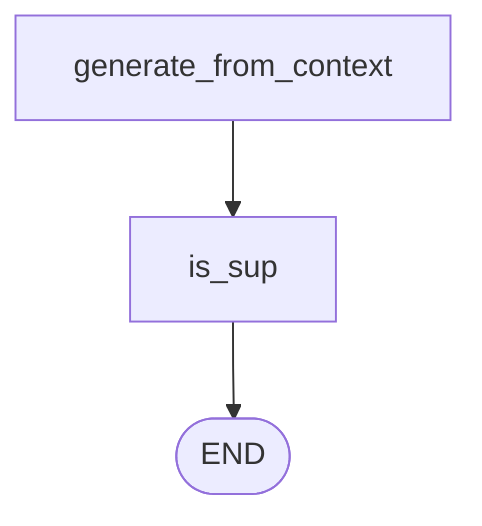

There is an answer now, built from documents that passed the relevance filter. Nothing has yet checked whether the answer actually stayed inside those documents.

This iteration adds that check — the `is_sup` node — and nothing else. It classifies and reports; acting on the classification comes in [[13-The-Revision-Loop]].



---

## Two new state fields

```python
issup: Literal["fully_supported", "partially_supported", "no_support"]
evidence: List[str]
```

`issup` is the verdict. `evidence` holds short quotes from the context that support the answer.

> [!note] The lecture is candid that `evidence` is **optional** — it was added for debugging and the architecture works without it. Keep it anyway. The verdict alone tells you *that* an answer was judged unsupported; the evidence tells you *what the judge actually found*, which is the difference between a debuggable classifier and an oracle.

---

## The prompt is the interesting part

```python
class IsSUPDecision(BaseModel):
    issup: Literal["fully_supported", "partially_supported", "no_support"]
    evidence: List[str] = Field(default_factory=list)
```

The system prompt does far more work than a three-way classifier might suggest, and it is worth reading closely because it encodes a real discovery about how these judgements fail.

Paraphrasing its structure:

**`fully_supported`** — every meaningful claim is explicitly supported by the context, *and* the answer introduces no qualitative or interpretive words absent from the context. The prompt then lists examples of disallowed words: *culture, generous, robust, designed to, supports professional development, best-in-class, employee-first.*

**`partially_supported`** — the core facts are supported, **but** the answer includes any abstraction, interpretation or qualitative phrasing not explicitly stated. Calling a set of policies a "culture". Describing a leave allowance as "generous". Inferring an outcome like "supports professional development".

**`no_support`** — the key claims are not supported at all.

Plus two rules: *be strict — any unsupported qualitative phrasing means partially_supported*, and *evidence: up to 3 short direct quotes from the context*.

> [!important] Look at what that word list is defending against.
>
> The naive way to check grounding is to ask whether the facts match. But an LLM asked to summarise policy documents doesn't usually invent numbers — it **editorialises**. It reads "24 paid leaves, sick leave, casual leave, remote work two days a week" and writes that the company has a *generous, employee-first culture that supports professional development.*
>
> Not one of those adjectives is in the documents. Every underlying fact is. And a fact-matching check waves it straight through.
>
> This is hallucination as **interpretation**, and it is far more common in business RAG than fabricated numbers — because it is what a helpful assistant naturally does. Naming the specific vocabulary in the prompt is how the judge is taught to catch it.

The node itself is unremarkable once the prompt is written:

```python
issup_llm = llm.with_structured_output(IsSUPDecision)

def is_sup(state: State):
    decision = issup_llm.invoke(
        issup_prompt.format_messages(
            question=state["question"],
            answer=state.get("answer", ""),
            context=state.get("context", ""),
        )
    )
    return {"issup": decision.issup, "evidence": decision.evidence}
```

Three inputs — question, answer, context. Note that it re-reads `context` from state, the exact string that produced the answer, which is why [[11-Filtering-Retrieved-Documents]] returned it into state rather than computing it locally.

---

## Three runs, three verdicts

The lecture hunts for one query per verdict, and finding them took experimentation — which is itself the finding.

### Fully supported

> *How many employees does NexaAI have?*

- `need_retrieval` → True
- 4 documents retrieved, **2** relevant
- `issup` → **fully_supported**
- answer: NexaAI has over 85 employees
- `evidence` → three quotes pulled from the context, the first of which contains the employee figure

Every claim traces to a quote. No fabrication.

### Partially supported

> *Describe NexaAI's company culture.*

`issup` → **partially_supported**.

And here the lecture is honest in a way worth preserving: reading the answer against the evidence, **the fabrication is not obvious at a glance.** The instructor says as much on air, and suggests pausing the video to find it. It is there — the model took some liberties and added things beyond the evidence — but it is subtle.

> [!warning] That difficulty is the lesson, not a flaw in the example. This class of hallucination is hard for a *human* to spot by eye, on a three-document context, when explicitly looking for it. Which is precisely why you want a check that does it mechanically on every answer, and why the prompt has to name the vocabulary rather than rely on "does this look grounded".
>
> Notice also that the question invites it. Asking a corpus of policy documents to *"describe the company culture"* asks the model to synthesise something no single document states. The question shape predicts the failure.

### No support

> *Do NexaAI plans include a free trial? If yes, how many days?*

This one is the best demonstration in the lecture.

- `evidence` → **empty**. Nothing in the relevant documents addresses free trials at all.
- answer → *"Yes, NexaAI plans include a free trial which lasts for 14 days."*

Where did **14 days** come from? Not the context — there is nothing there. The model, under pressure to answer, reached into parametric knowledge, where it has learned that most software products offer a free trial and that trial is usually 14 days. So it printed that.

And this is precisely the hallucination shape from [[01-Why-Corrective-RAG]] — a confident, plausible, entirely invented specific. Anyone reading the answer alone would believe it. A prospective customer would plan around it.

- `issup` → **no_support**

> [!info] The good news, in the lecture's words: because the system now self-reflects, **it can say this is no_support**. The hallucination still happened — nothing here prevented it. What changed is that it is now *detected*, and detection is what makes the next iteration possible.

---

## Guarantees

**It guarantees** that every generated answer carries an explicit grounding verdict plus supporting quotes, before anything reaches the user.

**It does not guarantee** the verdict is correct. It is an LLM judging another LLM's output against text — with all the usual judge weaknesses, and one specific to this design: the prompt's list of disallowed words is **hand-written and finite**. Qualitative language outside that list is more likely to slip through, so the check is tuned to the failures someone already noticed.

**And it detects rather than prevents.** At this stage a `no_support` answer is still the answer in state. Fixing it is the next node's job.

---

> [!tip] Interview framing
> "The grounding check classifies the answer against the context it was generated from — fully supported, partially supported, or no support — and returns supporting quotes alongside the verdict. The design detail I'd point at is the prompt, which explicitly lists banned qualitative words like 'generous', 'robust', 'culture', 'employee-first'. That's because the realistic hallucination in business RAG isn't an invented number, it's editorialising: the model reads a leave policy and writes that the company has a generous employee-first culture. Every underlying fact checks out, so a fact-matching test passes it, but none of those adjectives are in the documents. The clearest demo was asking whether the product has a free trial — the evidence list came back empty and the answer confidently said 14 days, straight out of parametric knowledge, because most SaaS trials are 14 days. The system can't prevent that, but it can now label it no_support, and detection is what makes correction possible."
