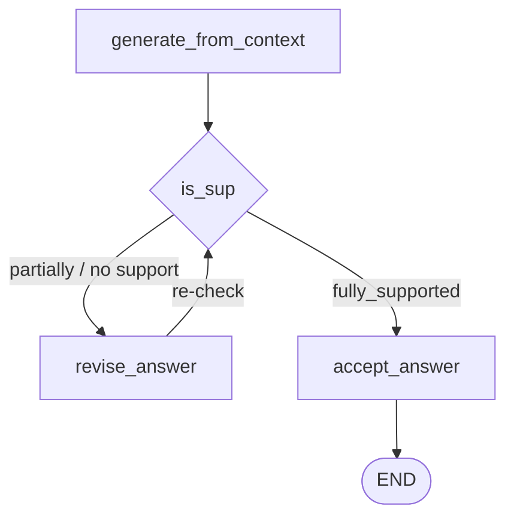

The support verdict exists but nothing acts on it. This iteration acts on it — and in doing so introduces the first loop in the architecture.

The logic is two-way:

- **`fully_supported`** → accept the answer, carry on
- **`partially_supported` or `no_support`** → send it to a **revise answer** node

The reviser rewrites the answer so that no fabricated fact survives — everything must come directly from the context. Then the revised answer goes **back to the support check**, which classifies it again.



---

## The loop needs a brake

A loop that repairs an answer until a judge is satisfied can fail to terminate. The reviser might never produce something the judge calls fully supported — particularly on a question the documents genuinely cannot answer, where there is nothing to revise **toward**.

So a counter:

```python
MAX_RETRIES = 10

retries: int      # new state field
```

Every pass through the reviser increments it. Past the limit, the loop exits regardless of verdict.

---

## The reviser

The prompt is worth reading in full, because it is much more aggressive than **remove unsupported claims**:

```python
revise_prompt = ChatPromptTemplate.from_messages([
    ("system",
     "You are a STRICT reviser.\n\n"
     "You must output based on the following format:\n\n"
     "FORMAT (quote-only answer):\n"
     "- <direct quote from the CONTEXT>\n"
     "- <direct quote from the CONTEXT>\n\n"
     "Rules:\n"
     "- Use ONLY the CONTEXT.\n"
     "- Do NOT add any new words besides bullet dashes and the quotes themselves.\n"
     "- Do NOT explain anything.\n"
     "- Do NOT say 'context', 'not mentioned', 'does not mention', 'not provided', etc.\n"),
    ("human",
     "Question:\n{question}\n\nCurrent Answer:\n{answer}\n\nCONTEXT:\n{context}"),
])

def revise_answer(state: State):
    out = llm.invoke(revise_prompt.format_messages(
        question=state["question"],
        answer=state.get("answer", ""),
        context=state.get("context", ""),
    ))
    return {
        "answer": out.content,
        "retries": state.get("retries", 0) + 1,
    }
```

This does not ask for a **better paraphrase**. It demands a **quote-only answer** — a bullet list of direct quotes from the context, with no words of the model's own except the dashes.

> [!important] That is a deliberate over-correction, and the reasoning behind it is sound.
>
> [[12-Grounding-And-The-Support-Levels]] established that the failure being fixed is **interpretation** — the model adding **generous**, **culture**, **supports professional development**. You cannot reliably instruct a model to interpret **less**; that is a matter of degree, and degrees drift.
>
> But you can remove the opportunity entirely. If the output may contain nothing but verbatim quotes, there is no room for an adjective to appear. The revision problem is converted from **be less interpretive** — unenforceable — into **copy these sentences** — mechanical.

**Do NOT say 'context', 'not mentioned', 'does not mention', 'not provided'** is the second guard. Without it, a reviser handed an answer it cannot support falls back on meta-commentary — **the context does not mention a free trial** — which is a sentence about the retrieval process rather than an answer, and would then be judged for grounding on its own terms. The prompt closes that exit.

Note also that both the **question** and the **current answer** are passed in, not just the context. The reviser needs to know what was being asked (so it quotes relevant sentences) and what the previous attempt claimed (so it knows what to strip).

---

## The router

```python
def route_after_issup(state: State) -> Literal["accept_answer", "revise_answer"]:
    if state.get("issup") == "fully_supported":
        return "accept_answer"

    if state.get("retries", 0) >= MAX_RETRIES:
        return "accept_answer"

    return "revise_answer"
```

Two ways to reach `accept_answer` — success, or exhaustion. The notebook's own comment flags this: on exhaustion you could route to a dedicated give-up node instead. As written, an answer that never reached full support is accepted anyway, carrying whatever verdict it last received.

That turns out not to be a hole, because the usefulness check in [[14-Is-The-Answer-Useful]] sits downstream and catches it.

```python
def accept_answer(state: State):
    return {}       # keep the answer as-is
```

An empty node. It exists to give the **success** branch a name in the graph rather than to do work.

---

## The loop, in the graph

```python
g.add_edge("generate_from_context", "is_sup")

g.add_conditional_edges(
    "is_sup",
    route_after_issup,
    {"accept_answer": "accept_answer", "revise_answer": "revise_answer"},
)

g.add_edge("revise_answer", "is_sup")     # loop back to verify
g.add_edge("accept_answer", END)
```

`revise_answer → is_sup` is the cycle, and it is what makes this a genuinely different kind of graph from CRAG's. Everything in [[07-The-Ambiguous-Path]] was a directed acyclic path from START to END; here control can revisit a node it has already executed.

That has a practical consequence:

```python
result = app.invoke(initial_state, config={"recursion_limit": 80})
```

LangGraph caps how many steps a run may take, and the default is low enough that a revision loop can hit it. **Raising `recursion_limit` is a requirement, not a tweak** — and note it is a second, independent brake from `MAX_RETRIES`. One is your logic; the other is the framework refusing to run forever.

---

## What it fixed

The lecture re-runs the question that came back **partially supported** in the previous iteration:

> **Describe NexaAI's company culture.**

Now:

- `issup` → **fully_supported**
- the answer is visibly **trimmed down**, and sits directly on the evidence
- `retries` → **1**

One pass through the reviser converted partially supported into fully supported.

> [!note] Look at the shape of that result and be clear-eyed about the trade. The answer got **shorter and more literal**. It became a list of quoted policy lines rather than a paragraph describing a culture.
>
> That is more truthful and less pleasant to read. The system now refuses to synthesise — but synthesis was part of what the user asked for when they said **describe the culture**. Strict grounding and helpful prose are in genuine tension here, and this design resolves it hard toward grounding.
>
> Which sets up exactly the next question: **the answer is now perfectly grounded, but does it still answer what was asked?**

---

## Guarantees

**It guarantees** that an answer reaching the user has either been judged fully supported, or has survived `MAX_RETRIES` attempts to make it so.

**It does not guarantee** the answer stays useful. The reviser optimises for one objective — quote fidelity — and readability is not in it.

**It does not guarantee termination on quality.** Hitting the retry cap accepts whatever the last revision produced, verdict unchanged.

**Cost:** every revision is one LLM call plus a re-judgement, so a query that revises three times pays six extra calls on top of the routing, filtering and generation calls already spent.

---

> [!tip] Interview framing
> **When the grounding check comes back partially or unsupported, the answer goes to a reviser and then loops back for re-checking. The prompt is the interesting bit — it doesn't ask for a more careful paraphrase, it demands a quote-only answer: bullet points of direct quotes from the context, no words of the model's own. That's deliberate over-correction. The failure you're fixing is interpretation, and you can't reliably instruct a model to interpret less because that's a matter of degree; but you can forbid it from writing any words at all, which is mechanical. There's a max-retries counter so the loop terminates, and separately you have to raise LangGraph's recursion_limit, since this is the first cyclic graph in the build. The honest trade-off is that the repaired answer comes back shorter and more literal — grounding wins over readability — which is exactly why a usefulness check has to come next.**
