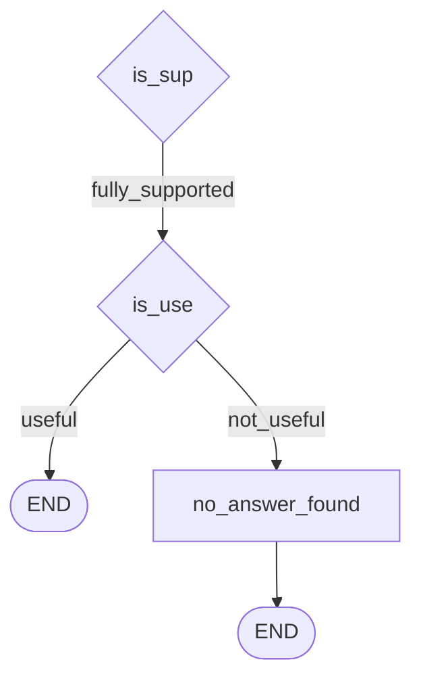

The answer is grounded. That is not the same as saying it is any good.

This is the fourth and last reflection question, and it exists because the previous three can all pass while the user still gets nothing they asked for. The `is_use` node asks one thing: **did we actually answer the question?**



---

## Why grounding doesn't imply usefulness

Worth restating with the concrete case from [[09-The-Four-Reflection-Questions]], because the intuition genuinely misleads people — *if it isn't hallucinating, surely it's a fine answer?*

Given documents about paid leave counts, leave types, and the HR portal, a model can answer:

> *"Employees may take different types of leaves such as sick leave and casual leaves, and leave requests are managed through the HR portal."*

Every claim sits on evidence. Zero fabrication. It would sail through the support check.

And the question was *"how many paid leaves do employees get per year"*. The number is in document 1, which the answer never touched.

Then there is the case created by the previous iteration. [[13-The-Revision-Loop]] pushes answers toward quoted fragments to guarantee grounding — and an over-trimmed quote list can end up grounded, faithful, and no longer an answer to anything. **The revision loop can manufacture exactly the failure this node catches**, which is a good argument for the two checks being separate and ordered this way.

---

## The node

```python
class IsUSEDecision(BaseModel):
    isuse: Literal["useful", "not_useful"]
    reason: str = Field(..., description="Short reason in 1 line.")
```

The prompt's rules, paraphrased:

- **useful** — the answer directly answers the question, or provides the requested specific information
- **not_useful** — the answer is generic, off-topic, or gives only related background without answering
- do not use outside knowledge
- **do not re-check grounding — `is_sup` already did that. Only check: did we answer the question?**
- keep the reason to one short line

> [!important] That fifth rule is the design, not boilerplate.
>
> Hand a model an answer and a context and ask "is this good", and it will conflate every axis at once — accuracy, grounding, tone, completeness. You would get one muddy verdict and no way to know which concern drove it.
>
> Telling the judge explicitly what **someone else already checked** narrows it to a single question. That is the general technique: when you decompose a quality judgement across several LLM calls, each prompt must say what the others own, or they silently re-litigate each other's work.

Notice also what the node is **not** given:

```python
def is_use(state: State):
    decision = isuse_llm.invoke(
        isuse_prompt.format_messages(
            question=state["question"],
            answer=state.get("answer", ""),
        )
    )
    return {"isuse": decision.isuse, "use_reason": decision.reason}
```

**Question and answer only. No context.** Deliberately — the documents are irrelevant to whether an answer addresses a question, and passing them in would tempt the judge back into grounding. The input set enforces the separation that the prompt asks for.

Two new state fields:

```python
isuse: Literal["useful", "not_useful"]
use_reason: str
```

---

## Two paths that currently do the same thing

```python
def route_after_isuse(state: State) -> Literal["END", "no_answer_found"]:
    if state.get("isuse") == "useful":
        return "END"
    return "no_answer_found"
```

Both branches terminate. Which looks pointless — why two paths to the same place?

Because a loop is going into the `not_useful` branch in [[15-The-Retrieval-Rewrite-Loop]]. Building the branch now and filling it later is the same move as the empty `no_relevant_docs` node in [[11-Filtering-Retrieved-Documents]]: **establish the routing shape first, attach behaviour after.** In a graph framework the wiring is the hard part to change; a node body is not.

---

## One wire that is easy to misread

In the graph, the label `"accept_answer"` returned by the support router no longer points at an `accept_answer` node:

```python
g.add_conditional_edges(
    "is_sup",
    route_after_issup,
    {
        "accept_answer": "is_use",        # fully_supported (or max retries) → IsUSE
        "revise_answer": "revise_answer",
    },
)
```

The router function is untouched from the previous iteration; only the **edge map** changed, redirecting the accept branch into `is_use`. The string is now a vestigial name for "the success branch". Reading the router alone would tell you the wrong thing about where control goes — the edge map is the authority.

---

## Two runs

**`Who is the CEO of NexaAI?`**

- `issup` → fully_supported, with evidence
- `isuse` → **useful**
- `reason` → the answer directly provides the name of the CEO

**`What is the refund policy of NexaAI?`**

- `issup` → **no_support**
- final answer → *no answer found*
- `isuse` → **not_useful**

Follow that second one through the whole machine, because it shows every check doing its job in sequence: retrieval fires, the documents are about pricing rather than refunds, generation produces something the support check rejects, the revision loop cannot fix an answer the documents do not contain, it exhausts its retries, and the usefulness check labels the survivor `not_useful`.

> [!info] The instructor's own comment on that outcome — *"which is logical"* — is the right reading. Nothing here failed. A question whose answer is genuinely absent from the corpus **should** end in a refusal, and the value of four checks is that the refusal is reached deliberately rather than replaced by an invented refund policy.

---

## Guarantees

**It guarantees** that a grounded-but-off-target answer is caught rather than shipped, and that the verdict comes with a one-line reason you can log.

**It does not guarantee** the judgement is calibrated. "Useful" is fuzzier than "supported" — grounding can at least be checked against text, while usefulness is a judgement about intent, made by a model that never saw the user.

**It has no repair yet.** At this stage `not_useful` simply ends the flow. Attempting a fix is the last iteration.

---

> [!tip] Interview framing
> "The last reflection point asks whether the answer actually addresses the question, and it's separate from grounding because the two are independent — an answer can quote the documents perfectly and never answer what was asked. The revision loop makes that more likely, not less, since it pushes answers toward literal quotes. Two implementation details I'd highlight. The prompt explicitly tells the judge that grounding was already checked by another node and not to re-check it, because otherwise a model asked 'is this answer good' collapses every quality axis into one muddy verdict. And the node is only given the question and the answer — not the context — so the input set enforces that separation rather than relying on the prompt alone. That's the general pattern for decomposing quality judgements across multiple LLM calls: each judge has to be told what the others own."
