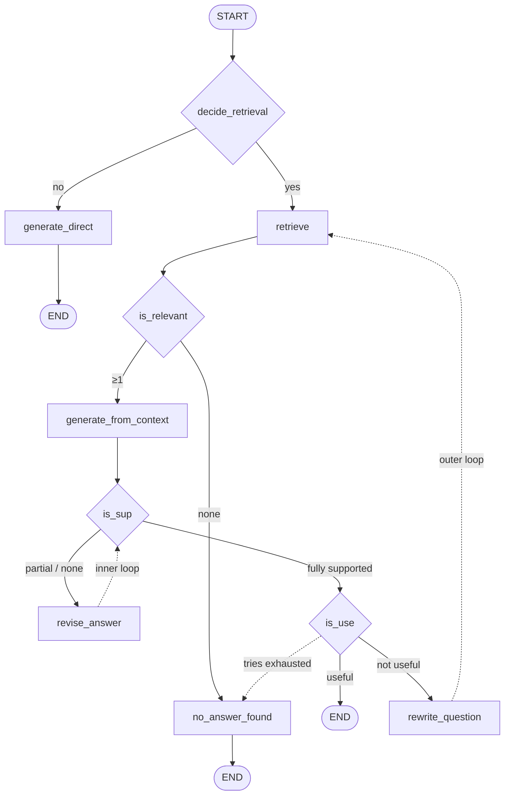

One branch is still a dead end. `not_useful` ends the flow, when what it should do is try again.

Trying again means going back further than any previous repair. The revision loop in [[13-The-Revision-Loop]] reworked the **answer** using documents it already had. If the answer isn't useful, the documents themselves may be the problem — so this loop returns all the way to **retrieval**.

But re-running retrieval with the same query returns the same documents. So the question gets **rewritten** first.



Two nested loops. The inner one repairs answers; the outer one repairs retrieval.

---

## The rewrite

Two new state fields:

```python
retrieval_query: str      # what retrieval actually searches with
rewrite_tries: int        # the outer loop's counter

MAX_REWRITE_TRIES = 3
```

`retrieval_query` is the substantive change. **`question` never changes** — it is what the user asked, and every judge downstream must keep evaluating against it. `retrieval_query` is a working variable that the loop is free to mutate.

The retrieve node switches to it:

```python
def retrieve(state: State):
    q = state.get("retrieval_query") or state["question"]
    return {"docs": retriever.invoke(q)}
```

And the initial state seeds them equal — first time round, the query **is** the question.

```python
class RewriteDecision(BaseModel):
    retrieval_query: str = Field(
        ...,
        description="Rewritten query optimized for vector retrieval against internal company PDFs."
    )
```

The prompt's rules: keep it to 6–16 words; **preserve key entities** like NexaAI and plan names; add 2–5 high-signal keywords likely to appear in the policy or pricing documents; strip filler; don't answer the question. It ships with two worked examples — a free-trial question becoming a keyword string about trial duration and plans, a refund-policy question becoming one about cancellation and refund timelines.

> [!important] Compare this against CRAG's rewrite in [[06-Query-Rewriting-For-Search]] and the difference is the whole point.
>
> CRAG rewrote **for a web search engine** — short, keyword-dense, with time constraints made explicit.
> Self-RAG rewrites **for its own vector store** — preserving entities, adding vocabulary that the indexed PDFs plausibly contain.
>
> Same technique, opposite targets. **Add high-signal keywords that likely appear in policy docs** is a statement about **the corpus**, not about queries in general. A rewrite prompt is only as good as its knowledge of what it is searching.

```python
def rewrite_question(state: State):
    decision = rewrite_llm.invoke(
        rewrite_for_retrieval_prompt.format_messages(
            question=state["question"],
            retrieval_query=state.get("retrieval_query", ""),
            answer=state.get("answer", ""),
        )
    )
    return {
        "retrieval_query": decision.retrieval_query,
        "rewrite_tries": state.get("rewrite_tries", 0) + 1,
        "docs": [],              # reset so the next pass is clean
        "relevant_docs": [],
        "context": "",
    }
```

Two details that matter more than they look.

**It is given the previous query and the previous answer.** Not just the original question — otherwise every iteration would produce the same rewrite and the loop would spin on identical retrievals. Seeing what was already tried, and what unsatisfying answer it produced, is what lets attempt two differ from attempt one.

**It clears `docs`, `relevant_docs` and `context`.** State persists across nodes — the property that [[07-The-Ambiguous-Path]] exploited deliberately — and in a loop that same persistence becomes a hazard. Without the reset, stale documents from the previous pass would linger alongside the new ones.

> [!warning] This is the characteristic bug of cyclic graphs. In an acyclic graph, **state persists** is purely convenient. In a loop, any field written on one pass is still there on the next, and you must decide field by field whether that is memory or contamination. Here `retrieval_query` and `rewrite_tries` are memory; `docs` and `context` are contamination.

---

## The router

```python
def route_after_isuse(state) -> Literal["END", "rewrite_question", "no_answer_found"]:
    if state.get("isuse") == "useful":
        return "END"
    if state.get("rewrite_tries", 0) >= MAX_REWRITE_TRIES:
        return "no_answer_found"
    return "rewrite_question"
```

Three outcomes now, from what was a two-way branch in [[14-Is-The-Answer-Useful]] — the placeholder built there paying off exactly as intended.

`MAX_REWRITE_TRIES = 3` against `MAX_RETRIES = 10` for the inner loop. The asymmetry is reasonable: an inner revision is one LLM call, while an outer pass re-runs retrieval, four relevance calls, generation, grounding, possibly several revisions and a usefulness check. Outer iterations cost roughly an order of magnitude more, so you buy far fewer of them.

```python
g.add_conditional_edges("is_use", route_after_isuse, {
    "END": END,
    "rewrite_question": "rewrite_question",
    "no_answer_found": "no_answer_found",
})

g.add_edge("rewrite_question", "retrieve")
```

---

## A change the lecture says didn't happen

Comparing this iteration's `is_relevant` prompt against the one in [[11-Filtering-Retrieved-Documents]], the lecture says it is unchanged. **The code disagrees**, and the difference is instructive.

The original judged whether a document **contains information useful for answering the question**. The final version judges relevance **at a topic level**, states that a document need not contain the exact answer, offers examples (HR policies are relevant to notice-period questions; pricing documents are relevant to refund and trial questions; the company profile is relevant to leadership, culture and size questions), and closes with two decisive lines: **do not decide whether the document fully answers the question — that will be checked later by IsSUP**, and **when unsure, return true**.

The filter was deliberately **loosened**.

> [!info] That change follows from the architecture. In [[11-Filtering-Retrieved-Documents]] the relevance filter was the **only** quality gate, so it had to be strict — anything it let through went straight to the user. By this iteration there are three checks behind it: grounding, revision, and usefulness.
>
> A strict early filter in a layered system is actively harmful, because a dropped document is **unrecoverable** — no later stage can retrieve what was discarded — whereas a document wrongly kept is caught downstream. So the correct posture flips from precision to recall: let borderline material through, and let the specialised checks reject it.
>
> **Early filters should get more permissive as you add later ones.** That generalises well beyond this graph.

---

## Running the whole thing

> **Describe NexaAI's company culture.**

The debug output walks the full machine:

- `need_retrieval` → True
- `rewrite_tries` → 0 — the outer loop never fired
- support retries → 1 — the inner loop fired once
- 4 documents retrieved, **2** relevant
- `issup` → fully_supported, with evidence
- `isuse` → useful, with a one-line reason
- and the final answer

One inner repair, no outer repair, a grounded and useful result.

> [!note] Two things to be honest about here.
>
> **The lecture never demonstrates the outer loop succeeding.** The instructor says plainly that he could not find a question where the answer was not-useful, was re-retrieved, and **became** useful — in his testing answers were consistently either useful or not. He recommends the viewer go looking. So the outer loop is built and wired but unproven on this corpus, and that is the honest status.
>
> **The notebook's initial state has a mismatch** — it asks about company culture while seeding `retrieval_query` with a refund-policy string, a copy-paste leftover. The lecture's stated intent is that both start equal. If you run the repo code and the first retrieval looks wrong, that is why.

---

## The finished architecture

All four reflection questions, answered, with a correction path behind each:

| # | Question | Node | If the answer is no |
|---|---|---|---|
| 1 | Retrieval needed? | `decide_retrieval` | answer directly from parametric knowledge |
| 2 | Documents relevant? | `is_relevant` | no relevant documents → stop |
| 3 | Answer grounded? | `is_sup` | revise and re-check (inner loop, ×10) |
| 4 | Answer useful? | `is_use` | rewrite and re-retrieve (outer loop, ×3) |

---

## How this differs from Corrective RAG

Both live in this folder; they are not the same kind of system.

| | Corrective RAG | Self-RAG |
|---|---|---|
| Reflection points | one (after retrieval) | four (before retrieval → after generation) |
| Control flow | **acyclic** — classify, branch, done | **cyclic** — two nested loops |
| Can skip retrieval? | no | yes |
| Checks its own output? | no | twice — grounding, then usefulness |
| Failure response | switch knowledge source (web) | repair the answer, or re-retrieve |
| Termination | structural | needs explicit counters |

CRAG fixes the **inputs** to generation. Self-RAG also inspects the **outputs**, which is what forces the loops, and the loops are what force the retry counters and the raised `recursion_limit`.

> [!warning] **What this implementation shares with every popular Self-RAG build, and what it costs.**
>
> The lecture is upfront that the paper's authors used a **fine-tuned model** and this build substitutes OpenAI LLMs at every reflection point — conceptually identical, different in the finer details.
>
> Worth knowing when you read the paper, and beyond what the lecture covers: the paper's actual contribution was to **train** those reflection decisions into the model as special tokens emitted inline during generation, rather than to orchestrate them as separate graph nodes. So a LangGraph build like this one reproduces Self-RAG's **control flow** while replacing its **mechanism** with prompted judges.
>
> That is not a criticism — the prompted version is what you can actually deploy without training anything. But it makes the claim **I implemented Self-RAG** one an interviewer can reasonably probe, and knowing which half you built is the answer.

---

## Guarantees

**It guarantees** four explicit self-checks per query, with a repair path behind each, and termination through two independent counters plus the framework's recursion limit.

**It does not guarantee** correctness at any of the four points — every one is an LLM judging text, and a wrong verdict early routes the whole query wrongly.

**It does not guarantee** the outer loop helps. It is built, wired, and undemonstrated.

**And it is expensive.** One query at `k=4` with a single inner revision costs: one routing call, four relevance calls, one generation, one grounding check, one revision, one re-check, one usefulness check — **ten LLM calls, sequentially**, where traditional RAG made one. An outer-loop pass multiplies most of that again. The cost profile, not the concept, is what decides whether this belongs in production.

---

> [!tip] Interview framing
> **The last piece closes the outer loop: if the answer isn't useful, rewrite the query and go back to retrieval. The key state design is that `question` never changes — every judge keeps evaluating against what the user actually asked — while a separate `retrieval_query` field is what the loop mutates and what the retriever searches with. The rewriter gets the previous query and the previous answer, not just the original question, otherwise every iteration produces the same rewrite. And it resets `docs`, `relevant_docs` and `context`, because in a cyclic graph state persistence flips from convenient to hazardous — you have to decide per field whether it's memory or contamination. The subtlest thing I found was that the relevance filter got looser over the build: it started strict when it was the only gate, and ended up saying 'don't decide whether it fully answers the question, IsSUP will check that — when unsure return true.' That's right, because a dropped document is unrecoverable while a wrongly-kept one gets caught downstream. Early filters should get more permissive as you add later ones.**
