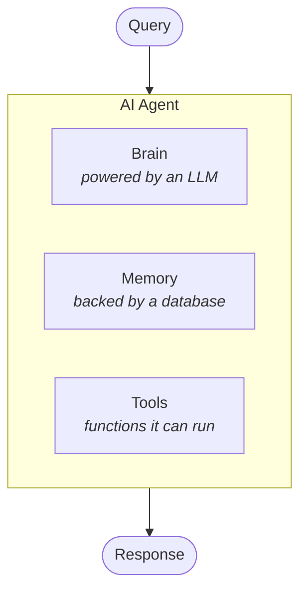

The whole architecture rests on one substitution — an agent in place of an LLM — so the term has to mean something precise before it can carry any weight.

Start with what an LLM is on its own.

**An LLM is a standalone system.** You give it a prompt, it generates a response. That is the entire contract, and it works without anything else attached. It is complete by itself.

**An AI agent is a larger system in which an LLM is one part.** The LLM is not the agent. It is a sub-component of something bigger, and it does not act alone inside it.

> [!important] This distinction is the one people skip, and it is the reason "agent" gets used to mean nothing. If the LLM is the whole system, you have an LLM. If the LLM is a piece inside a system that also holds state and can act on the world, you have an agent.

---

## The three components

Draw a box around the agent, and three essential components sit inside it.

---

## The brain

The brain is the crucial part. Every step the agent takes and every bit of thinking it does comes from here, and it is **powered by an LLM**.

It gives the agent three **cognitive capabilities**:

| Capability | What it is |
|---|---|
| **Reasoning** | thinking through how a given step should be done |
| **Planning** | deciding what the series of steps should be |
| **Orchestration** | deciding which option to take, and when |

All three are covered properly in [[18-The-Properties-Of-An-AI-Agent]]. What matters here is where they come from — the LLM, sitting inside the agent as its brain.

Two properties of the LLM itself get used constantly in an agentic RAG pipeline, and the lecture names both:

- **NLU — natural language understanding.** Used to understand the user, work out the **intent** behind a query, and make decisions from it. Every decision the pipeline makes about an incoming query runs on this.
- **NLG — natural language generation.** Used to produce the response.

> [!info] Worth noticing that these two sit at opposite ends of the pipeline. NLU is what the agent applies to the *query* before anything happens; NLG is what produces the *answer* at the end. The same model provides both, but they are doing different jobs, and most of what makes a pipeline "agentic" is happening on the NLU side.

---

## The memory

Memory is implemented with **some sort of database**, and the obvious reading of it is persistence — information the agent has, kept so it survives.

That reading is too small. Memory is not only storage; **the whole context is part of the agent's memory**.

The piece that gets underestimated is **conversational history**. It is tempting to assume conversational history means the messages you send the agent as input. It does not — several things live in it:

- the **input queries** the user asked
- the **retrieved documents** that came back
- the **responses** that were generated

All of it, together, is the conversational history.

> [!important] Hold on to the fact that retrieved documents are in memory. It looks like a detail here, but it is the entire basis of one of the good-to-have properties in [[23-The-Good-To-Have-Properties]] — if the documents from an earlier turn are still in memory, a later query that would retrieve the same thing does not need to retrieve at all.

---

## The tools

Tools are what complete the journey from LLM to agent:

> **LLM + tools = AI agent.**

Through tools the agent performs actions and tasks, and behind the scenes a tool is a **Python function**. The agent does not do anything magical when it uses one — it calls a function, the function runs, and the function returns a result.

And retrieval is a task like any other. So you give the agent a retrieval tool, and documents get fetched by calling it.

> [!important] That sentence is the hinge of this entire module. In traditional RAG, in Corrective RAG and in Self-RAG, retrieval is a **step in the graph** — a node that always sits in the same place. Making retrieval a **tool** turns it into something the agent may call, may call several times, may call with different arguments, or may not call at all.
>
> Nothing else in agentic RAG makes sense until that shift is clear. The four questions in [[19-The-Four-Questions]] are all questions an agent can only ask *because* retrieval became a tool.

---

## Guarantees

**It guarantees** a vocabulary: brain for deciding, memory for what has already happened, tools for doing.

**It does not guarantee** anything about quality. An agent is a structure, not a competence — a badly prompted agent with one badly written tool is worse than a clean traditional RAG pipeline.

**It does not mean autonomy is free.** The brain is an LLM, so every decision the agent makes is a model call with a model's error rate.

---

> [!tip] Interview framing
> "The distinction I'd start with is that an LLM is a standalone system — prompt in, response out, complete by itself — whereas an agent is a larger system where the LLM is a sub-component. Three parts: a brain, which is the LLM and supplies reasoning, planning and orchestration; memory, backed by a database, which holds not just persisted facts but the whole conversational history including previously retrieved documents; and tools, which are Python functions the agent can call. The formula is LLM plus tools equals agent. For RAG specifically, the load-bearing move is making retrieval a tool rather than a fixed node in the graph — that single change is what lets the agent decide whether to retrieve, from which source, with which parameters, and how many times. Everything else in agentic RAG follows from it."
