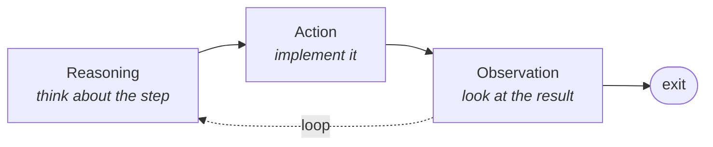

An agent has five properties worth naming, and the reason to name them is practical: each one shows up later as a specific thing the pipeline does. This is the vocabulary the rest of the module uses.

---

## The five properties

| # | Property | What it means |
|---|---|---|
| 1 | **Autonomy** | it makes the decisions itself |
| 2 | **Planning** | it works out the series of steps first |
| 3 | **Reasoning** | it thinks about how each step should be done |
| 4 | **Orchestration** | it decides which option to take, and in what order |
| 5 | **Adaptability** | it is dynamic, robust and error-free |

---

## Autonomy

Every decision the RAG pipeline makes — and an agentic pipeline makes many — the agent makes **by itself**. You will see decision points at many steps, and the whole of that decision-making is handled by the agent.

Human intervention is **minimal**. Not necessarily zero: you can include a human in the loop, and sometimes should. But the default posture is that the agent decides.

---

## Planning

Planning is the property that stops the agent from just starting.

When a query arrives, the agent does not immediately begin retrieving. It first **understands the query**, works out its **intent**, checks whether retrieval should happen at all, and — if it should — how it should be done. Only then does it define a **series of steps**.

Those steps depend on the input query. A different query produces a different plan.

> [!info] The clearest way to hold it: planning is building a **to-do list**. The agent writes the list before doing anything on it, and then acts according to the list.

---

## Reasoning

If planning is writing the to-do list, reasoning is the thinking that happens **inside each item on it**.

For every step in the series, the agent applies thinking to how that particular step should be carried out. Planning decides *what* the steps are; reasoning decides *how* each one goes.

> [!important] Planning and reasoning get used interchangeably in casual writing and they are not the same thing. One operates across steps, the other within a step. The lecture keeps them separate deliberately, and the distinction matters when you are debugging: a pipeline that picked the wrong *sequence* has a planning problem; one that picked the right sequence and executed a step badly has a reasoning problem.

---

## Orchestration and adaptability

**Orchestration** is choosing which option to take in which case — it draws on both planning and reasoning together. When the agent has several tools available and several possible orders, orchestration is what picks.

**Adaptability** is the pipeline being **dynamic**, **robust** and **error-free** — changing shape according to what the query needs, and holding up when something goes wrong.

![[AI-Engineering/07-RAG/09-RAG-Architecture/Images/03-Adaptability-And-Orchestration.png]]

---

## The loop

Properties are static descriptions. What the agent actually *does*, repeatedly, is a three-stage loop — and every step it takes passes through all three.

![[AI-Engineering/07-RAG/09-RAG-Architecture/Images/02-Reason-Act-Observe.png]]

1. **Reasoning / thinking** — decision making *for this step*. What needs doing here?
2. **Action** — the actual implementation. This produces a **result**.
3. **Observation** — observe what the action produced.

After observing, the agent either goes round again or leaves the loop.

> [!important] Compare that against what traditional RAG does, because the contrast is the whole point.
>
> In traditional RAG, once the pipeline is triggered you get an output. There is **no intervention possible** at any step in between, and **no verification** of the results as they are produced. It runs, and then it is done.
>
> An agent is in **active mode at every step**. It is watching each result as it appears, and it can act on what it sees. That is the difference between a pipeline that runs and a pipeline that is being supervised while it runs.

---

## Guarantees

**It guarantees** a name for each behaviour you will see later — so that when the pipeline rewrites a query or reorders two retrievals, you can say which property produced it.

**It does not guarantee** the properties are actually present in any given implementation. "Adaptability: robust and error-free" is an aspiration, and the graceful-fallback work in [[23-The-Good-To-Have-Properties]] exists precisely because it does not come for free.

**Every loop iteration costs.** Reason, act, observe is at minimum one model call per step, and the agent decides how many steps there are.

---

> [!tip] Interview framing
> "Five properties: autonomy, planning, reasoning, orchestration, adaptability. The two I'd separate carefully are planning and reasoning, because people use them interchangeably — planning is deciding what the series of steps is, essentially building a to-do list before doing anything, and reasoning is the thinking applied within each individual step. Orchestration sits on top of both and decides which option to take and when. Operationally the agent runs a reason-act-observe loop: it thinks about the step, implements it, observes the result, then either loops or exits. The contrast with traditional RAG is the useful part — traditional RAG is fire-and-forget, no intervention possible partway and no verification of intermediate results, whereas an agent is in active mode at every step and can respond to what it sees."
