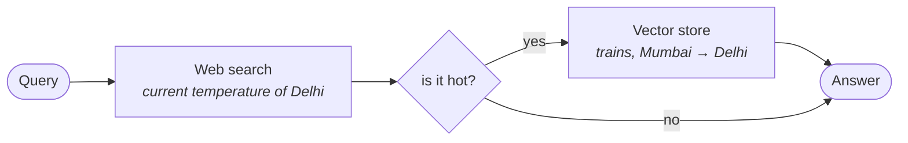

Everything an agent adds to a retrieval pipeline can be reduced to four questions. They are the spine of the architecture, and the rest of this module is each one worked out in detail.

![[AI-Engineering/07-RAG/09-RAG-Architecture/Images/04-The-Four-Questions.png]]

| Question | What is being decided |
|---|---|
| **IF** | whether to do retrieval or not |
| **WHERE** | where to do retrieval from |
| **HOW** | how to do it |
| **WHEN** | in what order the steps happen |

---

## Why these four and not others

Go back to what traditional RAG lacks, from [[16-Why-Agentic-RAG]]. Two things: **control on retrieval**, and **order**.

The four questions are those two failures taken seriously.

- **IF, WHERE and HOW** are all forms of **control over retrieval** — control over whether it happens, control over the source, control over the mechanics.
- **WHEN** is **order**.

That is the whole mapping. There is no fifth question because there was no third failure.

---

## IF — whether to retrieve

Traditional RAG retrieves for every input. An agent decides.

The mechanism is the agent's reasoning capability applied to the query: it uses the LLM to understand the query's **intent**, and checks whether the answer is already available in the model's **parametric knowledge** — the knowledge baked into the model's weights.

If it is, the agent answers directly and no retrieval happens at all.

> [!info] Self-RAG asked this same question — [[10-Deciding-Whether-To-Retrieve]] is the same idea implemented as a fixed router node. The difference is not the question but who owns it. There, you wrote a node whose job was to answer it. Here it is one of several decisions an agent makes as a matter of course.

---

## WHERE — which source

Once retrieval is happening, from where? A vector store, or a web search, or one of several vector stores.

The answer arrives via **tools**, and it is chosen per query. Fully worked in [[21-Retrieval-As-A-Tool]].

---

## HOW — the mechanics

Having picked a source, how should the retrieval actually be performed? Similarity search or MMR; how many documents (`k`); what **metadata filters** to apply; which fields to search.

These are the retriever settings you have been choosing by hand since [[01-What-Is-A-Retriever]]. In an agentic pipeline they stop being settings and become **arguments**. Also in [[21-Retrieval-As-A-Tool]].

---

## WHEN — the order

The fourth question is the one with no equivalent anywhere earlier in this folder, because it is the one traditional RAG structurally cannot ask.

It uses the agent's **orchestration** capability together with its cognitive capability, and it is best seen through the lecture's example.

![[AI-Engineering/07-RAG/09-RAG-Architecture/Images/08-When-Orchestration.png]]

> **Get me the current temperature of Delhi, and if it is hot, then recommend me three trains from Mumbai to Delhi.**

Two retrievals are needed, from two different sources. Train information is in the database — the vector store. Current temperature is not; that needs a web search.

Now notice the word **if**. The second retrieval is conditional on the result of the first. Which means:

Run those in the other order and the query cannot be answered correctly. You would be recommending trains before knowing whether the condition that justifies recommending them holds — and the lecture's own illustration of getting this wrong is ending up recommending something that does not actually answer what was asked.

> [!important] The principle stated plainly: **whether to do a step is one question; when to do it is a different question, and it also makes an impact.**
>
> This is genuinely new. Corrective RAG and Self-RAG both make decisions, but neither ever reorders anything — CRAG's graph is acyclic and fixed, and Self-RAG's loops revisit steps in the same order. Ordering as a decision is what **agentic** buys that reflection alone does not.

---

## Guarantees

**It guarantees** a complete checklist. If you can say what your pipeline does about IF, WHERE, HOW and WHEN, you have described its agentic behaviour exhaustively.

**It does not guarantee** the answers are good. Four decisions made by a model is four places to be wrong, and WHEN is the least forgiving of them — a wrong order does not degrade the answer, it invalidates it.

---

> [!tip] Interview framing
> **Agentic RAG comes down to four questions the agent answers per query: IF — retrieve or not; WHERE — from which source; HOW — with what retrieval settings; and WHEN — in what order. The reason it's exactly four is that traditional RAG has exactly two structural failures: no control over retrieval, and a fixed order. IF, WHERE and HOW are all control over retrieval; WHEN is order. The one I'd dwell on is WHEN, because it's the only one with no equivalent in Corrective RAG or Self-RAG — both of those make decisions but neither ever reorders anything. The example that makes it concrete is 'get the current temperature of Delhi, and if it's hot recommend three trains from Mumbai to Delhi' — temperature needs a web search, trains are in the vector store, and the second retrieval is conditional on the first result, so running them in the wrong order doesn't just degrade the answer, it makes the query unanswerable.**
