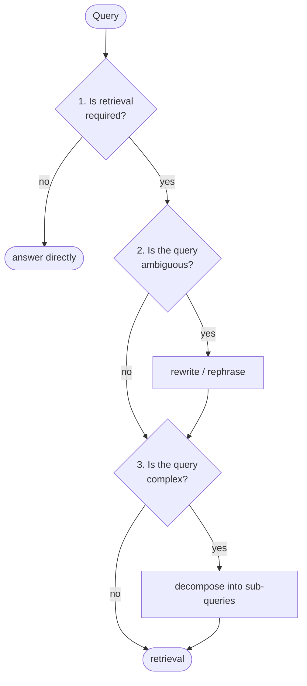

The lecture now walks the pipeline stage by stage and names the properties an agentic RAG system **must have** to function properly. There are eight. The first three all happen before any retrieval, while the agent is still looking at the query.

---

## 1. Is retrieval required?

The first question of all, and the reason is worth stating: the agent should decide whether to **initiate this whole process** before initiating it.

The agent uses its reasoning capability on the incoming query. Using the LLM it works out the query's **intent**, and alongside that it checks whether the answer is already present in the model's **parametric knowledge**.

If the answer is already there, generate it directly. No retrieval, no context, no documents.

This is the **IF** from [[19-The-Four-Questions]], and it is the same question Self-RAG asked in [[10-Deciding-Whether-To-Retrieve]].

---

## 2. Is the query ambiguous?

If retrieval **is** needed, the next check is whether the query is **ambiguous** — whether it could carry more than one meaning.

If it can, the agent **rewrites or rephrases** it, so that what gets sent to retrieval is a query with a single clear reading.

![[AI-Engineering/07-RAG/09-RAG-Architecture/Images/09-Retry-Logic.png]]

> [!info] Query rewriting has now appeared three times in this folder, each time pointed at a different problem, and the differences are the interesting part.
>
> | Where | Why it rewrites |
> |---|---|
> | [[06-Query-Rewriting-For-Search]] | the target changed — a **web search engine** wants keywords, not sentences |
> | [[15-The-Retrieval-Rewrite-Loop]] | retrieval already **failed**, so try different words |
> | here | the query is **ambiguous** as written, before anything has been tried |
>
> The third is the only one that is preventative. The other two are reactions — to a different consumer, or to a failure that already happened.

---

## 3. Is the query complex?

The third check asks whether the query is **complex** — whether it asks for several distinct things that each need their own retrieval. If it does, the agent performs **query decomposition** and breaks it into sub-queries.

The lecture's example:

> **Do a comparison between X and Y, and show me the comparison report.**

One query, but not one retrieval. It becomes a plan:

| Step | What happens |
|---|---|
| 1 | retrieve the documents for **X** |
| 2 | retrieve documents for **Y** |
| 3 | perform the **comparison** |
| 4 | produce the response |

With a concrete pair — comparing Java against JavaScript — step 1 retrieves the Java documents, and then step 2 does something subtler than simply retrieving Java**Script** documents.

> [!important] **The second retrieval is shaped by the first.** The lecture is specific: the retrieval for Y happens **in relation to** X — whatever topics came back for X, those same topics are what get retrieved for Y.
>
> That matters because a comparison is only a comparison if both sides cover the same ground. Retrieve **Java: memory model, concurrency, type system** and then retrieve whatever JavaScript documents happen to rank highest, and you have two unrelated summaries sitting next to each other rather than a comparison.
>
> Note also what this requires: step 2 cannot be planned in full until step 1 has returned. That is planning **and** reasoning together, and it is the first place in this folder where one retrieval's parameters depend on another retrieval's results.

So decomposition is doing two things at once — breaking the query down, **and** performing multiple retrievals off the back of it.

---

## Guarantees

**It guarantees** that the query reaching the retriever is one the retriever has a chance with: needed, unambiguous, and single-purpose.

**It does not guarantee** the judgements are right. Three model calls happen before a single document is fetched, and each can be wrong — deciding no retrieval is needed when it was, resolving an ambiguity the wrong way, or decomposing a query that did not need it.

**It costs three model calls minimum** ahead of any retrieval, on every query, including the simple ones.

---

> [!tip] Interview framing
> **Before any retrieval happens, an agentic pipeline asks three things about the query. One: is retrieval required at all, which the agent decides by working out intent and checking whether the answer is already in the model's parametric knowledge. Two: is the query ambiguous, and if so rewrite it — worth distinguishing from the other rewrites in this space, because this one is preventative rather than a reaction to a failed retrieval. Three: is the query complex, and if so decompose it into sub-queries. The detail I'd highlight in decomposition is that for a comparison query — compare X and Y — the retrieval for Y is shaped by what came back for X, using the same topics, because otherwise you get two unrelated summaries rather than a comparison. That also means the second step can't be fully planned until the first returns, which is planning and reasoning operating together.**
