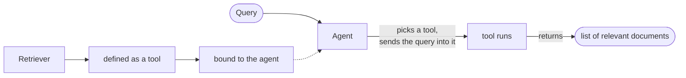

Properties four and five are **WHERE** and **HOW** — which source to retrieve from, and how to retrieve from it. Both are answered by the same mechanism, which is why they belong in one note: the agent's **tool** capability.

---

## 4. Selecting the source

Start with why the source needs choosing at all.

A vector store holds company-related documents. Ask *"what is the leave policy of the company"* and it is exactly the right place to look — the answer is in there.

Now ask something the company documents do not cover. Run it against the same vector store and you still get four documents back, because a vector store asked for `k` always returns `k`. The context gets built, and it is not relevant.

Whereas if that query had gone to a **web search** instead, the answer would have come back — and the response would have been more accurate and simply better.

So the source of retrieval should **change dynamically based on the input query**.

![[AI-Engineering/07-RAG/09-RAG-Architecture/Images/05-Where-Source-Of-Retrieval.png]]

### How it is implemented

This is where the agent's tool capability does the work.



Each retrieval gets **defined as a tool** and **bound** to the agent. The agent always knows which tools it has available, so when a query arrives it looks at its list of available tools, works out which one this query needs, sends the query into that tool, and the tool hands back retrieved documents as its result.

Because a tool is a Python function, the sequence is unglamorous and exact: the agent calls the function, the function runs, the function returns. And a retriever's return value is always the same thing — a **list of relevant documents**.

> [!important] Compare this against [[05-Web-Search-Fallback]]. Corrective RAG also had two knowledge sources, corpus and web, and also chose between them. But there the choice was made by a **hand-written router** reading a verdict, and web search was reachable only on the failure path.
>
> Here neither is a fallback. Both are tools of equal standing, and the agent picks on the way in, from the query itself, before anything has failed.

The dynamic character goes further than one choice per query. The agent can search the vector store, find the results unsatisfactory, and then go to another source — the selection is not a single decision made once.

---

## 5. How to do the retrieval

Source chosen. Now: how should the retrieval actually run?

These are the retriever settings from earlier in the course. Similarity search takes a `k` and a metadata `filter`. MMR takes `k`, `fetch_k` and `lambda_mult`.

![[AI-Engineering/07-RAG/09-RAG-Architecture/Images/06-How-Retrieval-Parameters.png]]

Until now you have been choosing those by hand, at build time, once, for every query the system will ever see. An agentic pipeline hands them to the agent.

The mechanism is the **tool schema** — the declaration of what parameters a tool accepts.

![[AI-Engineering/07-RAG/09-RAG-Architecture/Images/07-Tool-Schema-Parameters.png]]

```
tool schema
└── parameters
    ├── k            = 3
    ├── fetch_k      = 30
    └── lambda_mult  = 0.5
            ↓
    tool call operation
```

You describe those parameters in the tool schema, the agent reads the schema, and at **tool-call time** the agent decides what to pass. The values above are what a call might look like — not a configuration you set.

> [!important] This is the sharpest single idea in the module, and it is easy to read past.
>
> `lambda_mult` controls the trade-off between relevance and diversity in MMR — it is the dial you tuned in [[03-MMR-Maximal-Marginal-Relevance]]. Setting it to 0.5 is a **judgement about a query**: this one wants a spread of perspectives rather than four near-identical chunks.
>
> Traditional RAG forces you to make that judgement once, in advance, for every query at the same time. Putting it in the tool schema means the judgement gets made **per query, by something that has read the query**.
>
> The same applies to `k`. A narrow factual question wants a small `k`; "give me an overview of everything the report says about X" wants a large one. One number cannot be right for both.

And the whole chain stays concrete: schema → the agent fills in arguments → a tool call → a Python function runs → a list of documents comes back.

---

## Guarantees

**It guarantees** that source and retrieval settings are decided with the query in hand rather than months earlier.

**It does not guarantee** the agent chooses well. It can pick the wrong source, or set `k` badly, and unlike a hardcoded value a bad choice is not reproducible — the same query may be retrieved differently on two runs.

**It makes retrieval harder to debug.** With fixed settings, a bad result means bad documents or a bad query. With agent-chosen settings, it might also mean the agent passed `k=1`, and you will not know unless you logged the tool call.

---

> [!tip] Interview framing
> "Properties four and five — where to retrieve from and how — are both answered by making retrieval a tool. Each retriever gets defined as a tool and bound to the agent; the agent sees its list of available tools, picks based on the query, and the tool is just a Python function that returns a list of documents. That's different from Corrective RAG's web-search fallback, where the choice was a hand-written router and web search only happened after the corpus failed — here both sources are peers and the choice happens on the way in. The part I find most interesting is HOW. Retriever parameters — k, the metadata filter, MMR's fetch_k and lambda_mult — get declared in the tool schema, so the agent fills them in at tool-call time. lambda_mult is a judgement about whether a query wants diverse results or tightly relevant ones, and traditional RAG makes you fix that once for every query the system will ever see. Putting it in the schema means something that has actually read the query decides it."
