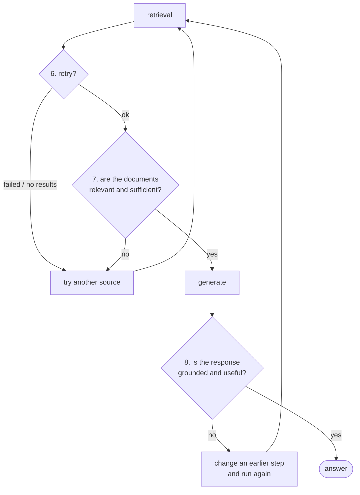

Documents have been retrieved. The last three must-have properties are about not trusting them — and then not trusting the answer built from them.

---

## 6. Retries

The sixth property is whether the agent should **perform any retries**.

Retry logic here is tied to **multiple sources**. If retrieval from one source fails — it errors, or it comes back with nothing — the agent selects a second source and tries there.

![[AI-Engineering/07-RAG/09-RAG-Architecture/Images/09-Retry-Logic.png]]

The lecture's own case: a web search tool is called, and it does not manage to search properly. That is a failure the pipeline can respond to rather than propagate, and the response is to pick a different source.

> [!info] Notice this is a different kind of retry from the ones in [[13-The-Revision-Loop]] and [[15-The-Retrieval-Rewrite-Loop]]. Those retried the **same source** with either a repaired answer or a rewritten query. This retries a **different source** with the same query. Both are worth having; they fail differently.

Retries are also the property most obviously in need of a brake, which is why they come back in [[23-The-Good-To-Have-Properties]] under graceful fallback.

---

## 7. Relevance of the retrieved documents

The seventh property: check the documents before generating from them.

The check takes two inputs — the **query** and the **retrieved documents** — and asks whether these documents are **sufficient to answer this query**.

And the agent can go further than a yes/no. The lecture lists what is available at this stage: **transformations**, **scoring**, and **refinement** — the retrieved set can be reworked rather than merely accepted or rejected.

> [!important] This is Corrective RAG, reused. [[04-Retrieval-Evaluation]] scored each document for relevance and [[03-Knowledge-Refinement]] refined what survived, and both of those are exactly the operations named here.
>
> The reuse is the point rather than a coincidence. Agentic RAG does not invent a new relevance mechanism — it takes CRAG's and makes it something the agent applies when it judges it necessary, instead of a node that always runs.

---

## 8. Verifying the response

The eighth and last must-have: verify the generated response against **two** things.

| Check | Question |
|---|---|
| **Grounded** | is the response built on the context? |
| **Useful** | does it actually answer the query? |

These are Self-RAG's two questions, from [[12-Grounding-And-The-Support-Levels]] and [[14-Is-The-Answer-Useful]], reused the same way CRAG's evaluator was.

The lecture adds a twist worth catching: **you can define these checks as tools too**. A `grounded` tool and a `useful` tool, bound to the agent, called automatically when it wants to verify its own output.

> [!important] That generalises further than it first looks. Once verification is a tool rather than a node, the agent decides *whether to verify at all* — cheap on a query it is confident about, thorough on one it is not.
>
> It also means the two checks stay independent. [[14-Is-The-Answer-Useful]] made the case for why grounded and useful must be judged separately: an answer can quote the documents perfectly and never address the question. Two tools keep that separation structurally.

And if the response is not up to the mark, the agent is not limited to fixing the response. It can go back into **previous steps of the pipeline**, change them, and run the whole thing again.

> [!info] That is the strongest statement of what "dynamic" means in this architecture. Self-RAG's outer loop in [[15-The-Retrieval-Rewrite-Loop]] could go back to retrieval with a rewritten query — one specific repair, wired in advance. Here a failed verification can reach back to *any* earlier decision: the source, the parameters, the decomposition, the order.

---

## The eight, together

| # | Property | Stage |
|---|---|---|
| 1 | Is retrieval required? | query |
| 2 | Is the query ambiguous → rewrite | query |
| 3 | Is the query complex → decompose | query |
| 4 | Selecting the source of retrieval | retrieval |
| 5 | How to do the retrieval | retrieval |
| 6 | Whether to perform retries | retrieval |
| 7 | Relevance check on retrieved documents | retrieval |
| 8 | Verify the response — grounded, and useful | generation |

These are the **must-haves**: what an agentic RAG pipeline needs in order to function properly.

Two of the four questions from [[19-The-Four-Questions]] are visible in this table — IF is property 1, WHERE is property 4, HOW is property 5. **WHEN is not in it**, because ordering is not a stage of the pipeline; it is a decision about the pipeline, and it applies across all of them.

---

## Guarantees

**It guarantees** three independent chances to catch a bad run: at the retrieval call, at the documents, and at the answer.

**It does not guarantee** any of the three verdicts is right, and the last one is the most expensive to get wrong — a false "not grounded" sends the pipeline back through steps it already did correctly.

**Cost:** on top of the three query-stage calls, this adds a relevance judgement per document plus two verification calls, before counting anything a retry or a re-run repeats.

---

> [!tip] Interview framing
> "The last three must-haves are all forms of not trusting what you just got. Six is retries, which here means switching to a different source when one fails or returns nothing — distinct from Self-RAG's retries, which re-ran the same source with a rewritten query. Seven is a relevance check on the retrieved documents, taking the query plus the documents and asking whether they're sufficient, with the option to transform, score or refine rather than just accept or reject — that's Corrective RAG's evaluator reused. Eight is verifying the response on two independent axes, grounded and useful, which is Self-RAG reused. The neat detail is that both verification checks can themselves be defined as tools, so the agent decides whether to verify at all. And if verification fails, the agent isn't limited to fixing the answer — it can go back and change any earlier step, the source, the parameters, the decomposition, and run again. That's the strongest form of 'dynamic' in the whole architecture."
