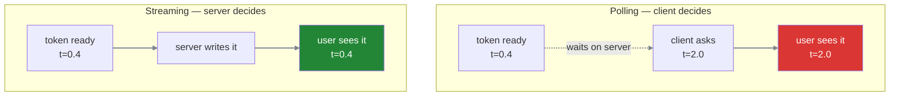
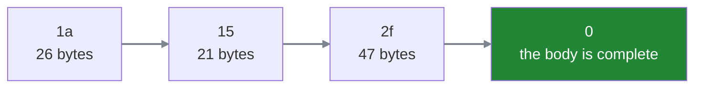
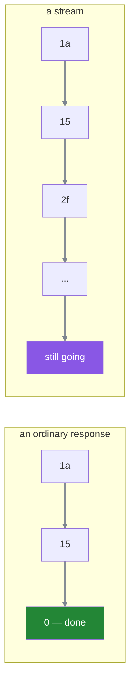
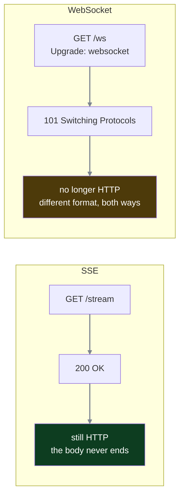

#sse #streaming #http #polling #agents

**Streaming does not make the answer arrive sooner.** The last token lands at the same moment either way — what changes is when the **first** one does, and every design decision in this folder follows from taking that distinction seriously.

# Twenty seconds of nothing

A teacher asks the assistant what their salary was last month. The agent reads the question, calls the school's records system for salary details, waits for that API, and writes an answer. End to end, twenty seconds.

For those twenty seconds the user sees an empty screen.

**The problem is not that twenty seconds is slow.** It is that a screen showing nothing after twenty seconds is indistinguishable from a screen showing nothing because the request died. The user has no way to tell a working system from a hung one, so they do the reasonable thing and reload — which throws away the work in flight and starts another twenty seconds.

# What streaming actually changes

Both versions start at the same instant. The model still has to generate every token, and the records system call still takes as long as it takes.

```text
without streaming   t=0 ──────────────────────────────── t=20   entire answer
with streaming      t=0 ─ t=0.4 first token ─ … ──────── t=20   last token
```

**The last token lands at t=20 in both.** Total latency is unchanged, because nothing about streaming makes generation faster.

What moved is the **first** token, from twenty seconds to a few hundred milliseconds. That number has its own name — **time to first token**, usually written TTFT — and it is a different measurement from total latency. Streaming improves TTFT and leaves total latency exactly where it was.

> [!important] This is worth stating plainly because the intuition runs the other way. Streaming feels faster, so it is easy to assume it is faster. It is not. It converts a twenty-second wait into twenty seconds of visible progress, and the whole value is that the user can now tell the difference between working and broken.

# The obvious fix, and where it breaks

Suppose SSE does not exist. The user still needs to see progress, so the client asks repeatedly.

```javascript
1  // poll every 2 seconds until the answer is complete
2  const id = await startGeneration(question);
3  while (true) {
4      const r = await fetch(`/result/${id}`);
5      if (r.done) return r.text;
6      await sleep(2000);
7  }
```

At two seconds and a twenty-second answer that is ten requests, nine of which return nothing useful. **But that version of polling is unnecessarily dumb** — it treats the answer as all-or-nothing.

Make the server smarter. Have it buffer tokens as they are generated, and have each poll return whatever is new since the last one. Now polling does deliver progressive display: the user sees the answer build up in two-second jumps.

So polling is not disqualified by being unable to stream. It streams fine. The problem is somewhere else.

## The client decides when it learns

The tokens exist on the server the moment the model produces them. They reach the user only when the client next happens to ask.

**So the delay has nothing to do with how fast the model is.** However quickly a token is generated, it waits on the server until the next poll comes around, and the gap between any two updates is always the polling interval — never the generation interval.

That is the actual flaw, and it is a flaw of control rather than of efficiency: **the side that has the data is not the side that decides when it moves.**

## Shrinking the interval is the trap

The obvious response is to poll faster. If two seconds feels laggy, poll every hundred milliseconds and the gap becomes imperceptible.

Ten requests a second, for twenty seconds:

```text
10 req/s × 20 s = 200 requests — for one prompt, from one user
```

Two hundred round trips to deliver one answer, each carrying its own headers, its own TLS overhead, its own auth check and its own routing, and the overwhelming majority of them returning nothing new. Then multiply by every concurrent user.

> [!important] The interval is doing two jobs and cannot do both
> Long enough to be cheap means long enough to feel laggy. Short enough to feel live means expensive **in exact proportion to how live it feels** — there is no setting that is both, because the two requirements pull directly against each other.



# What has to change

Polling fails because the client controls the timing. So the fix is to give that control to the server: **it should be able to send a token at the moment it has one, without waiting to be asked.**

That means the conversation cannot end after one response. In ordinary HTTP a TCP connection is established with a three-way handshake, the client sends a request, the server sends its response, and the exchange is over. One request, one response, done — and that shape is exactly what makes the client ask two hundred times.

So the connection has to **stay open**, and the server has to keep writing into it as tokens appear.

Which immediately raises the thing the next note is about. If the server has not finished sending, how does the client know that? Every mechanism above assumed a response arrives complete. **The client needs a way to be told this is not all of it, more is coming** — and without that, a response that stays open is indistinguishable from a response that hung.

# How a response says it is finished

An open connection is useless unless the client can tell the difference between **more is coming** and **that was everything**. HTTP has to answer that question for every response, streaming or not.

The ordinary answer is a header:

```text
1  HTTP/1.1 200 OK
2  Content-Type: application/json
3  Content-Length: 4096
```

The server declares the body will be 4096 bytes. The client reads exactly that many and knows it is done — no guessing, no waiting, and the connection stays usable for the next request instead of being thrown away.

## Why that header cannot exist here

`Content-Length` is a header, and **headers go out before any of the body**. At the instant the server has to write that line, the model has not produced a single token. The server is being asked to declare the size of something that does not exist yet.

So this is not a case of the header being awkward or approximate. **It is unavailable**, and any design that depends on knowing the total size upfront is ruled out before it starts.

## Chunked encoding: each piece carries its own length

HTTP/1.1's answer is to stop describing the body as a whole and describe it a piece at a time.

```text
1  HTTP/1.1 200 OK
2  Transfer-Encoding: chunked
3
4  1a\r\n                          ← this chunk is 0x1a = 26 bytes
5  {"delta":"Your salary "}\r\n
6  15\r\n                          ← this one is 0x15 = 21 bytes
7  {"delta":"was 84,200"}\r\n
8  0\r\n                           ← a zero-length chunk: the body is complete
9  \r\n
```

> [!info]- Two pieces of notation, if you need them
> **`\r\n`** is how a line ends in HTTP — two characters, a carriage return followed by a newline. HTTP inherited it from older protocols and requires both, which is why it appears everywhere rather than a plain newline.
>
> **The sizes are written in hexadecimal**, base 16 rather than base 10. `1a` means 26 and `15` means 21. It is a convention rather than a requirement — hexadecimal is compact and lines up neatly with how bytes are counted.

Every chunk states its own size just before its bytes, so **the server never needs to know the total.** It writes a piece whenever it has one. And the end of the body is signalled by a chunk of length zero — an explicit marker rather than an absence.



# SSE is a response that never ends

Everything needed for streaming is now on the table, and the mechanism turns out to be almost anticlimactic.

> **The server simply never sends the zero-length chunk.**



> [!important] There is no special mode, no negotiation, no new protocol
> A stream is an ordinary chunked HTTP response in which the server keeps writing chunks and has not yet written the terminator. The connection stays open because **the response is not finished**, and HTTP already had a way to express exactly that.

So SSE is not a peer of HTTP. It is an agreement about **what to put inside the chunks** of a response that does not end.

> [!info]- Protocol and transport are not the same word
> **Protocol** is the general term — any agreed set of rules for communicating. TCP is a protocol, HTTP is a protocol, SSE is a protocol.
>
> **Transport** strictly means layer 4 — TCP or UDP, the thing that actually moves bytes between two machines. It is also used loosely to mean whatever channel is carrying your data, which is where the confusion comes from.
>
> ```text
> TCP     ← the actual transport, layer 4
> HTTP    ← application protocol running on TCP
> SSE     ← a text format inside an ordinary HTTP response body
> ```

# What WebSocket does instead

A WebSocket connection begins as an HTTP request carrying `Upgrade: websocket`. If the server agrees it answers **`101 Switching Protocols`**, and from that moment the connection **stops being HTTP**. What flows afterwards is WebSocket frames — a different, binary wire format, travelling in both directions.



Both run over TCP, both are application-layer protocols, and **the transport layer genuinely does not care** which of them it is carrying. The difference is not where they sit in the stack.

The difference is in the machines between you and the user. Proxies and load balancers read HTTP in order to do their jobs — routing a request to the right service, logging it, checking who sent it. An SSE stream is still an HTTP response, so all of that keeps working. After a WebSocket upgrade **there is no HTTP left to read**, so those boxes cannot do their job, and many are configured to refuse traffic they cannot inspect.
