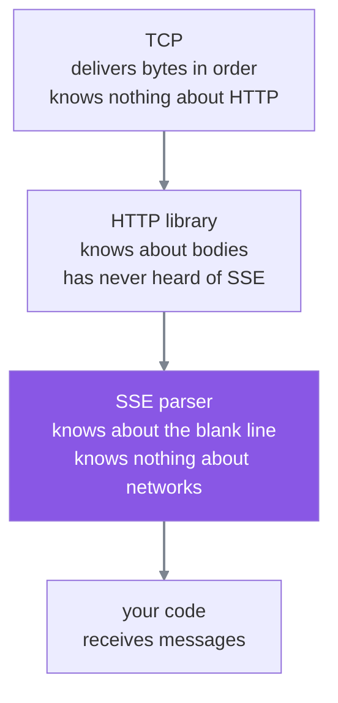
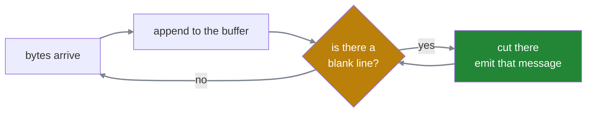
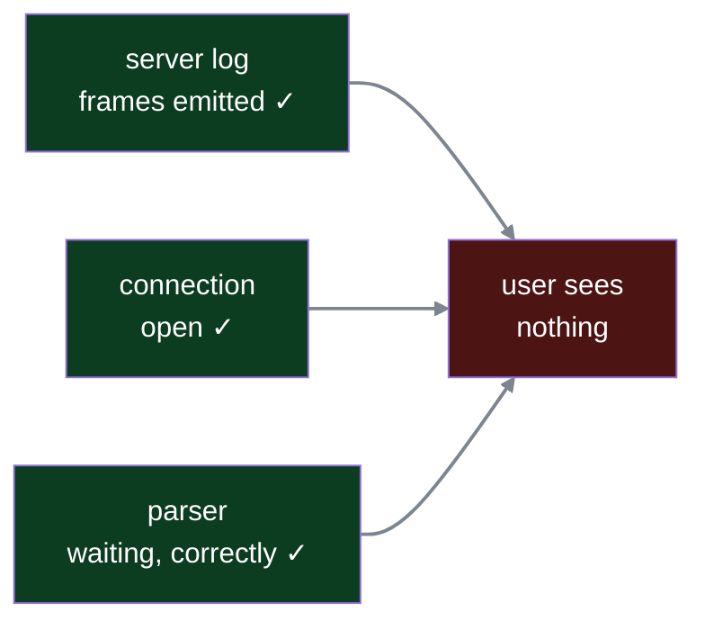

#sse #streaming #http #framing

**A normal response arrives as one complete body. A stream never has a complete body**, so your code receives it in pieces and has to work out for itself where one message ends — which is the entire reason SSE puts a blank line between them.

# The library stops being able to help

For an ordinary response the HTTP library does all of this for you, and it can because **the body finishes.**

```text
1  Content-Length: 4096
```

It waits until it has all 4096 bytes, then hands your code the complete body in one piece. Your code never sees part of a body, so it never has to ask where anything ends.

A stream has no `Content-Length` and never sends the terminator that would end it. So if the library applied its normal rule — wait for the body to be complete, then hand it over — **you would see nothing for twenty seconds and then everything at once.** That is the twenty-second wait streaming exists to remove, rebuilt with extra machinery.

So the library has no choice. It passes bytes upward **as they arrive**, part-way through a body that has not finished.

# What your code is actually holding

At some moment your code has this and nothing else:

```text
1  data: {"text":"Your pay
```

There is nothing useful to do with it. The JSON is not closed, the sentence is cut off, and calling something like `data.getText()` on it would fail. At least one complete message is needed before anything can be parsed or shown.

The natural response is that somebody should hold those bytes back until they are complete. The problem is deciding who.

**It cannot be the HTTP library, because it has never heard of SSE.** It does not know what `data:` means, does not know there is JSON in there, does not know a `text` key is meant to exist. To it, that line is twenty-two bytes of body, indistinguishable from any other twenty-two bytes. It has no rule that would tell it those bytes are unfinished.

So the job lands in your code.

# The boundary has to be written into the bytes

But your code is looking at **exactly the same bytes the library was.** It has no extra information — just those twenty-two bytes sitting in memory. Nothing about them announces that they are incomplete.

Which means the only way anything can tell is if **the sender writes the boundary into the bytes.** There is nowhere else the information could come from.

## One marker, not two

The obvious design is a start marker and an end marker — one to say a message is beginning, one to say it is over.

**The start marker is redundant.** Messages arrive back to back in a single stream, so anything appearing after an end marker is by definition the beginning of the next one. The first message starts where the stream starts. An end marker alone carries all of it.

## The marker must be impossible inside the data

Whatever byte sequence gets chosen — a **byte sequence** being simply a specific series of bytes, so `\n\n` is a two-byte sequence — it must be something the payload cannot contain. Otherwise a message containing the marker would appear to end early.

The usual fix for that is escaping. SSE does something better.

# SSE's marker is a blank line

A message is one or more `field: value` lines, followed by an empty line.

```text
1  data: Your pay was 84,200
2                              ← nothing on this line. the message is over.
```

Written as bytes that is `\n\n`, and the two newlines do different jobs:

```text
1  data: Your pay was 84,200\n     ← this \n ends the line
2  \n                              ← this \n leaves a line with nothing on it
```

**A blank line and `\n\n` are the same thing described two ways.** The first newline finishes the content line; the second produces an empty one, and an empty line is the terminator.

# Payloads that contain newlines

Your code hands over one string. What travels is not that string, and what arrives on the other side is that string again — the format in between is an encoding step the library performs and reverses.

**What your code writes:**

```python
1  yield ServerSentEvent(data="your salary for March is\n\n\n85k")
```

**What the library puts on the wire** — it sees newlines in the string, splits on them, and gives every resulting line its own `data: ` prefix, empty ones included:

```text
1  data: your salary for March is
2  data:
3  data:
4  data: 85k
5                                  ← terminator
```

**What the receiving app gets** — the parser joins those values back with newlines:

```python
1  "your salary for March is\n\n\n85k"
```

Identical to what was sent. **The `data:` prefixes exist only in transit**, and neither end ever writes or reads one.

## Why this makes the terminator safe

Look at the actual bytes on the wire:

```text
1  data: your salary for March is\ndata:\ndata:\ndata: 85k\n\n
2                                ^^     ^^     ^^          ^^^^
3                                every newline is followed by 'd', never another newline
```

Two newlines can never end up adjacent inside a message, because **every content line begins with at least `data:`** — even a line whose content is nothing at all.

```text
1  data:      ← a prefix with an empty value. an empty line of content.
2             ← nothing whatsoever. the terminator.
```

So the sender emits a bare empty line for exactly one reason, and the collision is designed away rather than escaped away.

> [!warning] This is not for splitting delivery. A message is only ever sent once it is complete — you never emit half of one and finish it later. `data: {"text":"Your` followed by `data: pay is 25k"}` rebuilds as two separate lines and produces nonsense. Multiple `data:` lines describe **what is inside the payload**, never how it travels.

# Text is safe, binary is not

A newline is not a special thing — **it is just a byte, `0x0A`**, and that is all the parser scans for.

Which is fine for text, because there the newlines are real line boundaries the library can split on and rejoin. It is not fine for arbitrary bytes. Somewhere inside a few hundred kilobytes of JPEG:

```text
1  ... FF D8 FF E0 00 10 4A 46 49 46 0A 0A 3C 8B ...
2                                    ^^^^^
```

Those two bytes are compressed pixel data that happened to land on that value. They mean nothing — and the parser cuts the message there, turning half an image into a complete message and misaligning everything after it. The prefix rule cannot save this, because there are no lines to split on.

There is a harder reason underneath. **SSE is defined as UTF-8 text**, and arbitrary bytes are not valid UTF-8 — a JPEG begins `FF D8`, and no valid UTF-8 sequence starts with `0xFF`. So `decode("utf-8")` raises inside the parser before framing is ever reached.

Binary therefore has to become text first. Base64 is the usual choice, since its output alphabet contains no newlines at all.

# JSON payloads are safe by construction

When the payload is JSON, the newline question does not even arise.

```text
1  \n inside JSON  →  0x5C 0x6E    backslash, letter n — two characters
2  \n as a newline →  0x0A         one byte
```

JSON is not permitted to contain a raw newline inside a string; it must escape it. So `{"text":"Your pay is \n\n 25k"}` contains **no newline bytes at all** — only backslash-n pairs, which are entirely different bytes. The parser scans for `0x0A` and finds none until the real terminator.

```text
1  data: {"text":"Your pay is \n\n 25k"}
2                                          ← the only real newlines are here
```

The escapes do become real newlines eventually, but that happens **one layer up**, when the JSON parser decodes the string, long after SSE has finished with the bytes. Which is why they were never SSE's problem.

# Where the parsing happens

The thing doing this work has a name that makes it sound like infrastructure. It is not. **The SSE parser is a small piece of ordinary code** sitting between the bytes the HTTP library hands up and the functions in your application that want messages.



Each layer understands exactly one thing and is ignorant of the rest. The HTTP library cannot help with message boundaries because it does not know what a message is. The parser cannot help with lost packets because it never sees one.

> [!important] Nobody in that stack has the whole picture
> Which is why a stream can fail with every layer reporting success. Each is doing its own job correctly, and no single one of them is positioned to notice that the result is a blank screen.

# The buffer

A **buffer** here is just a piece of memory your code keeps between arrivals — somewhere to put bytes that are not yet enough to act on.

The rule is three lines long. Append whatever arrived. Look for a blank line. If there is one, everything before it is a complete message: take it, act on it, and keep the remainder for next time.

```text
1  arrives:  data: Hel
2  buffer:   data: Hel
3  scan → no blank line. wait.
```

```text
1  arrives:  lo\n\ndata: Wo
2  buffer:   data: Hello\n\ndata: Wo
3  scan → found
4    before it  → data: Hello      ← a complete message. emit.
5    remainder  → data: Wo         ← keep
```

```text
1  arrives:  rld\n\n
2  buffer:   data: World\n\n
3  scan → found → emit. buffer now empty.
```



Three arrivals, two messages.

> [!important] The arrivals and the messages have nothing to do with each other
> Bytes turn up in whatever groups the network produced. Messages come out in the groups the sender intended. The buffer is the only thing standing between those two facts, and it works precisely because it makes no assumption about the first one.

Notice the arrow from **emit** back to the question rather than back to **arrive** — that is the loop below, and getting it wrong is a real bug.

## Scanning is a loop, not a single check

One arrival can complete more than one message. Take a buffer holding the front of a message, and an arrival carrying its tail plus another message entirely:

```text
1  buffer:   data: {"text":"Your pay
2  arrives:  is 25k"}\n\ndata: {"text":"do you want your CTC?"}\n\n
3
4  buffer:   data: {"text":"Your pay is 25k"}\n\ndata: {"text":"do you want your CTC?"}\n\n
```

Two blank lines are now sitting in the buffer, so scanning once would emit one message and leave the second stranded until more bytes happened to arrive. **Keep cutting while a blank line is still present.**

# Packets do not exist above TCP

It is tempting to think a layer might get stuck holding half a packet. It cannot, because **packets are TCP's private business.**

TCP takes a byte stream, cuts it into packets, ships them, and reassembles them in order at the far end. What it hands upward is bytes in order — the HTTP library never learns that a packet boundary happened, because above TCP there is no such thing.

So when a message is split across two packets:

```text
1  p1 arrives → TCP delivers:  data: {"text":"Your
2  library passes it up
3  parser buffer: data: {"text":"Your
4  scan → no blank line → wait
```

```text
1  p2 arrives → TCP delivers:  pay is 25k"}\n\n
2  library passes it up
3  parser buffer: data: {"text":"Your pay is 25k"}\n\n
4  scan → found → emit
```

Nothing blocked and nothing was dropped. Every layer passed up whatever it had, the moment it had it.

And what handled the split was **the buffer**. The parser never knew a packet arrived, never knew there were two, and did not need to. Its rule makes no assumption whatsoever about how bytes are grouped on the way in, which is exactly why **any** grouping produces the same result.

# When the terminator is missing

The failure this format has is worth meeting deliberately, because of how it presents.

A server writes three messages and ends each with one newline instead of two:

```text
1  data: {"text":"Your pay is 25k"}
2  data: {"text":"Tax deducted was 3k"}
3  data: {"text":"Net credited on the 30th"}
```

Walk the buffer and nothing ever leaves it. The parser appends the first line and scans — no blank line. Appends the second and scans — still none. It accumulates all three, and every message after them.

> **It emits nothing at all.** Not a merged message — nothing.

## And no error is raised anywhere

The parser cannot distinguish **this message is not finished yet** from **the sender forgot the terminator.** Both look exactly the same: a buffer with no blank line in it. Waiting is a legitimate state, so waiting forever is one too.

## Where this actually comes from

Using a proper library, this cannot happen — `EventSourceResponse` serialises the frame with its terminator and you are not given the opportunity to omit it.

It comes from **hand-rolled SSE**, which is common because FastAPI's native module only arrived in 0.135.0 in March 2026. Anything written before that either pulled in `sse-starlette` or did this:

```python
1  yield f"data: {json.dumps(token)}\n"      ← one newline. broken.
2  yield f"data: {json.dumps(token)}\n\n"    ← two. correct.
```

```text
1  broken:   data: {"text":"Hello"}\n        ends the line
2  correct:  data: {"text":"Hello"}\n\n      ends the line and leaves an empty one
```

There is a second version that survives a good library, because it comes from the payload rather than the code. Hand a raw multi-line string to something that does not split it into repeated `data:` lines, and a newline inside your own content becomes a premature terminator. The message ends early and the remainder is parsed as garbage — corruption instead of silence.

# Silence with healthy logs

The reason this rung matters is not that the newline will be forgotten. It is that **silence is what a framing failure looks like**, and that symptom will turn up.

Picture debugging it. A user reports a blank chat. Every place you look reports success.

**The server log**, because the streaming loop writes one:

```python
1  logger.info("emitting frame", extra={"token": token})
```

```text
1  10:04:22  emitting frame  token="Your"
2  10:04:22  emitting frame  token=" pay"
3  10:04:23  emitting frame  token=" is"
```

Frames generated, frames written, no exception. **The connection** is open, with no disconnect and no timeout. **The browser** shows nothing.



There is no error to search for, because nothing failed. The server did its job, the network did its job, and the parser is doing its job by waiting.

Which makes the instinct — assume generation is slow, go and stare at the model — the wrong move, and an easy hour to lose.

**The right question is where the bytes are sitting.** They left the server, since the log proves it, and they are not on the screen, so something in between is holding them. Either the framing is wrong and the parser cannot release them, or something in the path is buffering and has not flushed.

So the rule worth keeping: **a stream showing nothing while the server insists it is sending is never a generation problem.** It is framing or buffering, and those are the only two places to look.

# Telling one kind of message from another

Every frame so far has looked the same — some `data:` lines and a terminator. But an agent sends several different things down one stream: a progress update while it works, tokens of an answer, a question back to the user, a final response, a marker saying it has finished. **The client has to tell them apart.**

The obvious approach needs no new SSE field at all. The payload is already JSON, so put a label in it:

```text
1  data: {"type":"progress","msg":"Looking up salary"}
2
3  data: {"type":"token","text":"Your pay"}
4
```

**That works.** Plenty of production systems do exactly this. So the question worth asking is what the protocol's own field adds.

```text
1  event: progress
2  data: {"msg":"Looking up salary"}
3
```

## What it buys — one: the client library does the routing

**Dispatch** here means deciding which piece of your code handles an incoming message — a switchboard choosing which desk a call goes to.

Without the field you get one function, and it opens the message to decide:

```python
1  def on_message(data):
2      msg = json.loads(data)
3      if msg["type"] == "progress":  show_spinner(msg)
4      elif msg["type"] == "token":   append(msg)
5      elif msg["type"] == "done":    finish()
```

With it, you register one function per name and the client library picks:

```python
1  handlers = {
2      "progress": show_spinner,
3      "token":    append,
4      "done":     finish,
5  }
```

Same behaviour. The if-chain moved out of your code. **A convenience, not a capability.**

## What it buys — two: the payload no longer has to be an object

This is the difference that actually matters, and it only appears when the payload was not going to be JSON anyway.

Streaming raw tokens with the field:

```text
1  event: token
2  data: Hello
3
```

`data` is the string `Hello`. Nothing more. Now remove the field and try to carry the label in the payload — the payload has to become an object to hold it:

| | the frame | bytes |
|---|---|---|
| **with `event:`** | `data: Hello` | **11** |
| **without it** | `data: {"type":"token","text":"Hello"}` | **37** |

**Three times the bytes on every token**, for a label that never changes, plus a JSON parse per token instead of appending a string.

So the real choice is not label-in-the-frame versus label-in-the-payload. It is **label in the frame, or every payload must become an object.**

## What it buys — three: it is the protocol's answer rather than yours

Any SSE client already knows what `event:` means. A `type` key inside your JSON is a private convention that every consumer has to be told about separately.

## Carrying it in both places, on purpose

A system that started without `event:` and added it later often ends up sending both:

```python
1  return ServerSentEvent(
2      event=event_type,
3      data={"type": event_type, "content": content},
4  )
```

That looks redundant and is not. Clients released before the change switch on the value inside `data`, so removing the duplicate breaks them. The workable answer is to keep both and write down the condition under which the duplicate can go, rather than leaving it there indefinitely as something nobody remembers the reason for.

## Which payloads actually need to be objects

Take a plausible set of event types for a tool-calling agent, and what each carries:

| event | what it carries | needs an object? |
|---|---|---|
| `step_update` | id, label, status, error | **yes** |
| `choose_one` | ranked candidates to pick from | **yes** |
| `progress` | a sentence like Looking up salary | no — a string |
| `answer` | the final response | depends on the response |
| `done` | nothing at all | no — nothing |

Two genuinely need an object and two do not. And if `done` carries nothing, wrapping it in the same envelope as the rest forces an empty object through purely to satisfy a rule — which is usually the point at which a special case gets added to escape the envelope, and that special case is the tell that one blanket rule never fitted.

**The decision belongs to each event type, not to the stream.**

# Marking a position in the stream

```text
1  event: token
2  id: 47
3  data: Hello
4
```

On its own `id:` does nothing whatsoever. The client reads it and the frame behaves exactly as it would have without it.

Its purpose only appears when the connection breaks. **The client remembers the last id it saw**, and when it reconnects it sends that value back as a request header:

```text
1  GET /stream HTTP/1.1
2  Last-Event-ID: 47
```

None of which you write — `EventSource` tracks the value and attaches it automatically.

Note the timing, because it is what makes this cheap. The client does **not** acknowledge each frame as it arrives; that would be a round trip per token, which is the polling cost reintroduced under a different name. The id travels back exactly once, on reconnect, and only when a reconnect happens at all.

The server is then expected to resume from there — everything after 47. **Which means it kept everything after 47.** The protocol supplies the handshake and nothing else; where those frames are stored, and for how long, is left entirely to the server.

# Controlling how soon clients come back

The browser reconnects on its own after a drop. The question is how long it waits, and what happens when every client is dropped at once.

A server restart disconnects every open stream in the same instant, and each client reconnects. If the delay is a constant compiled into the client, **they all come back together** — the server is restarting and immediately takes the full connection load in one wave.

```text
1  retry: 30000
2  data: still working
3
```

The client stores that value and uses it as its reconnect delay from then on. One field, sent mid-stream, and every connected client now waits thirty seconds instead of one.

## Why the server is the right place for that decision

A constant baked into the client can only be changed by shipping a new client. And the client has no idea whether the server is healthy — **the server does.** So a server under strain can widen the delay on the way out and narrow it again on recovery, with nothing deployed anywhere.

The decision moved to the side that has the information.

> [!warning] This only works while the server can still respond. If it is completely down the client receives no response at all, so there is no `retry:` to read and it falls back to whatever it last knew. The field helps with graceful degradation — a server that is up and shedding load — and does nothing for a hard outage. Browsers also apply their own backoff on repeated failures regardless of what is sent.

# Bytes that mean nothing

An agent can be genuinely silent for a long time. It called the records system and that call is taking thirty seconds; there is no token, no progress, nothing has happened worth telling anyone.

Suppose during that gap you needed to send **something**, purely to prove the connection is still there.

No real frame will do. A `progress` event with an empty message fires a handler on the client and may render something — you would be inventing activity that did not occur. **The requirement is bytes that reach the client and cause nothing at all to happen.**

```text
1  : ping
2
```

A line beginning with `:` has no field name, so the parser skips it. No event fires, nothing renders, the application never learns it arrived. But bytes crossed the wire.

That is why a protocol specifies something that does nothing: **doing nothing is the requirement**, and every other frame type fails it because they all trigger something.

This is what `EventSourceResponse`'s 15-second default ping emits — a comment frame, every fifteen seconds, whenever nothing else has been written. Why an idle connection needs one at all is a separate question, and a large one.

# The complete format

| field | what it is for |
|---|---|
| `data:` | the payload, repeated for multiple lines |
| `event:` | which kind of message this is |
| `id:` | a position, for resuming after a drop |
| `retry:` | how long the client waits before reconnecting |
| `:` | a comment — bytes that mean nothing |
| **blank line** | **the message is over** |

Five fields and a terminator, carried inside the body of an ordinary HTTP response that never finishes.
