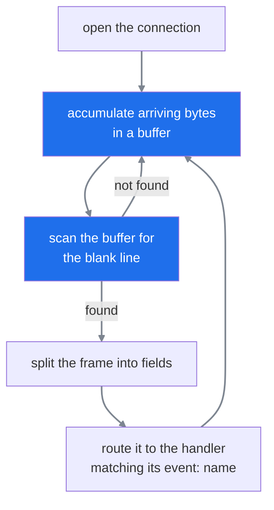
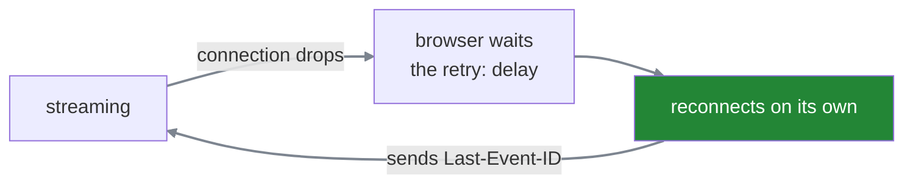
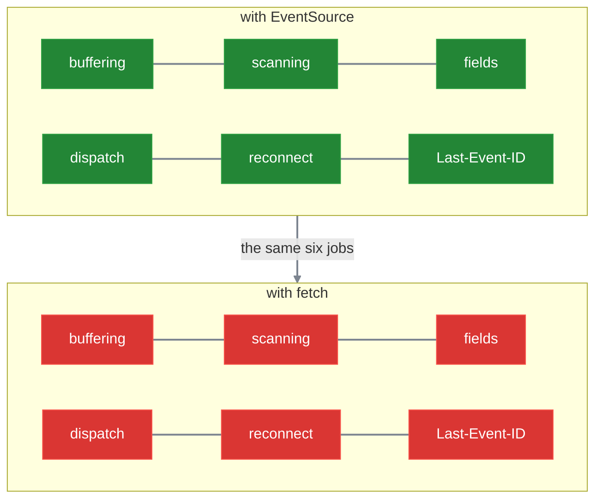

#sse #streaming #eventsource #browser #fetch

**The browser already contains an SSE client**, and it implements almost everything the protocol requires — the buffer, the scan for the blank line, the field parsing, reconnection, id tracking. Which is why SSE feels effortless right up until you need something that client cannot do.

# What arrives for free

```javascript
1  const source = new EventSource("/stream");
2
3  source.addEventListener("progress", (e) => showSpinner(e.data));
4  source.addEventListener("token",    (e) => append(e.data));
5  source.addEventListener("done",     ()  => finish());
```

Three lines of **handlers** — functions registered to be called when something happens — and everything underneath is already written.



Every box in that loop is code somebody already wrote, once, years ago. You supply the last step and nothing else.

# Reconnection is not a failure

Stop the server mid-stream and the browser reconnects on its own, after the delay `retry:` last specified. Nothing in your code asked for this.



Two consequences follow, and both change how the server is written.

**Your endpoint will be reopened without warning.** A stream handler is not called once per user session — it is called again every time a connection drops, which happens on wifi changes, laptop sleep, tunnel timeouts and deploys. Anything it does on entry happens repeatedly.

**And a dropped connection is not something to show the user.** The client is coming back by itself within seconds, so rendering an error announces a failure that has already resolved.

> [!important] A stream handler runs many times per conversation
> Not once per user, not once per question — once per connection, and connections drop on wifi changes, laptop sleep, tunnel timeouts and every deploy. Anything the handler does on entry happens every one of those times.
>
> Which makes reopening the normal case rather than the exceptional one.

When it reconnects, the browser sends the last id it saw:

```http
1  GET /stream HTTP/1.1
2  Last-Event-ID: 47
```

The protocol supplies that **handshake** and stops there. Whether the server can actually resume from 47 depends entirely on whether it kept anything.

# Why a chat endpoint cannot use it

`EventSource` can only issue **GET** requests. There is no way to send a body.

A chat message **is** a body — a whole conversation turn, sometimes with history attached. So if the endpoint is declared as a POST:

```python
1  @router.post(path="", response_class=EventSourceResponse)
```

then `EventSource` is unavailable, and there is nothing left to decide.

Which is worth noticing, because you would expect this choice to be made on streaming grounds — which option is faster, more reliable, better supported. It is not. **It is made by whether the request needs to send a body**, and that question is answered long before anyone thinks about streaming.

## The second limitation, and who it actually affects

`EventSource` also gives you **no way to add a header of your own.** There is no argument, no method, no option — you pass a URL and that is the entire API.

Which sounds worse than it is, because a request carries two kinds of header:

```text
1  GET /stream HTTP/1.1
2  Host: api.example.com          ← the browser adds this
3  User-Agent: Mozilla/5.0 ...    ← the browser adds this
4  Accept: text/event-stream      ← the browser adds this
5  Cookie: session=eyJhbGci...    ← the browser adds this
6  Authorization: Bearer eyJ...   ← your code adds this
```

Lines 2 to 5 are **browser-controlled**. They go on every request the browser makes, whatever API produced it. You do not write them and cannot remove them.

Line 6 is **author-controlled**. It exists only because some code asked for it.

`EventSource` never hands you the request, so nothing on line 6 is possible. The browser's own headers are untouched, because they were never yours to begin with.

| header | whose job | with `EventSource` |
|---|---|---|
| `Cookie` | the browser's | **still sent** |
| `Authorization` | yours | **no way to send it** |

A **JWT** is a signed piece of text holding who you are, which a server can verify on its own without looking anything up. A **bearer token** is any credential sent in the `Authorization` header — named that way because whoever holds it can use it, with nothing further asked.

So the limitation splits authentication schemes in two. **A JWT in a cookie survives it completely** — the browser attaches that line itself, exactly as it does for every other request, and the streaming API is not involved. **A bearer token does not**, because sending it requires a header your code must set, and there is nowhere to set it.

`fetch` removes the limitation by handing you the request object, so your headers join the browser's.

# What you take on instead

The browser offers two ways to make an HTTP request, and they differ in how much they know.

**`EventSource` is a specialist.** It exists for SSE and nothing else. Hand it a URL and it hands back parsed messages, because it already contains the buffer, the scan for the terminator and the field splitting.

**`fetch` is a generalist.** It makes any HTTP request — any method, any headers — and it has never heard of SSE. Hand it a URL and it hands back **bytes**, delivered a piece at a time through something called a `ReadableStream`.

| | `EventSource` | `fetch` |
|---|---|---|
| speaks SSE | **yes** | no |
| gives you | parsed messages | raw bytes |
| can POST | no | **yes** |
| can set headers | no | **yes** |

> A straight trade. **One understands the protocol but can barely make a request; the other makes any request and understands nothing.**

So choosing `fetch` for the POST also dismisses the only thing that was parsing SSE. Nobody is doing it any more, which means all of this becomes application code:

| the job | with `EventSource` | with `fetch` |
|---|---|---|
| buffering partial reads | free | **yours** |
| scanning for the terminator | free | **yours** |
| splitting fields | free | **yours** |
| dispatching by event name | free | **yours** |
| reconnecting after a drop | free | **yours** |
| tracking `Last-Event-ID` | free | **yours** |



Green because somebody else does them. Red because you do. The first three are the parser itself, written out again by hand. The last three are jobs `EventSource` was doing quietly enough that nobody noticed they existed.

> [!warning] Reconnection is the one that silently goes missing
> The first five are visible — skip any of them and nothing works at all, so they get written on the first afternoon.
>
> Reconnection is invisible in development, where the server does not drop connections, the laptop does not sleep and the wifi does not change. **It fails only in production**, as a stream that goes quiet and never returns, and it is by far the most commonly omitted piece.

Which makes two questions worth asking of any such client, in this order:

**Does it reconnect at all?** If not, a single dropped connection ends the conversation permanently and the user sees a chat that simply stopped.

**Does it track `Last-Event-ID`?** If the server sends no `id:` on any frame, there is nothing to track and nothing to resume from even if the client tried.

Both belong to the same decision — whether a dropped stream can be rejoined at all, or whether the turn is simply lost.
