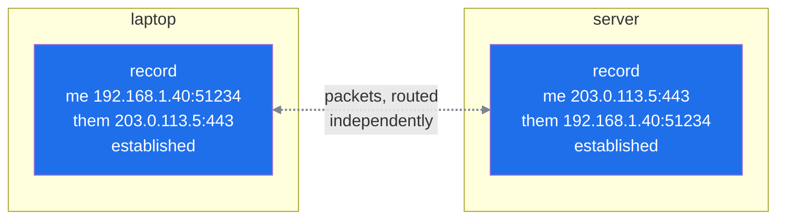
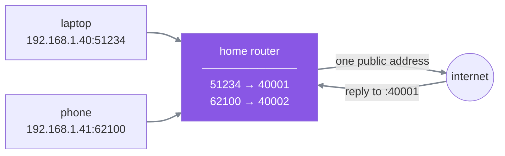
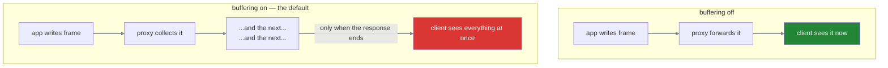

#sse #streaming #http #heartbeat #proxies

**Nobody keeps an idle connection alive.** Every machine between the two ends holds a small record of it, and deletes that record after a period of silence — usually without telling either end that it has done so.

# What a connection actually is

Nothing physical is created when two machines connect. No wire is reserved, no channel set aside, nothing along the route dedicated to the pair of them. The network has no idea they are talking.

Data crosses as **packets** — small independent chunks, each carrying an address, each routed separately by whatever equipment it meets. Two packets from the same conversation can take different paths. Nothing in between remembers anyone from one packet to the next.

So if nothing is reserved and nothing remembers, what does **connected** mean?

**It means two machines are keeping notes.** One record at each end, and that pair of records is the connection. There is nothing else to it.

```text
1  who I am        192.168.1.40  port 51234
2  who they are    203.0.113.5   port 443
3  how far along   sent 8,432 bytes, received 12,109
4  what state      established
```

> [!info]- An address finds the machine. A port finds the program on it.
> One computer runs many programs at once — a browser, a mail client, three terminal windows — and all of them share the machine's single address. A port is a number that says which of them a packet belongs to.
>
> Servers sit on **well-known** ports so clients know where to knock: 443 is HTTPS, 80 is plain HTTP. Clients get a **random spare** one for each conversation, which is why the laptop above is on 51234 — a number nobody chose and nobody will reuse.

The first two lines identify the conversation, the third is what lets either side notice a missing packet and ask for it again, and the fourth says whether it is being set up, running, or shutting down.



The dotted line is not a thing that exists. It is two records agreeing with each other.

**Opening** a connection means creating those two records. That is the entire purpose of the **handshake** — a short exchange of three packets in which both sides agree to start keeping notes on each other and agree where their counting begins. **Closing** it means agreeing to delete them.

> [!important] Open can only ever mean my record still exists
> That is all either side is able to check. A server looks at its own notes, sees an established connection, and reports it as open. **It cannot look at the other end, and it cannot look at anything in between.**
>
> Every surprise in this note follows from that one limitation.

# The assumption worth breaking

A connection stays open until one side closes it. That is the **intuition**, and it is **wrong** — because the two end records are not the only notes being kept.

Leave a stream idle for ninety seconds with a proxy in front of it and it dies on its own. Neither end asked for that. No code ran. The agent was simply thinking, and thinking produced no bytes.

# Everyone in the path is keeping notes too

The clearest example of this is the router in your own house.

A phone, a laptop and a TV all use one internet connection. The provider gave the house **one public address**, and three devices are sharing it. So when the laptop asks for a page, the request leaves stamped with the house's address rather than the laptop's — and the reply comes back addressed to the house.

At which point the router has a problem. Three devices are behind it, and it has to decide which one this reply belongs to. It can only answer that if it wrote something down when the request went out:

```text
1  laptop, port 51234  →  left as  house address, port 40001
2  phone,  port 62100  →  left as  house address, port 40002
```

A reply arriving for port 40001 goes to the laptop. **That table is what makes sharing one address possible at all** — and it is the same shape as the records at the two ends.



The same job is being done at every scale between a browser and a server:

| the box | what it is sharing |
|---|---|
| a home router | a few devices behind one address |
| a mobile provider | thousands of phones behind one address |
| a company proxy | all employee traffic leaving through one exit |
| a load balancer | many users routed to one of several servers |

Different sizes, identical requirement: **anything that has to decide where the next packet goes must remember the conversation.**

**And every one of those tables is finite.** A home router is a small box with limited memory; a load balancer is tracking hundreds of thousands of conversations at once. Neither can hold them forever, so both follow the same rule — if no bytes have crossed a connection in N seconds, delete the entry and reclaim the slot for something active.

> Any table that remembers will eventually forget.

# The part that makes it hard to diagnose

When a box deletes its record, **it tells nobody.**

No packet is sent to either end announcing it. And the two end records are untouched — they still exist, still say established, still look perfectly healthy to the machines holding them.

So both ends believe the connection is open, and **neither is wrong about what it can see.** Each is reading its own notes correctly. What has vanished is the bookkeeping in the middle that was actually carrying the packets.

The server writes the next frame into a socket that goes nowhere. The user watches a spinner. **No error is raised anywhere**, because from every participant's local perspective nothing has gone wrong.


> [!warning] A zombie connection raises no error anywhere
> Not a broken connection — **two correct records with nothing left between them.** Both ends report healthy because both are reading their own notes correctly.
>
> The server keeps writing frames into a socket that goes nowhere. The user watches a spinner. Nothing is logged, nothing throws, and no monitoring alert fires, because from every participant's local perspective nothing has gone wrong.

# The fix is bytes, and only bytes

The rule that killed it was *no bytes in N seconds*. So the fix is to send bytes more often than that.

What those bytes contain is irrelevant to every box in the path — they are counting traffic, not reading it. But it matters enormously to the client, **because a real frame would fire a handler and possibly render something.** Sending a fake progress update every fifteen seconds would fill the screen with activity that never happened.

What is needed is bytes that reach the client and cause nothing at all:

```text
  : ping
```

A line beginning with `:` is a comment. The parser skips it, no event fires, the application never learns it arrived. But the bytes crossed every box in the path, and every one of them reset its timer.

# The interval does not come from the specification

There is no correct number. The interval has to be smaller than **the shortest idle timeout anywhere in the path**, and that value is a property of the deployment rather than of SSE.

| where | idle timeout |
|---|---|
| AWS ALB | 60s default |
| nginx `proxy_read_timeout` | 60s default |
| mobile carrier equipment | often far less, and not published |
| corporate proxies | anything at all |

Which means the number is not chosen, it is **discovered** — by reading the configuration of whatever sits in front of the application, and taking the smallest.

# TCP keepalive is a different mechanism and does not solve this

The **operating system** has its own keepalive feature, and the name invites confusion.

**It defaults to 7200 seconds.** Two hours, which is useless against a sixty-second timeout, and changing it means changing kernel settings on every machine involved.

**And some intermediaries ignore it anyway.** A TCP keepalive probe is an empty packet with no payload, and a box that only counts data packets as activity will not treat it as traffic at all.

The **application-level heartbeat** has neither problem. A **comment frame** is ordinary body data travelling the same path as everything else, so every box in the chain counts it, and the interval is a value in application code rather than an operating system setting.

# What a framework already does about it

```python
  KEEPALIVE_COMMENT = b": ping\\n\\n"
  _PING_INTERVAL: float = 15.0
```

Fifteen seconds, sent whenever nothing else has been written.

> [!important] Heartbeats rarely need building. They need checking, once.
> Fifteen seconds clears every common timeout with room to spare, so the work is not implementing a heartbeat — it is reading the configuration actually deployed in front of the service and confirming the smallest timeout there is comfortably above it.
>
> That number changes when infrastructure changes, and nothing will announce it when it does.

# The other way a stream dies quietly

Idle timeouts are one failure. Buffering is the other, and it is more common.

A **reverse proxy** is a server that sits in front of your application and receives requests on its behalf, then passes them along. The application behind it is called the **upstream**. Clients only ever talk to the proxy; the proxy talks to the upstream.

Such a proxy usually **buffers upstream responses by default.** It reads from the application, collects the bytes, and forwards them once a buffer fills or the response completes. For an ordinary response this is a sensible optimisation — fewer, larger writes to the client.

For a stream it is fatal.



**The entire answer arrives at once, at the end** — which is precisely the twenty-second wait that streaming existed to remove.

> [!warning] This failure cannot be reproduced locally
> In development the application is reached directly, with nothing in between, and streaming works perfectly every time. It only fails once deployed behind a proxy — and **nothing about the symptom points at the proxy**, because the application is behaving correctly and its logs prove it.

```text
  X-Accel-Buffering: no        response header, per-response
  proxy_buffering off;         nginx config, per-location
```

# Three silences that look the same

All three of these present identically to a user — a screen that shows nothing — and they have different causes.

| cause | what the screen does |
|---|---|
| **missing terminator** | nothing ever arrives; the connection stays open and the server keeps writing |
| **zombie connection** | nothing arrives; both ends believe the connection is fine, and it is not |
| **proxy buffering** | nothing arrives, then **everything arrives at once** at the end |

The third distinguishes itself by waiting: if the whole answer appears in one lump when the agent finishes, it was buffered. If nothing ever appears at all, it is one of the first two.

Separating those two comes down to time. A framing bug fails instantly and identically on every request, including the very first frame. A zombie connection only appears after a quiet period long enough for something in the path to lose patience — so it strikes when the agent pauses to call a slow tool, and not otherwise.
