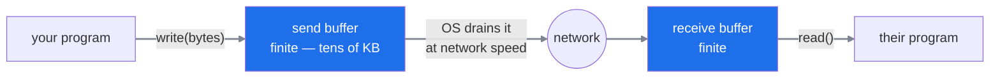
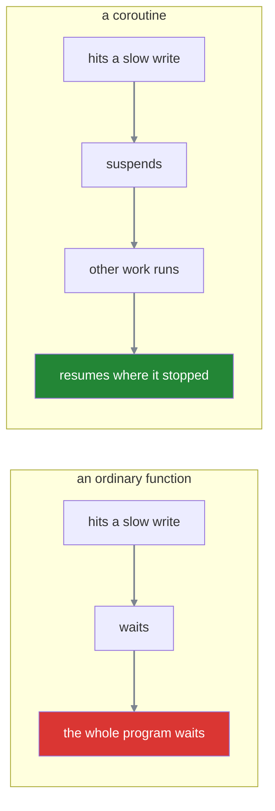
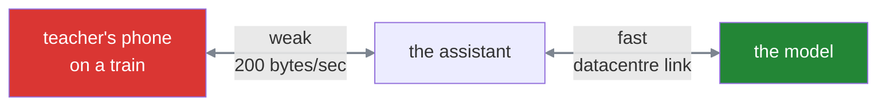
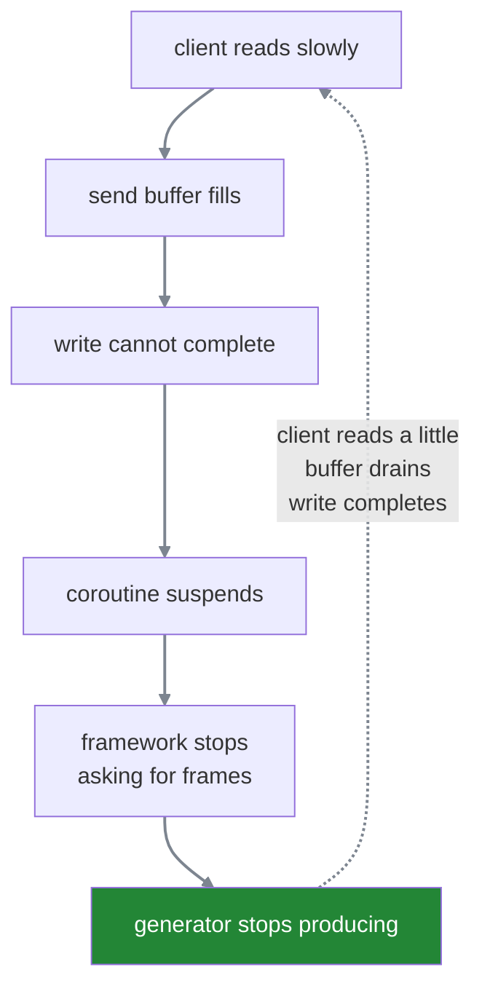
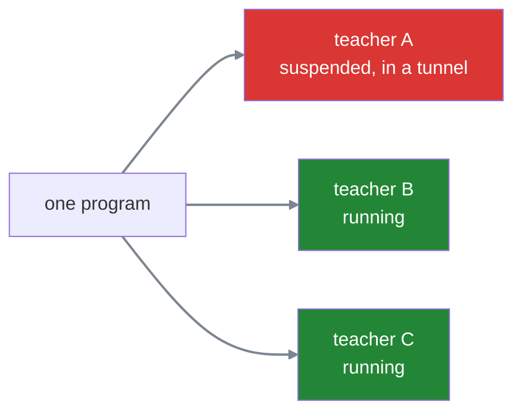
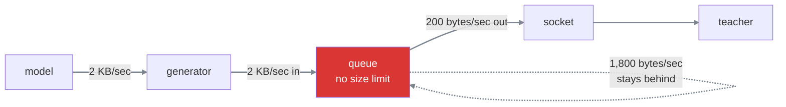

#sse #streaming #backpressure #generators #sockets #cost

**A streaming endpoint hands over one frame at a time, and something has to stop it running away from whoever is reading.** That something turns out to be free — until a reasonable-looking design removes it.

# Where a connection actually lives

> [!info] Prerequisite — skip ahead if sockets and buffers are already familiar
> Everything in this section is groundwork. The subject of the note starts at the worked example.

The two records that make up a connection are held by the **operating system**, not by your program. Your code cannot touch them, has no idea about sequence numbers or retransmission, and should not.

A **socket** is the handle your program is given to one of those records. It is how you say *put these bytes into that particular conversation* without knowing anything about how.

Behind the handle sit two buffers, one in each direction:



> [!important] Writing to a socket does not put anything on the network
> It copies bytes into the send buffer and returns immediately. The operating system drains that buffer afterwards on its own schedule — cutting it into **packets**, which are the small addressed chunks data actually travels in, numbering them so the far end can reassemble them in order, and re-sending whatever goes missing. Your write finished long before any of that happened.

The buffers exist because the two sides run at different speeds. A program produces bytes in bursts; the network moves them at a rate that changes minute to minute. The buffer absorbs the difference.

**And it is finite** — typically tens to a few hundred kilobytes. Large enough that a small response is copied in and done with instantly. Not large enough to absorb an unbounded amount, which turns out to be the entire point.

# The shape of a streaming endpoint

A streaming handler is a **generator** — a function that produces values one at a time and pauses between each, instead of building a list and returning it at the end.

```python
1  async def stream():
2      async for token in model.generate(prompt):
3          yield sse_frame(token)
```

The **framework** — the library that received the HTTP request and called your handler — drives it. Each time it wants another frame it resumes the function, which runs as far as the next `yield`, hands over one frame, and pauses there until asked again. What the framework does with each frame is **write it to the socket**.

# Functions that can pause

> [!info] Prerequisite — skip ahead if coroutines are already familiar

An ordinary function runs from top to bottom and cannot be interrupted. If it has to wait for something slow — a network read, a disk write — it simply waits, and **the entire program waits with it.** One slow client would freeze the server for everyone.

A **coroutine** is a function that can pause in the middle. When it reaches something slow it hands control back and says, in effect, *I am waiting, use the time for something else.* When the slow thing is ready it resumes from exactly where it stopped, with all its local variables intact.

**Suspending** is that pause. Nothing is lost and nothing is cancelled — the function is set aside, and something else runs in the meantime.



> [!important] Suspending is not failing
> A suspended coroutine has not errored, timed out, or been cancelled. It is paused, holding its place, waiting to be resumed. That distinction is what makes the rest of this note work — because a write that suspends looks like nothing at all from the outside.

# A worked example

A teacher asks the AI Assistant what their salary was last March.

A model does not produce its answer all at once. It produces **tokens** — the small pieces it works in, each roughly a short word or part of a longer one — one after another. This is also the unit model providers charge by: a thousand tokens produced is a thousand tokens billed, whether or not anybody reads them.

Concretely:

```text
1  model produces          50 tokens per second
2  each frame              about 40 bytes
3  so the server produces  about 2 KB per second
4  send buffer             64 KB
```

If the teacher is on a laptop with a normal connection, the operating system drains that buffer far faster than 2 KB per second. The buffer never fills, every write completes instantly, and nothing interesting happens.

Now put the same teacher on a train with a weak signal, where the connection is moving about 200 bytes per second.

There are **two connections here, not one**, and only one of them is weak.



The teacher is talking to the assistant, and the assistant is talking to the model. The train only affects the first of those.

So the model generates at full speed. The assistant receives those tokens at full speed, because its own connection is a server in a datacentre talking to another server. And then it has to push them down a slow pipe to a phone in a tunnel.

If the model happened to run on the same machine as the assistant there would be no second network at all — and nothing about the example would change, because the model was never the slow part.

```text
1  produced   2000 bytes/sec
2  drained     200 bytes/sec
3  net gain   1800 bytes/sec accumulating in a 64 KB buffer
4
5  64,000 ÷ 1,800 ≈ 36 seconds until it is full
```

For thirty-six seconds everything looks normal. Then the buffer is full, and the next write has nowhere to copy its bytes.

# What happens when the buffer fills

**A write that cannot complete suspends the coroutine.** The framework was part-way through writing a frame, so it stops there and does not come back to ask the generator for another one. The generator, waiting to be asked, stops producing.



The moment the teacher's train leaves the tunnel, the buffer drains, the write completes, the framework asks for the next frame, and the generator resumes exactly where it paused.

> [!important] This is backpressure, and nobody wrote it
> **Backpressure** is a slow consumer causing a fast producer to slow down, rather than the producer racing ahead and the difference piling up somewhere.
>
> No code in that chain was written to achieve it. It falls out of ordinary behaviour — a finite buffer, a write that cannot complete, a coroutine that suspends. Production ends up limited by consumption, and the total memory involved is one operating system buffer.

# Where the tokens go while the generator is paused

The chain above stops one link short. The generator has stopped producing — but the model has not stopped generating, and it has no idea anything is wrong. So where do those tokens go?

Look at where the generator is actually paused:

```python
1  async for token in model.generate(prompt):
2      yield sse_frame(token)      ← paused HERE
```

It is stopped **at the `yield`**. It has not gone back to line 1 to fetch the next token, which means **your code is not pulling from the model at all.**

But the provider does not know that. It is still generating and still sending.

## The pile-up travels backwards

There is a buffer at every hop, and they fill in order, away from the slow client:


Tokens the provider already sent sit in **your server's receive buffer** for that connection. Once it fills, your machine stops acknowledging them, which fills the **provider's send buffer**, which eventually blocks the provider's writes.

**The backpressure propagates all the way back to the model.** It is the same mechanism as before, one link further along, and again nobody wrote it.

# One teacher, or a thousand

Everything so far has followed a single conversation. A real service has many at once, which raises two separate questions: what does each one cost, and does a slow teacher slow anyone else down.

## Every open stream is its own connection

An answer that takes twenty seconds holds a connection open for twenty seconds, and that connection belongs to one teacher. A thousand teachers reading at the same time means a thousand connections, all open simultaneously.

Each carries its pair of buffers, and those stay allocated for the whole time:

```text
1  1,000 concurrent streams
2  × roughly 64 KB out + 64 KB in
3  ≈ 128 MB of memory, before the application has stored anything of its own
```

The operating system also limits how many connections one program may hold at once. Ordinary request-and-response traffic rarely approaches it, because each connection is finished with in milliseconds. **Streaming holds every one of them open for the length of an answer**, so the limit arrives far sooner than anyone expects.

On the model side the count is usually lower, because connections to the provider are pooled and reused between requests. But a streaming request occupies one for its entire duration, so a hundred answers being generated at once still needs a hundred available.

## But a slow teacher does not slow anybody else

This is exactly what pausing bought, and it is worth seeing the contrast again.

When the slow teacher's write cannot complete, the coroutine suspends — and the program immediately runs somebody else's. A hundred teachers can be mid-answer while one of them sits in a tunnel, and the other ninety-nine notice nothing at all.



Had these been ordinary functions that wait rather than pause, that one tunnel would have frozen the service for everybody.

## Until something shared runs out

The word **isolation** is doing two different jobs, and only one of them is true.

Pausing gives isolation **in time** — nobody waits for anybody else. The slow teacher suspends and everyone else keeps running, which is what the diagram above shows.

But everybody is drawing from the same **finite pools**. So a slow teacher cannot make others wait, and can still make them **fail**. Those are different outcomes, and only the first one is prevented.

There are four such pools.

**Memory.** Every stalled connection keeps its buffers allocated for as long as it stalls. A thousand stalled teachers is roughly 128 MB doing nothing at all. If enough of them stall at once the server runs out of memory and is killed — which drops every connection, including the ninety-nine that were perfectly fast.

**How many connections at once.** The operating system caps how many one program may hold. Say that cap is 1,024. Once 1,024 teachers have streams open, teacher number 1,025 does not get a slow response — **they cannot connect at all.** The request is refused before any of your code runs.

**The provider's rate limit.** A model provider allows a certain number of requests per minute for the **account**, not for each user. If that allowance is thirty a minute and fifty teachers ask at once, twenty are rejected. One heavy user's requests come out of the same allowance as everybody else's.

**A cap on how many generations run at once.** Many services deliberately limit themselves to, say, ten simultaneous model calls, to keep cost predictable. A stuck generation occupies one of those ten slots for as long as it is stuck. Nine others carry on; the eleventh teacher waits — not because anything is slow, but because there is no slot free.

> [!warning] Which is what a bound is actually for
> With a **bounded** buffer, one slow teacher's cost is capped in advance. 128 KB, whatever they do, however long they sit in that tunnel. The worst case is known.
>
> With an **unbounded** queue there is no ceiling. A single teacher stuck for ten minutes can consume hundreds of megabytes on their own — **drawn from the same pool as everybody else's.**
>
> So the bound is not tidiness. It is the thing that stops one bad case from becoming everyone's problem.

> **Isolated in time, shared in quantity.** Nobody waits for anybody else, and everybody still draws from one finite supply of memory, connections and allowances.

# The problem someone tries to solve here

Look again at what the chain does to the model.

The model can produce 2 KB a second. The teacher on the train can receive 200 bytes a second. And because the generator suspends whenever the send buffer is full, **generation is throttled down to 200 bytes a second too** — the model spends most of its time doing nothing, waiting for a phone in a tunnel.

That looks like obvious waste, and the instinct it produces is reasonable: *why should generating wait for delivering?* They are separate jobs with separate speeds. Let each run as fast as it can.

This instinct is usually correct. Decoupling a fast producer from a slow consumer is a standard, sensible pattern — it is why logging systems hand messages to a background writer rather than making every request wait on the disk.

# How to break it

The standard way to decouple two jobs is to put a queue between them.

```python
1  async def produce(queue):
2      async for token in model.generate(prompt):
3          await queue.put(sse_frame(token))     ← returns immediately, always
4
5  async def send(queue, socket):
6      while True:
7          await socket.write(await queue.get())
```

Now generation runs at full speed into the queue, and sending drains the queue at whatever pace the network allows. Two jobs, two speeds, neither waiting for the other. It reads like better engineering than what it replaced.

## What it actually does

The send side still suspends when the buffer fills — that part is unchanged. But **the produce side never touches the socket**, so nothing can ever suspend it. The chain that limited production has been cut at its first link.



2,000 bytes go in every second and 200 come out. The remaining 1,800 stay, every second, with nothing anywhere to stop them.

## And it buys nothing

This is the part that makes it a bad trade rather than a risky one.

**The teacher still receives at 200 bytes a second.** That was never going to change — it is a property of the train, not of the server. Generating faster does not deliver a single byte sooner, so the experience on the phone is identical either way.

So the queue spends memory to produce output that nobody can consume any faster. The model finishes earlier, into a buffer, and then waits exactly as long as it would have anyway.

> [!warning] An unbounded queue is a memory leak with good manners
> Take the train example. 1,800 bytes a second accumulating, with nothing to stop it. Over a twenty-minute journey that is roughly **2 MB for one stuck connection**, and a hundred of them is 200 MB of frames nobody will ever read — drawn from the memory everybody shares.
>
> It looks orderly, it has a sensible name, and it grows until the process is killed.

## The fix is a bound, not the absence of a queue

A queue created with a maximum size makes `put` suspend once it is full. Which restores exactly the chain that existed before, one step further along:

```text
1  queue is full
2  → put cannot complete
3  → the produce coroutine suspends
4  → generation stops
5  → and resumes when the send side drains one item
```

> **The bound is what makes a queue safe, never the queue itself.** A bounded queue is a deliberate decision about how far ahead you are willing to run; an unbounded one is a decision not to decide.
