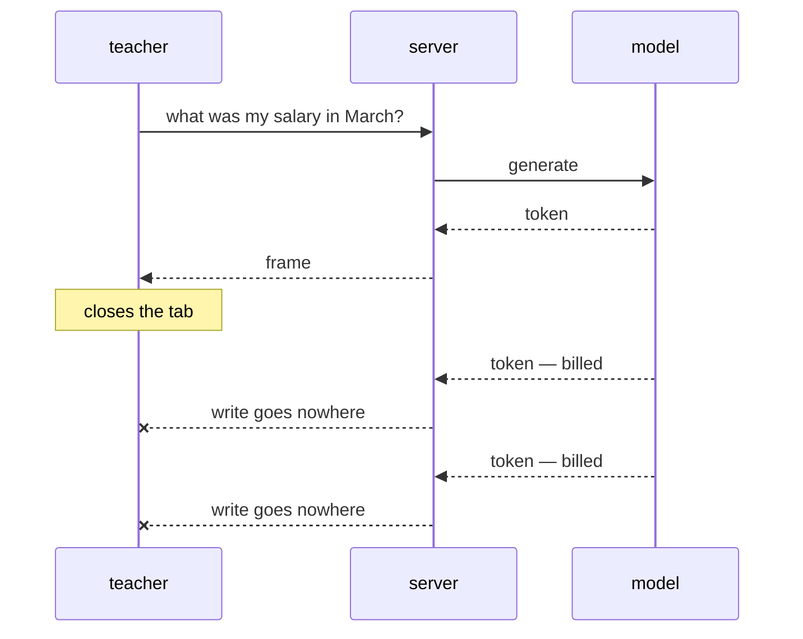
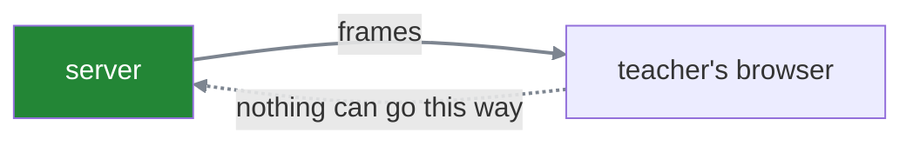
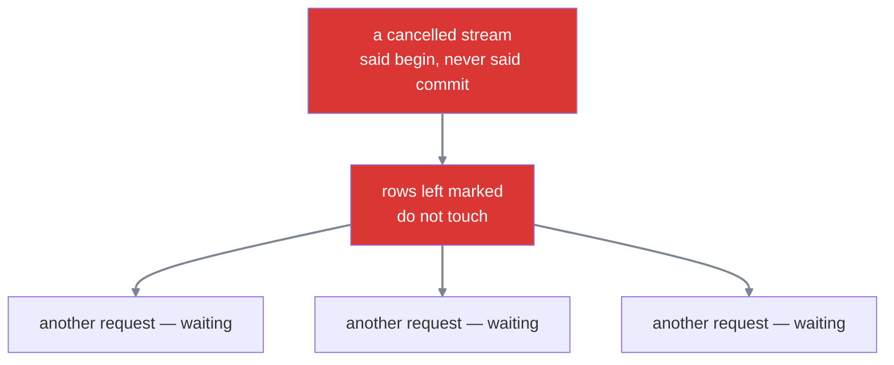

#sse #streaming #cancellation #cost #agents

**A slow reader and an absent reader look identical to a server**, and only one of them is worth generating for. Telling them apart, and stopping when nobody is there, is the difference between an idle loop and an invoice.

# When the reader vanishes

The teacher waits four seconds, gets bored, and closes the tab.

Nothing tells the generator. It is in the middle of a loop over model output and has no idea a browser exists. It gets the next token, yields it, gets the next one, yields it.



## The cost before anything stops it

Writes into a departed connection still succeed at first, because they only have to reach the send buffer. So the generator carries on producing until that buffer is full — and then the write cannot complete and the generator suspends.

Which means the waste is bounded, and the bound is worth knowing.

> [!example] What one abandoned tab costs
> ```text
> send buffer            ~64 KB
> ÷ frame size           ~40 bytes
> = about 1,600 frames generated after the teacher left
>
> at 50 tokens a second  ≈ 32 seconds of generation, billed, for nobody
> ```
>
> Not unlimited. But thirty seconds of a model's output, charged in full, for a tab that no longer exists.

## What stays held afterwards

Once the generator suspends, production stops — and nothing is released. The connection stays open, its buffers stay allocated, and if the service caps how many generations run at once, that slot stays occupied.

For how long depends entirely on how the teacher left, and the two cases are very different.

**If they closed the tab properly**, the browser sends a small packet saying the connection is finished. The operating system marks its record closed, the next write fails outright rather than suspending, the generator raises an error, and everything is released within moments.

**If the connection simply vanished** — a laptop lid closing, a train entering a tunnel, wifi dropping — nothing is sent at all. There is no packet announcing anything, because the device that would have sent it is gone. So the operating system keeps doing what it is supposed to do: retransmitting into silence, waiting for an acknowledgement that will never come, and giving up only after a long series of retries. That can take fifteen minutes.

> [!warning] The second case is the expensive one, and it is not about tokens
> Thirty seconds of wasted generation is a real cost. Fifteen minutes of a held connection, held memory and a held generation slot is a larger one — and it happens without a single error, because the operating system cannot tell gone from quiet and is behaving correctly by waiting.
>
> A hundred teachers going into tunnels leaves a hundred of those sitting there, all drawing from the pools everybody shares.

## Asking rather than waiting for a buffer

The generator should not wait to be stopped by a buffer filling. It can ask directly whether anyone is still listening:

```python
1  async def stream(request):
2      async for token in model.generate(prompt):
3          if await request.is_disconnected():
4              break
5          yield sse_frame(token)
```

One check per iteration, and what it reads is the operating system's own record of the connection. When a browser closes a tab properly, the packet it sends marks that record closed — so the check returns true on the very next token rather than 1,600 frames later.

| | what happens after the tab closes |
|---|---|
| **without the check** | ~1,600 frames, then suspend, then wait out the timeout |
| **with the check** | 1 frame, then stop, then release everything |

> [!warning] It cannot detect a connection that simply vanished
> A closed lid or a tunnel sends nothing at all, so there is nothing for the operating system to record and nothing for the check to read. It returns false the entire time, exactly as it should, because from where it is sitting the connection is fine.
>
> The check turns the common case from thirty seconds into one token. It does nothing whatsoever for the case that costs fifteen minutes, and nothing at this layer can — knowing a silent peer has gone requires asking, which is what a heartbeat does.

The cost of forgetting the check is not a bug report. It is a line item nobody thinks to look for.

---

# When the reader presses stop

Everything above is the teacher leaving without saying anything. The other case is the teacher deciding to stop — the button every chat interface has, sitting next to the answer while it is being written.

These look similar and are completely different problems. One is detecting an absence. The other is receiving an instruction.

## The stream cannot carry the instruction

The obvious idea is to send it back down the connection the answer is arriving on. It is already open, both ends are already talking, and opening another seems wasteful.

It is not possible. An SSE stream carries data in one direction only, server to client. There is no channel back — the client can read from that connection and cannot write to it.



So stopping requires a second, entirely separate request — an ordinary one, going the normal direction.

```text
1  POST /chat          →  opens the stream, answer flows back
2  POST /chat/stop     →  a different request, arriving separately
```

## Naming a stream so it can be stopped

That second request has to say which answer to stop. A server generating for forty teachers at once needs to know which of the forty this refers to.

Which forces two things that would not otherwise exist.

The server must hand the client an identifier when the stream begins, so the client has something to name later. Usually the first frame carries it.

And the server must be able to find a running generation from that identifier. Something has to hold the mapping — this id belongs to that in-flight piece of work — for as long as the work runs.

> [!warning] That mapping is a new way for one teacher to reach another's work
> If a stop request only names an id, anybody who can guess an id can stop somebody else's answer. The identifier has to be unguessable, and the stop request still has to prove who is asking. A stream id is not a credential.

## How one request reaches another

The stop request now has a stream id and permission to use it. That is not the same as being able to do anything with it.

The stream is running inside one request. The stop arrives as a completely separate one. **They are two pieces of work running side by side in the same server**, and neither has any natural way to touch the other.

So something has to connect them.

## A task is running work you can hold on to

When a stream begins, the server does not simply run the generator and forget about it. It wraps it in a **task** — a running coroutine that the event loop is managing — and the useful property of a task is that **a reference to it can be kept, and it can be stopped from outside.**

```text
1  the stream starts
2  → create a task for the generation
3  → store it under the stream id
4
5  running = { "str_a91f": <task>, "str_c02b": <task>, ... }
```

That map is an ordinary dictionary in the server's memory, and it exists for exactly one purpose: so a later request can find work that is already in flight.

Stopping is then short:

```text
1  a stop request arrives naming str_a91f
2  confirm the caller is allowed to stop it
3  task = running["str_a91f"]
4  task.cancel()
```

> [!warning] That dictionary lives inside one process
> If the stop request is routed to a different instance than the stream, the map there does not contain the id and the stop quietly does nothing. The teacher presses the button, the answer keeps writing itself, and no error appears anywhere.
>
> A shared store does not fix this directly, because a task is a live object in one process and cannot be put in Redis. What can be shared is a **flag**: the stop request sets a key, and the generator checks it in the loop where it is already checking for a disconnect. Nothing has to reach the task — the task comes and asks.

## Cancelling is not suspending

`cancel()` is the entire mechanism, and what it does is worth being precise about, because it is not the pause from earlier.

**Suspending** is a pause. The function is set aside holding its place, it will be resumed, and nothing is lost.

**Cancelling** raises an error inside the running task, at whatever point it is currently waiting — the write to the socket, or the wait for the next token from the model. The function stops there for good, and whatever cleanup it has runs on the way out.

| | what it means |
|---|---|
| **suspended** | paused at a wait, will continue, keeps its place |
| **cancelled** | an error appears at that same wait, and the function ends |

The `async for` loop over model output is abandoned mid-iteration. No more tokens are requested, and the generation stops.

## What still has to be recorded

Two things, and they are not equally optional.

**The conversation state.** A checkpoint normally saves once a turn completes, and this turn did not complete. So there is a genuine product decision here: keep the partial answer, or discard the turn as though it never happened. Either is defensible.

**The token usage.** Not a decision. Those tokens were generated, and the provider has already charged for them. If nobody writes the number down, the cost exists and the record of it does not.

Somebody has to know that this teacher used those tokens — to bill the school, to show a usage figure, to enforce a monthly allowance, or simply to know what the service costs to run. None of that works if the number only ever existed in memory inside a request that has now been cancelled.

So it goes in a database:

```text
1  usage table
2  teacher_id   tokens   at
3  ─────────────────────────────────
4  4021         400      14:32
```

And the natural place to write it is the cleanup that runs as the cancelled generation unwinds — which turns out to be the worst possible place, for a reason worth setting up carefully.

## What writing to a database involves

You are not allowed to edit a database casually. Every change happens inside three steps:

```text
1  begin      I am starting a set of changes
2  update     make them
3  commit     done — keep them
```

Instead of `commit` you may say `rollback`, meaning scrap them and pretend it never happened. One or the other must eventually be said.

**Between `begin` and `commit`, the database protects the rows you touched.** If somebody else changed them halfway through your set, your changes would be built on something that moved underneath you. So it puts a do-not-touch marker on those rows, and anybody else who wants them **waits**.

That is entirely fine in normal use, because a transaction lasts milliseconds. Marker on, marker off, nobody notices it happened.

## Where it goes wrong

The connection your code uses to talk to the database is called a **session**, and web frameworks normally create one per request and destroy it when the request finishes.

Which produces this sequence:

```text
1  the teacher presses stop
2  the server begins tearing the request down
3  on the way out, it tries to write the usage row
4  begin        ← the do-not-touch markers go on
5  update ...
6  ...and the session is closed, because it belonged to
7     the request currently being destroyed
8  commit       ← never happens, and never will
```

> The code that was going to say `commit` **stopped existing halfway through the sentence.**

## Why that is worse than simply losing the write

The database has no idea anything went wrong. From where it sits, somebody said `begin` and has not said `commit` yet — which is not an error, it is a slow client. So it does the correct thing and keeps the markers on, waiting for a `commit` that is never coming.



> [!warning] The symptom appears nowhere near the cause
> Nothing failed in the streaming code. No exception, no log line, no alert.
>
> What shows up instead is some completely unrelated query starting to hang, in a different part of the application, minutes later. So that is where you go and look — because that is where the symptom is.
>
> The cause was a stream cancelled four minutes ago, and there is nothing anywhere pointing from one to the other.

## Two fixes, and both are needed

Use a fresh session, not the request's. **The write must not depend on something that is in the middle of being destroyed.**

And shield the write from the cancellation. By default, cancelling a request cancels everything running underneath it, including the cleanup. Shielding marks one piece of work as exempt: the cancellation still arrives, but that work is allowed to finish first.

```python
1  async def on_cancel(usage):
2      async with new_session() as session:              ← not the request's
3          await asyncio.shield(record_usage(session, usage))
```

> [!important] The shield is what makes the write survive the thing that triggered it
> Without it, the write is cancelled by the same cancellation that made the write necessary — so the tokens are generated, charged by the provider, and never recorded on your side.
>
> Which is the worst of the outcomes. The money is spent and there is no trace of it anywhere in your own system.
