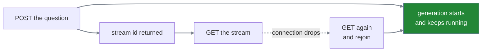

#sse #streaming #resumption #design

**The default way to build a streaming endpoint ties the answer's life to the connection's life.** When that connection drops, twelve seconds of generation that has already been produced and already been charged for is discarded, and the only thing the teacher can do is ask again from nothing.

Whether that is acceptable is a decision, and it is usually made by accident.

# The shape that causes it

One request does both jobs. The teacher's question goes up, the answer comes back down the same connection:

```http
  POST /chat   →  submit the question, and stream the answer back on this connection
```

Which is the obvious design, and it quietly couples two things that have nothing to do with each other. **The generation exists only for as long as the connection does.** Close the laptop at second twelve of a twenty-second answer and the work stops, the tokens already produced are gone, and the request that replaces it starts from zero.

> The connection is not delivering the work. It **is** the work, and losing one loses the other.

# Separating the two

```http
  POST /chat            →  submit the question, receive a stream id, connection closes
  GET  /stream/{id}     →  consume the answer
```

Now the generation belongs to the server rather than to a connection. It starts when the question arrives and continues regardless of who is listening, or whether anybody is.



A dropped connection is now a client problem rather than a lost turn — the answer is still being produced, and reconnecting means finding it again rather than starting it again.

> [!info]- Where the stream id has to point
> A reconnect has to locate work that is already in flight, which needs the same thing a stop button needs: a map from stream id to running work, held somewhere both requests can reach.
>
> Two features, one piece of infrastructure. If either is being built, the other becomes much cheaper.

# What resuming actually requires

The protocol supplies a handshake and nothing else. On reconnect the browser sends the last id it saw:

```http
  GET /stream/{id} HTTP/1.1
  Last-Event-ID: 47
```

The server is expected to continue from 48. **Which means somebody kept 48 onwards.**

Frames that have already been sent are ordinarily gone the moment they are written. Honouring that header means holding on to them — which is storage, and storage needs a retention window, and a retention window needs a decision about what happens when it expires.

# The other way: re-derive instead of replay

A system that already saves conversation state has an option a stateless one does not — but the two behave differently enough to be worth watching side by side.

Take an answer being generated:

```text
1  Your salary for March was 84,200 after deductions.
```

The connection drops after the teacher has received up to id 47.

## If the frames were stored

```text
1  id: 45   data: {"delta":"Your salary "}
2  id: 46   data: {"delta":"for March "}
3  id: 47   data: {"delta":"was 84,200 "}      ← the teacher got this far
4  id: 48   data: {"delta":"after deductions"}
```

They reconnect saying `Last-Event-ID: 47`. The server looks in its store, finds 48, and sends it. The client appends two words and the sentence completes.

**Nothing else happens** — no flicker, no duplication, no re-render, because the server knew exactly what had already arrived.

## If only the answer was stored

```text
1  conversation state
2  ──────────────────
3  answer: "Your salary for March was 84,200 after deductions."
```

No frames were kept. They reconnect saying `Last-Event-ID: 47`, and **the server has no idea what 47 was.** It never recorded a frame 47, or 46, or any of them. All it holds is the finished text, so it cannot send the missing piece because it does not know which piece is missing.

Its only real option is to send everything and let the client sort it out:

```text
1  data: {"answer":"Your salary for March was 84,200 after deductions."}
```

The client now has to **replace** what it was showing rather than continue it — which is the part the teacher may actually see, as a brief flicker or a re-render.

## The distinction in one line

> **Replay knows where you were. Re-derive only knows where you ended up.**

| | what the client gets | what it costs |
|---|---|---|
| **replay** | exact continuation | a store of frames to size, expire and clean |
| **re-derive** | the whole answer again | nothing extra — but fidelity |

Replay costs storage: every frame sent has to be held somewhere, per stream, until it expires — which needs a size, an expiry and something to do the cleaning up.

Re-deriving costs nothing extra, because the state is being saved for other reasons anyway. What it costs instead is fidelity: ids will not line up, the client replaces rather than appends, and anything that was never part of the saved state cannot come back at all.

> [!important] Progress events are lost either way
> Looking up salary details, calling the records system, checking the leave balance — none of that is part of the answer, so none of it is in the saved state, and a replay buffer that has expired cannot produce it either.
>
> So a resumed stream shows a finished answer appearing, without the work that produced it. For a twenty-second answer with two progress updates that is barely noticeable. For a forty-five-second one with two hundred, the reconnection looks like a completely different product.

# The questions that decide it

None of this has a general answer. It has four specific ones.

**How long is a frame worth keeping?** A teacher reconnecting after four seconds should get their answer back. After four hours, almost certainly not — the question is stale and so is the answer. Somewhere between those is a number, and it determines how much storage this feature costs.

**What happens when someone reconnects after that window?** There has to be an answer, and quietly showing nothing is not one. Starting over is honest. Showing what was saved and stopping is also honest. Doing neither produces a blank screen with no explanation.

**Is the model still generating when they come back?** If it is, they can be attached to the run in flight and pick up live. If it finished while they were away, the whole answer is waiting and can be delivered at once. These are different code paths and both have to exist.

**And what does the reconnecting client already have on screen?** It may have half an answer rendered, or nothing at all if the tab was reloaded. `Last-Event-ID` says what arrived; it says nothing about what is still displayed.

# The new way in

Splitting the request creates something that did not exist before: **a name for work, that a later request can use.**

> [!warning] A stream id is not a credential
> If a `GET /stream/{id}` returns whatever that id points at, then anybody holding an id can read somebody else's answer — and answers here contain salaries, leave records and personal details.
>
> Two things are needed, not one. The id must be **unguessable**, so it cannot be found by trying. And the request must still **prove who is asking**, so that holding an id is not sufficient on its own. An id that is hard to guess is not the same as an id that is safe to accept.

# Why this is usually the wrong thing to build first

Everything above is one feature, and it is considerably larger than it looks. It drags in a store with a retention policy, a background cleanup, a map from ids to running work, a second endpoint, a decision about live rejoining versus waiting, and an authorisation model for the id.

Against which the honest question is what it buys. A twenty-second answer, on a connection that rarely drops, for a teacher who can simply ask again — that is a small amount of pain being solved by a large amount of machinery.

> [!warning] This is the scope trap in this whole subject
> Resumption is the piece most likely to turn a week of work into a month, because each part of it looks small and each one pulls in the next.
>
> Deciding not to build it is a legitimate answer, and a much better one than discovering halfway through that it needed a storage design. **What is not legitimate is not deciding** — because the shape of the endpoint, one request or two, is chosen on the first day and is expensive to change afterwards.
