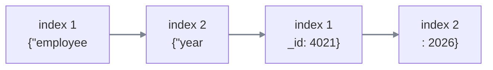

#sse #streaming #tool-calls #json #agents

**Half a sentence is still worth showing. Half a JSON object is worth nothing at all** — and worse than nothing if anything acts on it. Everything difficult about streaming a tool call follows from that.

# What a tool call actually is

When a model decides to use a tool, nothing is called. The model **emits text** saying it would like a tool used, along with the arguments — and those arguments are JSON.

```text
1  name        get_salary
2  arguments   {"employee_id": "4021"}
3  plus, sometimes, a message to the user alongside it
```

The arguments are a **string** containing JSON, not a parsed object. Something downstream reads that string, parses it, and calls the actual function.

> [!info]- Why this has probably never been your problem
> An agent framework sitting between the model and your code assembles the whole tool call before handing it over. By the time it reaches application code it is complete, named and parsed — so none of what follows has ever been visible.
>
> It becomes visible the moment streaming moves from whole messages to individual tokens.

# Why text was the easy case

Two things arriving mid-flight:

```text
1  Your salary for Mar
2  {"employee_id": "40
```

Both incomplete, and only one is useful. **A teacher reading the first has already learned something**, and the next fragment appends to it.

The second is not a smaller object. It is **not an object** — an opening brace with no closing one, a string with no terminating quote. A parser rejects it, and is right to.

## And a lenient parser makes it worse, not better

Parsers exist that accept unterminated objects and return what they can. Running one on that fragment gives:

```text
1  {"employee_id": "40"}
```

**Valid JSON. Parses cleanly. No error anywhere.** And it is a different teacher — the real id was `4021`.

|                               | consequence                                   |
| ----------------------------- | --------------------------------------------- |
| **displaying** half an object | a field that rewrites itself. cosmetic.       |
| **executing** half an object  | the wrong teacher's salary. **not cosmetic.** |

> A strict parser fails loudly. A lenient parser **succeeds quietly and incorrectly**, which is worse.

Which makes the rule absolute: **buffer everything, parse once, and act only on a complete object.**

# The provider is streaming this over SSE

Which is worth stopping on, because it inverts a role. The model provider streams its response as server-sent events — so **your backend is the SSE client here**, doing exactly what a browser does: accumulating bytes, scanning for the blank line, assembling frames.

And that raises an obvious question with a non-obvious answer. If frames end with a blank line, does the blank line tell you the JSON is finished?

**No.** There are two levels of complete and they are not the same one.

```text
1  event: content_block_delta
2  data: {"index":1,"delta":{"type":"input_json_delta","partial_json":"{\"employee"}}
3                                    ← blank line. this FRAME is complete.
4  event: content_block_delta
5  data: {"index":1,"delta":{"type":"input_json_delta","partial_json":"_id\": \"4021\"}"}}
6                                    ← blank line. this frame is complete.
7  event: content_block_stop
8  data: {"index":1}
9                                    ← and THIS says the arguments are complete.
```

Look closely at line 2. **That frame is perfectly well-formed JSON.** It parses without complaint — an index, a delta, a partial_json field, every brace closed.

What is incomplete is not the frame. It is **the string inside the frame**, which is a fragment of an entirely different JSON document spanning many frames.

> [!important] The blank line fires after every fragment and tells you nothing about the thing being assembled
> ```text
> \n\n                  one SSE frame has fully arrived
> content_block_stop    the tool arguments have fully arrived
> ```
>
> The SSE layer did its job perfectly and delivered every fragment intact. **It has no idea those fragments were pieces of something.**
>
> Which is the same layering problem one level up. The HTTP library could not find message boundaries; now the SSE parser cannot find argument boundaries. Each layer knows only its own framing.

# The three events, and the two delta types

```text
1  content_block_start   a block is beginning, and here is its type
2  content_block_delta   a fragment          ← repeated many times
3  content_block_stop    that block is finished
```

The deltas themselves carry no notion of being last. They are fragments and nothing more, which is precisely why a separate stop event has to exist.

And a delta's **type** decides which field holds the payload and what may be done with it:

| delta type | field to read | what you may do with it |
|---|---|---|
| `text_delta` | `text` | **append to the screen now** |
| `input_json_delta` | `partial_json` | append to a buffer — **do not parse** |

Same event name, two payload shapes. Reading `text` and showing it is safe. Reading `partial_json` and parsing it is not.

A single response commonly holds both:

```text
1  content_block_start   index 0   type: text
2  content_block_delta   index 0   text_delta        "Let me look"
3  content_block_delta   index 0   text_delta        " that up"
4  content_block_stop    index 0
5
6  content_block_start   index 1   type: tool_use, name: get_salary
7  content_block_delta   index 1   input_json_delta  "{\"employee"
8  content_block_delta   index 1   input_json_delta  "_id\": \"4021\"}"
9  content_block_stop    index 1
```

The model said something to the teacher, then asked for a tool.

# One response, several tool calls

An agent asked for a teacher's salary and their leave balance produces two tool calls, and their fragments **interleave**:



Appended to a single buffer in arrival order, that produces:

```text
1  {"employee{"year_id": "4021"}": 2026}
```

Which is not a parse error anyone enjoys debugging. It is **two valid tool calls shredded into something that is neither.**

> [!warning] Every delta carries an index, and ignoring it fails silently
> The `index` is the position of the content block a fragment belongs to. **Buffering is per index**, never into one place.
>
> The failure is not a crash on arrival. It is arguments from two different tool calls merged — which either fails to parse much later, or parses into something plausible and calls a tool with the wrong arguments.

# The identity assembles too

Arguments are not the only thing arriving in pieces. Before a tool can be executed, two other things are needed: **which function**, and **an id** to match the result back to the request that asked for it.

The obvious approach is to read those from the first chunk of a tool call and buffer the arguments from the chunks that follow. It reads correctly and it does not work.

Because **there is no first chunk that tells you what the call is.** Everything is a delta, including the name and the id:

```text
1  chunk 1   index 0   id "call_a91f"   name ""              arguments ""
2  chunk 2   index 0                    name "get_salary"    arguments ""
3  chunk 3   index 0                                         arguments "{\"employee"
4  chunk 4   index 0                                         arguments "_id\": \"4021\"}"
```

Chunk 1 carries the id and an **empty name**. Chunk 2 carries the name and no id. So code reading the name from the first chunk gets an empty string, and code reading the id from the chunk that has the name gets nothing at all.

> The arguments are not the only thing assembling over time. **The identity of the call assembles too.**

Which changes the mental model. This is not a header chunk followed by payload chunks. It is **a partial object being merged field by field**, where any field may arrive late — and the argument string is simply the field that needs concatenating rather than replacing.

| field | how it assembles |
|---|---|
| `id`, `name` | **merge** — take the value when it appears |
| `arguments` | **concatenate** — append every fragment |

> [!warning] Both of these are filed bugs, in two different agent frameworks
> A tool call breaking because `function.name` arrived in a later chunk than expected. A tool call id coming through empty because the id and the name arrived in separate deltas.
>
> Neither is exotic. Both are what happens when the first chunk of a tool call is treated as though it contained the whole call.

# Showing structure before it is complete

Everything so far says parse at the end. But a product may want something the end cannot give it.

A tool books leave:

```json
1  {"teacher_id": "4021", "start_date": "2026-03-10", "end_date": "2026-03-14", "reason": "family"}
```

and the interface shows a confirmation card before anything is booked:

```text
1  Leave request
2    Teacher   Priya Sharma
3    From      10 March
4    To        14 March
5    Reason    family
```

Those arguments take a second or so to stream, which leaves two options. **Wait for the end** and the card appears all at once after a second and a half. **Show it as it arrives** and the teacher's name appears, then the start date, then the end date — the card visibly assembling, matching the answer text streaming beside it.

The second is what products want. It requires running a **lenient parser on the incomplete buffer**, after every fragment — and the card is redrawn from whatever comes back.

**Two fragments in**

```text
buffer    {"teacher_id": "4021", "start_date": "2026-03-1
parse →   {"teacher_id": "4021"}
```

```text
┌─ Leave request ──────────────┐
│  Teacher   Priya Sharma      │
│  From      ·                 │
│  To        ·                 │
│  Reason    ·                 │
└──────────────────────────────┘
```

**Three fragments in**

```text
buffer    {"teacher_id": "4021", "start_date": "2026-03-10", "end_da
parse →   {"teacher_id": "4021", "start_date": "2026-03-10"}
```

```text
┌─ Leave request ──────────────┐
│  Teacher   Priya Sharma      │
│  From      10 March          │
│  To        ·                 │
│  Reason    ·                 │
└──────────────────────────────┘
```

**All five fragments**

```text
┌─ Leave request ──────────────┐
│  Teacher   Priya Sharma      │
│  From      10 March          │
│  To        14 March          │
│  Reason    family            │
└──────────────────────────────┘
```

The parser discards whatever is unterminated and returns only the fields that are definitely finished — so each redraw adds a row and never removes one.

## Which contradicts the earlier rule, and does not

A lenient parse of `{"employee_id": "40` returns a different teacher — that was the reason the rule was absolute. What changed is not the parse. It is what happens next.

| | consequence |
|---|---|
| **displaying** a half-parsed object | wrong for 200ms, then replaced. cosmetic. |
| **executing** a half-parsed object | the wrong teacher's leave gets booked. |

> **Same buffer, two consumers, two different rules.** The renderer may read the partial parse. Nothing that acts may ever touch it.

Which generalises beyond this note: **may I use incomplete data** has no single answer, because it depends entirely on what the data is about to be used for.

## And a product decision inside it

Even for display there is a choice, because a field can appear and then change. At one instant the parse yields `start_date: "2026-03-1"` and the card reads **1 March**. A fragment later it corrects to **10 March**.

| approach | feels like |
|---|---|
| render every field as it parses | most alive — fields visibly rewrite themselves |
| render only completed fields | steadier, slower to show anything |
| wait for the whole object | back where you started |

None is wrong. It is a judgement about whether a value that corrects itself reads as responsive or as broken — and for **a date being booked**, most people would say broken.

The machinery exists already: SDKs hold a hidden buffer per tool-use block and run a partial parse on every delta so a snapshot can be exposed. The decision about what to do with that snapshot does not come with it.

# Validation cannot happen early either

Checking arguments against a schema before the tool runs seems like something that could start early — a required field either is or is not present.

It cannot, and the reason is specific.

```text
1  {"teacher_id": "4021", "start_date": "2026-03-10"}
2
3  validation says   reason is required and missing
4  but is that       a genuinely invalid call
5  or                a field that is still streaming
```

**Nothing in the object answers that.** A missing required field is indistinguishable from a field that has not arrived yet, so every partial object fails validation and every one of those failures carries no information.

It is not premature. It is meaningless.

The same applies to execution, for the reason established earlier: `{"employee_id": "40"}` is valid JSON, passes a schema check for a required string, and refers to the wrong teacher.

# Retrying a tool call is not like retrying a request

A stream carrying a tool call fails partway through — the connection drops at the third fragment of five. The request is retried, the model produces the same call again, and this time it completes.

The tool is `apply_leave`.

## Deduplicating on the tool call id does not work

Which is the obvious first answer, and it fails for a structural reason: the retry sends the whole turn to the model again, and the model produces a **fresh tool call with a fresh id.** Same leave request, different identifier.

The id identifies the call. It does not identify the intent, and the retry destroys it.

So idempotency has to be anchored to something that survives:

```text
1  a key supplied by the client for the whole turn, reused on the retry
2  semantic — same teacher, same dates, same reason = the same leave, applied once
```

## Why this is a streaming concern rather than a networking one

The clean case is genuinely safe. Fragments stop arriving, `content_block_stop` never comes, nothing is executed, and the retry is the first real execution.

The problem is the other case. **The tool ran, and then the connection died before the client learned that it had.**

```text
1  leave applied ✓   →   connection drops   →   client sees nothing   →   retries
2  leave applied ✓ again
```

From the client's side those two situations are identical. It cannot distinguish **never happened** from **happened and I did not hear about it**, so it must retry — and the server has to be built expecting that it will.

> [!warning] A tool that reads is safe to retry. A tool that acts is not.
> Fetching a salary twice costs a wasted call. Applying leave twice, sending an email twice, or approving a request twice are each a real event in the world that cannot be taken back.
>
> **No amount of retry logic on the client makes an unsafe tool safe.** The guarantee has to live where the action happens.
