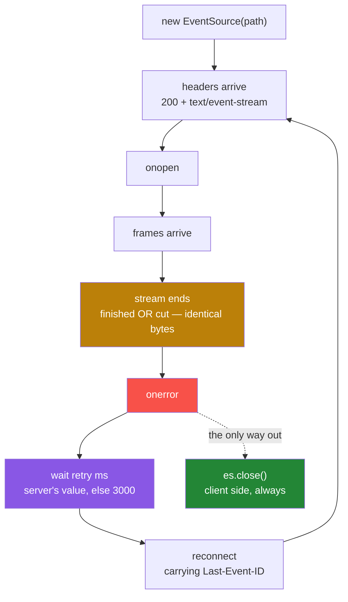

#sse #streaming #eventsource #reconnection #lab

**A stream finishes perfectly, sends everything it owes, and the client calls it an error.** Then it reconnects, on its own, forever, without a single line of code asking it to. This note is that experiment — build it, run it, and read what comes back.

# What The Browser Does On Its Own

> [!info] The one-line
> The browser contains a complete SSE client, and it reconnects by itself whenever a stream ends — including when the stream ended because it was finished. The server can configure that behaviour but cannot switch it off, and the only thing that ever stops it lives on the client. Getting a stream to end cleanly turns out to be a harder problem than getting it to resume.

Twenty minutes, about sixty lines of Python and one HTML page. You will run two endpoints that differ in four small ways and watch the browser behave completely differently against each. Nothing here is theory — every claim below points at a timestamp in a log you will produce yourself.

Notes [[02-The-Wire-Format]] and [[03-The-Browser-Client]] cover the protocol underneath this in depth. You do not need them first.

---

## What you need

Python 3.14 and FastAPI **0.141.1 or newer**. The SSE support used here is `fastapi.sse`, a module built into FastAPI since **0.135.0 in March 2026**. Almost every SSE tutorial online is written against the older `sse-starlette` package, and those imports will not match anything below.

```toml
dependencies = [
    "fastapi[standard]>=0.141.1",
    "uvicorn>=0.52.4",
]
```

---

## Part 1 — the endpoint that streams items

An SSE endpoint is an ordinary GET that does not finish in one go. Instead of returning a body, it **yields** a sequence of small frames down a connection that stays open, and the browser processes each one as it lands.

```python
1   items = [
2       Item(name="Plumbus", description="A multi-purpose household device."),
3       Item(name="Portal Gun", description="A portal opening device."),
4       Item(name="Meeseeks Box", description="A box that summons a Meeseeks."),
5   ]
6
7   @app.get("/items/stream", response_class=EventSourceResponse)
8   async def stream_items(last_event_id: Annotated[int | None, Header()] = None,) -> AsyncIterable[ServerSentEvent]:
9       yield ServerSentEvent(comment="stream of item updates")
10
11      start = last_event_id + 1 if last_event_id is not None else 0
12
13      for i, item in enumerate(items):
14          if i < start:
15              continue
16          await asyncio.sleep(2)
17          yield ServerSentEvent(data=item, event="item_update", id=str(i), retry=5000)
```

Three items, one every two seconds, then the function returns and the stream is over. Line 17 is where everything interesting lives, so take its four arguments one at a time.

- **`data=item`** — the payload. It gets JSON-encoded on the way out, which is why the items arrive as JSON later.
- **`event="item_update"`** — a **name** for this frame. The client can register a listener for that specific name instead of catching everything in one place.
- **`id=str(i)`** — a **bookmark**. The browser remembers the most recent one it received. Remember this.
- **`retry=5000`** — a number in milliseconds. It looks like configuration for the server. It is not. Remember this one too.

And line 8 has the counterpart to the bookmark: `last_event_id`, declared as a **header** the endpoint reads on the way in. Lines 11 and 14 use it to skip anything the caller already has. Nothing in the world sends that header yet, so for now those lines do nothing.

---

## Part 2 — the endpoint that has none of that

The second endpoint streams three fixed log lines on the same two-second cadence.

```python
1   @app.get("/logs/stream", response_class=EventSourceResponse)
2   async def stream_logs() -> AsyncIterable[ServerSentEvent]:
3       logs = [
4           "2025-01-01 INFO  Application started",
5           "2025-01-01 DEBUG Connected to database",
6           "2025-01-01 WARN  High memory usage detected",
7       ]
8       for log_line in logs:
9           await asyncio.sleep(2)
10          yield ServerSentEvent(raw_data=log_line)
```

Same shape, and **four things are missing**. There is no `id`, so no bookmark. There is no `event` name. There is no `retry`. And the signature on line 2 takes no header, so even if a bookmark came back there is nothing to receive it.

> [!note] The four absences are the whole note
> Everything you are about to watch is the difference between these two functions. Nothing else changes — same server, same browser, same page, same two-second cadence.

One more difference, and it is a decoy. `stream_logs` uses `raw_data=` where `stream_items` uses `data=`. That one controls **JSON encoding only** — `data=` serialises the payload, `raw_data=` puts the string on the wire untouched. It will look like it explains something later. It does not.

---

## Part 3 — the page that watches

A **handler** is a function you hand to the browser, which the browser calls when something happens. `EventSource` takes three.

```javascript
1   es = new EventSource(path);
2
3   es.onopen = function () {
4       line("open", "onopen — connection established");
5   };
6
7   es.onmessage = function (e) {
8       line("message", "onmessage    lastEventId=" + JSON.stringify(e.lastEventId) + "  data=" + e.data);
9   };
10
11  es.addEventListener("item_update", function (e) {
12      line("item", "item_update  lastEventId=" + JSON.stringify(e.lastEventId) + "  data=" + e.data);
13  });
14
15  es.onerror = function () {
16      line("error", "onerror — readyState=" + STATES[es.readyState] + ...);
17  };
```

**`onopen`** is the one to be precise about, because its name is misleading. It fires when the **response headers arrive** — status 200 with `Content-Type: text/event-stream`. That is all it asserts. The connection was established. It promises nothing at all about data, and a stream can be open and completely silent for as long as it likes.

**`onmessage`** on line 7 catches frames that arrive with **no event name**. Line 11 registers a listener for the specific name `item_update` instead. One endpoint will use each.

**`onerror`** on line 15 fires when something goes wrong. Hold that definition loosely.

`e.lastEventId` on lines 8 and 12 is the browser's copy of the most recent `id:` it saw — the bookmark, read from the client side.

> [!important] Search this file for reconnection code
> There is none. No timers, no retry loop, no `setTimeout`, nothing that reopens a connection. That matters in about four minutes.

---

## Part 4 — run it

Start the server, open the page, and click **connect /items/stream**. Three items arrive, two seconds apart. Then the generator has nothing left, returns, and the response ends normally — no exception, no error, a completed HTTP response.

> [!important] Write your prediction down before you scroll
> The stream has finished successfully. **What does the page show ten seconds later?**
>
> Then do the same for the second endpoint: click connect /logs/stream, let all three log lines arrive, and wait. **Same answer or different?**

---

## What actually happened

![[AI-Engineering/08-Streaming-And-SSE/Images/01-Both-Endpoints-Reconnect-Loop.png]]

Both runs in one capture. `/items/stream` starts at 11:04:41 and `/logs/stream` at 11:05:25.

---

## What the log is telling you

Fifteen steps, and each one either breaks the step before it or is forced by it. Every one points at a timestamp above.

### A stream that ends and a stream that dies are the same bytes

**1.** At **11:04:47.942** the third item arrived. The loop had nothing left, so the function returned and the response completed. On the server this is a success — no exception, nothing logged, nothing wrong.

**2.** At **11:04:47.946**, four milliseconds later, the page reported an **error**. Nothing failed. A healthy, finished stream is being described by the client as a failure.

**3.** The client has no alternative. A stream that finishes and a stream that is cut in half produce the same thing on the wire — **the bytes stop**. There is no end-of-stream marker anywhere in the SSE format, so there is no signal the client could examine to tell the two apart, and it assumes the worse of the two.

### The server sets the delay, the browser owns the behaviour

**4.** At **11:04:52.959** it connected again. Nobody asked it to. It did it again at **11:04:57.973**. The gaps are **5013ms** and **5011ms**, and it would have carried on all day.

**5.** It is not the page. You already searched that file and there is no reconnection code in it. This is the browser's own machinery, and it runs whether or not you want it to.

**6.** So where did five seconds come from? **`retry=5000`, on the server.** It is a wire field: the server sends it, the browser stores it, and it becomes the wait before reconnecting. The proof is the second run — at **11:05:31.229** the log stream dropped and came back **3011ms** later, because `stream_logs` sends no `retry:` at all and **3000ms is the browser's own default**.

### Open does not mean working

**7.** `onopen` fired at **11:04:52.959** and **11:04:57.973**, on two connections that delivered **zero items**. That is not a bug. `onopen` asserts the headers arrived and nothing else, exactly as defined earlier. Open is not the same as working.

### What a bookmark buys, and what its absence costs

**8.** Those two empty reconnects were **correct**. Each one carried a header the browser attached by itself — `Last-Event-ID: 2` — and line 11 of the endpoint read it, worked out that all three items had already been delivered, and yielded nothing.

**9.** That header is `id=str(i)` coming home. You can watch the client's copy of it climb in the log: `lastEventId="0"` at 11:04:43.940, then `"1"`, then `"2"`. The server wrote the bookmark, the browser kept it, and the browser handed it back without being asked.

**10.** Now the second run. At **11:05:36.241**, `Application started` arrives. It already arrived at **11:05:27.226**. All three log lines repeat, in order, on the reconnect — six lines where three were wanted.

**11.** `stream_logs` sends no `id:` and accepts no header. It holds **no information whatsoever** about what the client already has, so on every reconnect it starts from the top. This is not a bug inside that function — there is nothing for it to skip on. And the reverse is equally useless: an `id:` that nobody reads back changes nothing. **The pair is the mechanism.**

### Resumption is not termination

**12.** So `/items/stream` resumes perfectly. Every reconnect does exactly the right thing. **And it still looks broken** — open, error, open, error, and left alone it would repeat until the tab closed.

**13.** Because `Last-Event-ID` answers **where do I start from**. It does not answer **should I start at all**. Those are two different problems, and solving the first one flawlessly leaves the second one untouched.

**14.** The usual fix is a final frame that means finished — call it `done`. **On its own it is not enough.** The browser has no idea what that word means; it is one more line of data. It arrives, it gets dispatched to a handler, the stream ends, and the browser reconnects exactly as before.

**15.** It works only if **the client acts on it** — `es.close()` inside the handler. In the entire log the only two lines that ever stopped anything are at **11:04:58.744** and **11:05:40.911**, and both are `es.close()`. The contract has two sides, and the server owns one of them.



---

## Two traps

Both of these are what almost everyone reaches for first, including people who have read the specification.

> [!important] Trap 1 — send a done frame and the loop stops
> It does not. A terminal frame is data like any other data, and the browser assigns it no meaning at all. You will see it dispatched to your handler, then you will watch the stream close, then you will watch the browser reconnect exactly as it did before.
>
> A terminal frame is a **signal**. `es.close()` is the **action**. Shipping the signal without the action changes nothing except the byte count.

> [!important] Trap 2 — onmessage fired for logs because of raw_data
> `raw_data` is the other visible difference between the two endpoints, so it looks like the culprit. It is not. It controls **JSON encoding only** — which is why items arrive as JSON and log lines arrive bare, and that is the entire extent of it.
>
> Prove it in ten seconds: add `event="log_line"` to `stream_logs` and leave `raw_data` alone. `onmessage` stops firing while the payload on the wire is unchanged.

---

## One more thing the comparison revealed — event dispatch

This came out of the same two endpoints but it has nothing to do with reconnection, so it is kept apart and numbered from one.

**1.** `onmessage` fired on **every** log line and **never once** on an item. Same page, same handlers, both registered before either connection opened.

**2.** `stream_items` sets `event="item_update"`, so those frames are dispatched to a listener registered under that exact name. `stream_logs` sets no event name, so its frames go to the **default event, which is called `message`** — and `onmessage` is the handler for it.

**3.** So a named frame reaching `onmessage` is impossible, and an unnamed frame reaching a named listener is impossible. If you set an event name and forget to register a listener for it, frames will arrive, be parsed correctly, be dispatched correctly, and vanish — with no error anywhere.

---

## Where this bites in a real system

Picture an agent that streams its progress into a chat interface, one bubble per frame, over a connection that drops after step 3 of 7.

**With no `id:`** the reconnect replays steps 1 through 3 before continuing, so the user watches three messages they already read append themselves a second time. Over a flaky connection this compounds — every drop adds another full copy.

**With no terminal frame and no `es.close()`** the finished turn reconnects every few seconds forever. Each reconnect is a real request that hits routing, authentication, and any per-user concurrency limit in the way. A client that believes it is being helpful becomes a slow, permanent, self-inflicted load test.

There is one escape hatch, and it is an accident. `EventSource` can only issue a **GET**, so any system that streams over **POST** — which is common, because a chat turn needs a request body — has to read the stream itself and inherits none of this. No automatic reconnection, no `Last-Event-ID`, no `retry` handling. You give up free resumption and you are handed immunity to the loop in the same trade, and the day somebody moves that endpoint to a GET, all of it arrives at once.

---

## Recall

File closed, from memory.

1. A stream ends successfully. Why does the client report an error, and why can it not do better?
2. The reconnect gap was 5013ms on one endpoint and 3011ms on the other. Where did each number come from?
3. What exactly does `onopen` assert, and what does it not?
4. One endpoint sent nothing on reconnect and one re-sent everything. What is present in the first that is absent in the second — name both halves.
5. Resumption worked perfectly and the client still looked broken. Why are those two separate problems?
6. Is a terminal frame enough to stop the loop? Justify the answer either way.
7. Which single field decides whether a frame reaches `onmessage`, and what does `raw_data` control instead?

---

## Four things to try next

Each one is run, not read. An experiment that does not reproduce gets written down as not reproduced rather than quietly dropped.

- **Kill the server mid-stream, then restart it.** The reconnect should deliver only the items you had not received. Resumption doing real work, across a process that died.
- **Set `id=str(i + 1)` and repeat.** The bookmark no longer matches the position. Watch exactly one item disappear, silently, with no error on either side.
- **Put nginx in front with a low `proxy_read_timeout` and let a stream idle.** Then turn `proxy_buffering` on and watch streaming quietly stop being streaming.
- **Close the tab mid-stream.** Does the generator stop, or does the server keep working for a client that left? On a per-token API that question has an invoice attached.
