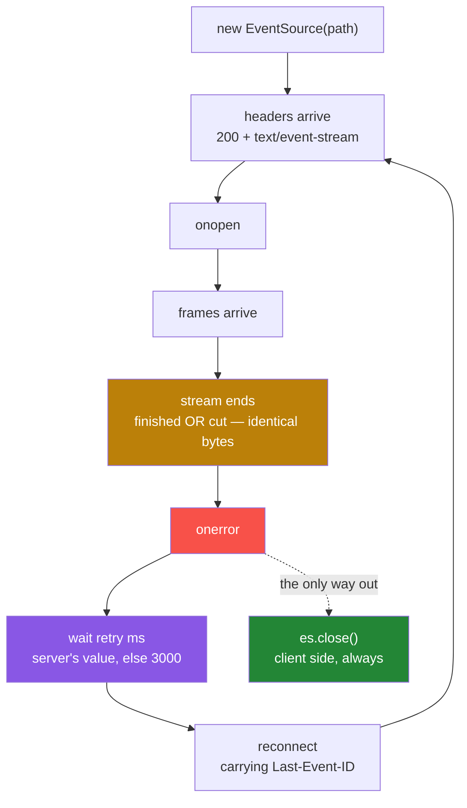

#sse #streaming #eventsource #reconnection #lab

**A stream finishes perfectly, sends everything it owes, and the client calls it an error.** Then it reconnects, on its own, forever, without a single line of code asking it to. This note is that experiment — build it, run it, and read what comes back.

# What The Browser Does On Its Own

> [!info] The one-line
> The browser contains a complete SSE client, and it reconnects by itself whenever a stream ends — including when the stream ended because it was finished. The server can configure that behaviour but cannot switch it off, and the only thing that ever stops it lives on the client. Getting a stream to end cleanly turns out to be a harder problem than getting it to resume.

Twenty minutes, about sixty lines of Python and one HTML page. You will run two endpoints that differ in four small ways and watch the browser behave completely differently against each. Nothing here is theory — every claim below points at a timestamp in a log you will produce yourself.

Notes [[02-The-Wire-Format]] and [[03-The-Browser-Client]] cover the protocol underneath this in depth. You do not need them first.

---

## What you need

Python 3.14 and FastAPI **0.141.1 or newer**. The SSE support used here is `fastapi.sse`, a module built into FastAPI since **0.135.0 in March 2026**. Almost every SSE tutorial online is written against the older `sse-starlette` package, and those imports will not match anything below.

```toml
dependencies = [
    "fastapi[standard]>=0.141.1",
    "uvicorn>=0.52.4",
]
```

---

## Part 1 — the endpoint that streams items

An SSE endpoint is an ordinary GET that does not finish in one go. Instead of returning a body, it **yields** a sequence of small frames down a connection that stays open, and the browser processes each one as it lands.

```python
1   items = [
2       Item(name="Plumbus", description="A multi-purpose household device."),
3       Item(name="Portal Gun", description="A portal opening device."),
4       Item(name="Meeseeks Box", description="A box that summons a Meeseeks."),
5   ]
6
7   @app.get("/items/stream", response_class=EventSourceResponse)
8   async def stream_items(last_event_id: Annotated[int | None, Header()] = None,) -> AsyncIterable[ServerSentEvent]:
9       yield ServerSentEvent(comment="stream of item updates")
10
11      start = last_event_id + 1 if last_event_id is not None else 0
12
13      for i, item in enumerate(items):
14          if i < start:
15              continue
16          await asyncio.sleep(2)
17          yield ServerSentEvent(data=item, event="item_update", id=str(i), retry=5000)
```

Three items, one every two seconds, then the function returns and the stream is over. Line 17 is where everything interesting lives, so take its four arguments one at a time.

- **`data=item`** — the payload. It gets JSON-encoded on the way out, which is why the items arrive as JSON later.
- **`event="item_update"`** — a **name** for this frame. The client can register a listener for that specific name instead of catching everything in one place.
- **`id=str(i)`** — a **bookmark**. The browser remembers the most recent one it received. Remember this.
- **`retry=5000`** — a number in milliseconds. It looks like configuration for the server. It is not. Remember this one too.

And line 8 has the counterpart to the bookmark: `last_event_id`, declared as a **header** the endpoint reads on the way in. Lines 11 and 14 use it to skip anything the caller already has. Nothing in the world sends that header yet, so for now those lines do nothing.

---

## Part 2 — the endpoint that has none of that

The second endpoint streams three fixed log lines on the same two-second cadence.

```python
1   @app.get("/logs/stream", response_class=EventSourceResponse)
2   async def stream_logs() -> AsyncIterable[ServerSentEvent]:
3       logs = [
4           "2025-01-01 INFO  Application started",
5           "2025-01-01 DEBUG Connected to database",
6           "2025-01-01 WARN  High memory usage detected",
7       ]
8       for log_line in logs:
9           await asyncio.sleep(2)
10          yield ServerSentEvent(raw_data=log_line)
```

Same shape, and **four things are missing**. There is no `id`, so no bookmark. There is no `event` name. There is no `retry`. And the signature on line 2 takes no header, so even if a bookmark came back there is nothing to receive it.

> [!note] The four absences are the whole note
> Everything you are about to watch is the difference between these two functions. Nothing else changes — same server, same browser, same page, same two-second cadence.

One more difference, and it is a decoy. `stream_logs` uses `raw_data=` where `stream_items` uses `data=`. That one controls **JSON encoding only** — `data=` serialises the payload, `raw_data=` puts the string on the wire untouched. It will look like it explains something later. It does not.

---

## Part 3 — the page that watches

A **handler** is a function you hand to the browser, which the browser calls when something happens. `EventSource` takes three.

```javascript
1   es = new EventSource(path);
2
3   es.onopen = function () {
4       line("open", "onopen — connection established");
5   };
6
7   es.onmessage = function (e) {
8       line("message", "onmessage    lastEventId=" + JSON.stringify(e.lastEventId) + "  data=" + e.data);
9   };
10
11  es.addEventListener("item_update", function (e) {
12      line("item", "item_update  lastEventId=" + JSON.stringify(e.lastEventId) + "  data=" + e.data);
13  });
14
15  es.onerror = function () {
16      line("error", "onerror — readyState=" + STATES[es.readyState] + ...);
17  };
```

**`onopen`** is the one to be precise about, because its name is misleading. It fires when the **response headers arrive** — status 200 with `Content-Type: text/event-stream`. That is all it asserts. The connection was established. It promises nothing at all about data, and a stream can be open and completely silent for as long as it likes.

**`onmessage`** on line 7 catches frames that arrive with **no event name**. Line 11 registers a listener for the specific name `item_update` instead. One endpoint will use each.

**`onerror`** on line 15 fires when something goes wrong. Hold that definition loosely.

`e.lastEventId` on lines 8 and 12 is the browser's copy of the most recent `id:` it saw — the bookmark, read from the client side.

> [!important] Search this file for reconnection code
> There is none. No timers, no retry loop, no `setTimeout`, nothing that reopens a connection. That matters in about four minutes.

---

## Part 4 — run it

Start the server, open the page, and click **connect /items/stream**. Three items arrive, two seconds apart. Then the generator has nothing left, returns, and the response ends normally — no exception, no error, a completed HTTP response.

> [!important] Write your prediction down before you scroll
> The stream has finished successfully. **What does the page show ten seconds later?**
>
> Then do the same for the second endpoint: click connect /logs/stream, let all three log lines arrive, and wait. **Same answer or different?**

---

## What actually happened

![[AI-Engineering/08-Streaming-And-SSE/Images/01-Both-Endpoints-Reconnect-Loop.png]]

Both runs in one capture. `/items/stream` starts at 11:04:41 and `/logs/stream` at 11:05:25.

---

## What the log is telling you

Fifteen steps, and each one either breaks the step before it or is forced by it. Every one points at a timestamp above.

### A stream that ends and a stream that dies are the same bytes

**1.** At **11:04:47.942** the third item arrived. The loop had nothing left, so the function returned and the response completed. On the server this is a success — no exception, nothing logged, nothing wrong.

**2.** At **11:04:47.946**, four milliseconds later, the page reported an **error**. Nothing failed. A healthy, finished stream is being described by the client as a failure.

**3.** The client has no alternative. A stream that finishes and a stream that is cut in half produce the same thing on the wire — **the bytes stop**. There is no end-of-stream marker anywhere in the SSE format, so there is no signal the client could examine to tell the two apart, and it assumes the worse of the two.

### The server sets the delay, the browser owns the behaviour

**4.** At **11:04:52.959** it connected again. Nobody asked it to. It did it again at **11:04:57.973**. The gaps are **5013ms** and **5011ms**, and it would have carried on all day.

**5.** It is not the page. You already searched that file and there is no reconnection code in it. This is the browser's own machinery, and it runs whether or not you want it to.

**6.** So where did five seconds come from? **`retry=5000`, on the server.** It is a wire field: the server sends it, the browser stores it, and it becomes the wait before reconnecting. The proof is the second run — at **11:05:31.229** the log stream dropped and came back **3011ms** later, because `stream_logs` sends no `retry:` at all and **3000ms is the browser's own default**.

### Open does not mean working

**7.** `onopen` fired at **11:04:52.959** and **11:04:57.973**, on two connections that delivered **zero items**. That is not a bug. `onopen` asserts the headers arrived and nothing else, exactly as defined earlier. Open is not the same as working.

### What a bookmark buys, and what its absence costs

**8.** Those two empty reconnects were **correct**. Each one carried a header the browser attached by itself — `Last-Event-ID: 2` — and line 11 of the endpoint read it, worked out that all three items had already been delivered, and yielded nothing.

**9.** That header is `id=str(i)` coming home. You can watch the client's copy of it climb in the log: `lastEventId="0"` at 11:04:43.940, then `"1"`, then `"2"`. The server wrote the bookmark, the browser kept it, and the browser handed it back without being asked.

**10.** Now the second run. At **11:05:36.241**, `Application started` arrives. It already arrived at **11:05:27.226**. All three log lines repeat, in order, on the reconnect — six lines where three were wanted.

**11.** `stream_logs` sends no `id:` and accepts no header. It holds **no information whatsoever** about what the client already has, so on every reconnect it starts from the top. This is not a bug inside that function — there is nothing for it to skip on. And the reverse is equally useless: an `id:` that nobody reads back changes nothing. **The pair is the mechanism.**

### Resumption is not termination

**12.** So `/items/stream` resumes perfectly. Every reconnect does exactly the right thing. **And it still looks broken** — open, error, open, error, and left alone it would repeat until the tab closed.

**13.** Because `Last-Event-ID` answers **where do I start from**. It does not answer **should I start at all**. Those are two different problems, and solving the first one flawlessly leaves the second one untouched.

**14.** The usual fix is a final frame that means finished — call it `done`. **On its own it is not enough.** The browser has no idea what that word means; it is one more line of data. It arrives, it gets dispatched to a handler, the stream ends, and the browser reconnects exactly as before.

**15.** It works only if **the client acts on it** — `es.close()` inside the handler. In the entire log the only two lines that ever stopped anything are at **11:04:58.744** and **11:05:40.911**, and both are `es.close()`. The contract has two sides, and the server owns one of them.



---

## Now kill the server

Everything above happened with a **healthy** server. The stream ended because it had finished. Nothing had actually broken yet.

Widen the window first, so you have time to reach the terminal — `await asyncio.sleep(4)` instead of 2 gives four seconds between items.

Then connect, and the moment the first item lands, kill the server. Wait a few seconds while it is down. Start it again.

![[AI-Engineering/08-Streaming-And-SSE/Images/02-Server-Killed-And-Restarted.png]]

### A dead server looks different from a finished one

Three `error` lines in a row at **12:22:34.359**, **12:22:39.366** and **12:22:44.370** — and **not one `open` between them**. That is new. Every reconnect so far has been open, then error, then open, then error.

The difference is diagnostic, and you can read it off the log without knowing anything else about the system:

| What is happening | What the log looks like |
|---|---|
| Stream finished, server healthy | `open` → `error` → `open` → `error`, alternating |
| Server dead or unreachable | `error` → `error` → `error`, with no `open` at all |

An `open` means the connection was accepted. Three refusals in a row means nothing is listening. The browser cannot tell you that in words — `onerror` carries no detail whatsoever — but the **shape** tells you, and the five-second spacing is your own `retry` value pacing the attempts.

### And this is resumption doing real work

At **12:22:49.400** the server was back and the reconnect succeeded. Then look at what arrived:

```
12:22:53.401  item_update  lastEventId="1"  Portal Gun
12:22:57.408  item_update  lastEventId="2"  Meeseeks Box
```

**Plumbus was not re-sent.** Three items were requested, three items were delivered, across two connections and a server process that died and was replaced — and there is nothing anywhere in the client that coordinates any of that. The browser held the bookmark through the outage and handed it back on the way in.

> [!note] The skipped items cost no time, and that is not an accident
> Portal Gun arrived **4001ms** after the reconnect, not 8002ms. The `continue` sits **before** the `await asyncio.sleep(...)`, so skipping an already-delivered item costs nothing at all.
>
> Move the sleep above the skip and it still works, and a client resuming from item 900 of 1000 would sit through nine hundred sleeps before seeing a single frame. **A resume path must not re-do the work it is skipping** — only the delivery is optional, and it is easy to write it the other way round without noticing.

### The bookmark has to match the position, and nothing checks that it does

The endpoint writes `id=str(i)`, so the id **is** the index, and `start = last_event_id + 1` is therefore right — after id 1, the next thing owed is index 2.

Write `id=str(i + 1)` instead and the two disagree. Id 1 now means index 0, so a client that received Plumbus and dropped comes back with `Last-Event-ID: 1`, the server computes `start = 2`, skips index 0 **and index 1**, and delivers Meeseeks Box. **Portal Gun is gone.**

Nothing reports it. The client received ids 1 and 3 and did not care, because `EventSource` tracks the most recent id and never looks for gaps. The server did what it was told. The user is simply missing an item, permanently, and there is no error on either side to explain it.

That is the real cost of resume-by-id: **the mapping between the id and the position is the entire correctness surface**, it is checked by nobody, and getting it wrong loses data quietly. It is also the strongest argument for the alternative — resuming from state you already persist, where there is no id arithmetic to get wrong in the first place.

---

## Now change the client

Both experiments so far changed something about the **server** — it finished, or it died. Change the client instead and leave everything else exactly as it is.

Open the same three URLs in an ordinary HTTP client. Postman is used here, but anything that can display a stream will do.

### The POST stream

![[AI-Engineering/08-Streaming-And-SSE/Images/03-Postman-Post-Chat-Stream.png]]

Sixteen seconds, five frames, `Connection closed`, and then **nothing**. No retry, no second attempt, no error.

Two details worth reading off it. `[DONE]` arrives as bare text while the other frames arrive as JSON — that is `raw_data` against `data` on the server, visible on the wire. And every frame carries its event name as a label, because this client shows them and the browser's built-in one does not.

### The GET stream — the same URL that loops forever

![[AI-Engineering/08-Streaming-And-SSE/Images/04-Postman-Get-Items-Stream.png]]

**This is the endpoint that reconnected every five seconds, indefinitely, earlier in this note.** Same URL, same server, same three items, same bytes. Here it closes once at 12:29:14.465 and stops.

So the conclusion has to be revised, and revised in an important direction:

> [!important] Reconnection is a property of the client, not of the protocol
> There is nothing in SSE that reconnects. `EventSource` reconnects because the specification obliges it to, and **every other client inherits none of it** — not this one, not `curl`, not a mobile app, not your own `fetch` reader. No retry, no `Last-Event-ID`, no `onerror`.
>
> The mistake is to read the earlier sections as a fact about SSE. They are a fact about one client that happens to be built into every browser.

There is a second finding in that screenshot, at 12:29:02.439:

```
:stream of item updates
```

That is the `comment` frame the endpoint sends before anything else — and **the browser has never once shown it to you**. `EventSource` parses comment lines and silently discards them. Which matters more than it looks: keep-alive pings travel as comments, so if a proxy ever starts eating them, `EventSource` will report absolutely nothing. Diagnosing that needs a client like this one.

### And the log stream, for the dispatch difference

![[AI-Engineering/08-Streaming-And-SSE/Images/05-Postman-Get-Logs-Stream.png]]

Three lines, no labels on any of them, `Connection closed`. The frames from this endpoint carry no `event:` field at all, which is the same reason `onmessage` handled them and never handled an item — see the dispatch section below.

---

## Now put a proxy in the middle

The application does not change at all for this one. Put nginx between the client and the server, and change **one number** in its config.

You need an endpoint that goes quiet, because everything so far emits every few seconds and would sail through any timeout:

```python
@app.get("/idle/stream", response_class=EventSourceResponse)
async def stream_idle() -> AsyncIterable[ServerSentEvent]:
    yield ServerSentEvent(data={"message": "starting, then quiet for 60 seconds"}, event="progress")
    await asyncio.sleep(60)
    yield ServerSentEvent(data={"message": "still here"}, event="progress")
    await asyncio.sleep(60)
    yield ServerSentEvent(raw_data="[DONE]", event="done")
```

And the proxy in front of it, on port 8081:

```nginx
location / {
    proxy_pass http://host.docker.internal:8080;
    proxy_http_version 1.1;
    proxy_set_header Connection "";
    proxy_read_timeout 10s;      # nginx default is 60s
}
```

### Ten seconds

The stream lasted **10.03 seconds** and the client reported `Connection closed`. The application was in perfect health, fifty seconds from its next frame, sitting inside `asyncio.sleep(60)`.

![[AI-Engineering/08-Streaming-And-SSE/Images/06-Nginx-Upstream-Timed-Out-Logged-200.png]]

Read those two lines together. **Same second, same connection, and they disagree.**

```
07:24:44 [error] ... upstream timed out (110: Operation timed out) while reading upstream
07:24:44 ... "GET /idle/stream HTTP/1.1" 200 80
```

nginx knows exactly what happened and says so in its error log. Its own access log still records **200**, because the status left with the first byte ten seconds earlier and cannot be revised. The client saw 200. The application logged 200. **One line in the entire stack names the cause, and it is on a machine the application team frequently cannot read.**

And the client's message was `Connection closed` — word for word what it says when a stream finishes normally, and when the server is killed. That is now **three** distinct causes producing one indistinguishable signal.

### Thirty seconds

Change `10s` to `30s`, restart the proxy, send the identical request.

![[AI-Engineering/08-Streaming-And-SSE/Images/07-Idle-Stream-Survives-On-Pings.png]]

**Two minutes and 0.06 seconds.** Both sixty-second silences survived, both frames arrived, `[DONE]` arrived, and the nginx error log is empty:

![[AI-Engineering/08-Streaming-And-SSE/Images/08-Nginx-Clean-No-Timeout.png]]

### The number that matters is not the one you would guess

The silences are **60 seconds** long. The timeout is **30 seconds**. Thirty is less than sixty, and it worked anyway.

Look at what fills the gaps:

```
13:00:27.710  progress   starting, then quiet for 60 seconds
13:00:42.725  :ping
13:00:57.732  :ping
13:01:12.730  :ping
13:01:27.716  progress   still here
```

**nginx never saw sixty seconds of silence.** The longest gap on that connection was **fifteen seconds**, because `EventSourceResponse` fills idle time with a comment frame every fifteen seconds — `_PING_INTERVAL = 15.0` in `fastapi/sse.py`, three pings per silence, arriving at 15.015s, 15.007s and 14.998s.

> [!important] The timeout must exceed the ping interval, not the idle period
> This is the whole result, and it inverts the intuition. The application could go quiet for **ten minutes** and a 30-second timeout would still hold, because the connection is never quiet — the ping is.
>
> Which also re-explains the failure: ten seconds did not fail because the app was slow. It failed because **10 is less than 15**, so the timeout expired before the first ping could arrive to reset it.
>
> So the number to check in production is not how long your slowest request takes. It is: **is the heartbeat interval below the smallest timeout anywhere in the path** — proxy, load balancer, CDN, carrier NAT. Any single hop configured under it kills every quiet stream, silently.

The byte counts make the pings concrete too: 80 bytes on the run that died, **250** on the run that lived. Comment frames are real traffic.

### And nobody upstream knew anything

![[AI-Engineering/08-Streaming-And-SSE/Images/09-Uvicorn-Both-Runs-200.png]]

Two requests, two `200 OK`, and **not a word about the one that was cut off**. From the application's side the failed run and the successful run are identical. Whatever you would want to alert on here, it is not in this log.

One last thing, from the ping frames themselves: `:ping` is visible in this client and has never once appeared in the browser, because `EventSource` discards comment lines. **The mechanism keeping your streams alive is invisible to the client most of your users are running.**

### The other half of the experiment did not reproduce

Every article about SSE behind nginx says the same thing: nginx buffers proxied responses by default, so it holds event frames until a buffer fills, and streaming silently becomes batching. The fix given is `proxy_buffering off`.

That is testable, so test it. FastAPI already sends `X-Accel-Buffering: no` and nginx honours it, which means buffering cannot bite here by accident — so switch the protection off deliberately:

```nginx
proxy_ignore_headers X-Accel-Buffering;
```

nginx's own documentation is explicit that the header overrides the directive, and that this is exactly how you disable that override. With this line, buffering is on.

**It changed nothing.** On the sixty-second idle stream, frames still arrived one at a time, fifteen seconds apart, across two full minutes. So the producer was slowed down to see whether rate was the trigger — 200 frames at 20 ms intervals:

```
tick {"n": 0}     14:04:31.154
tick {"n": 199}   14:04:35.492
```

**4.338 seconds**, about 21.7 ms per frame, spread evenly. Fifty frames a second through a buffering proxy, and not one of them was held.

> [!important] What this proves, and what it does not
> **Proven:** on current nginx with `proxy_buffering` at its default, an SSE stream at fifty frames per second arrives with no measurable delay. The advice everyone repeats did not reproduce.
>
> **Not proven:** that buffering never bites. This says nothing about **gzip**, which compresses and genuinely does accumulate, and nothing about a CDN, a load balancer or an API gateway — separate mechanisms with their own behaviour, and plausibly the real cause behind many reports that name nginx.
>
> **What to do anyway:** still set `proxy_buffering off` on SSE routes. It costs nothing and the failure mode is silent. But hold it as **insurance against layers you have not tested**, not as a fix for something you have observed — and be able to say which is which.

The general lesson outlives the specific result. **A widely repeated piece of infrastructure advice took twenty minutes to test and did not hold.** Most of the people repeating it have not run it either.

---

## Now close the client

Every experiment so far watched the client. This one watches the **server** — when the person on the other end walks away, does the work stop, and who is left holding the bill?

You cannot answer that without instrumentation, because a stream that stops produces silence on the server too. So the generator gets a counter and two prints:

```python
sent = 0
try:
    for i in range(200):
        await asyncio.sleep(0.02)
        yield ServerSentEvent(data={"n": i}, event="tick")
        sent = i + 1
    yield ServerSentEvent(raw_data="[DONE]", event="done")
except asyncio.CancelledError:
    print(f"CANCELLED after {sent} frames")
    raise                       # never swallow this
finally:
    print(f"FINALLY — {sent} frames produced")
```

Two hundred frames over four seconds. Start it, then press cancel about a second in.

```
CANCELLED after 95 frames — client gone, work stopped here
FINALLY — generator closing, 95 frames produced
```

**Ninety-five, not two hundred.** The disconnect reached the generator, and the work stopped where it stood rather than running on for a client that had gone. `finally` ran on both paths — 200 on a clean finish, 95 here.

And once more, the access log said `200 OK`. That is now the **third** kind of incomplete response today that logs as a success.

The `raise` on the line after the print is not a formality. Swallowing `CancelledError` stops the cancellation propagating, and the framework then believes the task finished normally.

### Ninety-five frames of work happened, and something has to record it

This is where a lab exercise turns into a production concern. Cancellation lands at whatever `await` the generator was sitting on — here `asyncio.sleep`, in a real agent the model call. So the work stops, which is what you want. But the tokens already spent are still owed, and the only place guaranteed to run is that `finally`.

So put the write there and see what happens. `record_usage` stands in for it, and it awaits, which is the entire problem:

```python
async def record_usage(frames: int, *, label: str) -> None:
    await asyncio.sleep(0.1)
    print(f"USAGE WRITTEN — {frames} frames ({label})")
```

Unshielded, cancelled by an ordinary client disconnect:

```
CANCELLED after 106 frames — client gone, work stopped here
FINALLY — generator closing, 106 frames produced
the usage write's own await was cancelled
```

**No write.** A hundred and six frames of billable work, and nothing recorded it — with no error anywhere, because a write that never happened is not an error. It is an await that did not finish.

Shielded, same conditions:

```
FINALLY — generator closing, 131 frames produced
USAGE WRITTEN — 131 frames (shielded)
```

One flag, and the difference is whether the money got recorded.

### Why one cancellation is enough, which is not what asyncio alone would tell you

Test this against raw asyncio and you get a misleading answer. A single `task.cancel()` is **edge-triggered** — it is delivered once, so the next await in the `finally` proceeds normally and the write succeeds. On that evidence you would conclude an unshielded write is fine for ordinary disconnects and only fails on shutdown.

That conclusion is wrong on this stack, and the server disagrees with it directly.

Starlette runs request handlers inside **anyio task groups**, and an anyio cancel scope is **level-triggered**: once the scope is cancelled, every await inside it raises immediately, not just the first. Run all three against a real anyio task group cancelled exactly once:

```
plain                          ->  write CANCELLED, nothing recorded
anyio.CancelScope(shield=True) ->  USAGE WRITTEN
asyncio.shield                 ->  write CANCELLED, nothing recorded
                                   USAGE WRITTEN
```

> [!important] On FastAPI there is no grace period at all
> One ordinary client disconnect is enough to lose an unshielded write in a `finally`. There is no second cancellation needed and no window where a short await slips through.
>
> And the two fixes are **not** equivalent, which the third line above shows. `asyncio.shield` lets the outer await die and finishes the write in an orphan task **after the request has ended** — so the code has to swallow a `CancelledError` it did not cause, and if the process exits in that window the write is lost anyway. `anyio.CancelScope(shield=True)` completes **inline**, before `finally` returns. On Starlette it is the native primitive and the correct one.

```python
finally:
    with anyio.CancelScope(shield=True):
        await record_usage(sent)
```

The general shape outlives the example. **Anything that must survive the end of a request — usage accounting, quota decrements, releasing a slot, closing a resource — has to be shielded, and shielded with the primitive belonging to the framework actually running the task.** Guessing at asyncio semantics when the framework is on anyio produces code that passes every test you write and loses data in production.

---

## Two traps

Both of these are what almost everyone reaches for first, including people who have read the specification.

> [!important] Trap 1 — send a done frame and the loop stops
> It does not. A terminal frame is data like any other data, and the browser assigns it no meaning at all. You will see it dispatched to your handler, then you will watch the stream close, then you will watch the browser reconnect exactly as it did before.
>
> A terminal frame is a **signal**. `es.close()` is the **action**. Shipping the signal without the action changes nothing except the byte count.

> [!important] Trap 2 — onmessage fired for logs because of raw_data
> `raw_data` is the other visible difference between the two endpoints, so it looks like the culprit. It is not. It controls **JSON encoding only** — which is why items arrive as JSON and log lines arrive bare, and that is the entire extent of it.
>
> Prove it in ten seconds: add `event="log_line"` to `stream_logs` and leave `raw_data` alone. `onmessage` stops firing while the payload on the wire is unchanged.

---

## One more thing the comparison revealed — event dispatch

This came out of the same two endpoints but it has nothing to do with reconnection, so it is kept apart and numbered from one.

**1.** `onmessage` fired on **every** log line and **never once** on an item. Same page, same handlers, both registered before either connection opened.

**2.** `stream_items` sets `event="item_update"`, so those frames are dispatched to a listener registered under that exact name. `stream_logs` sets no event name, so its frames go to the **default event, which is called `message`** — and `onmessage` is the handler for it.

**3.** So a named frame reaching `onmessage` is impossible, and an unnamed frame reaching a named listener is impossible. If you set an event name and forget to register a listener for it, frames will arrive, be parsed correctly, be dispatched correctly, and vanish — with no error anywhere.

---

## Where this bites in a real system

Picture an agent that streams its progress into a chat interface, one bubble per frame, over a connection that drops after step 3 of 7.

**With no `id:`** the reconnect replays steps 1 through 3 before continuing, so the user watches three messages they already read append themselves a second time. Over a flaky connection this compounds — every drop adds another full copy.

**With no terminal frame and no `es.close()`** the finished turn reconnects every few seconds forever. Each reconnect is a real request that hits routing, authentication, and any per-user concurrency limit in the way. A client that believes it is being helpful becomes a slow, permanent, self-inflicted load test.

None of that is inevitable, though, because none of it belongs to SSE. It belongs to `EventSource`, and a system reaches it only by using that client. Read the same stream with anything else and you inherit nothing — no reconnection, no `Last-Event-ID`, no `retry` handling — which means no duplicate bubbles and no permanent loop either.

**Streaming over POST forces you into that category**, since `EventSource` can only issue a GET and a chat turn needs a request body. That is a real trade and it is usually made without noticing: you give up free resumption and you are handed immunity to the loop in exchange. The danger is that neither half is written down anywhere, so the day somebody moves the endpoint to a GET and points a browser at it, both halves arrive at once.

---

## Recall

File closed, from memory.

1. A stream ends successfully. Why does the client report an error, and why can it not do better?
2. The reconnect gap was 5013ms on one endpoint and 3011ms on the other. Where did each number come from?
3. What exactly does `onopen` assert, and what does it not?
4. One endpoint sent nothing on reconnect and one re-sent everything. What is present in the first that is absent in the second — name both halves.
5. Resumption worked perfectly and the client still looked broken. Why are those two separate problems?
6. Is a terminal frame enough to stop the loop? Justify the answer either way.
7. Which single field decides whether a frame reaches `onmessage`, and what does `raw_data` control instead?
8. A proxy killed an idle stream at ten seconds and let the same stream live at thirty — across silences of **sixty** seconds. Why does thirty work when the silence is twice that?
9. Ninety-five frames of billable work happened and the client left. Where does the usage write have to live, and why does putting it there not make it safe?
10. Testing cancellation against raw asyncio gives you the wrong answer on FastAPI. What is the difference, and which way does it cut?
11. Three separate causes today produced the identical message `Connection closed`. Name them.

---

## What is left

Every experiment above was run rather than read, and one of them did not reproduce — which is recorded as a negative result rather than quietly dropped. One thing remains:

- **Read the stream with your own code rather than a finished client.** `fetch` the endpoint, take the response body, buffer the bytes, scan for the blank line, and parse the fields yourself. It is about thirty-five lines, and every one of them is machinery `EventSource` was already providing — which is the most direct way to find out what you have been getting for free.
