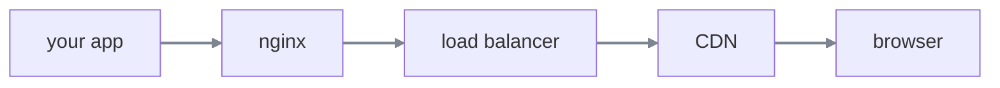
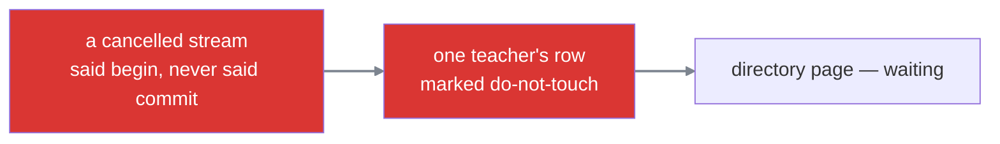

#sse #streaming #test #retrieval

**Ten questions, notes closed.** Three kinds — trace a mechanism, diagnose a symptom, defend a decision against a changed constraint. Marked **solid** if it would survive follow-ups, **thin** if the answer was right without the mechanism underneath it, **wrong** if the chain is broken.

Each question keeps the answer given and whatever had to be explained afterwards, because the explanations are the point rather than the score.

---

# Question 1 · diagnose

> A teacher asks a question. The screen stays empty for the full twenty seconds, then the entire answer appears at once.The server shows every frame written, no exceptions, and the connection open throughout.

> **What happened, and what would you look at to confirm it?**

**Answered:** a reverse proxy is buffering the responses and only sending them once it is above its threshold. Would check whether the response headers are configured correctly.

**Mark: solid.** The diagnosis is right and for the right reason — everything arriving at once at the end is the signature of buffering, and it is what separates it from the other two silent failures, where nothing arrives at all.

## Perturbation

> You set `X-Accel-Buffering: no` on the response and deploy. **Same behaviour — still nothing until the end.** What now?

**Answered:** there is another header, but could not recall the name.

**Mark: wrong.** The instinct was to look for a second header, which is a reasonable guess and the wrong shape of answer. `proxy_buffering off` does exist but is nginx configuration rather than a response header — so it only helps where that config is yours to change.

The real answer is a level up.

## The path has more than one thing in it

A deployed request does not go from your code to the browser. It goes through a chain:



Each is a **separate program, usually on a separate machine, often owned by a different person.** Each receives bytes from the thing before it, decides when to pass them on, and may hold them while deciding. So a frame has to survive four hand-offs and **any one of them can hold it.**

`X-Accel-Buffering: no` is a convention that **nginx** looks for. That is its entire scope.

```text
1  your app  →  nginx  →  load balancer  →  CDN  →  browser
2                 ▲
3                 └── the header fixed this one, and only this one
```

The CDN has never heard of it. Neither has the load balancer. So the app writes a frame, nginx forwards it immediately because nginx was fixed, and **the CDN holds it anyway** — identical symptom, and it looks as though the fix did nothing.

> One fix at one hop is not a fix. **Streaming has to be enabled at every hop**, and nothing tells you when one was missed.

## Finding which hop is doing it

Remove hops one at a time, testing progressively closer to the application:

| test | goes through | result |
|---|---|---|
| `curl` the app directly, on the box | nothing | streams fine |
| `curl` through nginx | nginx | streams fine |
| `curl` through the load balancer | nginx, LB | streams fine |
| `curl` the public URL | nginx, LB, CDN | **arrives in one lump** |

**The first step that breaks is the hop that is buffering.**

> [!important] The technique outlives the bug
> Any failure that appears in production and not locally was introduced by something between the two. **Bisecting the path** — testing at each hop, outwards from the application — finds it without needing to know what each box does internally.

## And why it comes back

The fix lives in configuration on machines your code does not own. Somebody adds a CDN six months later for unrelated reasons — no code change, no deploy of your service — and **streaming silently stops working**, with the same symptom and the same healthy logs.

---

# Question 2 · trace

> A teacher is on a train with a weak signal. The model is producing tokens at full speed.

> **Walk from the phone all the way back to the model provider. What stops what, and in what order?**

**Answered:** the consumer cannot consume at the same speed, so the send buffer in the app's operating system starts filling and eventually fills completely. No more writes can be performed, which leads the generator to stop generating, which leads the model to stop producing tokens. The whole pipeline gets stuck, and its speed becomes the speed of the teacher's network — even if the model could and wanted to stream faster, it cannot.

**Mark: solid.** The chain holds end to end, and the last observation is the one most people miss: **the pipeline runs at the speed of its slowest link**, regardless of what the model is capable of.

## The hop that was compressed

Between the generator stopping and the provider stopping, there is a second connection with its own buffers.

**Answered on the probe:** there is an OS buffer for the app and for the model provider too, because the provider is also streaming to the app.

**Correct.** The app is an endpoint on two connections at once, and the pressure crosses from one to the other through the paused generator:

```mermaid
flowchart LR
    T["teacher's phone<br/>reading slowly"] -->|"1 · fills"| SB["app's send buffer"]
    SB -->|"2 · generator suspends"| G["generator<br/>paused at yield"]
    G -->|"3 · nobody is pulling"| RB["app's receive buffer<br/>holding model tokens"]
    RB -->|"4 · fills"| PSB["provider's send buffer"]
    PSB -->|"5 · provider's writes block"| M["the model"]
    style T fill:#da3633,color:#fff
    style M fill:#238636,color:#fff
    linkStyle default stroke:#7d8590,stroke-width:2px
```



Four buffers live inside the app for a single question — two for the connection to the teacher, two for the connection to the provider. **The generator is the only thing joining them**, which is precisely why pausing it propagates pressure backwards instead of letting tokens pile up in memory.

---

# Question 3 · diagnose

> An agent sometimes asks for two tools in a single turn — a teacher's salary and their leave balance together.
>
> Most of the time it works. Occasionally a tool is called with arguments that look like they came from a completely different request, and once in a while the whole thing fails to parse. **Single-tool turns are always fine.**
>
> **What is happening, and why is it intermittent rather than constant?**

**Answered:** the index is not being taken into account, so the arguments of one tool get mixed with the arguments of the other. Not necessarily always, which is why it is intermittent.

**Mark: solid.** Every delta carries an **index** — the position of the content block it belongs to — and buffering has to be per index rather than into one place. Single-tool turns always work because there is only one index, so ignoring it is harmless. Two tools interleave, and whether the interleaving produces something that parses varies from run to run.

## Which failure is worse

**Answered:** arguments getting mixed, because the wrong tool can be executed with the wrong inputs. If it does not fail loudly it is worse still — imagine a refund tool for ₹500 and a payment tool for ₹100 having their arguments swapped. Then ₹500 gets charged from the user's account.

**Mark: solid**, and the example is the right one.

> [!warning] A parse failure is loud. A successful parse with merged arguments is silent.
> Two valid tool calls shredded together sometimes produce something malformed, which crashes and gets noticed. Sometimes they produce something **structurally valid and semantically wrong** — which does not crash, does not log, and calls a real tool with real arguments that belong to a different request.
>
> Money moves. Leave gets approved. Email gets sent. And nothing anywhere records that a bug occurred, because from the system's point of view nothing went wrong.

---

# Question 4 · diagnose

> A stop button works perfectly in testing. In production it works about half the time — the other half the button greys out and the answer keeps writing itself to the end. No errors, and no visible pattern in which requests fail.
>
> **What is happening?**

**Answered:** it is a distributed problem. For the other half, the request is getting routed to a different instance that does not have the mapping of the task.

**Mark: solid.** The task is a live object in one process's memory, and the stop request lands wherever the load balancer sends it. Two instances gives roughly a coin flip.

## The fix

**Answered:** make the session stateful, so one client is tied to one server instance.

**Mark: thin.** Session affinity does work, and plenty of teams use it — but it solves a state problem at the routing layer, and the trade is poor.

**Answered on the cost:** if that instance goes down, the client cannot be served until it recovers or the connection is reassigned.

Correct, and there are two more. **Deploys become disruptive**, since every rolling restart drops live sessions. And **load goes uneven**, because clients are pinned rather than balanced.

## The cheaper answer

A task cannot be put in a shared store — it is a live object with a running stack, not data. **But a flag can.**

```python
1  async for token in model.generate(prompt):
2      if await request.is_disconnected():
3          break
4      if await cancelled(stream_id):        ← one more check, same place
5          break
6      yield sse_frame(token)
```

The stop request sets `cancel:{stream_id}`. The generator reads it in the loop where it is already checking for a disconnect.

> **Nothing has to reach the task — the task comes and asks.**

Which removes the routing constraint entirely. The stop lands on any instance, no pinning, no sessions lost on deploy. The cost is a lookup per check, and that is tunable by checking every tenth token rather than every one.

## How that plays out across instances

Each generator reads **only its own stream id**, not everybody's.

```text
1  instance 1   running stream A   →  each iteration, reads cancel:A
2  instance 2   running stream B   →  each iteration, reads cancel:B
```

The teacher on stream A presses stop. That request lands on **instance 2** — the wrong one, which was the original problem.

```text
3  instance 2 receives the stop for A
4  instance 2 writes  cancel:A = 1
5  instance 2 is finished. it does not know or care where A is running.
```

And then, on its very next token:

```text
6  instance 1 reads cancel:A  →  set  →  break
```

Instance 2 never had to find instance 1 — no directory, no forwarding, no knowledge of who owns what. And instance 1 was never told anything; it asked, as it does every iteration regardless, and the answer had changed.

> The stop request and the running generation never communicate. **They touch the same key at different times, from different machines.**

Which sidesteps the routing problem rather than solving it.

---

# Question 5 · trace

> An agent is twelve seconds into a twenty-second answer. Six frames have already reached the teacher's screen. Then the call to the school's records system fails outright.
>
> **Trace what happens. What does the teacher see, and what are the options?**

**Answered:** a normal JSON error response cannot be sent the way a controller advice would, because the client is already expecting data in a certain shape. So a special event named error can be used, carrying the error as its payload, and the client shows it however it wants.

**Mark: solid.** That is what production systems do.

## The harder reason

**Answered on the probe:** because the 200 OK was already sent in the first second of the response.

**Correct.** Not that the client expects a shape — that **the status line physically left twelve seconds ago and cannot be recalled.** The client read it, believed it, and has been appending tokens ever since. `raise HTTPException(500)` at second twelve does nothing at all.

Which leaves exactly two options, and neither is good:

| option | what it costs |
|---|---|
| **close the connection** | indistinguishable from a network failure — and a well-behaved client will treat it as a drop and **reconnect**, into a server about to fail again |
| **send an error frame** | works, and is what production does — but the failure is now application data rather than an HTTP failure |

## What that costs

> **Answered on the probe:** it will not show anything, as everything would be 2xx only.

**Mark: solid.** Which is the real price of the error-frame approach.

> [!warning] The status code stops being the source of truth
> Once a response streams, whether it succeeded is a property of its **content**, not its status line. Every tool built on the opposite assumption is now looking at the wrong thing:
>
> - the error-rate dashboard shows zero while every request fails
> - the load balancer's error rate stays flat
> - anything that retries on HTTP status has nothing to retry on
> - alerting stays silent through a total outage of the feature
>
> The service reports itself perfectly healthy, and it is not.

---

# Question 6 · diagnose

> Short answers stream perfectly. When the agent calls a slow tool and sits thinking for ninety seconds before producing anything, the connection dies.
>
> No error on the server. No error in the browser. **It works flawlessly on a laptop.**
>
> **What is happening?**

**Answered:** the connection is being timed out by one of the middle boxes maintaining it. The fix is to send a keep-alive every interval t, where t is the minimum of all the boxes' thresholds, so none of them removes the connection.

**Mark: solid**, including the part most answers get wrong — **the interval comes from the smallest timeout in the path**, not from a standard or a default.

## Why neither end reports it

**Answered:** because neither the browser nor the server dropped the connection. It was the middle-layer hops.

**Correct.** Every box in the path keeps its own record of the connection so it knows where to send the next packet. Those tables are finite, so an entry with no traffic gets reclaimed — **and the box tells nobody.**

The two end records are untouched. Both still say established. Both machines are reading their own notes correctly, and neither can see the middle.

> A zombie connection is not a broken one. It is **two correct records with nothing left between them.**

And it never reproduces on a laptop because there is nothing in between to forget anything.

## Why the keepalive has to be a comment

**Answered on the probe:** because a progress event would fire a handler on the client.

**Correct.** Every real frame triggers something — a handler runs, and the interface may render it. Sending a fake progress update every fifteen seconds would fill the screen with activity that never happened.

What is needed is bytes that **reach the client and cause nothing at all**, which is the one thing a comment does:

```text
1  : ping
2
```

The parser skips it, no event fires, the application never learns it arrived — and the bytes still crossed every box in the path and reset every timer along the way.

> A protocol specifying something that does nothing looks like an oversight until you need it. **Doing nothing is the requirement**, and every other frame type fails it.

---

# Question 7 · diagnose

> A week after shipping the stop button, queries start hanging in an unrelated part of the application — the teacher directory page, which has nothing to do with streaming.
>
> Intermittent. Clears up on its own. Every stack trace points at the directory query, which has not been touched in months.
>
> **What is happening?**

**Answered:** did not know.

**Mark: wrong**, and it is the subtlest failure in this whole topic — the kind that costs a week.

## The chain

The stop cancels the request. On the way out, cleanup records the tokens already owed — and that write opens a transaction on **the session belonging to the request being destroyed.**

```text
1  begin              the do-not-touch markers go on
2  update teachers    set tokens_used = tokens_used + 400
3  ...and the session closes, because the request is being torn down
4  commit             never happens, and never will
```

The code that was going to say `commit` **stopped existing halfway through the sentence.**

## Why the directory page

The database has no idea anything went wrong. Somebody said `begin` and has not said `commit`, which is not an error — it is a slow client. So the markers stay on that teacher's row.

The directory page reads the `teachers` table. It reaches that row. **It waits.**



**Intermittent** because it only happens when somebody presses stop. **Clears on its own** because the database eventually reaps the abandoned transaction.

> [!warning] The symptom appears nowhere near the cause
> Nothing failed in the streaming code — no exception, no log line, no alert. The only visible symptom is a query in an unrelated feature nobody has changed in months.
>
> The stack trace points at an innocent query. **The cause was a cancelled stream four minutes earlier, and nothing anywhere connects the two.**

## The fix needs both halves

**A fresh session**, not the request's, so the write does not depend on something mid-destruction. **And a shield** around it, so the cancellation that made the write necessary does not also kill it.

Shield alone: the commit runs, but the session may already be gone. Fresh session alone: the cancellation still lands on the commit. **Neither is sufficient by itself.**

---

# Question 8 · diagnose

> The service runs fine for hours, then the process is killed by the operating system for using too much memory. It restarts, runs for hours, and does it again.
>
> **It only happens in production.** Load testing on a fast local network never reproduces it, however many concurrent streams are thrown at it.
>
> **What would you look for?**

**Answered:** a user got disconnected and the app is holding connections that are no longer needed. The backend does not know the client is unavailable, so it keeps dumping the full response into an unbounded queue. The fix is a bounded queue, which stores only a limited amount and then throttles.

**Mark: solid.** And the fix is exactly right — the bound is what restores the chain, not the removal of the queue.

## Why the queue is what breaks it

Without a queue, a slow or absent client fills the send buffer, the write cannot complete, and the generator suspends. That chain limits memory to one operating system buffer, and nobody wrote a line of it.

A queue between the producer and the socket severs that chain at its first link. **The producer never touches the socket, so nothing can ever suspend it** — it runs at full speed into memory while the send side waits.

## Why load testing misses it

**Answered on the probe:** because connections never get dropped in testing.

Half of it. The other half is that **load test clients read as fast as the server writes.**

```text
1  production      real users. some slow, some vanish into tunnels.
2  load testing    fast local network. every client reads at full speed.
```

So in testing the queue drains as quickly as it fills and never accumulates. It needs a **slow or absent consumer** to grow, and a load test on a fast network has neither.

> [!warning] An unbounded queue is a memory leak with good manners
> It looks orderly, it has a sensible name, and it grows until the process is killed. And it gains nothing — the client still receives at its own speed, so generating ahead into memory delivers not one byte sooner.

---

# Question 9 · defend

> Resumption for a chat assistant. Answers take about twenty seconds and emit two progress updates before the final response.
>
> **Keep the frames and replay them from `Last-Event-ID`, or rebuild the answer from the conversation state already being saved?**

**Answered:** with limited engineering bandwidth, at MVP stage, rebuild the answer — it costs much less. A teacher can always retype the question.

**Mark: solid on the choice**, with one thing worth separating. *A teacher can retype* is an argument for building **neither**, not for choosing re-derive — and at MVP stage that is actually the strongest position available. Twenty seconds, on connections that rarely drop, is a small amount of pain being solved by a large amount of machinery.

## The perturbation

> The agent grows. It now runs **forty-five seconds** and emits **two hundred progress updates** as it works through several tools. Does the answer hold?

**Answered:** progress events are too much to ignore now, but did not know how to resolve it.

Spotting that is most of the work. Three things moved at once.

| | at 20s, 2 updates | at 45s, 200 updates |
|---|---|---|
| chance of a drop | low | **much higher** — resumption is worth more |
| cost of re-derive | invisible, 2 events lost | **severe** — the whole visible process vanishes |
| cost of replay | small buffer | **large buffer**, per stream |

Re-derive does not stay equal — **it gets actively worse.** Progress events were never part of the conversation state, so a resumed stream shows a finished answer materialising with no trace of the forty-five seconds of work that produced it. The teacher watched two hundred updates, dropped, reconnected, and now sees a completed answer appear from nothing. It reads as a different product.

But replay does not simply win either, because two hundred events per stream is a real buffer to size, expire and clean.

## The resolution is that not everything has to be resumable

The two hundred progress events are simultaneously **the most expensive thing to replay and the least valuable.** Nobody reconnecting needs to re-watch *looking up salary details* from thirty seconds ago.

So split them:

```text
1  the answer      replay it, or rebuild it from state — it is what the teacher came for
2  progress        do not replay. send one summary frame on reconnect.
```

```text
1  event: resumed
2  data: {"step": 4, "of": 6, "doing": "checking leave balance"}
```

Which costs one frame instead of two hundred, tells the teacher exactly what they need to know, and removes the largest part of the buffer entirely.

> The question **replay or re-derive** assumes one answer for the whole stream. **Different event types can have different answers**, and choosing per type is usually cheaper than choosing once.

---

# Question 10 · defend

> An interviewer asks why you chose SSE rather than WebSocket for streaming the assistant's answers.
>
> **Justify it. Then: the product adds voice — the teacher speaks and the assistant replies in speech. Does your answer hold?**

## The justification

Not that SSE is faster or lighter, which is the weak answer. The real one has two parts.

**The traffic is one-directional.** The server has everything to say and the client only listens. WebSocket's defining feature is a channel back, and there is nothing to send on it — so its main advantage does not apply while its costs still do.

**And SSE stays ordinary HTTP.** Every proxy, load balancer and CDN in the path already understands an HTTP response. A WebSocket upgrade stops being HTTP the moment it succeeds, so every layer-7 feature — path routing, access logs, header auth, rate limiting — goes dark, and some boxes refuse to carry traffic they cannot inspect.

## Now voice arrives, and the answer does not hold

Voice is **bidirectional and continuous.** Audio flows from the teacher to the server for as long as they are speaking, and back again as the reply is spoken. That is not one-directional traffic with an occasional control message — it is a genuine two-way stream.

The first half of the justification collapses entirely, because it was never a general preference for SSE. **It was a claim about the traffic**, and the traffic changed.

```text
1  text answers   one-directional   → SSE, and the infrastructure cooperates
2  voice          bidirectional     → WebSocket or WebRTC, and the cost is now worth paying
```

The second half — that SSE keeps the network's cooperation — is still true. It just stops being decisive, because no amount of infrastructure friendliness fixes a transport that cannot carry audio upstream.

> [!important] What this question is really testing
> Not which transport you like. **Whether the reason you gave was a property of the traffic or a preference dressed up as one.**
>
> An answer built on the traffic being one-directional adapts cleanly when the traffic changes. An answer built on SSE being simpler has nowhere to go, and usually defends the original choice past the point where it makes sense.

And the honest shape of a real system: both, at once. Text answers over SSE, voice over WebSocket, chosen per channel rather than once for the product.
