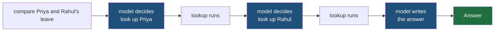
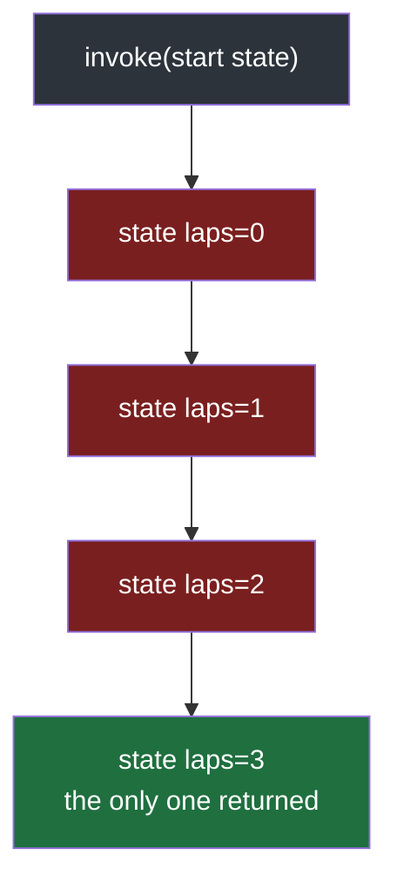
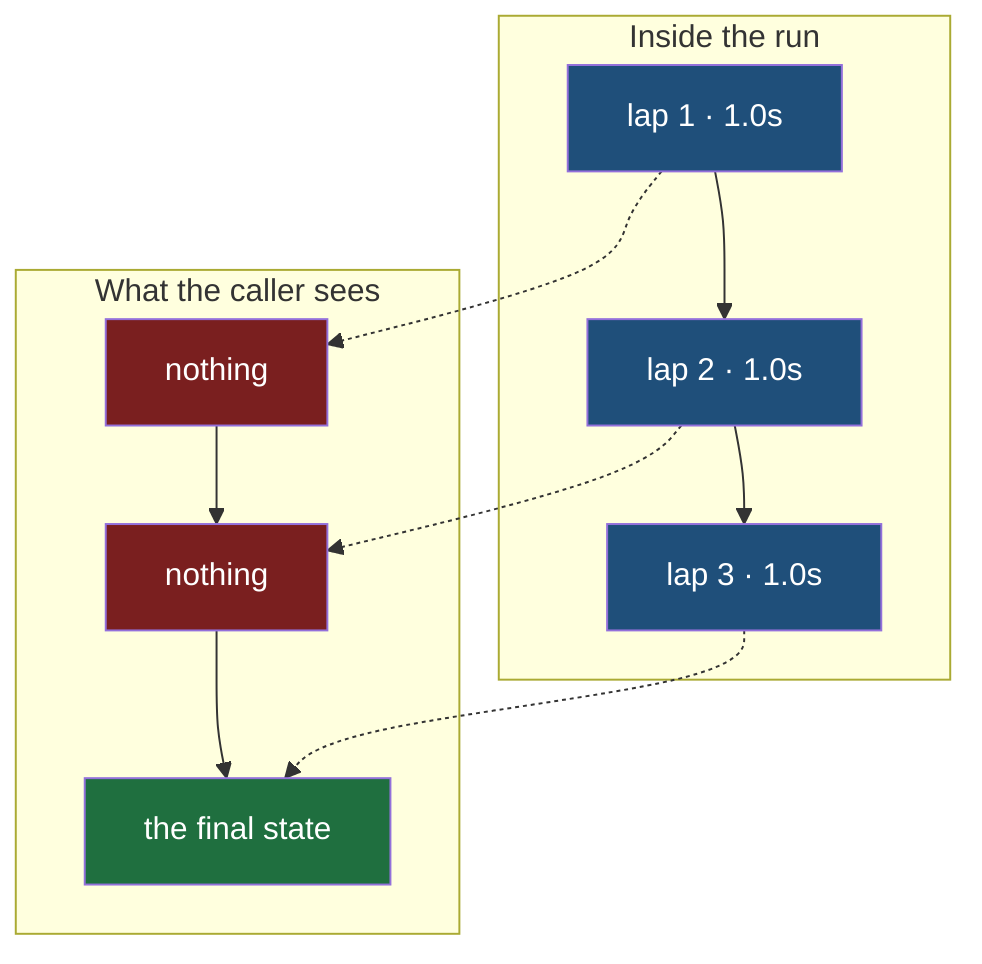
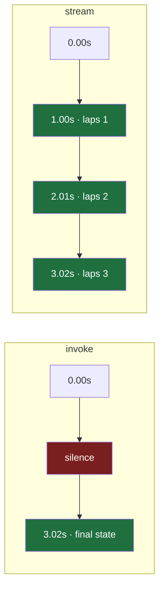
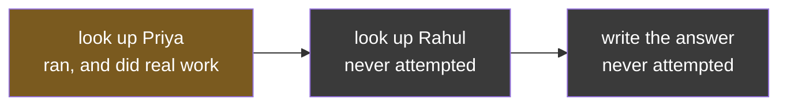
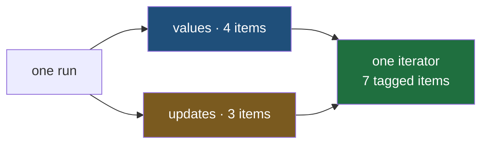
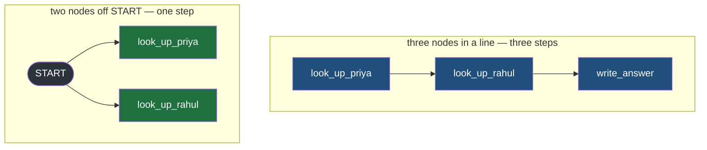
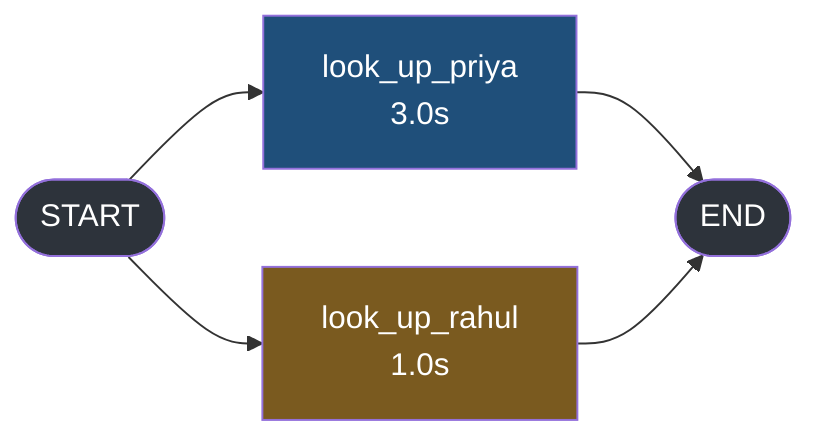

#langgraph #graphs #agents #lab

**`graph.invoke(state)` reads like every function you have ever called — something goes in, the body runs once, something comes out.** One of those three is wrong, and almost everything else in this folder follows from which one.

# The Graph Does Not Return, It Emits

> [!info] `invoke` is not the function. It is the thing that drives the functions, over and over, for as long as the graph keeps routing somewhere — and when it finally stops, it hands back the last state and is silent about every state before it.

## The system this folder argues from

The same school records assistant from the testing notes. Staff type a question in plain English, the assistant picks small functions to call, those functions are the only thing that ever touches real data, and an answer comes back.

What matters here is the shape of one turn. Somebody types compare Priya and Rahul's leave, and the assistant cannot answer in one move. It has to look up Priya, look up Rahul, then read both results and write a sentence. Three separate trips to the model, with function calls in between.



Five steps of work between the question and the answer. **One call from your code.** That gap between what the code looks like and what actually happens is the subject.

---

## A word first: node and router

Two kinds of function live in a graph, and they are not interchangeable.

A **node** does work. It receives the state, does something, and returns the parts of the state it wants changed.

A **router** decides. It receives the same state, changes nothing, and returns the **name** of wherever control should go next.

| | Reads state | Changes state | Returns |
|---|---|---|---|
| **Node** | yes | yes | a dictionary of changes |
| **Router** | yes | **no** | a destination name |

Keeping them apart is what makes a loop possible rather than accidental. A node that could also choose the next step would be a function calling another function, and there would be no graph at all — just a call stack. **The graph exists because the deciding is separated from the doing.**

---

## The smallest graph that loops

One node, one router, one state key. Save it as `src/langgraph_lab/note01/a_invoke_loops.py`.

```python
from typing import TypedDict

from langgraph.graph import END, START, StateGraph


class LapState(TypedDict):
    laps: int
    asked_by: str


class LapUpdate(TypedDict, total=False):
    laps: int
    asked_by: str


def run_one_lap(state: LapState) -> LapUpdate:
    print(f"    node run_one_lap ran, laps={state['laps']}")
    return {"laps": state["laps"] + 1}


def should_continue(state: LapState) -> str:
    return "run_one_lap" if state["laps"] < 3 else END


builder = StateGraph(LapState)  # ty: ignore[invalid-argument-type]
builder.add_node("run_one_lap", run_one_lap)
builder.add_edge(START, "run_one_lap")
builder.add_conditional_edges("run_one_lap", should_continue, ["run_one_lap", END])
graph = builder.compile()

if __name__ == "__main__":
    print("calling invoke, once")
    result = graph.invoke({"laps": 0, "asked_by": "reception"})
    print("invoke returned", result)
```

Run it with `uv run python -m langgraph_lab.note01.a_invoke_loops`:

```
calling invoke, once
    node run_one_lap ran, laps=0
    node run_one_lap ran, laps=1
    node run_one_lap ran, laps=2
invoke returned {'laps': 3, 'asked_by': 'reception'}
```

**One `invoke`. Three executions of the body.**

`invoke` did not run `run_one_lap`. It started a loop that ran `run_one_lap`, asked `should_continue` where to go, ran it again, asked again, and stopped only when the router said `END`.

---

## Reading the file

**`LapState` is not an object.** It is a **plain dictionary** with a **declared shape**. At runtime `{"laps": 0, "asked_by": "reception"}` is just a dict — `TypedDict` exists only to tell the type checker which keys are allowed and what they hold. There is no such thing as a `LapState` instance, which is why `invoke` is handed a bare dictionary on the last line.

**`run_one_lap` returns changes, not state.** It receives the whole state and returns only the keys it wants updated. The returned dictionary is merged into state rather than swapped for it, which is why `asked_by` survives a node that never mentions it.

That distinction has to be said twice — once to the graph, once to the type checker. A `TypedDict` requires **every** key it declares, so `LapState` describes a dictionary holding both `laps` and `asked_by`. A node returning `{"laps": 1}` is not one of those, and annotating it as though it were is a claim `ty` refuses:

```
error[invalid-return-type]: Return type does not match returned value
   |
16 | def run_one_lap(state: LapState) -> LapState:
18 |     return {"laps": state["laps"] + 1}
   |            ^^^^^^^^^^^^^^^^^^^^^^^^^^^ expected `LapState`, found `dict[Literal["laps"], int]`
```

`LapUpdate` is the same fields with `total=False`, meaning every key optional — which is exactly what an update is. **The type system makes you name the same distinction the stream modes do:** the state, and what a node returned.

**`should_continue` returns an address, not a value.** The string `"run_one_lap"` is a place, not data. Nothing it returns ever reaches the state.

**`add_node("run_one_lap", run_one_lap)` registers two separate things** — a name and a function. They happen to match here and nothing requires it. Every edge in the graph refers to the **name**; the function is only ever reached through it.

**`compile()` freezes it.** Builders build, graphs run, and after that line no node can be added.

> [!important] The one line that creates the loop
> ```python
> builder.add_conditional_edges("run_one_lap", should_continue, ["run_one_lap", END])
> ```
> `"run_one_lap"` appears **twice** — once as the node the edge leaves from, once as a place it is allowed to go. That is the graph pointing back at itself, and it is the only reason the body runs three times instead of once.

The third argument is the list of destinations the router is allowed to name. It is a declaration, not a restriction that does the routing — it exists so the graph can be drawn, and its shape known, before it is ever run.

---

## What comes back, and what does not

Look again at what the run printed.

```
calling invoke, once
    node run_one_lap ran, laps=0
    node run_one_lap ran, laps=1
    node run_one_lap ran, laps=2
invoke returned {'laps': 3, 'asked_by': 'reception'}
```

Four lines produced. **One returned.**

`laps=0`, `laps=1` and `laps=2` were real states that really existed inside the run. Each one was complete, consistent, and correct at the moment it existed. They are gone. The only reason they are visible at all is the `print` inside the node — take it out and the entire run produces exactly one observable thing, at the very end.



Green is the only state that leaves the run. Red is what it knew and threw away.

> [!question] So what does `invoke` actually promise?
> That the loop will finish, and that you will be told the final state. Nothing about how many steps it took, which of them did anything, or how long any of it stayed silent.

Change `< 3` to `< 20` and run it again. The terminal fills up, and **not one line of that comes from `invoke`** — every one of them comes from the `print` you put inside the node. Remove it and a twenty-lap run and a one-lap run are indistinguishable from the outside.

That is the problem the rest of this folder exists to solve.

---

## Take the print out and measure it

The `print` was carrying the whole run. Remove it, give each lap real work to be slow at, and time the call from outside so the measurement does not come from inside the thing being measured.

`src/langgraph_lab/note01/b_invoke_silent.py`:

```python
import time
from typing import TypedDict

from langgraph.graph import END, START, StateGraph

LAPS = 3
SECONDS_PER_LAP = 1.0


class LapState(TypedDict):
    laps: int
    asked_by: str


class LapUpdate(TypedDict, total=False):
    laps: int
    asked_by: str


def run_one_lap(state: LapState) -> LapUpdate:
    time.sleep(SECONDS_PER_LAP)
    return {"laps": state["laps"] + 1}


def should_continue(state: LapState) -> str:
    return "run_one_lap" if state["laps"] < LAPS else END


builder = StateGraph(LapState)  # ty: ignore[invalid-argument-type]
builder.add_node("run_one_lap", run_one_lap)
builder.add_edge(START, "run_one_lap")
builder.add_conditional_edges("run_one_lap", should_continue, ["run_one_lap", END])
graph = builder.compile()

START_STATE: LapState = {"laps": 0, "asked_by": "reception"}


if __name__ == "__main__":
    started = time.monotonic()
    print(f"{time.monotonic() - started:5.2f}s  calling invoke")
    result = graph.invoke(START_STATE)
    print(f"{time.monotonic() - started:5.2f}s  invoke returned {result}")
```

```
 0.00s  calling invoke
 3.02s  invoke returned {'laps': 3, 'asked_by': 'reception'}
```

**Two lines, three seconds apart, and nothing in between.**

The node ran three times. The state changed three times. The router was consulted three times. Every one of those was a real event with a real timestamp, and from outside the call there is no evidence any of it happened.



Raise `LAPS` to 20 and run it again:

```
 0.00s  calling invoke
20.11s  invoke returned {'laps': 20, 'asked_by': 'reception'}
```

Twenty times the work, twenty times the wait, and **the output is the same two lines**. The silence scales with the work, which is the wrong direction: the longer the run has been going, the more it has to say, and the less it says.

> [!important] This is not a speed problem, it is a shape problem
> A function that returns has room for exactly one value, delivered exactly once, at the end. There is nowhere in that signature to put a second thing, or an earlier thing. Making the node faster shortens the silence; it does not create a place for anything to go.

---

## What the run knows and cannot say

The silence is not because there is nothing to report. Stop and list what the machinery has in its hands at any moment during those three seconds.

| The run knows | When the caller gets to see it |
|---|---|
| which node is running right now | never |
| what that node returned when it finished | never |
| what the whole state became after it | **only the last one, on return** |
| how many steps have happened so far | never |
| what the model is saying, as it says it | never |
| that it is about to pause and wait for a person | never |

Six things, all real, all already computed. **One of them survives, and only its final value.** The interior of a run has structure, and a return value has room for almost none of it.

That is what makes this a design problem rather than a performance one. You cannot optimise your way to a second output.

---

## `stream` yields while the loop is still running

The same graph, unchanged. Only the call changes.

`src/langgraph_lab/note01/c_stream_yields.py`:

```python
import time

from langgraph_lab.note01.b_invoke_silent import START_STATE, graph

if __name__ == "__main__":
    started = time.monotonic()
    print(f"{time.monotonic() - started:5.2f}s  calling stream")
    for item in graph.stream(START_STATE):
        print(f"{time.monotonic() - started:5.2f}s  got {item}")
    print(f"{time.monotonic() - started:5.2f}s  loop finished")
```

```
 0.00s  calling stream
 1.00s  got {'run_one_lap': {'laps': 1}}
 2.01s  got {'run_one_lap': {'laps': 2}}
 3.01s  got {'run_one_lap': {'laps': 3}}
 3.01s  loop finished
```

Three items, one per lap, each arriving **as its lap ended** rather than after all of them. The same three seconds now has three timestamps in it instead of none.

> [!note] The documentation calls these chunks
> Same object, different word. This folder says item throughout, because `chunk` is also what `langchain-core` names the fragments a model produces — `AIMessageChunk`, `ToolCallChunk`, `ToolMessageChunk` — and one of those eventually arrives **inside** one of these. Keeping the two words apart is what lets a later note say a message chunk arrived without having to ask which kind was meant.

> [!important] Streaming did not make anything faster
> Both runs finish just past three seconds. The work is identical, the total is identical, and no lap got quicker. What moved is when the **first** evidence arrives: 3.02s under `invoke`, 1.00s under `stream`. Streaming trades nothing for latency — it converts a wait into a sequence.



Notice the shape of what came out:

```
{'run_one_lap': {'laps': 1}}
```

A dictionary keyed by **node name**, holding **what that node returned**. Not the state — the state at that moment was `{'laps': 1, 'asked_by': 'reception'}`, and `asked_by` is nowhere in the item because the node never touched it. Nobody asked for that shape and nothing in the call selected it. It is a default, which means a choice was made and it was not made here.

---

## Nothing runs until something asks

`stream` does not start the graph. It hands back a **generator**, and a generator does nothing until somebody pulls on it.

`src/langgraph_lab/note01/d_generator.py`:

```python
import time
from typing import TypedDict

from langgraph.graph import END, START, StateGraph


class LapState(TypedDict):
    laps: int
    asked_by: str


class LapUpdate(TypedDict, total=False):
    laps: int
    asked_by: str


def run_one_lap(state: LapState) -> LapUpdate:
    print(f"         node run_one_lap ran, laps={state['laps']}")
    time.sleep(1.0)
    return {"laps": state["laps"] + 1}


def should_continue(state: LapState) -> str:
    return "run_one_lap" if state["laps"] < 3 else END


builder = StateGraph(LapState)  # ty: ignore[invalid-argument-type]
builder.add_node("run_one_lap", run_one_lap)
builder.add_edge(START, "run_one_lap")
builder.add_conditional_edges("run_one_lap", should_continue, ["run_one_lap", END])
graph = builder.compile()

START_STATE: LapState = {"laps": 0, "asked_by": "reception"}


if __name__ == "__main__":
    print("--- created but never consumed")
    started = time.monotonic()
    stream = graph.stream(START_STATE)
    time.sleep(0.5)
    print(f"{time.monotonic() - started:5.2f}s  half a second later, nothing has run")

    print("\n--- consumed once, then abandoned")
    started = time.monotonic()
    for item in graph.stream(START_STATE):
        print(f"{time.monotonic() - started:5.2f}s  got {item}")
        break
    print(f"{time.monotonic() - started:5.2f}s  left the loop")
```

```
--- created but never consumed
 0.51s  half a second later, nothing has run

--- consumed once, then abandoned
         node run_one_lap ran, laps=0
 1.01s  got {'run_one_lap': {'laps': 1}}
 1.01s  left the loop
```

**The first half runs no nodes at all.** `graph.stream(START_STATE)` was called and half a second passed, and the node never printed. **The call built a generator and returned**. That is all it did.

**The second half runs exactly one.** One `break` after the first item, and the node printed once rather than three times. The run stopped at 1.01s instead of 3.02s, and `laps` never reached 3.

> [!important] The run lives exactly as long as the loop that consumes it
> Not as long as the request, the process, or the graph. Stop iterating and the graph stops mid-flight, wherever it happened to be — no error, no final state, nothing written anywhere.

That is one fact pulling in two directions, and it is worth separating them.

First, it is not how an ordinary function behaves. Compare what a server does when somebody closes their browser tab mid-request.

| | What happens on the server |
|---|---|
| `invoke()` | the call **runs to the end**, does all the work, produces the answer, and the answer is thrown away because nobody is listening |
| `stream()` | the loop consuming it ends, so **the graph stops where it is** |

With `invoke` you waste the work. With `stream` you stop doing the work.

**The half you want.** The model generates a token at a time and every token is billed. Nobody is going to read these. Stopping is exactly right, and it arrives without any cancellation code being written — it falls out of how generators work.

**The half that bites.** The graph stops wherever it happened to be, which is rarely a tidy place. Take a turn of three steps: look up Priya, look up Rahul, write the answer. The tab closes after the first.



The first step really happened. If it wrote an audit row or sent a message, that is done and stays done. The other two never started.

> [!bug] Nothing reports it
> No exception is raised, because abandoning a generator is not an error. No final state is returned, because there is no final state. The logs show a turn beginning and never show it ending, which from the outside is indistinguishable from a turn that is still running.

Unless state was being written down after each step, there is no record the first one ran and no way to pick the turn up again.

So: the run's life is the reader's life. That saves money when they leave, and it makes half-finished work ordinary rather than exceptional — which means anything a node does that outlives the request has to be safe to have happened on its own.

---

## There is no obvious thing to yield

The shape that came back was chosen. Ask the same graph for a different one and it obliges.

`src/langgraph_lab/note01/e_mode_shape.py`:

```python
from langgraph_lab.note01.b_invoke_silent import START_STATE, graph

if __name__ == "__main__":
    print("--- stream_mode='updates'")
    for item in graph.stream(START_STATE, stream_mode="updates"):
        print("   ", item)

    print("\n--- stream_mode='values'")
    for item in graph.stream(START_STATE, stream_mode="values"):
        print("   ", item)
```

```
--- stream_mode='updates'
    {'run_one_lap': {'laps': 1}}
    {'run_one_lap': {'laps': 2}}
    {'run_one_lap': {'laps': 3}}

--- stream_mode='values'
    {'laps': 0, 'asked_by': 'reception'}
    {'laps': 1, 'asked_by': 'reception'}
    {'laps': 2, 'asked_by': 'reception'}
    {'laps': 3, 'asked_by': 'reception'}
```

Same graph, same three laps, same three seconds. **Two different item shapes, and two different item counts** — three against four, from a run that did identical work both times. Keep that difference in view; it is explained at the end of this note.

And those two are not the only candidates. Four things could reasonably come out of a running graph, and each one is the right answer to a different question.

| What comes out | Answers | Wrong for |
|---|---|---|
| the whole state after each step | what does the world look like now | a screen that only needs the last sentence |
| only what a node returned | what just happened | a screen that re-renders from state |
| the model's words, as it produces them | what is being said | anything that is not a model call |
| a message written from inside a node | what is happening right now | anything the node cannot describe |

There is no default that serves all four, and no ranking that makes one of them the obvious primary. A library that picked one would be wrong for three quarters of its users.

> [!important] So the parameter exists because the question does not have one answer
> `stream_mode` is not a tuning knob or a convenience. It is an admission that the interior of a run has several genuinely different views, and only the caller knows which one their screen needs.

---

## The modes are not alternatives

Nothing forces a choice between them. `stream_mode` takes a list, and asking for two does not mean picking a winner.

`src/langgraph_lab/note01/f_modes_combine.py`:

```python
from langgraph_lab.note01.b_invoke_silent import START_STATE, graph

if __name__ == "__main__":
    print("--- one mode, passed as a string")
    for item in graph.stream(START_STATE, stream_mode="updates"):
        print(f"    {type(item).__name__:5}  {item}")

    print("\n--- two modes, passed as a list")
    for item in graph.stream(START_STATE, stream_mode=["updates", "values"]):
        print(f"    {type(item).__name__:5}  {item}")
```

```
--- one mode, passed as a string
    dict   {'run_one_lap': {'laps': 1}}
    dict   {'run_one_lap': {'laps': 2}}
    dict   {'run_one_lap': {'laps': 3}}

--- two modes, passed as a list
    tuple  ('values', {'laps': 0, 'asked_by': 'reception'})
    tuple  ('updates', {'run_one_lap': {'laps': 1}})
    tuple  ('values', {'laps': 1, 'asked_by': 'reception'})
    tuple  ('updates', {'run_one_lap': {'laps': 2}})
    tuple  ('values', {'laps': 2, 'asked_by': 'reception'})
    tuple  ('updates', {'run_one_lap': {'laps': 3}})
    tuple  ('values', {'laps': 3, 'asked_by': 'reception'})
```

> [!bug] Asking for two modes changes the type of every item
> One mode passed as a string yields the payload directly. A list yields a 2-tuple of `(mode, payload)` — for **every** item, including the modes you were already consuming. Adding a mode to an existing call breaks the loop that reads it, and it breaks by unpacking a tuple into the wrong variable rather than by raising, so it fails quietly.

Now count. Four `values` items and three `updates` items, seven in total — **exactly the two separate runs, interleaved.** Neither series lost an item, gained one, or changed shape. **The output is additive, never merged.**

That is what makes the tag necessary. **Two independent series are sharing one iterator**, so each item has to say which series it belongs to, and `('values', ...)` is that label rather than a wrapper.



> [!important] Which makes adding a mode a safe change
> Requesting a new mode never alters what an existing mode yields. So a migration is always the same three steps: add the mode, ignore it, then start using it — each one deployable on its own. The only thing that is not safe is the first one, where the item type changes from payload to tuple.

---

## Why the tags arrive in that order

The two series are reporting on the **same lap**, at two different moments.

`updates` fires when a node hands something back. It is a receipt: node `run_one_lap` returned `{'laps': 1}`.

`values` fires once the graph has applied that to the state. It is the new total, **every key of it**, including `asked_by` which no node has ever written.

One lap, in order:

| | What happens | What comes out |
|---|---|---|
| 1 | the node sleeps a second | nothing |
| 2 | the node returns `{'laps': 1}` | `('updates', {'run_one_lap': {'laps': 1}})` |
| 3 | the graph merges that into the state | nothing |
| 4 | the state is now `{'laps': 1, 'asked_by': 'reception'}` | `('values', {'laps': 1, 'asked_by': 'reception'})` |

**Step 3 takes step 2 as its input.** The new state cannot be worked out until the node has said what changed, so for any single lap the update physically cannot arrive after the value.

A deposit slip and a bank balance. The slip has to exist before the new balance can be calculated — not because the bank chose that order, but because the other order is not a thing that can happen.

Which also accounts for the very first line of the run:

```
('values', {'laps': 0, 'asked_by': 'reception'})
```

No node had run yet, so that is the state you passed in — the balance before any deposit. It is also why `values` produced four items against `updates` three. `values` reports the starting point as well, and `updates` has nothing to report until something has actually been returned.

---

## A step is a round, not a node

A run is not a sequence of nodes. It is a sequence of **rounds**, and each round is a step.

At the start of a round the graph asks one question: **which nodes have everything they need right now?** Whatever the answer is, that set is the step. They are started together, and the step is over when the **slowest** of them finishes.



**Chained nodes are three steps of one node each**, because the second cannot start until the first has produced what it reads. **Two nodes wired off `START` are one step holding both**, because neither waits for the other.

So the count is decided by the wiring, not by how many nodes there are. Three nodes can be three steps or one, depending on what depends on what.

| | Nodes | Steps |
|---|---|---|
| a line of three | 3 | 3 |
| three off `START` | 3 | **1** |
| a self-loop run three times | 1 | 3 |

### The same three nodes, counted twice

Take three lookups and wire them two ways, changing nothing else. `values` fires once per step that wrote something, plus the starting state, so counting its items counts the steps.

`src/langgraph_lab/note01/h_steps_not_nodes.py`:

```python
from typing import TypedDict

from langgraph.graph import END, START, StateGraph


class DeskState(TypedDict):
    asked_by: str
    priya_leave: int
    rahul_leave: int
    sana_leave: int


class DeskUpdate(TypedDict, total=False):
    priya_leave: int
    rahul_leave: int
    sana_leave: int


def look_up_priya(state: DeskState) -> DeskUpdate:
    return {"priya_leave": 12}


def look_up_rahul(state: DeskState) -> DeskUpdate:
    return {"rahul_leave": 5}


def look_up_sana(state: DeskState) -> DeskUpdate:
    return {"sana_leave": 8}


in_a_line = StateGraph(DeskState)  # ty: ignore[invalid-argument-type]
in_a_line.add_node("look_up_priya", look_up_priya)
in_a_line.add_node("look_up_rahul", look_up_rahul)
in_a_line.add_node("look_up_sana", look_up_sana)
in_a_line.add_edge(START, "look_up_priya")
in_a_line.add_edge("look_up_priya", "look_up_rahul")
in_a_line.add_edge("look_up_rahul", "look_up_sana")
in_a_line.add_edge("look_up_sana", END)
chained = in_a_line.compile()

all_at_once = StateGraph(DeskState)  # ty: ignore[invalid-argument-type]
all_at_once.add_node("look_up_priya", look_up_priya)
all_at_once.add_node("look_up_rahul", look_up_rahul)
all_at_once.add_node("look_up_sana", look_up_sana)
all_at_once.add_edge(START, "look_up_priya")
all_at_once.add_edge(START, "look_up_rahul")
all_at_once.add_edge(START, "look_up_sana")
all_at_once.add_edge("look_up_priya", END)
all_at_once.add_edge("look_up_rahul", END)
all_at_once.add_edge("look_up_sana", END)
parallel = all_at_once.compile()

START_STATE: DeskState = {"asked_by": "reception", "priya_leave": 0, "rahul_leave": 0, "sana_leave": 0}


if __name__ == "__main__":
    print("--- three nodes in a line")
    for item in chained.stream(START_STATE, stream_mode="values"):
        print("   ", item)

    print("\n--- the same three nodes, all wired off START")
    for item in parallel.stream(START_STATE, stream_mode="values"):
        print("   ", item)
```

```
--- three nodes in a line
    {'asked_by': 'reception', 'priya_leave': 0, 'rahul_leave': 0, 'sana_leave': 0}
    {'asked_by': 'reception', 'priya_leave': 12, 'rahul_leave': 0, 'sana_leave': 0}
    {'asked_by': 'reception', 'priya_leave': 12, 'rahul_leave': 5, 'sana_leave': 0}
    {'asked_by': 'reception', 'priya_leave': 12, 'rahul_leave': 5, 'sana_leave': 8}
```

**Four items: the starting state, then one per node.** Priya's lookup lands alone, then Rahul's, then Sana's — each node is its own step because each waits for the one before it, even though not one of them actually reads what the previous node wrote.

```
--- the same three nodes, all wired off START
    {'asked_by': 'reception', 'priya_leave': 0, 'rahul_leave': 0, 'sana_leave': 0}
    {'asked_by': 'reception', 'priya_leave': 12, 'rahul_leave': 5, 'sana_leave': 8}
```

**Two items: the starting state, then everything at once.** All three lookups landed in the same snapshot, because all three were in the same step.

| | Nodes | `values` items | Steps |
|---|---|---|---|
| in a line | 3 | 4 | **3** |
| off `START` | 3 | 2 | **1** |

Same three functions, same three results, same final state. **The wiring alone decided whether that run had three steps or one.**

**The state is merged between steps, never inside one.** That single rule accounts for most of what follows.

## Two nodes, one step

Every graph so far has been one node pointing at itself, which makes a node and a step look like the same thing. They are not, and the difference shows the moment two nodes have no reason to wait for each other.

Two lookups, neither depending on the other, both wired straight off `START`.



`src/langgraph_lab/note01/g_step_not_node.py`:

```python
import time
from typing import TypedDict

from langgraph.graph import END, START, StateGraph


class LookupState(TypedDict):
    asked_by: str
    priya_leave: int
    rahul_leave: int


class LookupUpdate(TypedDict, total=False):
    asked_by: str
    priya_leave: int
    rahul_leave: int


def look_up_priya(state: LookupState) -> LookupUpdate:
    print("         priya starts")
    time.sleep(3.0)
    print("         priya done")
    return {"priya_leave": 12}


def look_up_rahul(state: LookupState) -> LookupUpdate:
    print("         rahul starts")
    time.sleep(1.0)
    print("         rahul done")
    return {"rahul_leave": 5}


builder = StateGraph(LookupState)  # ty: ignore[invalid-argument-type]
builder.add_node("look_up_priya", look_up_priya)
builder.add_node("look_up_rahul", look_up_rahul)
builder.add_edge(START, "look_up_priya")
builder.add_edge(START, "look_up_rahul")
builder.add_edge("look_up_priya", END)
builder.add_edge("look_up_rahul", END)
graph = builder.compile()

START_STATE: LookupState = {"asked_by": "reception", "priya_leave": 0, "rahul_leave": 0}


if __name__ == "__main__":
    started = time.monotonic()
    for item in graph.stream(START_STATE, stream_mode=["updates", "values"]):
        print(f"{time.monotonic() - started:5.2f}s  {item}")
```

```
 0.00s  ('values', {'asked_by': 'reception', 'priya_leave': 0, 'rahul_leave': 0})
         priya starts
         rahul starts
         rahul done
 1.01s  ('updates', {'look_up_rahul': {'rahul_leave': 5}})
         priya done
 3.00s  ('updates', {'look_up_priya': {'priya_leave': 12}})
 3.01s  ('values', {'asked_by': 'reception', 'priya_leave': 12, 'rahul_leave': 5})
```

The two sleeps are deliberately unequal, because equal ones hide the answer. Four things fall out of this.

**Both nodes start at 0.00s.** `priya starts` and `rahul starts` print back to back, before either sleeps. They are launched together rather than one after the other, which is why a three-second node and a one-second node cost three seconds and not four.

**`updates` fires when a node finishes, not when the step does.** Rahul's update lands at 1.01s — two full seconds before the step is over. It did not wait for its sibling, and the state at that moment was not published to anybody.

**`updates` arrives in completion order, not declaration order.** `look_up_priya` is added to the graph first and reports **second**. Nothing in the code tells you what that order will be, so any consumer that depends on it is depending on how fast a lookup happened to be.

**`values` fires once, at 3.00s.** There is no `values` item at 1.01s. Rahul's result sat finished and unreported for two seconds, because the state is never published mid-step.

So the two series are counting different things.

| Series | One item per |
|---|---|
| `updates` | **node** that ran, whatever it returned |
| `values` | **step in which something was written**, plus the starting state |

The second row carries a condition that is easy to miss here, because every step in this note writes. A step whose nodes all return nothing produces `updates` items and **no** `values` item at all, so the two counts stop tracking each other.

One step here, two nodes in it, and rahul idle for two thirds of it.

> [!important] A node cannot see what its sibling wrote
> `look_up_rahul` received the state as it stood at the start of the step, so `priya_leave` was still 0 inside it. The merge happens after both have returned, never between them. Anything you write assuming a sibling has already run is reading the past.

Which decides what a screen can say, and when.

| Built on | Rahul's result reaches the reader at |
|---|---|
| `updates` | **1.01s** |
| `values` | 3.00s |
| `invoke` | 3.00s |

Two seconds of difference from the choice of mode alone, on a step whose duration nobody changed. And the gap widens with parallelism rather than closing: a step is as slow as its slowest node, so five lookups where four are quick and one is slow still produce exactly one `values` item, at the speed of the slow one.

---

## Where this shows up in a real system

The school assistant answering compare Priya and Rahul's leave runs the model three times and the lookup twice. On a slow day that is thirty seconds.

Under `invoke`, the person who typed the question sees nothing for thirty seconds and then sees everything at once. Not a slow answer — **no answer, and no evidence anything is happening**, followed by a complete one. The interior of the run had five distinct things worth saying, and the shape of `invoke` threw all five away.
