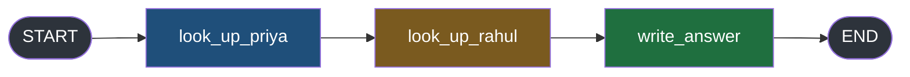
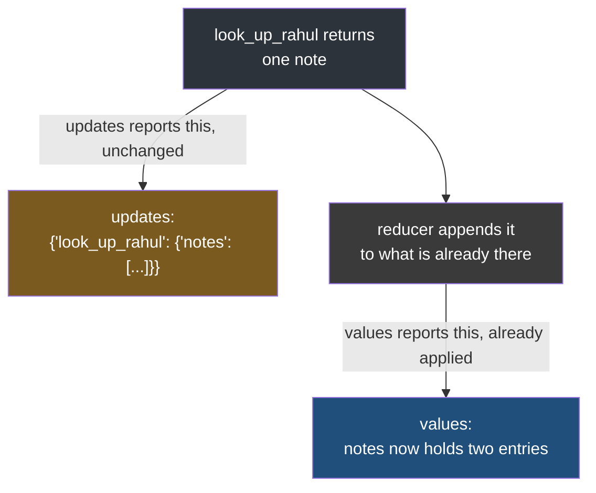
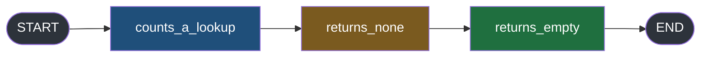
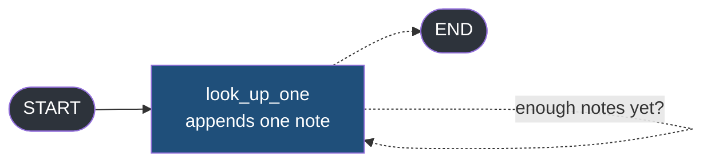
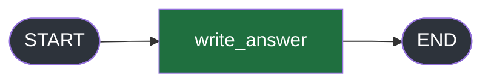

#langgraph #graphs #state #lab

**Two modes look at the same run and hand you different things, and the temptation is to call one of them the detailed version of the other.** They are not a pair of resolutions. They answer two different questions, and there are runs where they flatly contradict each other on the same key at the same instant.

# values And updates

> [!info] `values` tells you what is true now. `updates` tells you what a node just did. Those are the same sentence only while nothing in the state accumulates — and the moment something does, one of them says one note and the other says two.

## The graph this note runs on

A reception desk taking one question — compare Priya and Rahul's leave — and building an answer out of two lookups. Three nodes in a line, each adding a note to a list.



`src/langgraph_lab/note02/a_desk_graph.py`:

```python
import operator
from typing import Annotated, TypedDict

from langgraph.graph import END, START, StateGraph


class DeskState(TypedDict):
    asked_by: str
    notes: Annotated[list[str], operator.add]


class DeskUpdate(TypedDict, total=False):
    asked_by: str
    notes: list[str]


def look_up_priya(state: DeskState) -> DeskUpdate:
    return {"notes": ["Priya has 12 days left"]}


def look_up_rahul(state: DeskState) -> DeskUpdate:
    return {"notes": ["Rahul has 5 days left"]}


def write_answer(state: DeskState) -> DeskUpdate:
    return {"notes": [f"answered using {len(state['notes'])} lookups"]}


builder = StateGraph(DeskState)  # ty: ignore[invalid-argument-type]
builder.add_node("look_up_priya", look_up_priya)
builder.add_node("look_up_rahul", look_up_rahul)
builder.add_node("write_answer", write_answer)
builder.add_edge(START, "look_up_priya")
builder.add_edge("look_up_priya", "look_up_rahul")
builder.add_edge("look_up_rahul", "write_answer")
builder.add_edge("write_answer", END)
graph = builder.compile()

START_STATE: DeskState = {"asked_by": "reception", "notes": []}
```

One line in there is new and everything in this note depends on it:

```python
notes: Annotated[list[str], operator.add]
```

That annotation tells the graph **how to combine what a node returns with what is already there**. For this key, add them — and adding two lists appends one to the other. Without it, each node's `notes` would replace the previous one. That is the whole of what it needs to mean here.

---

## What each one hands you

`src/langgraph_lab/note02/b_the_two_shapes.py`:

```python
from langgraph_lab.note02.a_desk_graph import START_STATE, graph

if __name__ == "__main__":
    print("--- stream_mode='values'")
    for item in graph.stream(START_STATE, stream_mode="values"):
        print("   ", item)

    print("\n--- stream_mode='updates'")
    for item in graph.stream(START_STATE, stream_mode="updates"):
        print("   ", item)
```

```
--- stream_mode='values'
    {'asked_by': 'reception', 'notes': []}
    {'asked_by': 'reception', 'notes': ['Priya has 12 days left']}
    {'asked_by': 'reception', 'notes': ['Priya has 12 days left', 'Rahul has 5 days left']}
    {'asked_by': 'reception', 'notes': ['Priya has 12 days left', 'Rahul has 5 days left', 'answered using 2 lookups']}

--- stream_mode='updates'
    {'look_up_priya': {'notes': ['Priya has 12 days left']}}
    {'look_up_rahul': {'notes': ['Rahul has 5 days left']}}
    {'write_answer': {'notes': ['answered using 2 lookups']}}
```

**`values` is a stack of snapshots.** Each item is the entire state, complete and correct at that moment, and `asked_by` rides along in all four even though no node has ever touched it.

**`updates` is a stack of receipts.** Each item names the node that produced it and carries only what that node handed back. Nothing else in the state appears.

---

## The same key, two different values

Ask for both modes at once and the disagreement is unmissable.

`src/langgraph_lab/note02/c_they_disagree.py`:

```python
from langgraph_lab.note02.a_desk_graph import START_STATE, graph

if __name__ == "__main__":
    for mode, data in graph.stream(START_STATE, stream_mode=["updates", "values"]):
        print(f"{mode:8} {data}")
```

```
values   {'asked_by': 'reception', 'notes': []}
updates  {'look_up_priya': {'notes': ['Priya has 12 days left']}}
values   {'asked_by': 'reception', 'notes': ['Priya has 12 days left']}
updates  {'look_up_rahul': {'notes': ['Rahul has 5 days left']}}
values   {'asked_by': 'reception', 'notes': ['Priya has 12 days left', 'Rahul has 5 days left']}
updates  {'write_answer': {'notes': ['answered using 2 lookups']}}
values   {'asked_by': 'reception', 'notes': ['Priya has 12 days left', 'Rahul has 5 days left', 'answered using 2 lookups']}
```

Look at the middle pair, two lines apart, describing the same instant:

| | `notes` holds |
|---|---|
| `updates` from `look_up_rahul` | **one** note — `['Rahul has 5 days left']` |
| `values` right after it | **two** notes — Priya's and Rahul's |

Both are correct. `look_up_rahul` really did return a single note; the state really does hold two. The reducer sits between them, and everything it does is invisible to `updates` and already applied in `values`.

> [!question] So which one is the real `notes`?
> Neither, and that is the point. `updates` is what a node **intended**. `values` is what the graph **decided** as a result. A reducer is precisely the thing that makes those two different, and any key without one hides the distinction by making them agree.

That is the entire difference between the modes, and it survives everything else in this note:



---

## A node that returns nothing

Not every node changes the state. A guard that checks something, a node that only logs, a branch that decided there was nothing to do.



`src/langgraph_lab/note02/d_nothing_returned.py`:

```python
from typing import TypedDict

from langgraph.graph import END, START, StateGraph


class DeskState(TypedDict):
    asked_by: str
    lookups: int


class DeskUpdate(TypedDict, total=False):
    asked_by: str
    lookups: int


def counts_a_lookup(state: DeskState) -> DeskUpdate:
    return {"lookups": state["lookups"] + 1}


def returns_none(state: DeskState) -> None:
    return None


def returns_empty(state: DeskState) -> DeskUpdate:
    return {}


builder = StateGraph(DeskState)  # ty: ignore[invalid-argument-type]
builder.add_node("counts_a_lookup", counts_a_lookup)
builder.add_node("returns_none", returns_none)
builder.add_node("returns_empty", returns_empty)
builder.add_edge(START, "counts_a_lookup")
builder.add_edge("counts_a_lookup", "returns_none")
builder.add_edge("returns_none", "returns_empty")
builder.add_edge("returns_empty", END)
graph = builder.compile()

START_STATE: DeskState = {"asked_by": "reception", "lookups": 0}


if __name__ == "__main__":
    items = list(graph.stream(START_STATE, stream_mode="updates"))
    print(f"--- stream_mode='updates'   {len(items)} items for 3 nodes")
    for item in items:
        print("   ", item)

    items = list(graph.stream(START_STATE, stream_mode="values"))
    print(f"\n--- stream_mode='values'   {len(items)} items for 3 nodes")
    for item in items:
        print("   ", item)
```

```
--- stream_mode='updates'   3 items for 3 nodes
    {'counts_a_lookup': {'lookups': 1}}
    {'returns_none': None}
    {'returns_empty': None}

--- stream_mode='values'   2 items for 3 nodes
    {'asked_by': 'reception', 'lookups': 0}
    {'asked_by': 'reception', 'lookups': 1}
```

> [!tip]- Why `list(graph.stream(...))` instead of just looping
> `graph.stream(...)` is a generator — it can only be walked once. This code needs it twice: once for `len(items)` in the printed header, once for the `for item in items` loop after it. Wrapping it in `list()` up front materializes it so both uses see the same items, rather than calling `stream` twice or losing the count to a one-pass loop.

**Three `updates` items for three nodes.** A node that returned nothing still gets an item — the series follows the nodes, not the changes.

**Two `values` items for three nodes.** The last two steps wrote nothing, so no snapshot was published. The series follows the changes, not the nodes.

> [!bug] The payload is `None`, and `{}` becomes `None` too
> `returns_none` and `returns_empty` produce identical items. So a consumer written as `for node, payload in item.items(): payload["notes"]` raises `TypeError` on both, and it will not do so until the first time a guard node runs — which in a graph with a rarely-taken branch can be weeks after deploy.

So the two counts only track each other while every step happens to write. That is true of every example in note 1, which is exactly why it was invisible there.

---

## The snapshot grows, and it grows faster than the run

To find out what changed between two `values` items, you have to compare them yourself. The graph will not tell you, because as far as `values` is concerned nothing changed — there is only what is true now.

That is the annoyance. The cost is the second half, and it is worth measuring rather than guessing at.

### The measuring graph

One node that appends a note and loops back to itself — the same shape as note 1, so the only genuinely new thing is what it appends.



`src/langgraph_lab/note02/e_values_grows.py`:

```python
import json
import operator
from typing import Annotated, TypedDict

from langgraph.graph import END, START, StateGraph
from langgraph.types import StreamMode


class DeskState(TypedDict):
    asked_by: str
    lookups_wanted: int
    notes: Annotated[list[str], operator.add]


class DeskUpdate(TypedDict, total=False):
    asked_by: str
    lookups_wanted: int
    notes: list[str]


def look_up_one(state: DeskState) -> DeskUpdate:
    return {"notes": [f"lookup {len(state['notes']):02d} returned a result"]}


def should_continue(state: DeskState) -> str:
    return "look_up_one" if len(state["notes"]) < state["lookups_wanted"] else END


builder = StateGraph(DeskState)  # ty: ignore[invalid-argument-type]
builder.add_node("look_up_one", look_up_one)
builder.add_edge(START, "look_up_one")
builder.add_conditional_edges("look_up_one", should_continue, ["look_up_one", END])
graph = builder.compile()


def bytes_streamed(mode: StreamMode, lookups: int) -> int:
    start: DeskState = {"asked_by": "reception", "lookups_wanted": lookups, "notes": []}
    total = 0
    for item in graph.stream(start, stream_mode=mode):
        total += len(json.dumps(item))
    return total


if __name__ == "__main__":
    print(f"{'lookups':>8} {'updates':>10} {'values':>10} {'ratio':>7}")
    for lookups in (3, 10, 20, 40):
        sent_updates = bytes_streamed("updates", lookups)
        sent_values = bytes_streamed("values", lookups)
        ratio = sent_values / sent_updates
        print(f"{lookups:>8} {sent_updates:>10,} {sent_values:>10,} {ratio:>6.1f}x")
```

### Reading it

**`lookups_wanted` is a state key nobody writes.** Every node reads it, no node returns it, so it sits in the state untouched from start to finish. `should_continue` compares `len(state["notes"])` against it, which means **how many laps to run arrives in the input** rather than being fixed in the file. That is what lets one compiled graph answer for 3 lookups and for 40 without being rebuilt, and it is why the loop at the bottom passes a number rather than building a new graph each time.

**`bytes_streamed` runs the graph and adds up what came out.** `json.dumps(item)` turns one streamed item into the text a server would actually put on the wire, and `len` counts its characters. Summing across the whole loop gives the total a client would have had to receive for that run.

**`StreamMode` is LangGraph's own type for the seven mode names.** Annotating that parameter as `str` reads fine and is wrong, because `stream` accepts seven specific strings rather than any string. `ty` rejects it:

```
error[invalid-argument-type]: Argument to bound method `Pregel.stream` is incorrect
   |
39 |     return sum(len(json.dumps(item)) for item in graph.stream(start, stream_mode=mode))
   |                                                                      ^^^^^^^^^^^^^^^^
   |  Expected `Literal["values", "updates", "checkpoints", "tasks", "debug", "messages",
   |  "custom"] | Sequence[...] | None`, found `str`
```

Importing `StreamMode` and using it fixes the annotation and documents the closed set at the same time.

### The measurement

```
 lookups    updates     values   ratio
       3        177        416    2.4x
      10        590      2,345    4.0x
      20      1,180      7,730    6.6x
      40      2,360     27,800   11.8x
```

Read the bottom two rows together, because they are the whole finding. **Doubling the run from 20 lookups to 40 doubles `updates` and quadruples `values`** — 1,180 to 2,360 is exactly 2.0 times, and 7,730 to 27,800 is 3.6 times.

### Why

Stop counting bytes and count notes instead.

| | `updates` carries | `values` carries |
|---|---|---|
| 1st item | 1 note | 1 note |
| 2nd item | 1 note | 2 notes |
| 3rd item | 1 note | 3 notes |
| … | … | … |
| 40th item | 1 note | 40 notes |
| **total sent** | **40 notes** | **820 notes** |

Every `updates` item carries one node's contribution and nothing else, so the total is one note per lookup. Every `values` item carries the complete list, so the fortieth item re-sends the thirty-nine notes that the previous items already delivered. Adding 1 + 2 + 3 up to 40 gives 820.

That is why the ratio in the table has no ceiling. It is not a constant overhead you can budget for once — it climbs with the length of the run, so the longer a turn goes on, the worse the choice gets.

> [!important] The accumulating key is usually the conversation
> In a real agent the appending list is the message history. So `values` re-transmits the entire conversation on every step, and a turn that runs twenty laps sends the first message twenty times. The cost is invisible in a three-node example and is the whole bill in a long one.

---

## Neither mode goes inside a node

Both modes fire when a node **finishes**. Nothing about how long it took, or what it was doing, reaches either of them.



`src/langgraph_lab/note02/f_the_node_is_the_floor.py` builds a sentence a word at a time, printing from inside so the interior is visible:

```python
import time
from typing import TypedDict

from langgraph.graph import END, START, StateGraph

SENTENCE = ["Priya ", "has ", "twelve ", "days ", "of ", "leave."]


class DeskState(TypedDict):
    asked_by: str
    answer: str


class DeskUpdate(TypedDict, total=False):
    asked_by: str
    answer: str


def write_answer(state: DeskState) -> DeskUpdate:
    answer = ""
    started = time.monotonic()
    for word in SENTENCE:
        time.sleep(0.5)
        answer += word
        print(f"    [inside the node] {time.monotonic() - started:5.2f}s  {answer!r}")
    return {"answer": answer}


builder = StateGraph(DeskState)  # ty: ignore[invalid-argument-type]
builder.add_node("write_answer", write_answer)
builder.add_edge(START, "write_answer")
builder.add_edge("write_answer", END)
graph = builder.compile()

START_STATE: DeskState = {"asked_by": "reception", "answer": ""}


if __name__ == "__main__":
    started = time.monotonic()
    for mode, data in graph.stream(START_STATE, stream_mode=["updates", "values"]):
        print(f"{time.monotonic() - started:5.2f}s  {mode:8} {data}")
```

```
 0.00s  values   {'asked_by': 'reception', 'answer': ''}
    [inside the node]  0.51s  'Priya '
    [inside the node]  1.01s  'Priya has '
    [inside the node]  1.52s  'Priya has twelve '
    [inside the node]  2.02s  'Priya has twelve days '
    [inside the node]  2.52s  'Priya has twelve days of '
    [inside the node]  3.03s  'Priya has twelve days of leave.'
 3.03s  updates  {'write_answer': {'answer': 'Priya has twelve days of leave.'}}
 3.03s  values   {'asked_by': 'reception', 'answer': 'Priya has twelve days of leave.'}
```

Six intermediate answers existed, half a second apart, each one a complete and sensible prefix. **The stream carried none of them.** The indented lines are `print` calls; delete them and three seconds pass with nothing between the first item and the last.

> An agent built on `updates` alone delivers a **finished paragraph in one go after a long pause** — because the node is the finest grain either mode can see, and **a node that calls a model does not finish until the model has finished.**

> [!important] The floor is the node, and it is not low enough
> Anything more frequent than one item per node has to come from somewhere else — either the node saying so itself, or the model's own output being intercepted. Those are two different mechanisms and each gets its own note.

---

## Which one your screen wants

| | `values` | `updates` |
|---|---|---|
| Carries | the whole state | only what one node returned |
| Size per item | grows with the run | flat |
| Says what changed | no, you diff it yourself | **yes** |
| Says what is true now | **yes** | no, not once a reducer is involved |
| Fires when | a step **wrote** something | any node **returned** |
| Names the node | no | **yes** |
| Suits | a screen that re-renders from state | a screen that reacts to what happened |

The choice is not really about data. It is about which of the two questions your interface is built to ask. A view that redraws itself from whatever the state currently is wants `values` and does not care what changed. A view that appends a line saying looked up Priya wants `updates` and cannot get the node name from `values` at all.

And they are not exclusive — note 1 established that asking for both costs nothing except the item type. In practice most systems take `updates` for the events and reach for `values` only where the accumulated total is genuinely what the screen needs.

---

## `stream` or `astream` makes no difference here

Worth settling before it becomes a background worry, because it changes nothing in this note.

`src/langgraph_lab/note02/g_stream_or_astream.py`:

```python
import asyncio

from langgraph_lab.note02.a_desk_graph import START_STATE, graph


async def collect_async() -> list[object]:
    return [item async for item in graph.astream(START_STATE, stream_mode=["updates", "values"])]


if __name__ == "__main__":
    from_stream = list(graph.stream(START_STATE, stream_mode=["updates", "values"]))
    from_astream = asyncio.run(collect_async())

    print(f"stream  gave {len(from_stream)} items")
    print(f"astream gave {len(from_astream)} items")
    print(f"identical: {from_stream == from_astream}")
```

```
stream  gave 7 items
astream gave 7 items
identical: True
```

Same items, same order, same values. The timings match too, including on a graph with parallel nodes — `astream` running ordinary synchronous node functions still executes them at the same time, because those go to a thread pool rather than the event loop.

> [!tip] Async is not what buys you concurrency
> A graph of plain `def` nodes parallelises under both. What async actually decides arrives later, when a node calls a model: whether the model produces the incremental output that a different mode exists to intercept. Until then, either call works.
