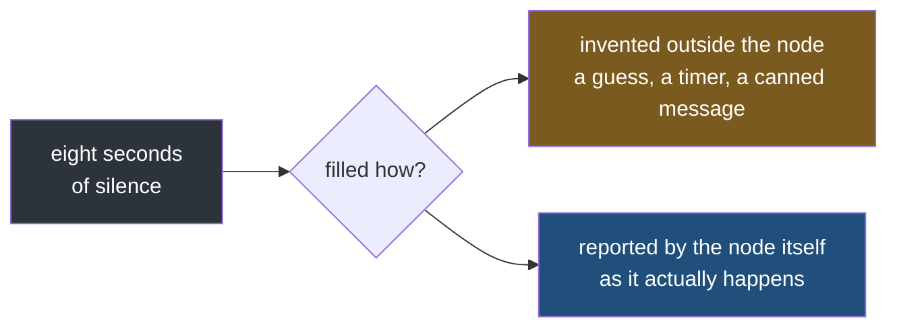
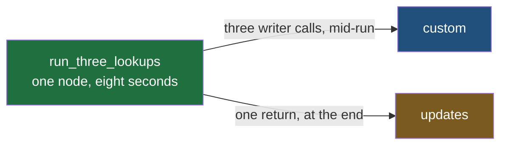
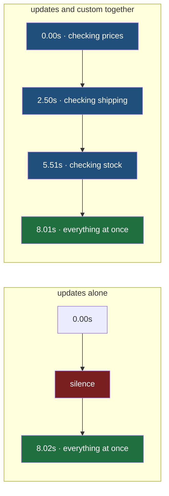
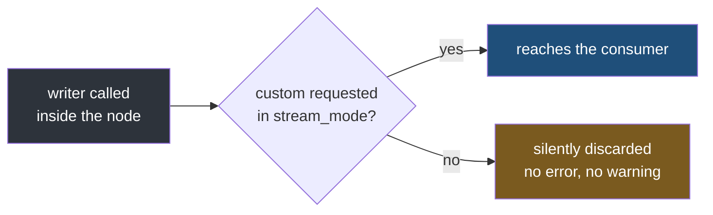

#langgraph #graphs #streaming #lab

**A node either returns or it doesn't — streaming has no way to describe what happens while one is still running.** Everything in this note is about closing that gap without lying about it.

# custom, The Channel You Control

> [!info] Every mode covered so far reports what a node **produced**. `custom` is the one channel a node can write to **before** it has produced anything at all.

## The floor, proven in note 2

**Not new.** Note 2's section on how neither mode goes inside a node already showed it: `write_answer` printed six intermediate strings from inside itself, half a second apart, and neither `updates` nor `values` produced a single item until the function's `return` executed. Three seconds of real work, three seconds of total silence, then one item carrying everything at once.

Restated as a rule: a mode fires exactly once per node per step, and it fires at the moment the function hands control back — never before, and never partway through.

## Break it: the toy sleep becomes a real call

`time.sleep(0.5)` six times was a lab prop. Put something real inside that gap and the same fact stops being harmless.

One node, three sequential API calls, because the third depends on what the second returns — pricing, then shipping, then a stock check.

| Elapsed | What the node is doing | What the stream shows |
|---|---|---|
| 0.0s | calling the pricing API | nothing |
| 2.5s | pricing returned, calling the shipping API | nothing |
| 5.5s | shipping returned, calling the stock API | nothing |
| 8.0s | stock returned, node returns everything at once | one item, all three results |

Those are the timings the lab graph further down actually produces — the three calls take 2.5, 3.0 and 2.5 seconds, and the single stream item lands at 8.02s.

Eight seconds, three calls, and from outside `stream()` this is indistinguishable from a node that has hung. That is the break — the floor above was a fact about a lab graph; this is the same fact with a user staring at a frozen spinner for eight seconds.

## The gap gets filled somehow

The node's silence for those eight seconds is not optional — the floor and the break above settled that. But a product still has to put something on screen, because a spinner that never moves reads as broken even when the request behind it is healthy.

Since the node isn't saying anything true during that time, whatever fills the gap has to come from somewhere else:



This note is about which branch `custom` sits on. Before getting there, it is worth seeing what the other branch actually looks like, because it is the one most systems reach for first.

## Guessing from tool names

The shape the **invented outside the node** branch almost always takes: a lookup table from tool or node name to a canned status string.

```python
STATUS_FOR_TOOL = {
    "search_flights": "Searching flights...",
    "check_pricing": "Checking prices...",
    "check_stock": "Checking stock...",
}
```

The streaming layer does not know what the node is doing. It knows which node is about to run, and prints a sentence that is usually true. Usually is the tell — the mapping is guessed once, at write time, by whoever built the UI, not reported live by the code doing the work.

> [!failure] Why the guess breaks
> It cannot say 2 of 3 calls done, because the table has no notion of progress within a node. It cannot surface an error mid-call, because nothing fires until the node returns. And it goes stale the moment the node's real behaviour changes while its name does not — a `search_flights` node that grows a fourth internal step still just says Searching flights... for the whole eight seconds, because the table was never told anything actually changed.

What is missing is a way for the node to say what it is doing, from inside, as it happens.

## The fix: a writer that emits mid-node

Same shape as note 2's floor graph — one node, nothing else — because the point is what changes inside it, not the graph around it.

The change is not to the graph. It is that the node grows a **second exit**.



Everything before this note used the bottom arrow only. `return` is a node's one exit, it fires once, and it fires last. The writer is a second door that opens as often as the node likes, whenever the node likes, while the first one is still shut.

`src/langgraph_lab/note03/a_writer_emits_midnode.py`:

```python
import time
from typing import TypedDict

from langgraph.config import get_stream_writer
from langgraph.graph import END, START, StateGraph

CALLS = (
    ("pricing", "Checking prices...", 2.5),
    ("shipping", "Checking shipping...", 3.0),
    ("stock", "Checking stock...", 2.5),
)


class DeskState(TypedDict):
    asked_by: str
    results: list[str]


class DeskUpdate(TypedDict, total=False):
    asked_by: str
    results: list[str]


def run_three_lookups(state: DeskState) -> DeskUpdate:
    writer = get_stream_writer()
    started = time.monotonic()
    results = []
    for name, status, seconds in CALLS:
        writer({"status": status})
        time.sleep(seconds)
        results.append(f"{name} done at {time.monotonic() - started:.1f}s")
    return {"results": results}


builder = StateGraph(DeskState)  # ty: ignore[invalid-argument-type]
builder.add_node("run_three_lookups", run_three_lookups)
builder.add_edge(START, "run_three_lookups")
builder.add_edge("run_three_lookups", END)
graph = builder.compile()

START_STATE: DeskState = {"asked_by": "reception", "results": []}


if __name__ == "__main__":
    print("--- stream_mode='updates' only")
    started = time.monotonic()
    for item in graph.stream(START_STATE, stream_mode="updates"):
        print(f"{time.monotonic() - started:5.2f}s  {item}")

    print("\n--- stream_mode=['updates', 'custom']")
    started = time.monotonic()
    for mode, data in graph.stream(START_STATE, stream_mode=["updates", "custom"]):
        print(f"{time.monotonic() - started:5.2f}s  {mode:8} {data}")
```

```
--- stream_mode='updates' only
 8.02s  {'run_three_lookups': {'results': ['pricing done at 2.5s', 'shipping done at 5.5s', 'stock done at 8.0s']}}

--- stream_mode=['updates', 'custom']
 0.00s  custom   {'status': 'Checking prices...'}
 2.50s  custom   {'status': 'Checking shipping...'}
 5.51s  custom   {'status': 'Checking stock...'}
 8.01s  updates  {'run_three_lookups': {'results': ['pricing done at 2.5s', 'shipping done at 5.5s', 'stock done at 8.0s']}}
```

**The first run reproduces the break exactly, timings included** — one item, at 8.02s, everything at once.

**The second adds `custom` to the same call, on the same node, with no other change.** Three more items appear, at 0.00s, 2.50s and 5.51s: before pricing has even finished, then before shipping, then before stock. The node has not returned. It is still inside the `for` loop. And the stream is no longer silent.



The green box is identical in both rows. Nothing was made faster and nothing was made earlier — the eight seconds are still eight seconds, and the answer still lands at the end. What changed is that the silence in between now has three true statements in it.

**`get_stream_writer()` does not emit anything.** It hands back a plain function. Two separate steps, and only the second one puts something on the stream:

```python
writer = get_stream_writer()        # once, at the top — hands back a function
writer({"status": status})          # as often as you like — this is what emits
```

Inside the loop, two lines sit next to each other doing completely unrelated jobs.

| | `results.append(...)` | `writer({"status": ...})` |
|---|---|---|
| Builds | the node's real answer | nothing at all |
| Leaves the node by | `return`, once, at the end | the stream, immediately |
| Arrives tagged | `updates` | `custom` |
| Delete the line and | the answer is wrong | **the answer is identical** |

That last row is the whole relationship. **`custom` is commentary running alongside the work, never part of it.**

> [!question] Which channel does the actual answer travel on?
> `updates`, always. `custom` never carries the result — delete every `writer` call and the node computes and returns exactly the same thing. That is what makes a writer safe to add to a node that already works, and it is also why a consumer must never try to rebuild the answer out of `custom` items.

So `custom` is additive, the same way any two modes are additive — note 1 already established that requesting a new mode never changes what an existing one yields.

The gap named above is closed, and closed truthfully: every `custom` item corresponds to a real moment the node actually reached, not a guess made before the node ran.

## Reported, not guessed

Set the two status strings side by side and the shift is exact.

**`STATUS_FOR_TOOL["check_pricing"]`** was written by whoever built the streaming layer, before the node ever ran, based on nothing but the node's name. A guess made from outside, by someone who could not see in.

**`writer({"status": "Checking prices..."})`** was written by whoever wrote `run_three_lookups`, sitting on the exact line where the pricing call happens.

Nobody upstream has to infer from a name that pricing probably takes a few seconds. **The code already doing the work says what it is doing, at the moment it is doing it** — because it is the only thing in the system that actually knows.

| | `STATUS_FOR_TOOL[...]` | `writer({"status": ...})` |
|---|---|---|
| Decided by | whoever built the streaming layer | whoever wrote the node |
| Decided when | before the node ever runs | at the exact line where it becomes true |
| Based on | the node's name | what the node is actually doing |
| Can it be wrong | yes, whenever the guess does not match reality | no — it only exists because that line executed |

## Three modes, three different moments

With `custom` in hand, the modes covered so far divide cleanly by **when** they fire rather than by what they carry.

| Mode | Reports | Fires |
|---|---|---|
| `values` | the whole state | after a step in which something was written |
| `updates` | what one node returned | the moment that node returns |
| `custom` | whatever a node chooses to say | the instant the node says it |

The first two are decided by the framework — a node cannot make `updates` fire twice, or make `values` skip a step. The third is decided entirely by the node, which is the only one of the three where the timing is a design choice rather than a consequence.

---

## No schema, on purpose

`{"status": ...}` was a reasonable shape for this graph. **Nothing in `get_stream_writer()` requires it.** The function sends whatever object it is handed, exactly as given, onto the `custom` channel — `{"progress": 40}`, `{"msg": "almost there"}`, a bare string, a list, a bare integer. There is no `CustomEvent` class to construct and no fields it checks for first.

**That freedom cuts both ways.** Adding a new kind of status costs nothing — call `writer(...)` with whatever makes sense for that node, no schema to register anywhere first. But nothing enforces a shape, so nothing stops two nodes disagreeing about what the same kind of update is called:

| Node | What it sends | Key a consumer must check for |
|---|---|---|
| `run_three_lookups` | `{"status": "Checking prices..."}` | `status` |
| a sibling node, written later | `{"stage": "Checking prices..."}` | `stage` |

> [!bug] Neither node is wrong, and the consumer still breaks
> Both payloads are valid `custom` items — `get_stream_writer()` accepted both without complaint. A consumer written against the first node reads `item["status"]` and gets a `KeyError` the first time the second node's item arrives, because the channel never promised which key would be there. Every consumer of `custom` has to check what actually showed up rather than trust a contract, because the channel does not have one to offer.

## Requested, or it never happened

`writer(...)` looks like it always fires once called. It does not — it only reaches a consumer whose `stream_mode` actually includes `"custom"`.



No new graph is needed — the same three-lookup node from above, streamed twice, with nothing different but the mode list.

`src/langgraph_lab/note03/b_writer_needs_the_mode.py`:

```python
from langgraph_lab.note03.a_writer_emits_midnode import START_STATE, graph

if __name__ == "__main__":
    print("--- stream_mode='updates', with 'custom' left off the list")
    for item in graph.stream(START_STATE, stream_mode="updates"):
        print("   ", item)
    print("    node finished, nothing raised, no custom item ever arrived")

    print("\n--- stream_mode=['updates', 'custom'], same graph, same writer calls")
    for mode, data in graph.stream(START_STATE, stream_mode=["updates", "custom"]):
        print(f"    {mode:8} {data}")
```

```
--- stream_mode='updates', with 'custom' left off the list
    {'run_three_lookups': {'results': ['pricing done at 2.5s', 'shipping done at 5.5s', 'stock done at 8.0s']}}
    node finished, nothing raised, no custom item ever arrived

--- stream_mode=['updates', 'custom'], same graph, same writer calls
    custom   {'status': 'Checking prices...'}
    custom   {'status': 'Checking shipping...'}
    custom   {'status': 'Checking stock...'}
    updates  {'run_three_lookups': {'results': ['pricing done at 2.5s', 'shipping done at 5.5s', 'stock done at 8.0s']}}
```

**The graph object is literally the same object.** Not a copy, not a rebuild — imported from the file above and streamed twice. The three `writer` calls still execute, still return, still raise nothing. The only thing that changed is an argument the **caller** passed, and in the first run those three status updates never existed as far as the consumer is concerned.

> [!bug] The bug is in a different file from the symptom
> The node's code is correct and stays correct. What is wrong is a `stream_mode` list one entry short, somewhere in the transport layer — and nothing fails, so there is no stack trace pointing anywhere. A reviewer reading the node sees working code, and a reviewer reading the caller sees a plausible mode list. The two are only wrong together.

## Where a status vocabulary belongs

The payload has no schema, but most products still want a small fixed set of recognisable statuses — `"fetching"`, `"retrying"`, `"done"` — rather than free-form prose, so a UI can switch on what arrived. **Nothing about `custom` enforces that set.** The channel accepts anything, exactly as shown above.

So a closed vocabulary has to be enforced by whoever writes the `writer(...)` calls, **inside the nodes** — because a node is the only code with the standing to say a given status is true right now.

A lookup table outside the graph, mapping node names to guessed strings, fails here for the same reason it failed at the start of this note: it cannot know, it can only guess. **Both fixes are the same fix — put the decision where the work happens.**

| | Guessed outside the node | Reported inside the node |
|---|---|---|
| Knows real progress | no | **yes** |
| Can say 2 of 3 done | no | **yes** |
| Survives the node's behaviour changing | no, goes stale silently | **yes**, updates with the code |
| Requires `custom` in `stream_mode` to be seen | not applicable — this is not `custom` | **yes** |
| Correct home for a status vocabulary | no | **yes** |
