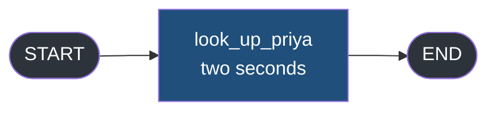
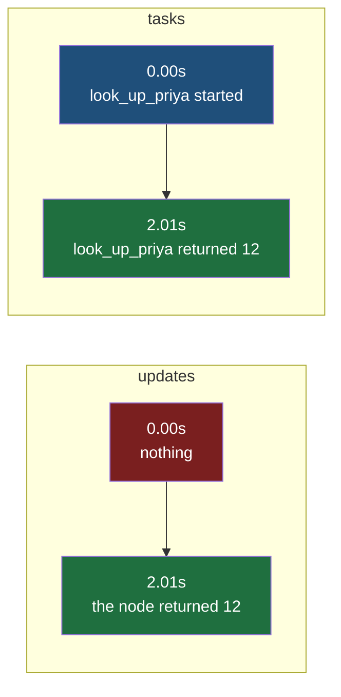
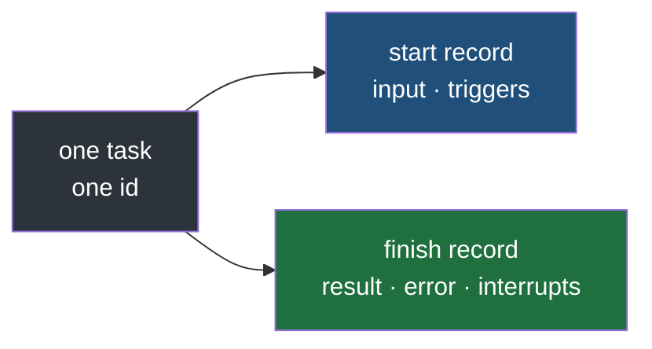
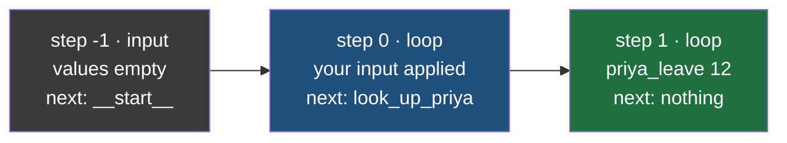
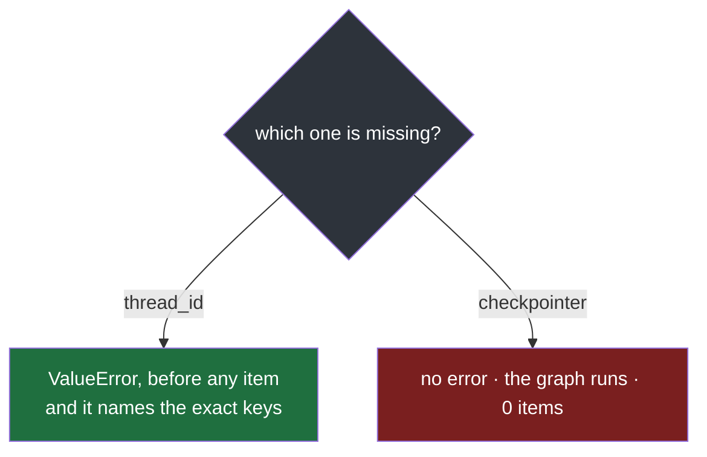
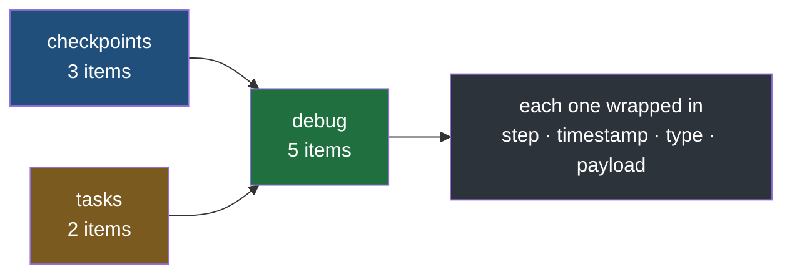

#langgraph #graphs #streaming #lab

**Three modes so far, and every one of them waits for a node to produce something.** A node that is running right now, and has produced nothing yet, does not exist as far as any of them are concerned.

# tasks, checkpoints And debug

> [!info] `tasks` does not report a node's output. It reports the **node** — one record when it starts, another when it ends — so a node that takes two seconds is visible at both ends of those two seconds instead of only at the far one.

## Every mode so far waits for output

| Mode | Fires | Needs the node to have |
|---|---|---|
| `updates` | the node returns | finished |
| `values` | the step commits | finished |
| `custom` | the node calls `writer` | reached that line, and chosen to say so |

The previous note looked like it broke that pattern, and it half did. `custom` does get inside a running node — but only because the node's author put a line there. **A node with no `writer` call in it is exactly as silent as it was two notes ago**, and nothing so far can report a node that has not been written to describe itself.

## The same node, two modes

One node, two seconds of work, the same graph streamed twice with nothing changed but the mode.



`src/langgraph_lab/note04/a_fires_twice.py`:

```python
import time
from typing import Any, TypedDict

from langgraph.graph import END, START, StateGraph


class DeskState(TypedDict):
    asked_by: str
    priya_leave: int


class DeskUpdate(TypedDict, total=False):
    asked_by: str
    priya_leave: int


def look_up_priya(state: DeskState) -> DeskUpdate:
    time.sleep(2.0)
    return {"priya_leave": 12}


builder = StateGraph(DeskState)  # ty: ignore[invalid-argument-type]
builder.add_node("look_up_priya", look_up_priya)
builder.add_edge(START, "look_up_priya")
builder.add_edge("look_up_priya", END)
graph = builder.compile()


def short_id(item: Any) -> dict[str, Any]:
    readable = dict(item)
    readable["id"] = readable["id"][:8]
    return readable

START_STATE: DeskState = {"asked_by": "reception", "priya_leave": 0}


if __name__ == "__main__":
    print("--- stream_mode='updates'")
    started = time.monotonic()
    for item in graph.stream(START_STATE, stream_mode="updates"):
        print(f"{time.monotonic() - started:5.2f}s  {item}")

    print("\n--- stream_mode='tasks'")
    started = time.monotonic()
    for item in graph.stream(START_STATE, stream_mode="tasks"):
        print(f"{time.monotonic() - started:5.2f}s  {short_id(item)}")
```

```
--- stream_mode='updates'
 2.01s  {'look_up_priya': {'priya_leave': 12}}

--- stream_mode='tasks'
 0.00s  {'id': 'e58401c3', 'name': 'look_up_priya', 'input': {'asked_by': 'reception', 'priya_leave': 0}, 'triggers': ('branch:to:look_up_priya',)}
 2.01s  {'id': 'e58401c3', 'name': 'look_up_priya', 'error': None, 'result': {'priya_leave': 12}, 'interrupts': []}
```

**One node, one item under `updates`, two under `tasks`.** The extra one is not extra detail about the finish — it lands at 0.00s, two full seconds before the node has done anything at all.



The green boxes are the same event reported twice, once per mode. The blue box is the thing no mode before this one could produce: **a report that something is underway, emitted by the framework, with nothing in the node written to make it happen.**

## Two records, not one shape

Set the two items side by side and the interesting part is not what the second one adds. It is what the first one has and the second one does not.

| Key | First item, at 0.00s | Second item, at 2.01s |
|---|---|---|
| `id` | present | **the same value** |
| `name` | `look_up_priya` | `look_up_priya` |
| `input` | the state the node was handed | absent |
| `triggers` | what caused it to run | absent |
| `result` | absent | what the node returned |
| `error` | absent | `None` |
| `interrupts` | absent | `[]` |

**This is not one shape with some fields left empty.** They are two different records describing one task from two ends, and `id` is the only thing that joins them.



> [!bug] A consumer cannot just read `item["result"]`
> **Half the items on this channel do not have that key.** Written against the finish record alone, `item["result"]` raises `KeyError` on the very first thing the mode ever yields — before the loop has printed anything at all.
>
> The same mistake was available in note 2, and it behaved nothing like this:
>
> | | note 2's `TypeError` | this `KeyError` |
> |---|---|---|
> | Caused by | a guard node returning nothing | the start record having no `result` |
> | First happens | whenever that branch is finally taken | first item, first run, every time |
> | So you find out | possibly weeks after deploy | before you have finished writing the loop |
>
> **This is the lucky version.** A bug that fires on the first item of the first run never reaches production. A consumer of `tasks` has to decide which record it is holding before reading anything out of it, and the channel makes you find that out immediately.

## Asking before reading

Both halves in one file — the loop that crashes, then the loop that does not.

`src/langgraph_lab/note04/b_two_records.py`:

```python
from langgraph_lab.note04.a_fires_twice import START_STATE, graph

if __name__ == "__main__":
    print("--- reading every item as if it were a finish record")
    try:
        for item in graph.stream(START_STATE, stream_mode="tasks"):
            print(f"    {item['name']} produced {item['result']}")
    except KeyError as exc:
        print(f"    KeyError: {exc}, and nothing was printed before it")

    print("\n--- asking which record arrived, then reading it")
    for item in graph.stream(START_STATE, stream_mode="tasks"):
        if "result" in item:
            print(f"    {item['name']} finished with {item['result']}")
        else:
            print(f"    {item['name']} started on {item['input']}")
```

```
--- reading every item as if it were a finish record
    KeyError: 'result', and nothing was printed before it

--- asking which record arrived, then reading it
    look_up_priya started on {'asked_by': 'reception', 'priya_leave': 0}
    look_up_priya finished with {'priya_leave': 12}
```

**`item['name']` is safe in both loops and `item['result']` is not.** Every record carries `name`; only one of the two carries `result`. So the check is not defensive coding around a mode that might misbehave — it is the loop admitting that two different things arrive on this channel, and reading each one for what it actually is.

**Two lines out, from one node.** That is the shape a consumer of `tasks` always has: a node is a span with two ends, and the loop that reads it has a branch in it for exactly that reason.

## What went in, not just what came out

`input` is the second thing no other mode carries, and it is the more useful of the two.

`updates` and `values` both describe a node's effect. `input` is the state that node was **handed** — the exact dictionary it read from, captured before it ran a line. **So when a node returns something wrong, the two records together answer a question no other mode can:** was it given bad input, or did it compute a bad answer from good input.

Nothing about that is available from `{'look_up_priya': {'priya_leave': 12}}`. That item says a value came out. It does not say what went in, and reconstructing it means diffing `values` snapshots and hoping no reducer sat in the way.

**`error` sits on every finish record whether or not anything went wrong.** It is `None` here because the node returned normally. What puts something in it comes later in this note, and it is the reason this mode is worth reaching for at all.

---

## The first graph in this folder that stores anything

Every graph so far was compiled bare. State existed for the length of the run and then went with it — there was nowhere for a snapshot to be kept, and nothing that could have gone back and looked at one.

`checkpoints` is the first mode that needs somewhere. Two things change, and neither is in a node:

```python
graph = builder.compile(checkpointer=InMemorySaver())
CONFIG: RunnableConfig = {"configurable": {"thread_id": "desk-1"}}
```

**`compile` grows a place to write.** `InMemorySaver` keeps checkpoints in a dictionary for the life of the process, which is enough to see the shape and useless for anything else.

**Every call now needs a `thread_id`.** A checkpointer holds many conversations at once, so a run has to say which one it belongs to. Pass the same `thread_id` twice and the second run continues where the first stopped.

What happens if you leave the checkpointer off comes next. It is not what the other modes do.

## Three checkpoints, one node

`src/langgraph_lab/note04/c_get_state.py`:

```python
from typing import TypedDict

from langchain_core.runnables import RunnableConfig
from langgraph.checkpoint.memory import InMemorySaver
from langgraph.graph import END, START, StateGraph


class DeskState(TypedDict):
    asked_by: str
    priya_leave: int


class DeskUpdate(TypedDict, total=False):
    asked_by: str
    priya_leave: int


def look_up_priya(state: DeskState) -> DeskUpdate:
    return {"priya_leave": 12}


builder = StateGraph(DeskState)  # ty: ignore[invalid-argument-type]
builder.add_node("look_up_priya", look_up_priya)
builder.add_edge(START, "look_up_priya")
builder.add_edge("look_up_priya", END)
graph = builder.compile(checkpointer=InMemorySaver())

START_STATE: DeskState = {"asked_by": "reception", "priya_leave": 0}
CONFIG: RunnableConfig = {"configurable": {"thread_id": "desk-1"}}


if __name__ == "__main__":
    print("--- stream_mode='checkpoints', one node")
    streamed = list(graph.stream(START_STATE, stream_mode="checkpoints", config=CONFIG))
    for item in streamed:
        meta = item["metadata"]
        print(f"    step {meta['step']:>2}  source={meta['source']:<6} next={item['next']}  values={item['values']}")

    last = streamed[-1]
    snapshot = graph.get_state(CONFIG)

    print("\n--- the container is not the same container")
    print(f"    from the stream: {type(last).__name__}")
    print(f"    from get_state:  {type(snapshot).__name__}")

    print("\n--- field by field, last checkpoint against get_state()")
    print(f"    values         identical: {last['values'] == snapshot.values}")
    print(f"    config         identical: {last['config'] == snapshot.config}")
    print(f"    metadata       identical: {last['metadata'] == snapshot.metadata}")
    print(f"    parent_config  identical: {last['parent_config'] == snapshot.parent_config}")
    print(f"    next           {last['next']!r} streamed, {snapshot.next!r} from get_state")
    print(f"    tasks          {last['tasks']!r} streamed, {snapshot.tasks!r} from get_state")
    print(f"    created_at     not on the streamed item, {snapshot.created_at!r} from get_state")
    print(f"    interrupts     not on the streamed item, {snapshot.interrupts!r} from get_state")
```

The first block it prints:

```
--- stream_mode='checkpoints', one node
    step -1  source=input  next=['__start__']  values={}
    step  0  source=loop   next=['look_up_priya']  values={'asked_by': 'reception', 'priya_leave': 0}
    step  1  source=loop   next=[]  values={'asked_by': 'reception', 'priya_leave': 12}
```

**Three items for one node**, where `updates` gave one and `tasks` gave two. And the numbering starts below zero.



| Step | `source` | `values`                    | What moment it is                                                                                 |
| ---- | -------- | --------------------------- | ------------------------------------------------------------------------------------------------- |
| -1   | `input`  | empty                       | **the thread exists** and your input has been recorded, but nothing has been applied to state yet |
| 0    | `loop`   | your start state            | the input is now the state, and a node has been chosen                                            |
| 1    | `loop`   | the node's result merged in | the node ran and the graph has nowhere left to go                                                 |

**These are boundaries, not nodes.** `values` mode fired twice on a graph like this because it reports a state that a step wrote. `checkpoints` fires three times because it reports every point the run could be **written down at**, and one of those exists before any node has been selected.

## `next` is the field no other mode carries

Look at what changes down the `next` column: `['__start__']`, then `['look_up_priya']`, then `[]`.

**Every other mode in this folder reports something that has already happened.** `updates` says a node returned. `values` says the state became this. `custom` says a node reached a line.

**`tasks` comes closest, and it is still the past.** A start record says a node has begun — the task was created, it is running now. Close enough to feel like a report about what is coming, and it is not one: nothing can produce a start record for a node that has not started.

`next` describes what has **not** happened. It is the list of nodes that would run if this run were picked up from this exact point, and an empty one means there is nothing left to pick up. Nothing has to be running for it to be true, and at step 1 above nothing is.

That is the whole reason the object exists in this shape — **it is not a record of the run, it is a place to restart it from.**

## Nearly the object `get_state` returns

`get_state(CONFIG)` asks the checkpointer for the **latest snapshot on a thread** — the same thing a resume reads. So the streamed item and the fetched one should be the same object, and the file above tests it rather than assuming it, field by field:

```
--- field by field, last checkpoint against get_state()
    values         identical: True
    config         identical: True
    metadata       identical: True
    parent_config  identical: True
    next           [] streamed, () from get_state
    tasks          [] streamed, () from get_state
    created_at     not on the streamed item, '2026-09-09T09:05:18.749690+00:00' from get_state
    interrupts     not on the streamed item, () from get_state
```

**Four of the eight fields are identical, including the two that matter most** — `values` is the same state and `config` is the same address, which is what makes the claim worth making at all. The other four are all different in small ways, and none of the differences is about content:

| Field | Streamed | From `get_state` | Difference |
|---|---|---|---|
| `next` | `[]` | `()` | list against tuple |
| `tasks` | `[]` | `()` | list against tuple |
| `created_at` | absent | a timestamp | the stream does not carry it |
| `interrupts` | absent | `()` | the stream does not carry it |

That accounts for the fields. **The container they arrive in is a separate difference**, and the same run reports it:

```
--- the container is not the same container
    from the stream: dict
    from get_state:  StateSnapshot
```

> [!failure] Same fields, different container, and only one of them takes a dot
> **`get_state` returns a `StateSnapshot`, so `snapshot.values` is how you read it.** A streamed checkpoint is a plain `dict`, so that same line raises `AttributeError` and the working one is `item["values"]`.
>
> Code moved between the two breaks on the access style long before it reaches a field that is genuinely missing — a resume handler reused as a stream handler, or the reverse.

So the useful version of the claim is narrower than it first sounds.

**A streamed checkpoint is the same state at the same address as the one a resume would read.** It is not the same object, it does not carry when it was written, and it hands you lists where the fetched one hands you tuples.

---

## Two things it needs, and two ways to get it wrong

The section above added a checkpointer and a `thread_id` in the same breath, as though they were one piece of setup. They are not. Take each away in turn and the two absences behave nothing alike.

`src/langgraph_lab/note04/d_setup_needs.py`:

```python
from typing import TypedDict

from langchain_core.runnables import RunnableConfig
from langgraph.checkpoint.memory import InMemorySaver
from langgraph.graph import END, START, StateGraph


class DeskState(TypedDict):
    asked_by: str
    priya_leave: int


class DeskUpdate(TypedDict, total=False):
    asked_by: str
    priya_leave: int


def look_up_priya(state: DeskState) -> DeskUpdate:
    print("        look_up_priya really ran")
    return {"priya_leave": 12}


builder = StateGraph(DeskState)  # ty: ignore[invalid-argument-type]
builder.add_node("look_up_priya", look_up_priya)
builder.add_edge(START, "look_up_priya")
builder.add_edge("look_up_priya", END)

plain = builder.compile()
saved = builder.compile(checkpointer=InMemorySaver())

START_STATE: DeskState = {"asked_by": "reception", "priya_leave": 0}
CONFIG: RunnableConfig = {"configurable": {"thread_id": "desk-1"}}


if __name__ == "__main__":
    print("--- no checkpointer, no thread_id")
    items = list(plain.stream(START_STATE, stream_mode="checkpoints"))
    print(f"    {len(items)} items")

    print("\n--- no checkpointer, with a thread_id")
    items = list(plain.stream(START_STATE, stream_mode="checkpoints", config=CONFIG))
    print(f"    {len(items)} items")

    print("\n--- a checkpointer, but no thread_id")
    try:
        items = list(saved.stream(START_STATE, stream_mode="checkpoints"))
        print(f"    {len(items)} items")
    except ValueError as exc:
        print(f"    ValueError: {exc}")

    print("\n--- a checkpointer and a thread_id")
    items = list(saved.stream(START_STATE, stream_mode="checkpoints", config=CONFIG))
    print(f"    {len(items)} items")

    print("\n--- tasks, on the graph with no checkpointer")
    items = list(plain.stream(START_STATE, stream_mode="tasks"))
    print(f"    {len(items)} items")
```

```
--- no checkpointer, no thread_id
        look_up_priya really ran
    0 items

--- no checkpointer, with a thread_id
        look_up_priya really ran
    0 items

--- a checkpointer, but no thread_id
    ValueError: Checkpointer requires one or more of the following 'configurable' keys: thread_id, checkpoint_ns, checkpoint_id

--- a checkpointer and a thread_id
        look_up_priya really ran
    3 items
```

| What the call had | `checkpoints` yields |
|---|---|
| no checkpointer, no `thread_id` | **0 items** |
| no checkpointer, with a `thread_id` | **0 items** |
| a checkpointer, no `thread_id` | `ValueError` |
| a checkpointer and a `thread_id` | 3 items |

**A `thread_id` on its own does nothing.** The first two rows are identical, because the config key only matters once there is a checkpointer for it to address.

**And `tasks` needs no checkpointer of its own.** The last block of the file runs it on the graph that has none:

```
--- tasks, on the graph with no checkpointer
        look_up_priya really ran
    2 items
```

Two items — the same count it produces on the graph that has one.

## One requirement shouts and the other whispers



**A missing `thread_id` cannot be shipped.** It raises the first time anybody runs it, before a single item comes out, and the message names the three keys it would have accepted. There is no version of this bug that survives to production.

**A missing checkpointer produces no evidence at all.** No exception, no warning, nothing in the logs. The loop opens, closes, and yields nothing — and **an empty stream is a perfectly valid stream**, indistinguishable from a healthy run of a graph that had nothing to say.

## Zero items does not mean nothing happened

The node in that file prints a line every time it executes, and the output above has it in the rows that yielded nothing:

```
--- no checkpointer, no thread_id
        look_up_priya really ran
    0 items
```

**The graph ran, the node ran, the state was correct, the run finished normally.** There was simply nowhere for a checkpoint to be written, so the mode had nothing to describe and described nothing.

That is what makes it expensive to diagnose. **The symptom is not a broken graph — it is a working graph with an empty stream**, which reads as a UI fault and sends you into the transport layer, the consumer, and the mode name you spelled correctly.

The cause is one missing argument on a `compile` call in a different file entirely.

> [!question] Which of the two would you rather get wrong?
> The loud one, every time — and that is the useful thing to take from the table rather than the fact that a checkpointer is required. **A silent failure is only findable because its neighbour is loud.** Given an empty `checkpoints` stream and a run that otherwise looks healthy, the first thing worth checking is the argument that would have complained if it were the other one missing.

---

## `debug` is not a third view

Two modes so far, each with its own item shape and its own dependency. The third one has neither, and the fastest way to see that is to ask a single run for all three at once so the ids and timestamps come from the same graph.

`src/langgraph_lab/note04/e_debug_is_both.py`:

```python
from typing import Any, TypedDict

from langchain_core.runnables import RunnableConfig
from langgraph.checkpoint.memory import InMemorySaver
from langgraph.graph import END, START, StateGraph


class DeskState(TypedDict):
    asked_by: str
    priya_leave: int


class DeskUpdate(TypedDict, total=False):
    asked_by: str
    priya_leave: int


def look_up_priya(state: DeskState) -> DeskUpdate:
    return {"priya_leave": 12}


builder = StateGraph(DeskState)  # ty: ignore[invalid-argument-type]
builder.add_node("look_up_priya", look_up_priya)
builder.add_edge(START, "look_up_priya")
builder.add_edge("look_up_priya", END)

plain = builder.compile()
saved = builder.compile(checkpointer=InMemorySaver())


def short_id(item: Any) -> dict[str, Any]:
    readable = dict(item)
    readable["id"] = readable["id"][:8]
    return readable

START_STATE: DeskState = {"asked_by": "reception", "priya_leave": 0}
CONFIG: RunnableConfig = {"configurable": {"thread_id": "desk-1"}}
CONFIG_FRESH: RunnableConfig = {"configurable": {"thread_id": "desk-2"}}


if __name__ == "__main__":
    print("--- stream_mode='debug'")
    for item in saved.stream(START_STATE, stream_mode="debug", config=CONFIG):
        print(f"    step {item['step']:>2}  type={item['type']}")
    print(f"    and every one of them has the same four keys: {sorted(item)}")

    print("\n--- one run, asking for debug and the two modes it is made of")
    debug_items: list[Any] = []
    originals: list[Any] = []
    for mode, data in saved.stream(START_STATE, stream_mode=["debug", "tasks", "checkpoints"], config=CONFIG):
        if mode == "debug":
            debug_items.append(data)
        else:
            originals.append(data)

    payloads = []
    for item in debug_items:
        payloads.append(item["payload"])

    print(f"    {len(payloads)} debug payloads, {len(originals)} items from tasks and checkpoints")
    print(f"    identical: {payloads == originals}")

    print("\n--- one record, bare and wrapped, from a single run")
    bare: list[Any] = []
    wrapped: list[Any] = []
    for mode, data in saved.stream(START_STATE, stream_mode=["tasks", "debug"], config=CONFIG_FRESH):
        if mode == "tasks":
            bare.append(data)
        else:
            wrapped.append(data)

    start_record = bare[0]
    start_item = wrapped[2]
    print(f"    tasks gave  {short_id(start_record)}")
    print(f"    debug gave  step={start_item['step']}  type={start_item['type']}  timestamp={start_item['timestamp']}")
    print(f"    and its payload is that same record: {start_item['payload'] == start_record}")

    print("\n--- the envelope timestamp is not the checkpoint's own")
    debug_items = list(saved.stream(START_STATE, stream_mode="debug", config=CONFIG))
    last_checkpoint = debug_items[-1]
    snapshot = saved.get_state(CONFIG)
    print(f"    debug timestamp    {last_checkpoint['timestamp']}")
    print(f"    get_state created  {snapshot.created_at}")
    print(f"    equal: {last_checkpoint['timestamp'] == snapshot.created_at}")

    print("\n--- stream_mode='debug', on the graph with no checkpointer")
    for item in plain.stream(START_STATE, stream_mode="debug"):
        print(f"    step {item['step']:>2}  type={item['type']}")
```

```
--- stream_mode='debug'
    step -1  type=checkpoint
    step  0  type=checkpoint
    step  1  type=task
    step  1  type=task_result
    step  1  type=checkpoint
    and every one of them has the same four keys: ['payload', 'step', 'timestamp', 'type']
```

And the check it runs straight afterwards:

```
--- one run, asking for debug and the two modes it is made of
    5 debug payloads, 5 items from tasks and checkpoints
    identical: True
```

**Five is three plus two.** Every item the other two modes produced, on one channel, and the comparison is done in the file rather than by eye — each payload is tested against the item the single mode yielded in that same run, and all five come back identical.



**`debug` invents no content.** It relabels, and the label is the whole of what it adds.

## The envelope names what you had to guess

One run, both modes on at once, printing the node's start record as each of them reports it:

```
--- one record, bare and wrapped, from a single run
    tasks gave  {'id': '0f5d39a7', 'name': 'look_up_priya', 'input': {'asked_by': 'reception', 'priya_leave': 0}, 'triggers': ('branch:to:look_up_priya',)}
    debug gave  step=1  type=task  timestamp=2026-09-09T12:24:43.291898+00:00
    and its payload is that same record: True
```

**Three lines, and the third one is the claim.** The `tasks` line is the record as that mode hands it over. The `debug` line is the envelope around it — four fields, nothing else. And `payload` is not a copy of the record, it **is** the record: the file compares them and gets `True`.

**`type` is the field that does the work**, and its three values are the three kinds of thing this note has already met:

| `type` | Which record it is | Where this note met it |
|---|---|---|
| `task` | the start record — `input` and `triggers` | the item that arrived at 0.00s, before the node had done anything |
| `task_result` | the finish record — `result`, `error`, `interrupts` | the item that arrived at 2.01s, when the node returned |
| `checkpoint` | a whole state at a boundary | the three items numbered from -1 |

So `task` and `task_result` are not two kinds of task. **They are the two ends of one task**, which is why they share an `id` and why one of them has no `result` — it was emitted before there was one.

This note opened on exactly that pair being indistinguishable, and a consumer crashing on the first item of every run because of it. The envelope is that missing label:

| | `tasks` mode | `debug` mode |
|---|---|---|
| Which of the two records is this | open it and see which keys exist | `item["type"]` says so |
| Which step did it belong to | **not carried at all** | `item["step"]` |
| Reading it without crashing | test `"result" in item` first | switch on `type` |

**`step` is not a convenience, it is new information.** Look at the bare record above — there is no step field in it anywhere. So `debug` is the only way to know which step a task belonged to without counting them yourself as they go past.

```
--- the envelope timestamp is not the checkpoint's own
    debug timestamp    2026-09-09T09:29:27.085698+00:00
    get_state created  2026-09-09T09:29:27.085674+00:00
    equal: False
```

> [!tip] The one field that looks restored and is not
> `checkpoints` drops the `created_at` that `get_state` carries, and `debug` items have a `timestamp`, so it reads as the missing field coming back. The run above compares them: **a few tens of microseconds apart, and not equal.** The envelope timestamp is when the item went onto the stream, not when the checkpoint was written. Close enough to look identical in a log and wrong to build on.

## A third way for the setup to fail

The previous section found two ways to get the setup wrong, one loud and one silent. `debug` is neither.

```
--- stream_mode='debug', on the graph with no checkpointer
    step  1  type=task
    step  1  type=task_result
```

| Mode          | With no checkpointer                                        |
| ------------- | ----------------------------------------------------------- |
| `tasks`       | 2 items — unaffected                                        |
| `checkpoints` | **0 items**, and no error                                   |
| `debug`       | **2 items** — `['task', 'task_result']`, the task half only |

It does not raise and it does not go quiet. It becomes `tasks` with an envelope on it, and there is nothing in the output announcing that the checkpoint items are missing rather than merely absent from this particular run.

**So the mode that exists to help you diagnose things is itself the hardest of the three to spot misconfigured** — an empty stream at least looks wrong, and a stream carrying two of its five items looks fine.
