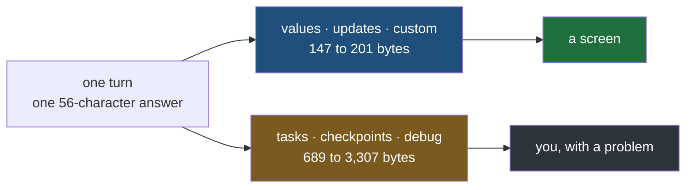
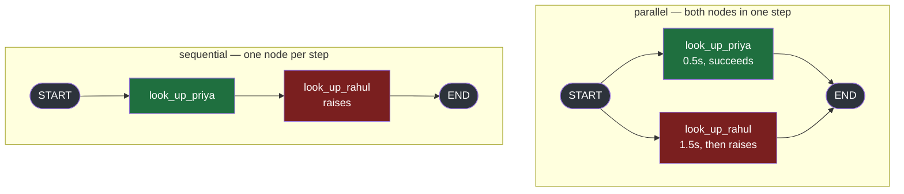
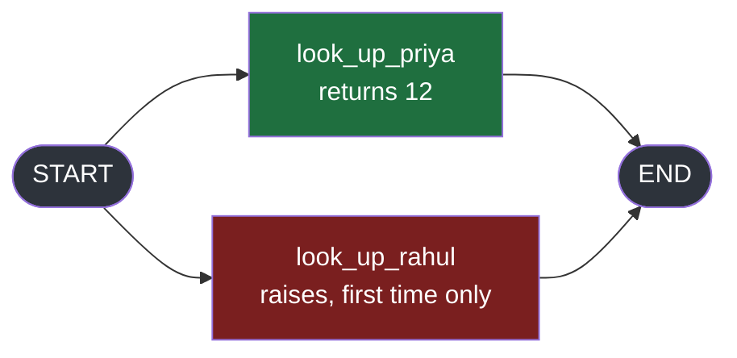
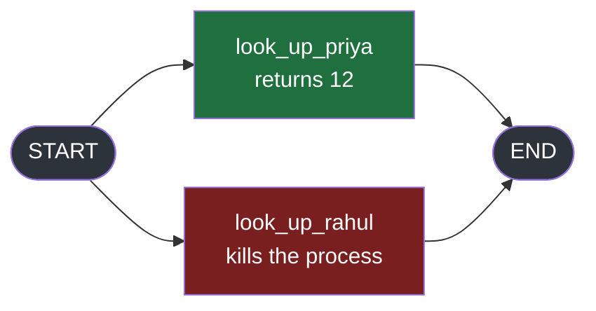

#langgraph #graphs #streaming #lab

**Three more modes arrive the same way the first three did — same call, same tagging, same additive behaviour — so the obvious reading is that you now have six ways to tell a user what is happening.** That reading is wrong, and the cost of finding out late is a stream nobody can afford to send.

# Not For The Client

> [!info] Every one of the six modes carries the answer exactly once. What separates them is how much machinery arrives alongside it.

## Nothing so far has separated them

Worth stating the assumption plainly before breaking it, because it is a reasonable one and everything in the previous note supports it.

`tasks`, `checkpoints` and `debug` are requested through the same `stream_mode` argument. They are tagged the same way in a list. They are additive in the same way — asking for one never changes what another yields. They arrive on the same iterator, in time order, interleaved with the others.

**On every observable property so far, they are three more modes.** So the question a reader should be asking by now is which of the six suits their screen.

## What a screen would actually receive

One small turn — look up Priya, then write a sentence — streamed once per mode, with the bytes counted as a transport would have to send them.


`src/langgraph_lab/note05/a_more_machinery.py`:

```python
import json
from typing import TypedDict

from langchain_core.runnables import RunnableConfig
from langgraph.checkpoint.memory import InMemorySaver
from langgraph.graph import END, START, StateGraph
from langgraph.types import StreamMode


class DeskState(TypedDict):
    asked_by: str
    answer: str


class DeskUpdate(TypedDict, total=False):
    asked_by: str
    answer: str


def look_up_priya(state: DeskState) -> DeskUpdate:
    return {"answer": "Priya has 12 days left"}


def write_answer(state: DeskState) -> DeskUpdate:
    return {"answer": state["answer"] + ", and that is the most in her team"}


builder = StateGraph(DeskState)  # ty: ignore[invalid-argument-type]
builder.add_node("look_up_priya", look_up_priya)
builder.add_node("write_answer", write_answer)
builder.add_edge(START, "look_up_priya")
builder.add_edge("look_up_priya", "write_answer")
builder.add_edge("write_answer", END)
graph = builder.compile(checkpointer=InMemorySaver())

START_STATE: DeskState = {"asked_by": "reception", "answer": ""}
ANSWER = "Priya has 12 days left, and that is the most in her team"


def report(mode: StreamMode, thread_id: str) -> None:
    config: RunnableConfig = {"configurable": {"thread_id": thread_id}}
    items = list(graph.stream(START_STATE, stream_mode=mode, config=config))
    on_the_wire = json.dumps(items, default=str)
    copies = on_the_wire.count(ANSWER)
    print(f"    {mode:<12} {len(items)} items, {len(on_the_wire):>6,} bytes, the answer {copies} time(s)")


if __name__ == "__main__":
    print(f"--- one turn, two nodes, an answer of {len(ANSWER)} characters")
    report("updates", "t1")
    report("values", "t2")
    report("tasks", "t3")
    report("checkpoints", "t4")
    report("debug", "t5")
```

```
--- one turn, two nodes, an answer of 56 characters
    updates      2 items,    147 bytes, the answer 1 time(s)
    values       3 items,    201 bytes, the answer 1 time(s)
    tasks        4 items,    689 bytes, the answer 1 time(s)
    checkpoints  4 items,  1,867 bytes, the answer 1 time(s)
    debug        8 items,  3,307 bytes, the answer 2 time(s)
```

**Every mode carries the answer, once.** `debug` twice, because it is the other two on one channel.

So the user-visible content is identical in all five runs. What is not identical is the bill:

| Mode | Bytes | Against `updates` |
|---|---|---|
| `updates` | 147 | — |
| `values` | 201 | 1.4x |
| `tasks` | 689 | 4.7x |
| `checkpoints` | 1,867 | 12.7x |
| `debug` | 3,307 | **22.5x** |

**Twenty-two times the bytes for the same 56 characters on the same screen.** And this is the smallest interesting graph there is — two nodes, one lookup, no model, no tools, no conversation history.

## The extra bytes are not more answer

They are not a longer answer, or a more detailed one, or the same answer explained better. They are the graph describing its own machinery.

| What arrives | What it is for |
|---|---|
| `checkpoint_id`, `parent_config`, `thread_id` | addressing a stored snapshot, so a resume can find it |
| `triggers: ('branch:to:look_up_priya',)` | which edge fired to schedule this node |
| a task `id` uuid | pairing a start record with its finish |
| `step: -1`, `source: 'input'` | the loop counter and where the write came from |
| `next: ['write_answer']` | what the scheduler would run next |

**Not one of those is something a person could be shown.** There is no screen on which `branch:to:look_up_priya` is the right thing to render, and no user who is better off knowing a checkpoint id.



## Two questions, not six answers

The split is not by shape, and not by dependency. It is by **who is asking**.

| | The question it answers | Who asks it |
|---|---|---|
| `values`, `updates`, `custom` | what should be on screen now | the person using the product |
| `tasks`, `checkpoints`, `debug` | what did the machinery do | **you**, and normally only when something is wrong |

That is also why the previous note kept turning up modes that were awkward to consume. `tasks` fires twice for one node and makes you check which record you are holding. `checkpoints` numbers its steps from -1. `debug` buries everything one level down inside `payload`.

**Every one of those is inconvenient for a UI and exactly right for an investigation** — where you want both ends of a task, the state before anything ran, and a label saying what each record is.

> [!important] The rest of this note follows from the audience, not the API
> Nothing after this section is about how to call these modes. It is about what you can do with them once you accept they are yours rather than your user's — where an exception first shows up, what a resume is built on, what survives a process being killed, and what must never leave the server.

---

## Where a failure shows up first

Nothing above says what these modes are good for, only who they are for. The first answer is the one you reach for at three in the morning.

Two lookups, and one of them fails. The same two nodes are wired two ways, because the difference turns out to matter.



`src/langgraph_lab/note05/b_where_errors_show.py`:

```python
import operator
import time
from typing import Annotated, Any, TypedDict

from langgraph.graph import END, START, StateGraph


class DeskState(TypedDict):
    asked_by: str
    notes: Annotated[list[str], operator.add]


class DeskUpdate(TypedDict, total=False):
    notes: list[str]


def look_up_priya(state: DeskState) -> DeskUpdate:
    time.sleep(0.5)
    return {"notes": ["Priya has 12 days left"]}


def look_up_rahul(state: DeskState) -> DeskUpdate:
    time.sleep(1.5)
    raise RuntimeError("records service returned 503")


side_by_side = StateGraph(DeskState)  # ty: ignore[invalid-argument-type]
side_by_side.add_node("look_up_priya", look_up_priya)
side_by_side.add_node("look_up_rahul", look_up_rahul)
side_by_side.add_edge(START, "look_up_priya")
side_by_side.add_edge(START, "look_up_rahul")
side_by_side.add_edge("look_up_priya", END)
side_by_side.add_edge("look_up_rahul", END)
parallel = side_by_side.compile()

one_after_another = StateGraph(DeskState)  # ty: ignore[invalid-argument-type]
one_after_another.add_node("look_up_priya", look_up_priya)
one_after_another.add_node("look_up_rahul", look_up_rahul)
one_after_another.add_edge(START, "look_up_priya")
one_after_another.add_edge("look_up_priya", "look_up_rahul")
one_after_another.add_edge("look_up_rahul", END)
sequential = one_after_another.compile()


def short_id(item: Any) -> dict[str, Any]:
    readable = dict(item)
    readable["id"] = readable["id"][:8]
    return readable


START_STATE: DeskState = {"asked_by": "reception", "notes": []}


if __name__ == "__main__":
    print("--- parallel graph, stream_mode='updates'")
    try:
        for item in parallel.stream(START_STATE, stream_mode="updates"):
            print("   ", item)
    except RuntimeError as exc:
        print(f"    raised {type(exc).__name__}: {exc}")

    print("\n--- parallel graph, stream_mode='tasks'")
    try:
        for item in parallel.stream(START_STATE, stream_mode="tasks"):
            print("   ", short_id(item))
    except RuntimeError as exc:
        print(f"    raised {type(exc).__name__}: {exc}")


    print("\n--- sequential graph, stream_mode='tasks', the failing node alone in its step")
    try:
        for item in sequential.stream(START_STATE, stream_mode="tasks"):
            print("   ", short_id(item))
    except RuntimeError as exc:
        print(f"    raised {type(exc).__name__}: {exc}")
```

## What the client mode tells you about it

```
--- parallel graph, stream_mode='updates'
    {'look_up_priya': {'notes': ['Priya has 12 days left']}}
    raised RuntimeError: records service returned 503
```

One item, then the exception comes out of the `for` loop.

**The stream said nothing about the failure.** Everything you know about it you got from catching it yourself — a type, a message, and a traceback pointing at a source line. Nothing in `RuntimeError('records service returned 503')` says which node raised it; that is the node's own message, not the graph's account of what happened.

## What `tasks` tells you about the same failure

```
--- parallel graph, stream_mode='tasks'
    {'id': 'f0859ad0', 'name': 'look_up_priya', 'input': {'asked_by': 'reception', 'notes': []}, 'triggers': ('branch:to:look_up_priya',)}
    {'id': 'a7d57d2c', 'name': 'look_up_rahul', 'input': {'asked_by': 'reception', 'notes': []}, 'triggers': ('branch:to:look_up_rahul',)}
    {'id': 'f0859ad0', 'name': 'look_up_priya', 'error': None, 'result': {'notes': ['Priya has 12 days left']}, 'interrupts': []}
    {'id': 'a7d57d2c', 'name': 'look_up_rahul', 'error': RuntimeError('records service returned 503'), 'result': {}, 'interrupts': []}
    raised RuntimeError: records service returned 503
```

Four items before the identical exception. The last one is the failure, described:

| Field | What it gives you |
|---|---|
| `name` | **`look_up_rahul`** — which node, by name, not by traceback |
| `error` | the exception object itself, not a rendering of it |
| `result` | `{}` — it produced nothing, so nothing of its was written |
| its start record | the exact **input** that node was handed |
| the sibling's finish record | `look_up_priya` **succeeded**, with a real result |

**That last row is the one nothing else can give you.** The run failed, so the step never committed and the state was thrown away — but the stream still states plainly that one lookup worked and the other did not, and which was which.

> [!important] The description arrives before the exception does
> Both modes end in the same `except` block. The difference is ordering: under `tasks` the failure has already been **named, attributed and described** on the stream by the time your error handling runs. Whatever your handler then decides the user should see, it is deciding it after all of this has gone past — which is the audience split again, from the other side.

## The edge, and it is worth knowing before you rely on this

The same failure on the sequential graph, where the failing node is the only task in its step:

```
--- sequential graph, stream_mode='tasks', the failing node alone in its step
    {'id': '85e75f95', 'name': 'look_up_priya', 'input': {'asked_by': 'reception', 'notes': []}, 'triggers': ('branch:to:look_up_priya',)}
    {'id': '85e75f95', 'name': 'look_up_priya', 'error': None, 'result': {'notes': ['Priya has 12 days left']}, 'interrupts': []}
    {'id': 'ded9241f', 'name': 'look_up_rahul', 'input': {'asked_by': 'reception', 'notes': ['Priya has 12 days left']}, 'triggers': ('branch:to:look_up_rahul',)}
    raised RuntimeError: records service returned 503
```

**The start record arrives. The finish record never does.** Priya's pair is complete, Rahul's is not — his start is there, naming him and carrying his input, and then the exception cuts the stream off before any finish record for him exists.

So the `error` field — the entire reason to reach for this mode when something breaks — **is missing in exactly the case where a node fails on its own.**

| The failing node | What `tasks` gives you |
|---|---|
| had a sibling in its step | start record, **and** a finish record carrying the exception |
| was alone, with a `step_timeout` set | the same — both records |
| was alone, with no `step_timeout` | start record only, naming it and its input |

The cause is a shortcut inside the runner, and it is worth knowing because nothing about it is documented as a behaviour difference.

**Running a step normally means handing every node to a thread pool and then sitting in a wait loop**, taking each result as it lands. `langgraph/pregel/_runner.py` says what it does with them:

```python
# execute tasks, and wait for one to fail or all to finish.
# each task is independent from all other concurrent tasks
# yield updates/debug output as each task finishes
```

Output goes out **as each task finishes**, and a task that finishes by raising is still a task that finished. **So its record is emitted**, and the exception is re-raised afterwards.

**With exactly one node and no step timeout, all of that machinery is waste, so it is skipped:**

```python
elif len(tasks) == 1 and timeout is None and get_waiter is None:
```

That branch calls the function directly, **and on failure it records the error and raises immediately** — before anything turns that record into a stream item.

The condition is testable. Setting a step timeout disqualifies the shortcut, and on the same graph with the same failure the record comes back:

`src/langgraph_lab/note05/c_the_fast_path.py`:

```python
from langgraph_lab.note05.b_where_errors_show import START_STATE, sequential, short_id

if __name__ == "__main__":
    print("--- the failing node alone in its step, no step_timeout")
    try:
        for item in sequential.stream(START_STATE, stream_mode="tasks"):
            print("   ", short_id(item))
    except RuntimeError as exc:
        print(f"    raised {type(exc).__name__}: {exc}")

    sequential.step_timeout = 30

    print("\n--- the same graph object, one attribute set")
    try:
        for item in sequential.stream(START_STATE, stream_mode="tasks"):
            print("   ", short_id(item))
    except RuntimeError as exc:
        print(f"    raised {type(exc).__name__}: {exc}")
```

```
--- the failing node alone in its step, no step_timeout
    {'id': '340653ce', 'name': 'look_up_priya', 'input': {'asked_by': 'reception', 'notes': []}, 'triggers': ('branch:to:look_up_priya',)}
    
    {'id': '340653ce', 'name': 'look_up_priya', 'error': None, 'result': {'notes': ['Priya has 12 days left']}, 'interrupts': []}
    
    {'id': '433f08e7', 'name': 'look_up_rahul', 'input': {'asked_by': 'reception', 'notes': ['Priya has 12 days left']}, 'triggers': ('branch:to:look_up_rahul',)}
    raised RuntimeError: records service returned 503
```

```
--- the same graph object, one attribute set
    {'id': 'd6bd0f92', 'name': 'look_up_priya', 'input': {'asked_by': 'reception', 'notes': []}, 'triggers': ('branch:to:look_up_priya',)}
    
    {'id': 'd6bd0f92', 'name': 'look_up_priya', 'error': None, 'result': {'notes': ['Priya has 12 days left']}, 'interrupts': []}
    
    {'id': '6e4aece4', 'name': 'look_up_rahul', 'input': {'asked_by': 'reception', 'notes': ['Priya has 12 days left']}, 'triggers': ('branch:to:look_up_rahul',)}
    
    {'id': '6e4aece4', 'name': 'look_up_rahul', 'error': RuntimeError('records service returned 503'), 'result': {}, 'interrupts': []}
    raised RuntimeError: records service returned 503
```

**Same graph object, same nodes, same exception.** One attribute set, and the finish record carrying the error appears — which is the condition in that `elif`, confirmed from outside.

**You are not left blind either way** — the start record still names the node and hands you its input, which is more than any client mode offers. But a consumer written to read `error` off a finish record will find nothing to read on the most ordinary failure there is.

---

## The field that was pointing at the future

Note 1 ended a section on a problem it could not solve yet. Abandoning a stream stops the graph mid-flight, and nothing anywhere reports it:

> No exception is raised, because abandoning a generator is not an error. No final state is returned, because there is no final state. The logs show a turn beginning and never show it ending.

**Unless state was being written down after each step, there is no record the first one ran and no way to pick the turn up again.** That sentence had a condition in it, and nothing in notes 1 to 3 satisfied it.

Three lookups chained, a checkpointer underneath, and the loop abandoned the moment the first node finishes — the tab closed, the connection dropped, the process was told to stop.


`src/langgraph_lab/note05/d_resume_reads_it.py`:

```python
from typing import TypedDict

from langchain_core.runnables import RunnableConfig
from langgraph.checkpoint.memory import InMemorySaver
from langgraph.graph import END, START, StateGraph


class DeskState(TypedDict):
    asked_by: str
    priya_leave: int
    rahul_leave: int
    answer: str


class DeskUpdate(TypedDict, total=False):
    priya_leave: int
    rahul_leave: int
    answer: str


def look_up_priya(state: DeskState) -> DeskUpdate:
    print("        look_up_priya ran")
    return {"priya_leave": 12}


def look_up_rahul(state: DeskState) -> DeskUpdate:
    print("        look_up_rahul ran")
    return {"rahul_leave": 5}


def write_answer(state: DeskState) -> DeskUpdate:
    print("        write_answer ran")
    return {"answer": f"Priya {state['priya_leave']}, Rahul {state['rahul_leave']}"}


builder = StateGraph(DeskState)  # ty: ignore[invalid-argument-type]
builder.add_node("look_up_priya", look_up_priya)
builder.add_node("look_up_rahul", look_up_rahul)
builder.add_node("write_answer", write_answer)
builder.add_edge(START, "look_up_priya")
builder.add_edge("look_up_priya", "look_up_rahul")
builder.add_edge("look_up_rahul", "write_answer")
builder.add_edge("write_answer", END)
graph = builder.compile(checkpointer=InMemorySaver())

START_STATE: DeskState = {"asked_by": "reception", "priya_leave": 0, "rahul_leave": 0, "answer": ""}
CONFIG: RunnableConfig = {"configurable": {"thread_id": "desk-1"}}


if __name__ == "__main__":
    print("--- first attempt, abandoned once one node has finished")
    for item in graph.stream(START_STATE, stream_mode="checkpoints", config=CONFIG):
        print(f"    step {item['metadata']['step']:>2}  next={item['next']}  values={item['values']}")
        if item["metadata"]["step"] == 1:
            print("        connection lost, leaving the loop")
            break

    print("\n--- what the checkpointer holds afterwards")
    snapshot = graph.get_state(CONFIG)
    print(f"    next={snapshot.next}")
    print(f"    values={snapshot.values}")

    print("\n--- resuming: same thread_id, and None as the input")
    for item in graph.stream(None, stream_mode="checkpoints", config=CONFIG):
        print(f"    step {item['metadata']['step']:>2}  next={item['next']}  values={item['values']}")
```

```
--- first attempt, abandoned once one node has finished
    step -1  next=['__start__']  values={}
    step  0  next=['look_up_priya']  values={'asked_by': 'reception', 'priya_leave': 0, 'rahul_leave': 0, 'answer': ''}
        look_up_priya ran
    step  1  next=['look_up_rahul']  values={'asked_by': 'reception', 'priya_leave': 12, 'rahul_leave': 0, 'answer': ''}
        connection lost, leaving the loop
```

**One node ran, two never started.** This is note 1's situation exactly — except this time something was written down as it went.

```
--- what the checkpointer holds afterwards
    next=('look_up_rahul',)
    values={'asked_by': 'reception', 'priya_leave': 12, 'rahul_leave': 0, 'answer': ''}
```

That is the last streamed checkpoint, still there after the run was walked away from. **Priya's 12 survived**, and `next` names the node that was about to run when everything stopped.

## Resuming is reading that object back

Same `thread_id`, and the input is `None`:

```
--- resuming: same thread_id, and None as the input
    step  1  next=['look_up_rahul']  values={'asked_by': 'reception', 'priya_leave': 12, 'rahul_leave': 0, 'answer': ''}
        look_up_rahul ran
        
    step  2  next=['write_answer']  values={'asked_by': 'reception', 'priya_leave': 12, 'rahul_leave': 5, 'answer': ''}
        write_answer ran
        
    step  3  next=[]  values={'asked_by': 'reception', 'priya_leave': 12, 'rahul_leave': 5, 'answer': 'Priya 12, Rahul 5'}
```

**`look_up_priya` did not print.** It did not run a second time. The run picked up at `look_up_rahul`, exactly where `next` said it would, with Priya's result still in the state from the attempt that was abandoned.

> [!important] `None` as the input is the entire signal
> A start state means begin something. `None` means continue what is already on this thread. Nothing else about the call changes — same graph, same mode, same config — so a resume is not a different kind of run, it is the same run being asked to carry on.

## Which is what `next` was for

The previous note called a checkpoint **not a record of the run but a place to restart it from**, and left that as a claim about shape. This is the shape being used:

| Field | What it says | What the resume does with it |
|---|---|---|
| `values` | the state as of that moment | hands it to the next node as its input |
| `next` | the nodes that had not run yet | starts exactly those, and nothing before them |
| `config` | which checkpoint this is | addresses it, so a resume can target one rather than the latest |

**A resumable UI cannot be built on `values`.** Knowing the state is not enough — recovery needs to know what was still pending, and `next` is carried by no client mode. That is the audience split with something concrete at stake: the field a user has no use for is the field a recovery cannot work without.

---

## What a half-finished step leaves behind

The resume above was **polite** — the loop was walked away from between steps, at a boundary the graph had already reached. A failure is not polite. It lands **inside** a step, **with some of that step's nodes finished and others not.**

Two lookups side by side, so both are in one step. Priya's returns. Rahul's throws the first time it is called, and works the second — a records service that was down and came back.



`src/langgraph_lab/note05/e_written_on_return.py`:

```python
from typing import TypedDict

from langchain_core.runnables import RunnableConfig
from langgraph.checkpoint.memory import InMemorySaver
from langgraph.graph import END, START, StateGraph


class DeskState(TypedDict):
    asked_by: str
    priya_leave: int
    rahul_leave: int


class DeskUpdate(TypedDict, total=False):
    priya_leave: int
    rahul_leave: int


ATTEMPTS: list[str] = []


def look_up_priya(state: DeskState) -> DeskUpdate:
    print("        look_up_priya ran")
    return {"priya_leave": 12}


def look_up_rahul(state: DeskState) -> DeskUpdate:
    ATTEMPTS.append("tried")
    if len(ATTEMPTS) == 1:
        print("        look_up_rahul failed")
        raise RuntimeError("records service returned 503")
    print("        look_up_rahul ran")
    return {"rahul_leave": 5}


builder = StateGraph(DeskState)  # ty: ignore[invalid-argument-type]
builder.add_node("look_up_priya", look_up_priya)
builder.add_node("look_up_rahul", look_up_rahul)
builder.add_edge(START, "look_up_priya")
builder.add_edge(START, "look_up_rahul")
builder.add_edge("look_up_priya", END)
builder.add_edge("look_up_rahul", END)
graph = builder.compile(checkpointer=InMemorySaver())

START_STATE: DeskState = {"asked_by": "reception", "priya_leave": 0, "rahul_leave": 0}
CONFIG: RunnableConfig = {"configurable": {"thread_id": "desk-1"}}


if __name__ == "__main__":
    print("--- the step dies halfway, stream_mode='values'")
    try:
        for item in graph.stream(START_STATE, stream_mode="values", config=CONFIG):
            print("   ", item)
    except RuntimeError as exc:
        print(f"    raised {type(exc).__name__}: {exc}")

    print("\n--- what the checkpointer kept")
    snapshot = graph.get_state(CONFIG)
    print(f"    values={snapshot.values}")
    print(f"    next={snapshot.next}")
    for task in snapshot.tasks:
        print(f"    task {task.name:<14} result={task.result}  error={task.error}")

    print("\n--- resuming the same thread, stream_mode='updates'")
    for item in graph.stream(None, stream_mode="updates", config=CONFIG):
        print("   ", item)
```

```
--- the step dies halfway, stream_mode='values'
    {'asked_by': 'reception', 'priya_leave': 0, 'rahul_leave': 0}
        look_up_priya ran
        look_up_rahul failed
    raised RuntimeError: records service returned 503
```

**`values` published the starting state and nothing else.** By note 2's rule that is exactly right — a `values` item means a step wrote something, and this step never finished, so there was nothing to publish.

## The write survived the step it was part of

```
--- what the checkpointer kept
    values={'asked_by': 'reception', 'priya_leave': 12, 'rahul_leave': 0}
    next=('look_up_rahul',)
    task look_up_priya  result={'priya_leave': 12}  error=None
    task look_up_rahul  result=None  error=RuntimeError('records service returned 503')
```

**`priya_leave` is 12 in stored state.** On a step that never committed, in a run that ended by raising.

And `next` names only `look_up_rahul`. **Priya is not pending** — as far as the checkpointer is concerned she is done, and the two task records say why: **one carries a result, the other carries the exception.**

| | What it says about Priya's result |
|---|---|
| the `values` stream | nothing — no item was ever published |
| the checkpointer | **kept it**, and no longer lists her as pending |

That gap is the whole point. **A node's output is written the moment that node returns, not when its step commits.** 
> The step is the **unit of publication**. The node is the **unit of durability**.

## What a resume does with the half it kept

Same thread, input `None`, with the service now recovered:

```
--- resuming the same thread, stream_mode='updates'
    {'look_up_priya': {'priya_leave': 12}, '__metadata__': {'cached': True}}
        look_up_rahul ran
    {'look_up_rahul': {'rahul_leave': 5}}
```

**Priya did not print.** Her node never executed. But her **update was emitted again**, carrying a field nothing else in this folder produces:

```python
'__metadata__': {'cached': True}
```

> [!important] Which is what makes a resume invisible to a consumer
> A UI rebuilding from `updates` receives the same two updates it would have seen from one uninterrupted run, in the same order, so it needs to know nothing about the failure. And a consumer that must not double count — a billing counter, an audit log, a webhook — has `__metadata__` to test, because for it the difference between real and replayed is the whole question.

## Committed together, stored one at a time

A step commits or it does not, **but the nodes inside it become durable one at a time, as each returns.**

So a step that dies halfway **keeps the half that finished**: stored state carries it, `next` stops listing it, and a resume replays its update marked `cached` instead of running the node again.

---

## None of that was a guarantee

The section above reads like a promise the framework makes: a node returns, its output is durable. It is not a promise. **It is a setting**, and the default is only one of three.

```python
durability: Durability = "async"    # or "sync", or "exit"
```

An exception cannot tell the three apart. Run the failing step above under each setting and all three keep Priya's 12, because **an exception unwinds politely** — the process is still alive the whole way out, so even the laziest setting gets its chance to write.

To separate them the process has to die without unwinding.

## Two things the earlier experiments could not do

**The checkpointer has to outlive the process.** `InMemorySaver` is a dictionary in the dead process, so after a kill there is nothing left to ask. This needs a file, and it goes in a scratch directory rather than the project, because SQLite writes two companion files alongside it and none of the three is anything you would want to open:

```python
with SqliteSaver.from_conn_string(DB) as saver:
    graph = builder.compile(checkpointer=saver)
```

**And the kill has to be real.** Not an exception, not a `break` — `SIGKILL`, which cannot be caught, handled or cleaned up after.



`src/langgraph_lab/note05/f_kill_the_process.py`:

```python
import os
import pathlib
import signal
import sys
import tempfile
import time
from typing import TypedDict

from langchain_core.runnables import RunnableConfig
from langgraph.checkpoint.sqlite import SqliteSaver
from langgraph.graph import END, START, StateGraph
from langgraph.types import Durability

# a scratch file outside the project, so the experiment leaves nothing behind
DB = str(pathlib.Path(tempfile.gettempdir()) / "langgraph_lab_kill_test.sqlite")


class DeskState(TypedDict):
    asked_by: str
    priya_leave: int
    rahul_leave: int


class DeskUpdate(TypedDict, total=False):
    priya_leave: int
    rahul_leave: int


def look_up_priya(state: DeskState) -> DeskUpdate:
    print("        look_up_priya returned", flush=True)
    return {"priya_leave": 12}


def look_up_rahul(state: DeskState) -> DeskUpdate:
    time.sleep(1.0)
    print("        look_up_rahul is about to kill the process", flush=True)
    os.kill(os.getpid(), signal.SIGKILL)
    # the signal takes a moment to land, and until it does this thread keeps
    # running — so wait here rather than letting the return below be written
    time.sleep(60)
    return {"rahul_leave": 5}


builder = StateGraph(DeskState)  # ty: ignore[invalid-argument-type]
builder.add_node("look_up_priya", look_up_priya)
builder.add_node("look_up_rahul", look_up_rahul)
builder.add_edge(START, "look_up_priya")
builder.add_edge(START, "look_up_rahul")
builder.add_edge("look_up_priya", END)
builder.add_edge("look_up_rahul", END)

START_STATE: DeskState = {"asked_by": "reception", "priya_leave": 0, "rahul_leave": 0}


if __name__ == "__main__":
    # "async" when run with no argument, so the file works from an editor too
    durability: Durability = sys.argv[1] if len(sys.argv) > 1 else "async"  # ty: ignore[invalid-assignment]
    config: RunnableConfig = {"configurable": {"thread_id": durability}}
    print(f"--- durability={durability!r}, and the step will not survive", flush=True)
    with SqliteSaver.from_conn_string(DB) as saver:
        graph = builder.compile(checkpointer=saver)
        for item in graph.stream(START_STATE, stream_mode="values", config=config, durability=durability):
            print("   ", item, flush=True)
```

The node kills its own process, so there is no second process and no timing to get wrong. The setting comes from the command line, defaulting to `"async"` when there is no argument. Run it once per setting — each dies, and each leaves a thread behind in the same file:

```
$ uv run python -m langgraph_lab.note05.f_kill_the_process async
--- durability='async', and the step will not survive
    {'asked_by': 'reception', 'priya_leave': 0, 'rahul_leave': 0}
        look_up_priya returned
        look_up_rahul is about to kill the process
    [process died, exit code 137]

$ uv run python -m langgraph_lab.note05.f_kill_the_process sync
    ... the same three lines, and the same exit code

$ uv run python -m langgraph_lab.note05.f_kill_the_process exit
    ... the same three lines, and the same exit code
```

`137` is the shell's way of saying the process was killed rather than exiting: 128 plus signal 9.

## Reading the file afterwards

Nothing is running now. This opens the same file and asks what each thread holds.

`src/langgraph_lab/note05/g_what_survived.py`:

```python
from langchain_core.runnables import RunnableConfig
from langgraph.checkpoint.sqlite import SqliteSaver

from langgraph_lab.note05.f_kill_the_process import DB, builder

if __name__ == "__main__":
    print("--- what the sqlite file kept, after each process was killed")
    with SqliteSaver.from_conn_string(DB) as saver:
        graph = builder.compile(checkpointer=saver)

        config: RunnableConfig = {"configurable": {"thread_id": "async"}}
        snapshot = graph.get_state(config)
        print(f"    durability='async'  values={snapshot.values}")
        print(f"                        next={snapshot.next}")

        config = {"configurable": {"thread_id": "sync"}}
        snapshot = graph.get_state(config)
        print(f"    durability='sync'   values={snapshot.values}")
        print(f"                        next={snapshot.next}")

        config = {"configurable": {"thread_id": "exit"}}
        snapshot = graph.get_state(config)
        print(f"    durability='exit'   values={snapshot.values}")
        print(f"                        next={snapshot.next}")

        config = {"configurable": {"thread_id": "never-run-at-all"}}
        snapshot = graph.get_state(config)
        print(f"    a thread nothing    values={snapshot.values}")
        print(f"    ever ran on         next={snapshot.next}")
```

```
--- what the sqlite file kept, after each process was killed
    durability='async'  values={'asked_by': 'reception', 'priya_leave': 12, 'rahul_leave': 0}
                        next=('look_up_rahul',)
    durability='sync'   values={'asked_by': 'reception', 'priya_leave': 12, 'rahul_leave': 0}
                        next=('look_up_rahul',)
    durability='exit'   values={}
                        next=()
    a thread nothing    values={}
    ever ran on         next=()
```

| `durability` | Priya's finished write | `next` | What a resume would do |
|---|---|---|---|
| `"async"` (the default) | **kept** | `('look_up_rahul',)` | run only Rahul |
| `"sync"` | **kept** | `('look_up_rahul',)` | run only Rahul |
| `"exit"` | **gone** | `()` | nothing — the thread is empty |

The last row of that output is the control: a thread nothing has ever been run on. **It is identical to the `"exit"` thread, field for field.**

So the turn that never happened is not a figure of speech. A node really did run and really did return, and what is stored is indistinguishable from a thread that was never touched — no partial state, no pending nodes, no record that anything was attempted.

> [!warning] The setting that loses work is the one that looks fastest
> `"exit"` writes once, at the end, on a clean finish. On a graph that always finishes it is the cheapest of the three and nothing about it looks wrong. Its behaviour only differs when the process dies — which is the one moment the checkpoint existed for.

## What this experiment does not show

`"async"` and `"sync"` are identical in that table, and this test cannot separate them. The difference between them is when the write lands relative to the next step starting, so telling them apart needs a kill in the microseconds after a node returns — a race, not a demonstration.

**What it does establish is the boundary that matters**: two settings keep a finished node's work across a hard kill, and one keeps nothing.

## What the setting actually decides

`durability` is not a tuning knob for write throughput. It decides whether a killed process leaves a resumable turn behind or leaves nothing at all.

**The default is `"async"`, and the default is on your side.** The one to notice is `"exit"`, which turns every crash into a turn that never happened.

---

## What the checkpoint does not protect

The graph that failed and resumed had a detail in it that was never looked at. `look_up_rahul` fails the first time it is called and works the second, and it decides which by counting:

```python
ATTEMPTS: list[str] = []


def look_up_rahul(state: DeskState) -> DeskUpdate:
    ATTEMPTS.append("tried")
    if len(ATTEMPTS) == 1:
        print("        look_up_rahul failed")
        raise RuntimeError("records service returned 503")
    print("        look_up_rahul ran")
    return {"rahul_leave": 5}
```

**That `append` is a side effect.** It changes something outside the node's return value, on a line the node reaches before it decides whether to fail. Printing it at each stage says how many times that line executed.

`src/langgraph_lab/note05/h_side_effects_repeat.py`:

```python
from langgraph_lab.note05.e_written_on_return import ATTEMPTS, CONFIG, START_STATE, graph

if __name__ == "__main__":
    print("--- before anything has run")
    print(f"    ATTEMPTS = {ATTEMPTS}")

    print("\n--- the attempt that fails")
    try:
        for item in graph.stream(START_STATE, stream_mode="values", config=CONFIG):
            print("   ", item)
    except RuntimeError as exc:
        print(f"    raised {type(exc).__name__}: {exc}")
    print(f"    ATTEMPTS = {ATTEMPTS}")

    print("\n--- the resume, which succeeds")
    for item in graph.stream(None, stream_mode="values", config=CONFIG):
        print("   ", item)
    print(f"    ATTEMPTS = {ATTEMPTS}")

    print("\n--- what the two of them add up to")
    snapshot = graph.get_state(CONFIG)
    print(f"    look_up_rahul produced one result: rahul_leave={snapshot.values['rahul_leave']}")
    print(f"    and its body ran {len(ATTEMPTS)} times")
```

```
--- before anything has run
    ATTEMPTS = []

--- the attempt that fails
    {'asked_by': 'reception', 'priya_leave': 0, 'rahul_leave': 0}
        look_up_priya ran
        look_up_rahul failed
    raised RuntimeError: records service returned 503
    ATTEMPTS = ['tried']

--- the resume, which succeeds
    {'asked_by': 'reception', 'priya_leave': 0, 'rahul_leave': 0}
        look_up_rahul ran
    {'asked_by': 'reception', 'priya_leave': 12, 'rahul_leave': 5}
    ATTEMPTS = ['tried', 'tried']

--- what the two of them add up to
    look_up_rahul produced one result: rahul_leave=5
    and its body ran 2 times
```

## One result, two executions

```
    look_up_rahul produced one result: rahul_leave=5
    and its body ran 2 times
```

The graph's own account of this thread is clean. One node, one result, `rahul_leave=5`, `next` empty, a turn that finished. Nothing in the state, the checkpoints or the task records suggests anything happened twice.

**`ATTEMPTS` holds two entries.**

| | What the checkpoint holds | What actually happened |
|---|---|---|
| `look_up_priya` | ran once, returned 12 | ran once |
| `look_up_rahul` | ran once, returned 5 | **ran twice** |

A resume starts a pending node **from its first line**, not from wherever it got to. Everything the previous attempt did before dying is not undone, not recorded, and not skipped — it simply happens again.

> [!warning] Swap the append for something that costs money
> `ATTEMPTS.append` is harmless. Put a card charge, an email send, an audit row or a webhook post on that line instead, and the resume does it a second time while every record the graph keeps still shows one clean result. **The graph is not lying — it is reporting the only thing it tracks**, which is what a node returned.

## Which is the sharp edge of everything above

Two sections back, a finished node's write survived a hard kill and the resume replayed it marked `cached`. That is a real guarantee and it has a precise scope:

| | Survives a failure or a kill | Skipped on resume |
|---|---|---|
| what a node **returned** | yes, once it has returned | **yes** — replayed from the checkpoint |
| what a node **did** on the way | no record of it exists | no — the node runs again from the top |

**Durability is about return values.** The checkpoint is a record of results, not a log of actions, so it can restore what a node produced and has no way to know what a node performed.

That is why a node that is going to be resumed has to be safe to run twice. Nothing in the framework makes it so, and nothing in the framework will tell you it was not.

## And notice where the counter was living

`ATTEMPTS` is a module-level Python list, so the failed attempt and the resume — both in this one process — are looking at the same object. That is the only reason the second call took the other branch.

**The checkpointer never saw it.** It is not in `values`, not in a task record, not in the sqlite file. A resume in a fresh process would start with an empty list, `len` would be 1 again, and the node would fail again — with the state and `next` restored perfectly, and the thing actually deciding the node's behaviour gone.

---

## What each mode would hand to a browser

Everything so far says these three modes are yours. The last question is what happens if you forward them anyway — and the honest answer needs measuring, because it is not simply that the operator modes are unsafe and the others are fine.

The state carries a `session_token`. **No node ever returns it**, so it is in the state only because it arrived in the input — which is how most internal fields get there.


`src/langgraph_lab/note05/i_what_leaks.py`:

```python
from typing import Any, TypedDict

from langchain_core.runnables import RunnableConfig
from langgraph.checkpoint.memory import InMemorySaver
from langgraph.graph import END, START, StateGraph
from langgraph.types import StreamMode


class DeskState(TypedDict):
    asked_by: str
    session_token: str
    leave_left: int
    answer: str


class DeskUpdate(TypedDict, total=False):
    leave_left: int
    answer: str


def look_up_record(state: DeskState) -> DeskUpdate:
    return {"leave_left": 12}


def write_answer(state: DeskState) -> DeskUpdate:
    return {"answer": f"Priya has {state['leave_left']} days left"}


builder = StateGraph(DeskState)  # ty: ignore[invalid-argument-type]
builder.add_node("look_up_record", look_up_record)
builder.add_node("write_answer", write_answer)
builder.add_edge(START, "look_up_record")
builder.add_edge("look_up_record", "write_answer")
builder.add_edge("write_answer", END)
graph = builder.compile(checkpointer=InMemorySaver())

START_STATE: DeskState = {
    "asked_by": "reception",
    "session_token": "tok_9f3a21",
    "leave_left": 0,
    "answer": "",
}


def short_id(item: Any) -> dict[str, Any]:
    readable = dict(item)
    readable["id"] = readable["id"][:8]
    return readable


def leaks(mode: StreamMode, thread_id: str) -> None:
    config: RunnableConfig = {"configurable": {"thread_id": thread_id}}
    on_the_wire = ""
    for item in graph.stream(START_STATE, stream_mode=mode, config=config):
        on_the_wire += str(item)
    token = "yes" if "tok_9f3a21" in on_the_wire else "no"
    names = "yes" if "look_up_record" in on_the_wire else "no"
    routing = "yes" if "branch:to:" in on_the_wire else "no"
    storage = "yes" if "checkpoint_id" in on_the_wire else "no"
    print(f"    {mode:<12} {token:<8} {names:<8} {routing:<8} {storage}")


if __name__ == "__main__":
    print("--- session_token is in the state, and no node ever returns it")
    print(f"    {'mode':<12} {'token':<8} {'names':<8} {'routing':<8} storage ids")
    leaks("updates", "t1")
    leaks("values", "t2")
    leaks("custom", "t3")
    leaks("tasks", "t4")
    leaks("checkpoints", "t5")
    leaks("debug", "t6")

    print("\n--- one 'updates' item, which is what a browser is usually sent")
    config: RunnableConfig = {"configurable": {"thread_id": "t7"}}
    for item in graph.stream(START_STATE, stream_mode="updates", config=config):
        print("   ", item)

    print("\n--- the first 'tasks' item of the same run")
    config = {"configurable": {"thread_id": "t8"}}
    for item in graph.stream(START_STATE, stream_mode="tasks", config=config):
        print("   ", short_id(item))
        break
```

Each row streams the whole run and then asks four questions of everything that came out.

```
--- session_token is in the state, and no node ever returns it
    mode         token    names    routing  storage ids
    updates      no       yes      no       no
    values       yes      no       no       no
    custom       no       no       no       no
    tasks        yes      yes      yes      no
    checkpoints  yes      yes      no       yes
    debug        yes      yes      yes      yes
```

## Four things in that table

**`custom` is the only clean row.** Nothing leaks, because nothing arrives on that channel except what a node explicitly passed to `writer(...)`. Every other mode carries something the framework decided to include. That is the argument for a status vocabulary restated as a security property — **the channel you control is the channel with nothing extra in it.**

**`updates` exports your node names.** It has to: the payload is keyed by them.

```
--- one 'updates' item, which is what a browser is usually sent
    {'look_up_record': {'leave_left': 12}}
    {'write_answer': {'answer': 'Priya has 12 days left'}}
```

`look_up_record` and `write_answer` are internal identifiers, and they reach the browser on the most ordinary client mode there is. Harmless in this graph. Less so when a node is named `check_fraud_score` or `apply_manual_override`.

**`values` exports state nobody returned.** The token is in every `values` item, because `values` is the whole state and the whole state includes fields no node has touched. A team that puts a token, an internal id or a raw record in state has put it on the wire.

**The operator modes are the union of both, plus more.** `tasks` adds routing, `checkpoints` adds storage addresses, `debug` adds all four at once.

## What a leak looks like

```
--- the first 'tasks' item of the same run
    {'id': '4d3eca6e', 'name': 'look_up_record', 'input': {'asked_by': 'reception', 'session_token': 'tok_9f3a21', 'leave_left': 0, 'answer': ''}, 'triggers': ('branch:to:look_up_record',)}
```

One item. It carries the node's name, the edge that scheduled it, and `input` — **the complete state that node was handed**, token included.

| In that one item | What it is |
|---|---|
| `name` | an internal identifier |
| `triggers` | the routing decision that led here |
| `input` | every key in the state, whether or not a node returned it |

`input` is the field to watch. It is not a payload anyone designed — it is whatever the state happened to hold at that moment, **and in a real system that is the conversation**, the record just looked up, whatever a previous node fetched.

> [!warning] The way this ships is a debugging session that was never undone
> Nothing above requires a mistake in judgement. A hang gets investigated, `"debug"` goes into the `stream_mode` list to find it, the bug is fixed, and the list is never changed back. The stream still works, the UI still renders, and every response now carries node names, routing, storage ids and the full state of every step.

**So the audience split has a second meaning.** The first was about usefulness — nobody wants a checkpoint id on their screen. The second is that forwarding these modes exports your graph's structure and your state together, and it fails silently in exactly the way that gets deployed.

---

## The one to reach for, and the one to reach for once

Everything in this note argued for these modes. The byte table at the top argues against leaving one of them on.

| Mode | Bytes, for the same 56-character answer |
|---|---|
| `updates` | 147 |
| `tasks` | 689 |
| `checkpoints` | 1,867 |
| `debug` | **3,307** |

**Two nodes, one lookup, no model, no tools, no conversation history** — and `debug` is already 22 times the size.

Every one of those numbers grows with the graph, and the operator ones grow faster: a checkpoint carries the whole state on every boundary, while an update carries one node's contribution.

**So `debug` is a tool, not a setting.** It is correct when you have one specific question and want everything at once: which node, in which step, with what input, against what checkpoint. It is wrong as a default, because it costs 22 times the bandwidth to bury the four items you need among the five you do not — and it is the mode most likely to be left on, since nothing about a working stream tells you it is still there.

The same is true one step down. `tasks` and `checkpoints` are cheaper than `debug` and still four to twelve times the cost of the mode a screen actually needs. **None of the three is something you stream because it might be useful later.**

## Six modes, two audiences

Which is the whole note, in one line.

| | Answers | Costs | Turned on |
|---|---|---|---|
| `values`, `updates`, `messages`, `custom` | what should be on screen | 147 to 201 bytes here | for every request |
| `tasks`, `checkpoints`, `debug` | what the machinery did | 689 to 3,307 bytes here | when you are investigating |

`messages` is the one mode in that first row this folder has not met yet — it carries model output as it is produced, and it gets its own note. It belongs on the client side for the same reason the others do: it exists to put something in front of a person.

**The line between the rows is not a matter of taste.** Cross it in one direction and you are paying twenty times the bandwidth to render a spinner. Cross it in the other and there is nothing in your logs when a node throws at three in the morning — no name, no input, no record that its sibling succeeded.

And crossing it by accident, in the direction of the browser, is the one that does not announce itself: the stream still works, the UI still renders, and the response now carries your node names, your routing and your state.
