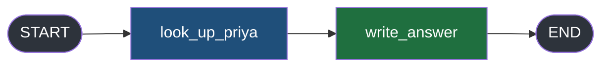
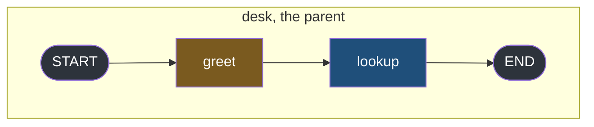
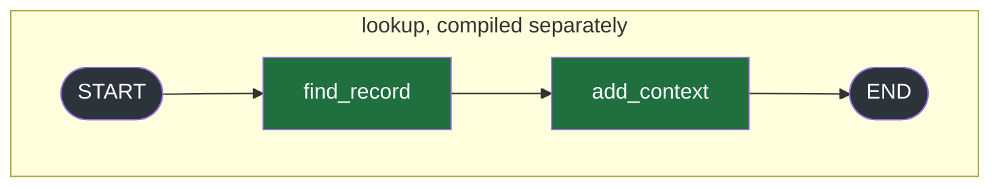
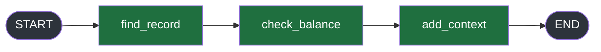
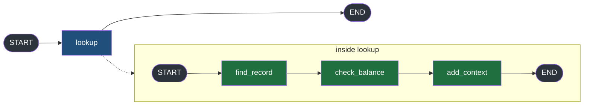
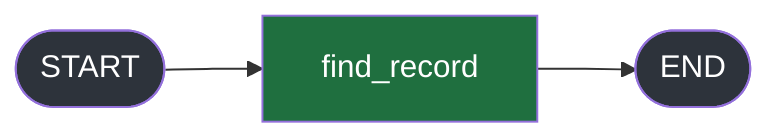
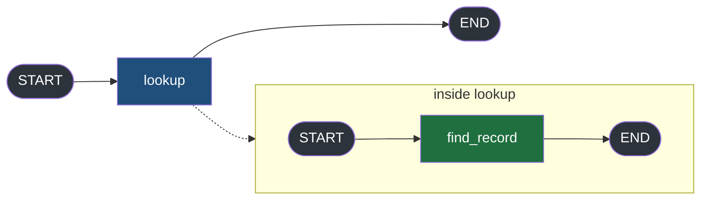
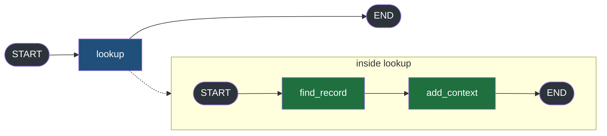
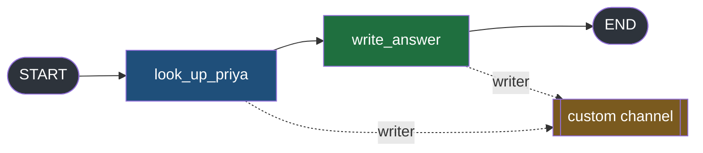

#langgraph #graphs #streaming #lab

**Six modes exist, two audiences need them, and no run so far has asked for more than one at a time.** Asking for two is a single argument change — and that argument change rewrites every item the stream produces, including the ones you were already reading.

# Combining Modes, And Reading The Item

> [!info] `stream_mode` accepts a list. The moment it does, the shape of every item changes — and it changes for a list of one, before any second mode exists.

## One argument, two audiences

Note 5 ended by splitting the six modes across a line: `updates`, `values`, `custom` and `messages` on the side facing a screen, `tasks`, `checkpoints` and `debug` on the side facing an operator. Both sides describe the same run.

So the first real question after that split is how you serve both at once. A turn that renders a spinner from `updates` also needs `tasks` in the log when something throws at three in the morning, and those are two different consumers of one execution.

**Running the graph twice is not an answer.** Two runs mean two sets of side effects — two model calls, two rows written, two invoices sent — for one user request. Whatever combining modes turns out to look like, it has to happen inside a single `stream()` call.

It does, and the mechanism is small: `stream_mode` takes a list.

## A list of one already changes the shape

The graph is the two-node desk from note 5 — a lookup, then a sentence written from what it found.



Three runs of it, same start state, nothing moving between them but the `stream_mode` argument. `type(item).__name__` goes on every line so the container sits next to the payload instead of being something you infer from the brackets.

`src/langgraph_lab/note06/a_list_changes_shape.py`:

```python
from typing import TypedDict

from langgraph.graph import END, START, StateGraph


class DeskState(TypedDict):
    asked_by: str
    answer: str


class DeskUpdate(TypedDict, total=False):
    answer: str


def look_up_priya(state: DeskState) -> DeskUpdate:
    return {"answer": "Priya has 12 days left"}


def write_answer(state: DeskState) -> DeskUpdate:
    return {"answer": state["answer"] + ", and that is the most in her team"}


builder = StateGraph(DeskState)  # ty: ignore[invalid-argument-type]
builder.add_node("look_up_priya", look_up_priya)
builder.add_node("write_answer", write_answer)
builder.add_edge(START, "look_up_priya")
builder.add_edge("look_up_priya", "write_answer")
builder.add_edge("write_answer", END)
graph = builder.compile()

START_STATE: DeskState = {"asked_by": "reception", "answer": ""}


if __name__ == "__main__":
    print("--- stream_mode is a string: the item is the data itself")
    for item in graph.stream(START_STATE, stream_mode="updates"):
        print(f"    {type(item).__name__:<6} {item}")

    print("\n--- stream_mode is a list of ONE: the same data, now wrapped")
    for item in graph.stream(START_STATE, stream_mode=["updates"]):
        print(f"    {type(item).__name__:<6} {item}")

    print("\n--- stream_mode is a list of two: each item says which mode it came from")
    for item in graph.stream(START_STATE, stream_mode=["updates", "values"]):
        print(f"    {type(item).__name__:<6} {item}")
```


The first two runs request the same data, and the difference between them is the whole point:

```
--- stream_mode is a string: the item is the data itself
    dict   {'look_up_priya': {'answer': 'Priya has 12 days left'}}
    dict   {'write_answer': {'answer': 'Priya has 12 days left, and that is the most in her team'}}

--- stream_mode is a list of ONE: the same data, now wrapped
    tuple  ('updates', {'look_up_priya': {'answer': 'Priya has 12 days left'}})
    tuple  ('updates', {'write_answer': {'answer': 'Priya has 12 days left, and that is the most in her team'}})
```

Two items either way. Same node names, same answers, same dicts — put the payloads side by side and they are byte for byte identical. What moved is the container: `dict` became `tuple`, and `'updates'` arrived in front of the data that was previously the whole item.

**It is the list that changes the shape, not the number of modes in it.** That is the sentence to keep, because the natural assumption is the opposite one — that tagging appears when there is something to disambiguate, and a single mode has nothing to disambiguate. It appears anyway.

The documentation states it once, in the `stream_mode` docstring, and nowhere else:

> You can pass a list as the `stream_mode` parameter to stream multiple modes at once. The streamed outputs will be tuples of `(mode, data)`.

## The tag is not decoration

The third run of the same file asks for both modes, and this is where the tuple starts earning its place.

```
--- stream_mode is a list of two: each item says which mode it came from
    tuple  ('values', {'asked_by': 'reception', 'answer': ''})
    tuple  ('updates', {'look_up_priya': {'answer': 'Priya has 12 days left'}})
    tuple  ('values', {'asked_by': 'reception', 'answer': 'Priya has 12 days left'})
    tuple  ('updates', {'write_answer': {'answer': 'Priya has 12 days left, and that is the most in her team'}})
    tuple  ('values', {'asked_by': 'reception', 'answer': 'Priya has 12 days left, and that is the most in her team'})
```

Five items on one iterator, and they are interleaved rather than grouped — `values`, `updates`, `values`, `updates`, `values`, in the order the run produced them. There is no first block of one mode followed by a second block of the other.

Strip the tags off and read what is left. Item 2 is a dict whose single key is a node name; item 3 is a dict whose keys are state fields. Nothing in either says which is which. You would be classifying items by inspecting their keys and hoping no state field is ever named after a node — which it can be, since both are strings you chose.

**With the tag, the classification is stated rather than guessed**, and it is stated by the producer, which is the only party that actually knows.

Count the two series separately and they are exactly what each mode yields alone: two `updates`, one per node, and three `values`, the start state plus one after each step. Combining changed the container and the ordering, and it changed neither series.

## The same typo, loud once and silent once

A shape that changes without a mode changing is a shape that breaks a consumer which was working yesterday, so it is worth running both wrong loops rather than reasoning about them.

`src/langgraph_lab/note06/b_break_the_consumer.py` imports the graph from the file above instead of rebuilding it, so the only thing that differs between the two files is the loop:

```python
from langgraph_lab.note06.a_list_changes_shape import START_STATE, graph

if __name__ == "__main__":
    print("--- a consumer written for the LIST shape, run against the string")
    try:
        for mode, data in graph.stream(START_STATE, stream_mode="updates"):
            print(f"    mode={mode!r} data={data!r}")
    except Exception as error:
        print(f"    {type(error).__name__}: {error}")

    print("\n--- a consumer written for the STRING shape, run against the list")
    try:
        for item in graph.stream(START_STATE, stream_mode=["updates"]):
            print(f"    {item['look_up_priya']}")
    except Exception as error:
        print(f"    {type(error).__name__}: {error}")

    print("\n--- the SAME wrong consumer as the first one, against values")
    for mode, data in graph.stream(START_STATE, stream_mode="values"):
        print(f"    mode={mode!r} data={data!r}")
```

The first two both fail, in the two directions:

```
--- a consumer written for the LIST shape, run against the string
    ValueError: not enough values to unpack (expected 2, got 1)

--- a consumer written for the STRING shape, run against the list
    TypeError: tuple indices must be integers or slices, not str
```

> [!important] `stream_mode="updates"` and `stream_mode=["updates"]` request identical data and return it in two different containers.
> Neither message names a mode, and no mode was added or removed to produce them — someone typed two brackets.

Both messages are worth reading closely, because neither one describes what actually went wrong. The `ValueError` never reached any data: `for mode, data in ...` over a dict-yielding stream unpacks the **dict**, and iterating a dict yields its keys, so what failed to fit into two names was the single key `look_up_priya`.

Which means the failure depends on how many keys the dict happens to have — and `values` items are keyed by state field, not by node. `DeskState` has exactly two fields, so the same wrong consumer, pointed at `values`, unpacks cleanly. That is the third block, and the reason it has no `try` around it is that there is nothing to catch:

```
--- the SAME wrong consumer as the first one, against values
    mode='asked_by' data='answer'
    mode='asked_by' data='answer'
    mode='asked_by' data='answer'
```

**No exception, three items, and every one of them is garbage.** `mode` is holding a field name, `data` is holding another field name, and not one character of the answer appears anywhere. A state with one field or three would have raised; this one has two, so the mistake is silent and the only symptom is that a screen renders `asked_by` where a name should be.

> [!tip] The shape mismatch is loud on `updates` and quiet on `values`
> Both come from the same typo. Which one you meet in testing is decided by how many keys your state happens to have on the day you run it.

## A compiled graph is a node

Every graph in this folder so far has been flat — a `StateGraph`, some functions, `compile()`. That stops scaling roughly where a real system starts getting interesting: a leave lookup that takes three nodes and a fallback is a thing you build once and want to call from four places, and pasting its three nodes into every parent that needs it leaves four copies to keep in step.

So `add_node` accepts a compiled graph wherever it accepts a function. The parent below has two nodes, and the second one is a whole graph.





`src/langgraph_lab/note06/c_subgraph_is_a_node.py`:

```python
from typing import TypedDict

from langgraph.graph import END, START, StateGraph


class DeskState(TypedDict):
    asked_by: str
    answer: str


class DeskUpdate(TypedDict, total=False):
    answer: str


def greet(state: DeskState) -> DeskUpdate:
    return {"answer": "checking"}


def find_record(state: DeskState) -> DeskUpdate:
    return {"answer": "Priya has 12 days left"}


def add_context(state: DeskState) -> DeskUpdate:
    return {"answer": state["answer"] + ", and that is the most in her team"}


inner = StateGraph(DeskState)  # ty: ignore[invalid-argument-type]
inner.add_node("find_record", find_record)
inner.add_node("add_context", add_context)
inner.add_edge(START, "find_record")
inner.add_edge("find_record", "add_context")
inner.add_edge("add_context", END)
lookup = inner.compile()

outer = StateGraph(DeskState)  # ty: ignore[invalid-argument-type]
outer.add_node("greet", greet)
outer.add_node("lookup", lookup)
outer.add_edge(START, "greet")
outer.add_edge("greet", "lookup")
outer.add_edge("lookup", END)
desk = outer.compile()

START_STATE: DeskState = {"asked_by": "reception", "answer": ""}


if __name__ == "__main__":
    print("--- what add_node was handed for the second node")
    print(f"    {type(lookup).__name__}")

    print("\n--- the parent, streamed with updates")
    for item in desk.stream(START_STATE, stream_mode="updates"):
        print(f"    {item}")

    print("\n--- what the subgraph returns when it is invoked on its own")
    print(f"    {lookup.invoke(START_STATE)}")
```

`inner` is built and compiled the same way every graph in this folder has been. `outer` then hands the result straight to `add_node`, the same call that took a plain function on the line above it — no wrapper, no adapter:

```
--- what add_node was handed for the second node
    CompiledStateGraph
```

## A subgraph node reports a whole state

Streaming the parent puts the two kinds of node side by side, in one run, under one mode:

```
--- the parent, streamed with updates
    {'greet': {'answer': 'checking'}}
    {'lookup': {'asked_by': 'reception', 'answer': 'Priya has 12 days left, and that is the most in her team'}}
```

`greet` returned `{"answer": "checking"}` and its item carries exactly that. `lookup` reports `asked_by` as well — a field nothing inside it ever touched, unchanged from the start state.

> That is not a special rule for subgraphs, and it needs nothing new to explain. `updates` reports what a node returned, which note 2 established, and **invoking a compiled graph returns its whole final state rather than a diff:**

```
--- what the subgraph returns when it is invoked on its own
    {'asked_by': 'reception', 'answer': 'Priya has 12 days left, and that is the most in her team'}
```

Multiply the two facts together: **a subgraph node's update is a whole state.** On a four-field state where the subgraph writes one field, the parent's `updates` stream carries all four and says nothing about which one moved. The mode whose entire point is reporting what changed stops reporting what changed at exactly the node that contains the most work.

> [!note] The item is keyed by the name the parent gave it
> `find_record` and `add_context` both ran. The item says `lookup`, and neither of their names appears anywhere in the output.

## Break it: the same three nodes, one wiring apart

The keying is a detail until the subgraph is where the work is. Three nodes, a second of work each, defined once and used by two graphs.

The first wires them straight into the graph being streamed:



The second compiles them into their own graph first, then drops that in as one node:



`src/langgraph_lab/note06/d_interior_is_invisible.py`:

```python
import time
from typing import TypedDict

from langgraph.graph import END, START, StateGraph


class DeskState(TypedDict):
    asked_by: str
    answer: str


class DeskUpdate(TypedDict, total=False):
    answer: str


def find_record(state: DeskState) -> DeskUpdate:
    time.sleep(1.0)
    return {"answer": "Priya has 12 days left"}


def check_balance(state: DeskState) -> DeskUpdate:
    time.sleep(1.0)
    return {"answer": state["answer"] + ", 3 already taken"}


def add_context(state: DeskState) -> DeskUpdate:
    time.sleep(1.0)
    return {"answer": state["answer"] + ", and that is the most in her team"}


# the same three nodes, wired straight into the graph that gets streamed
flat = StateGraph(DeskState)  # ty: ignore[invalid-argument-type]
flat.add_node("find_record", find_record)
flat.add_node("check_balance", check_balance)
flat.add_node("add_context", add_context)
flat.add_edge(START, "find_record")
flat.add_edge("find_record", "check_balance")
flat.add_edge("check_balance", "add_context")
flat.add_edge("add_context", END)
flat_desk = flat.compile()

# the same three nodes, compiled into their own graph first
inner = StateGraph(DeskState)  # ty: ignore[invalid-argument-type]
inner.add_node("find_record", find_record)
inner.add_node("check_balance", check_balance)
inner.add_node("add_context", add_context)
inner.add_edge(START, "find_record")
inner.add_edge("find_record", "check_balance")
inner.add_edge("check_balance", "add_context")
inner.add_edge("add_context", END)
lookup = inner.compile()

outer = StateGraph(DeskState)  # ty: ignore[invalid-argument-type]
outer.add_node("lookup", lookup)
outer.add_edge(START, "lookup")
outer.add_edge("lookup", END)
nested_desk = outer.compile()

START_STATE: DeskState = {"asked_by": "reception", "answer": ""}


if __name__ == "__main__":
    print("--- three nodes wired straight into the graph being streamed")
    started = time.perf_counter()
    for item in flat_desk.stream(START_STATE, stream_mode="updates"):
        print(f"    {time.perf_counter() - started:5.2f}s  {item}")

    print("\n--- the same three nodes, behind one subgraph node")
    started = time.perf_counter()
    for item in nested_desk.stream(START_STATE, stream_mode="updates"):
        print(f"    {time.perf_counter() - started:5.2f}s  {item}")
```

The three functions are defined once and shared, so the sleeps, the edges and their order are provably identical between the two runs. The only thing that differs is where those edges live.

```
--- three nodes wired straight into the graph being streamed
     1.01s  {'find_record': {'answer': 'Priya has 12 days left'}}
     2.02s  {'check_balance': {'answer': 'Priya has 12 days left, 3 already taken'}}
     3.02s  {'add_context': {'answer': 'Priya has 12 days left, 3 already taken, and that is the most in her team'}}

--- the same three nodes, behind one subgraph node
     3.03s  {'lookup': {'asked_by': 'reception', 'answer': 'Priya has 12 days left, 3 already taken, and that is the most in her team'}}
```

**One wiring choice, three items against one.**

| | Flat | Nested |
|---|---|---|
| Nodes that ran | 3 | 3 |
| Total time | 3.02s | 3.03s |
| Items on the stream | 3 | 1 |
| First item arrives | 1.01s | 3.03s |
| Names on the wire | `find_record`, `check_balance`, `add_context` | `lookup` |

Nothing got slower and nothing got skipped — all three nodes ran, and their three sleeps are inside that 3.03s. What disappeared is every intermediate report.

For the two seconds where the flat version was saying `find_record` finished and then `check_balance` finished, the nested version says nothing. **From outside `stream()` that silence is indistinguishable from a hang** — the iterator is not yielding, which is exactly what a wedged graph also looks like.

> [!important] A subgraph is a unit of composition, and by default a unit of opacity
> The parent sees a node called `lookup` that takes three seconds and returns a state. Not which of its three nodes is running, not whether the third one ever started, not whether it is making progress at all.

Note 3's fix does not reach this. That silence was inside a single node, between its first line and its `return`, and `get_stream_writer()` opened a channel across it. Here three nodes ran to completion and returned, and their three items existed — they just never crossed the boundary.

## The boundary blocks the writer too

Missing completion items are one thing — the parent could argue it never promised to narrate somebody else's graph. The channel note 3 built is another, because that one exists for no reason except to report progress that would otherwise be invisible.

One node function with a writer in it, registered into two graphs. The same function object goes to both `add_node` calls, so nothing about it differs between the runs.





`src/langgraph_lab/note06/e_writer_does_not_cross.py`:

```python
from typing import TypedDict

from langgraph.config import get_stream_writer
from langgraph.graph import END, START, StateGraph


class DeskState(TypedDict):
    answer: str


class DeskUpdate(TypedDict, total=False):
    answer: str


def find_record(state: DeskState) -> DeskUpdate:
    writer = get_stream_writer()
    writer({"status": "opening the record"})
    writer({"status": "reading the leave balance"})
    return {"answer": "Priya has 12 days left"}


# the node wired straight into the graph that gets streamed
flat = StateGraph(DeskState)  # ty: ignore[invalid-argument-type]
flat.add_node("find_record", find_record)
flat.add_edge(START, "find_record")
flat.add_edge("find_record", END)
flat_desk = flat.compile()

# the same node, one graph deeper
inner = StateGraph(DeskState)  # ty: ignore[invalid-argument-type]
inner.add_node("find_record", find_record)
inner.add_edge(START, "find_record")
inner.add_edge("find_record", END)
lookup = inner.compile()

outer = StateGraph(DeskState)  # ty: ignore[invalid-argument-type]
outer.add_node("lookup", lookup)
outer.add_edge(START, "lookup")
outer.add_edge("lookup", END)
nested_desk = outer.compile()

START_STATE: DeskState = {"answer": ""}


if __name__ == "__main__":
    print("--- custom, node wired straight into the graph being streamed")
    for item in flat_desk.stream(START_STATE, stream_mode="custom"):
        print(f"    {item}")
    print("    (stream ended)")

    print("\n--- custom, the same node one graph deeper")
    for item in nested_desk.stream(START_STATE, stream_mode="custom"):
        print(f"    {item}")
    print("    (stream ended)")

    print("\n--- and the node did run, because updates on the same graph reports it")
    for item in nested_desk.stream(START_STATE, stream_mode="updates"):
        print(f"    {item}")
```

Streamed directly, `custom` does what note 3 established — two items from inside the node, before it returned anything. One graph deeper, the same two writes produce nothing:

```
--- custom, node wired straight into the graph being streamed
    {'status': 'opening the record'}
    {'status': 'reading the leave balance'}
    (stream ended)

--- custom, the same node one graph deeper
    (stream ended)
```

Not delayed, not merged into the node's update, not reformatted. **Zero items**, which is why the file prints `(stream ended)` rather than leaving you to notice an absence of lines.

The third run is the control, and it is what makes this a boundary problem rather than an execution problem:

```
--- and the node did run, because updates on the same graph reports it
    {'lookup': {'answer': 'Priya has 12 days left'}}
```

Same nested graph, same input, `updates` instead of `custom`. The node ran and produced its answer, so the two `writer(...)` calls executed. Their payloads went somewhere and did not come out here.

> [!warning] Nothing about this failure is visible from the outside
> A wrong `stream_mode` raises. A missing checkpointer yields nothing from `checkpoints` and there is a checkpointer-shaped hole in the setup to find. This yields nothing from a mode that is correctly requested, on a graph that is running correctly, with a writer that is being called. The only evidence is a status line that used to appear and no longer does.

So refactoring a working three-node section into a reusable subgraph — a change that touches no streaming code, no mode, no consumer — silently deletes its progress reporting.

Both halves of this break point at the same missing thing: a way to ask the parent for the interior.

## subgraphs=True, and both breaks close at once

The fix is an argument to `stream()`, which is to say it lives on the consumer side. No node changes, no wiring changes, no mode changes.

The graph is the smallest one that can show both halves — a subgraph of two nodes, the first of which writes to the `custom` channel before returning.



`src/langgraph_lab/note06/f_subgraphs_true.py`:

```python
from typing import Any, TypedDict

from langgraph.config import get_stream_writer
from langgraph.graph import END, START, StateGraph


class DeskState(TypedDict):
    answer: str


class DeskUpdate(TypedDict, total=False):
    answer: str


def find_record(state: DeskState) -> DeskUpdate:
    writer = get_stream_writer()
    writer({"status": "opening the record"})
    return {"answer": "Priya has 12 days left"}


def add_context(state: DeskState) -> DeskUpdate:
    return {"answer": state["answer"] + ", and that is the most in her team"}


inner = StateGraph(DeskState)  # ty: ignore[invalid-argument-type]
inner.add_node("find_record", find_record)
inner.add_node("add_context", add_context)
inner.add_edge(START, "find_record")
inner.add_edge("find_record", "add_context")
inner.add_edge("add_context", END)
lookup = inner.compile()

outer = StateGraph(DeskState)  # ty: ignore[invalid-argument-type]
outer.add_node("lookup", lookup)
outer.add_edge(START, "lookup")
outer.add_edge("lookup", END)
desk = outer.compile()

START_STATE: DeskState = {"answer": ""}


def short(namespace: Any) -> str:
    # namespace is a tuple of strings, but stream() is typed loosely enough that
    # ty cannot see that; the task id is a full uuid and only its head is readable
    if namespace == ():
        return "()"
    node, task_id = namespace[0].split(":")
    return f"('{node}:{task_id[:8]}',)"


if __name__ == "__main__":
    print("--- updates, subgraphs left at the default")
    for item in desk.stream(START_STATE, stream_mode="updates"):
        print(f"    {item}")

    print("\n--- updates, subgraphs=True")
    for namespace, data in desk.stream(START_STATE, stream_mode="updates", subgraphs=True):
        print(f"    {short(namespace):<26} {data}")

    print("\n--- custom, subgraphs left at the default")
    for item in desk.stream(START_STATE, stream_mode="custom"):
        print(f"    {item}")
    print("    (stream ended)")

    print("\n--- custom, subgraphs=True")
    for namespace, data in desk.stream(START_STATE, stream_mode="custom", subgraphs=True):
        print(f"    {short(namespace):<26} {data}")
```

Four runs of that one graph, and the only thing changing between them is a boolean:

```
--- updates, subgraphs left at the default
    {'lookup': {'answer': 'Priya has 12 days left, and that is the most in her team'}}

--- updates, subgraphs=True
    ('lookup:b20cbe7b',)       {'find_record': {'answer': 'Priya has 12 days left'}}
    ('lookup:b20cbe7b',)       {'add_context': {'answer': 'Priya has 12 days left, and that is the most in her team'}}
    ()                         {'lookup': {'answer': 'Priya has 12 days left, and that is the most in her team'}}

--- custom, subgraphs left at the default
    (stream ended)

--- custom, subgraphs=True
    ('lookup:96743426',)       {'status': 'opening the record'}
```

`updates` goes from one item to three. `custom` goes from zero items to one. **Both halves of the break close on the same flag**, and the last run is the one to read against the control above — those `writer(...)` calls were always executing, and the boundary was the only thing between them and the stream.

## Added in front, never replaced

Read the three `updates` items in order, because which of them are new matters more than the count.

The first two are the interior: `find_record` and `add_context`, under their own names, arriving as each one returns. Those are exactly the items that went missing when the three nodes moved one graph deeper.

The third is the one you already had — `lookup`, keyed by the parent's name for the node, carrying the whole state, unchanged and still last.

**Nothing was replaced.** Turning the flag on cannot break a consumer that only cares about `lookup`; it can only hand it more to ignore. That is the same additive property the modes have, and it is the reason this is a safe flag to turn on in something already running.

## The namespace says which graph

Every item now arrives tagged, which is why the loop reads `for namespace, data in ...` rather than `for item in ...`.

| Namespace | What it means |
|---|---|
| `()` | the root graph — the parent itself |
| `('lookup:b20cbe7b',)` | inside the subgraph wired in as `lookup`, invocation `b20cbe7b` |

It is a tuple of strings, and each string is two things joined by a colon: the node name the parent gave the subgraph, and the task id of that particular invocation. The task id is there because the same subgraph can be running more than once at a time — a node name on its own would not separate two concurrent invocations of `lookup`.

So the interior items and the parent's item are told apart by something the producer stated, rather than by inspecting keys and hoping.

> [!note] The item shape has now changed twice in this note, and neither time was a mode
> `stream_mode="updates"` gives a bare dict. Wrap the mode in a list and it is a 2-tuple. Leave the mode alone and set `subgraphs=True` and it is also a 2-tuple. Two unrelated arguments, the same effect on the consumer, and one of them is spelled with brackets.

## Two switches, and the shape is the product

Wrapping the mode in a list changed the item shape. `subgraphs=True` changed it again. Turning both on is not a case anyone documents together, so it is worth running rather than reasoning about.

The graph is the one from the previous file, imported rather than rebuilt, so it is provably the same graph:

`src/langgraph_lab/note06/g_how_many_elements.py`:

```python
from typing import Any

from langgraph_lab.note06.f_subgraphs_true import START_STATE, desk, short


def shape(item: Any) -> str:
    if isinstance(item, tuple):
        return f"tuple of {len(item)}"
    return type(item).__name__


if __name__ == "__main__":
    print("--- a string mode, no flag")
    for item in desk.stream(START_STATE, stream_mode="updates"):
        print(f"    {shape(item):<12} {item}")

    print("\n--- the mode in a list, no flag")
    for item in desk.stream(START_STATE, stream_mode=["updates"]):
        mode, data = item
        print(f"    {shape(item):<12} mode={mode!r}  data={data}")

    print("\n--- a string mode, subgraphs=True")
    for item in desk.stream(START_STATE, stream_mode="updates", subgraphs=True):
        namespace, data = item
        print(f"    {shape(item):<12} ns={short(namespace)}  data={data}")

    print("\n--- the mode in a list, subgraphs=True")
    for item in desk.stream(START_STATE, stream_mode=["updates"], subgraphs=True):
        namespace, mode, data = item
        print(f"    {shape(item):<12} ns={short(namespace)}  mode={mode!r}  data={data}")
```

The unpacking is written on its own line in each block rather than in the `for` target, so the number of names being bound is the thing you read.

```
--- a string mode, no flag
    dict         {'lookup': {'answer': 'Priya has 12 days left, and that is the most in her team'}}

--- the mode in a list, no flag
    tuple of 2   mode='updates'  data={'lookup': {'answer': 'Priya has 12 days left, and that is the most in her team'}}

--- a string mode, subgraphs=True
    tuple of 2   ns=('lookup:feec4af9',)  data={'find_record': {'answer': 'Priya has 12 days left'}}
    tuple of 2   ns=('lookup:feec4af9',)  data={'add_context': {'answer': 'Priya has 12 days left, and that is the most in her team'}}
    tuple of 2   ns=()  data={'lookup': {'answer': 'Priya has 12 days left, and that is the most in her team'}}

--- the mode in a list, subgraphs=True
    tuple of 3   ns=('lookup:d98dbd3d',)  mode='updates'  data={'find_record': {'answer': 'Priya has 12 days left'}}
    tuple of 3   ns=('lookup:d98dbd3d',)  mode='updates'  data={'add_context': {'answer': 'Priya has 12 days left, and that is the most in her team'}}
    tuple of 3   ns=()  mode='updates'  data={'lookup': {'answer': 'Priya has 12 days left, and that is the most in her team'}}
```

One mode is requested in all four runs. `updates`, every time, the same data underneath.

| | `subgraphs=False` | `subgraphs=True` |
|---|---|---|
| `stream_mode="updates"` | `dict` | `(ns, data)` |
| `stream_mode=["updates"]` | `(mode, data)` | `(ns, mode, data)` |

**The item shape is the product of two independent switches**, and neither of them is a mode.

The two middle cells are the trap. Both are 2-tuples and they hold different things, so `len()` cannot tell them apart — a consumer that flipped the wrong switch unpacks cleanly and then treats a namespace as a mode name. That is the silent unpack from the opening of this note again, one level up: the loop is not wrong about arity, it is wrong about meaning.

> [!tip] Data is always last
> The elements arrive namespace, then mode, then data, and data occupies the final position in all four cells. `item[-1]` is the only positional access that survives every combination.

The two switches also do different amounts of work. The list changes the shape and nothing else — one item before, one item after, same payload. `subgraphs=True` changes the shape **and** the item count, one to three, because it is the only one of the two that changes what the graph reports rather than how the report is packaged.

And nothing brings them together. `stream_mode` documents `(mode, data)`. `subgraphs` documents `(namespace, data)`, or `(namespace, mode, data)` if `stream_mode` is a list — so the three-element case is described in exactly one place, under the parameter you were not reading.

## Additive, not merged

Every run in this note so far requested one mode, or requested two and looked at the shape rather than the contents. The question left is what combining does to the data — and merging is the plausible answer, so it is worth ruling out rather than assuming.

A framework that fused `updates` and `values` into one item per step would be defensible. Both describe the same step, one as a diff and one as a whole, and one item carrying both would halve the item count.

The graph is the two-node desk from the first file of this note, imported rather than rebuilt.


`src/langgraph_lab/note06/h_additive_not_merged.py`:

```python
from langgraph_lab.note06.a_list_changes_shape import START_STATE, graph

if __name__ == "__main__":
    updates_alone = list(graph.stream(START_STATE, stream_mode="updates"))
    values_alone = list(graph.stream(START_STATE, stream_mode="values"))
    combined = list(graph.stream(START_STATE, stream_mode=["updates", "values"]))

    updates_from_combined = []
    values_from_combined = []
    for mode, data in combined:
        if mode == "updates":
            updates_from_combined.append(data)
        if mode == "values":
            values_from_combined.append(data)

    print("--- how many items each run produced")
    print(f"    updates alone   {len(updates_alone)}")
    print(f"    values alone    {len(values_alone)}")
    print(f"    both together   {len(combined)}")

    print("\n--- the order the combined run produced them in")
    for mode, data in combined:
        print(f"    {mode}")

    print("\n--- each series pulled back out of the combined run")
    print(f"    updates identical to the solo run   {updates_from_combined == updates_alone}")
    print(f"    values identical to the solo run    {values_from_combined == values_alone}")
```

Two solo runs and one combined run, and then the combined run is split back into two lists by tag and each compared against its solo run with `==`:

```
--- how many items each run produced
    updates alone   2
    values alone    3
    both together   5
```

**2 + 3 = 5.** Not four, not six. No summary item, no fused item carrying both views of a step, no marker announcing a step boundary. Nothing was dropped and nothing was invented.

```
--- each series pulled back out of the combined run
    updates identical to the solo run   True
    values identical to the solo run    True
```

That is the real content of the file, because it compares lists of dicts element by element. Both `True` means the combined run's `updates` series is not similar to the solo run's — it is the same items, in the same order, with the same contents.

> [!important] A mode does not know it has company
> Whatever `updates` would have yielded alone is exactly what it yields alongside `values`. The presence of a second mode is invisible to the first.

## What combining does change: the order

One thing is genuinely different, and it is the only thing.

```
--- the order the combined run produced them in
    values
    updates
    values
    updates
    values
```

Interleaved, not concatenated. You do not get all of one series and then all of the other, so a consumer cannot wait for one to finish before starting the other — both have to be handled as they arrive, which is what the tag is for.

The pattern is not arbitrary either, and note 1 already explains it. `values` fires once before any node runs, carrying the start state. Then each step produces its `updates` item as the node returns, and its `values` item once the state has merged. Two nodes, two steps, and `values updates values updates values` falls out of that with nothing left over.

## Which is why adding a mode is a safe change

Additive is an abstract word until someone has to ship it. The concrete version is a screen that already works, a stream that is about to carry something new, and a question about whether those two have to move at the same time.

The graph writes to the `custom` channel from inside both nodes, so there is something real for the new mode to carry.



`src/langgraph_lab/note06/i_add_a_mode_safely.py`:

```python
from typing import Any, Iterator, TypedDict

from langgraph.config import get_stream_writer
from langgraph.graph import END, START, StateGraph


class DeskState(TypedDict):
    answer: str


class DeskUpdate(TypedDict, total=False):
    answer: str


def look_up_priya(state: DeskState) -> DeskUpdate:
    writer = get_stream_writer()
    writer({"status": "opening the record"})
    writer({"status": "reading the leave balance"})
    return {"answer": "Priya has 12 days left"}


def write_answer(state: DeskState) -> DeskUpdate:
    writer = get_stream_writer()
    writer({"status": "writing the reply"})
    return {"answer": state["answer"] + ", and that is the most in her team"}


builder = StateGraph(DeskState)  # ty: ignore[invalid-argument-type]
builder.add_node("look_up_priya", look_up_priya)
builder.add_node("write_answer", write_answer)
builder.add_edge(START, "look_up_priya")
builder.add_edge("look_up_priya", "write_answer")
builder.add_edge("write_answer", END)
desk = builder.compile()

START_STATE: DeskState = {"answer": ""}


def render_the_screen(stream: Iterator[Any]) -> None:
    # the consumer that already exists: it knows one mode and skips the rest
    for mode, data in stream:
        if mode != "updates":
            continue
        print(f"    {data}")


if __name__ == "__main__":
    print("--- step 1, today: one mode requested, one mode handled")
    render_the_screen(desk.stream(START_STATE, stream_mode=["updates"]))

    print("\n--- step 2: custom added to the request, consumer not touched")
    render_the_screen(desk.stream(START_STATE, stream_mode=["updates", "custom"]))

    print("\n--- step 3: same request, a consumer that now reads custom too")
    for mode, data in desk.stream(START_STATE, stream_mode=["updates", "custom"]):
        if mode == "custom":
            print(f"    custom   {data}")
        if mode == "updates":
            print(f"    updates  {data}")
```

`render_the_screen` is written once and called twice. The same function object handles both requests, which is what makes the first two blocks a comparison rather than two similar-looking runs:

```
--- step 1, today: one mode requested, one mode handled
    {'look_up_priya': {'answer': 'Priya has 12 days left'}}
    {'write_answer': {'answer': 'Priya has 12 days left, and that is the most in her team'}}

--- step 2: custom added to the request, consumer not touched
    {'look_up_priya': {'answer': 'Priya has 12 days left'}}
    {'write_answer': {'answer': 'Priya has 12 days left, and that is the most in her team'}}
```

**Identical, line for line.** The request changed, three new items were produced, and the screen rendered exactly what it rendered before.

That is the previous section cashed in. Because a mode does not know it has company, the `updates` series in step 2 is the same series as in step 1 — and because the items are tagged rather than merged, two lines are enough to make three extra items disappear:

```python
if mode != "updates":
    continue
```

## The migration shape, three deployments

| | Change | Who moves | Risk |
|---|---|---|---|
| 1 | add the mode to `stream_mode` | producer only | none, the consumer already skips it |
| 2 | deploy, watch, confirm nothing changed | nobody | this is the checkpoint |
| 3 | start reading the new tag | consumer only | contained to the new branch |

The reason this is worth naming is that steps 1 and 3 live in different deployments. **Adding a mode and using it are separable**, so the change that touches the graph and the change that touches the screen never have to ship together, and rolling back either one leaves the other working.

Step 3 is what it looks like at the end:

```
--- step 3: same request, a consumer that now reads custom too
    custom   {'status': 'opening the record'}
    custom   {'status': 'reading the leave balance'}
    updates  {'look_up_priya': {'answer': 'Priya has 12 days left'}}
    custom   {'status': 'writing the reply'}
    updates  {'write_answer': {'answer': 'Priya has 12 days left, and that is the most in her team'}}
```

Two status lines, then the node's update, then a status line, then the second node's update. The `custom` items arrive from inside the node before it returns, which is note 3; they are interleaved with `updates` items arriving as it returns, which is the previous section. Both facts are visible in five lines.

> [!warning] The safety is in the tag, not in the mode
> This works because the consumer skips on an explicit `mode != "updates"`. A loop that assumes every item is an update and reaches straight into `data` crashes on the first `custom` item — in step 2, the deployment that was supposed to be the safe one.

## Data grows, shape moves

Two claims have been made in this note and they are not the same claim, so it is worth separating them before the note ends.

**Data is additive, in both directions.** Adding a mode leaves every existing series byte-identical, proved by comparison. `subgraphs=True` only inserts — the parent's item is still there, still last, still unchanged.

**Shape is not additive at all.** It moves between four cells, and the two switches that move it are the list brackets and the `subgraphs` flag. Neither one is a mode, and neither one has anything to do with how much data arrives.

```
                     subgraphs=False   subgraphs=True
  "updates"          dict              (ns, data)
  ["updates"]        (mode, data)      (ns, mode, data)
```

A change is safe when it stays inside one cell. It breaks the consumer when it moves between cells, and whether the data grew is irrelevant to that.

Which corrects the migration table above, because it presumed something it never stated: **the request in step 1 was already `["updates"]`, not `"updates"`.** That was not incidental. Going straight from a string to a list of two modes is two changes at once, and the one that raises is not the mode.

| | Change | Cell | Breaks the consumer |
|---|---|---|---|
| 0 | `"updates"` becomes `["updates"]` | moves | **yes** |
| 1 | `["updates"]` becomes `["updates", "custom"]` | stays | no |
| 2 | deploy, watch, confirm nothing changed | stays | no |
| 3 | consumer reads the new tag | stays | no |

Step 0 is the one to ship on its own, and it is the cheapest possible change to reason about: the container changes and the requested data does not. If anything renders differently afterwards, there is exactly one candidate.

> [!important] `subgraphs=True` cannot be split that way
> It moves a cell and adds items in the same argument, so there is no shape-only version of it to ship first. That makes it a materially bigger change than adding a mode, even though both are one word in the call — and it is why the flag deserves its own deployment rather than riding along with something else.
