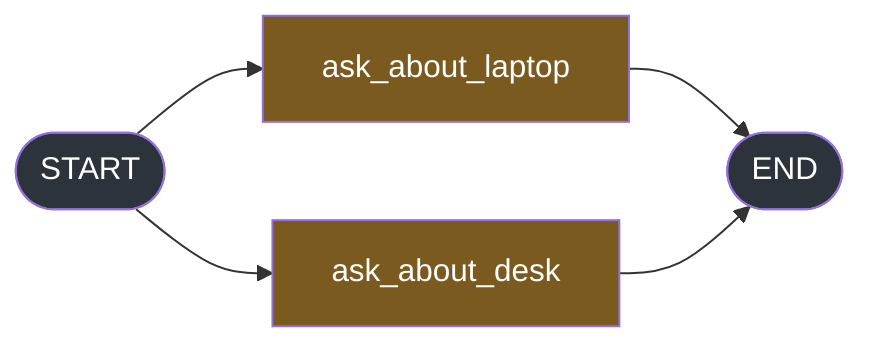

#langgraph #graphs #streaming #lab

**Every item in this folder so far has been produced by a node that finished.** An interrupt is the case where a node stops halfway and waits for a person, and nothing you have learned so far predicts where that shows up.

# Where The Interrupt Arrives

> [!info] An interrupt is not an error and not a result, so neither error handling nor node output reveals it. It arrives on the stream, under a key that looks exactly like a node name.

## A pause is not a return

Everything about streaming so far has been anchored to a node returning. `updates` fires when a node returns. `values` fires once the state has merged. Note 3's whole point was that `custom` is the only channel that works before a return, and note 5 measured how much machinery the operator modes attach to the same moment.

So the first thing to establish about `interrupt()` is that it breaks that anchor. The node does not return.


The node prints on the line before `interrupt()` and on the line after it, so the pause point is visible rather than inferred.

`src/langgraph_lab/note07/a_pauses_inside.py`:

```python
from typing import TypedDict

from langchain_core.runnables import RunnableConfig
from langgraph.checkpoint.memory import InMemorySaver
from langgraph.graph import END, START, StateGraph
from langgraph.types import interrupt


class DeskState(TypedDict):
    answer: str


class DeskUpdate(TypedDict, total=False):
    answer: str


def ask_which_priya(state: DeskState) -> DeskUpdate:
    print("        line 1 of the node ran")
    choice = interrupt({"question": "which Priya did you mean?"})
    print("        line 3 of the node ran")
    return {"answer": f"you picked {choice}"}


def write_answer(state: DeskState) -> DeskUpdate:
    print("        the second node ran")
    return {"answer": state["answer"] + ", noted"}


builder = StateGraph(DeskState)  # ty: ignore[invalid-argument-type]
builder.add_node("ask_which_priya", ask_which_priya)
builder.add_node("write_answer", write_answer)
builder.add_edge(START, "ask_which_priya")
builder.add_edge("ask_which_priya", "write_answer")
builder.add_edge("write_answer", END)
graph = builder.compile(checkpointer=InMemorySaver())

START_STATE: DeskState = {"answer": ""}


if __name__ == "__main__":
    config: RunnableConfig = {"configurable": {"thread_id": "t1"}}

    print("--- what the node prints, and what the stream yields")
    try:
        for item in graph.stream(START_STATE, stream_mode="updates", config=config):
            print(f"    item: {item}")
    except Exception as error:
        print(f"    an exception reached the caller: {type(error).__name__}")
    print("    the stream ended, no exception reached the caller")

    print("\n--- what the graph thinks it is doing now")
    snapshot = graph.get_state(config)
    print(f"    next: {snapshot.next}")
    print(f"    values: {snapshot.values}")
```

```
--- what the node prints, and what the stream yields
        line 1 of the node ran
    item: {'__interrupt__': (Interrupt(value={'question': 'which Priya did you mean?'}, id='c3865d2e...'),)}
    the stream ended, no exception reached the caller

--- what the graph thinks it is doing now
    next: ('ask_which_priya',)
    values: {'answer': ''}
```

Four facts, in one run.

**Line 1 ran and line 3 did not.** The node is suspended between them, mid-body, with local variables that no longer exist anywhere you can reach.

**The second node never ran at all.** No print, no item. The graph did not skip past the pause and carry on.

**No exception reached the caller.** The `try` **around the loop caught nothing**, and the line after it printed normally.

**And there is no `ask_which_priya` update item.** The node produced no return value, so `updates` has nothing from it to report — which is precisely why error handling and node output are both blind to this. **One of them sees exceptions and there was none; the other sees returns and there was none.**

The state confirms the shape of the pause. `next` is `('ask_which_priya',)` — the graph is parked **on** that node, not after it. `values` still holds the untouched start state.

## The node can destroy it before anyone sees it

That last sentence — no exception reached the caller — is worth being precise about, because it does not mean no exception was raised.

`src/langgraph_lab/note07/b_a_node_can_swallow_it.py`:

```python
from typing import TypedDict

from langchain_core.runnables import RunnableConfig
from langgraph.checkpoint.memory import InMemorySaver
from langgraph.errors import GraphInterrupt
from langgraph.graph import END, START, StateGraph
from langgraph.types import interrupt


class DeskState(TypedDict):
    answer: str


class DeskUpdate(TypedDict, total=False):
    answer: str


def plain(state: DeskState) -> DeskUpdate:
    choice = interrupt({"question": "which Priya did you mean?"})
    return {"answer": f"you picked {choice}"}


def guarded(state: DeskState) -> DeskUpdate:
    # the defensive wrapper a careful person puts around anything that can fail
    try:
        choice = interrupt({"question": "which Priya did you mean?"})
        return {"answer": f"you picked {choice}"}
    except Exception as error:
        print(f"        the node's own except caught: {type(error).__name__}")
        return {"answer": "sorry, something went wrong"}


plain_builder = StateGraph(DeskState)  # ty: ignore[invalid-argument-type]
plain_builder.add_node("plain", plain)
plain_builder.add_edge(START, "plain")
plain_builder.add_edge("plain", END)
plain_graph = plain_builder.compile(checkpointer=InMemorySaver())

guarded_builder = StateGraph(DeskState)  # ty: ignore[invalid-argument-type]
guarded_builder.add_node("guarded", guarded)
guarded_builder.add_edge(START, "guarded")
guarded_builder.add_edge("guarded", END)
guarded_graph = guarded_builder.compile(checkpointer=InMemorySaver())

START_STATE: DeskState = {"answer": ""}


if __name__ == "__main__":
    print("--- what interrupt() actually raises")
    print(f"    {[cls.__name__ for cls in GraphInterrupt.__mro__]}")

    print("\n--- the node without a try/except")
    config_one: RunnableConfig = {"configurable": {"thread_id": "t1"}}
    for item in plain_graph.stream(START_STATE, stream_mode="updates", config=config_one):
        print(f"    {item}")
    print(f"    next: {plain_graph.get_state(config_one).next}")

    print("\n--- the same node, wrapped in except Exception")
    config_two: RunnableConfig = {"configurable": {"thread_id": "t2"}}
    for item in guarded_graph.stream(START_STATE, stream_mode="updates", config=config_two):
        print(f"    {item}")
    print(f"    next: {guarded_graph.get_state(config_two).next}")
```

```
--- what interrupt() actually raises
    ['GraphInterrupt', 'GraphBubbleUp', 'Exception', 'BaseException', 'object']

--- the node without a try/except
    {'__interrupt__': (Interrupt(value={'question': 'which Priya did you mean?'}, id='a9c3d0b3...'),)}
    next: ('plain',)

--- the same node, wrapped in except Exception
        the node's own except caught: GraphInterrupt
    {'guarded': {'answer': 'sorry, something went wrong'}}
    next: ()
```

>`interrupt()` raises `GraphInterrupt`, and `GraphInterrupt` inherits from `Exception`. The framework catches it above the node and **turns it into a stream item**, **which is why the caller never sees it**. 

errors.py` says as much on the class itself:

> **Raised** when a **subgraph** is **interrupted**, **suppressed** by the **root graph**. **Never raised directly**, or surfaced to the user.

**A `try/except Exception` inside the node catches it first.** The second graph is the same node with the defensive wrapper a careful person puts around anything that can fail, and the result is a graph that ran to completion, `next: ()`, with a state field reading `sorry, something went wrong`. No interrupt item, no pause, no question asked of anybody.

> [!warning] The pause is destroyed silently, and the turn looks successful
> No error is logged, the stream ends normally, and the checkpoint says the run finished. The only symptom is that a question the product was supposed to ask never got asked, and the user gets an apology instead of a choice.

The rule that follows is narrow and worth keeping: **a node that calls `interrupt()` must not wrap it in a broad `except`.** If the node needs error handling around real work, the `interrupt()` call belongs outside that block, or the handler has to re-raise `GraphBubbleUp` before catching anything else.

## The key sits exactly where a node name sits

Now the interrupt has somewhere to arrive. The graph gets a node in front of the pause, so a real node name lands on the stream first and the two can be compared.


`src/langgraph_lab/note07/c_key_is_not_a_node.py`:

```python
from typing import TypedDict

from langchain_core.runnables import RunnableConfig
from langgraph.checkpoint.memory import InMemorySaver
from langgraph.graph import END, START, StateGraph
from langgraph.types import interrupt


class DeskState(TypedDict):
    answer: str


class DeskUpdate(TypedDict, total=False):
    answer: str


def look_up_priya(state: DeskState) -> DeskUpdate:
    return {"answer": "found two people called Priya"}


def ask_which_priya(state: DeskState) -> DeskUpdate:
    choice = interrupt({"question": "which Priya did you mean?"})
    return {"answer": f"you picked {choice}"}


builder = StateGraph(DeskState)  # ty: ignore[invalid-argument-type]
builder.add_node("look_up_priya", look_up_priya)
builder.add_node("ask_which_priya", ask_which_priya)
builder.add_edge(START, "look_up_priya")
builder.add_edge("look_up_priya", "ask_which_priya")
builder.add_edge("ask_which_priya", END)
graph = builder.compile(checkpointer=InMemorySaver())

START_STATE: DeskState = {"answer": ""}


if __name__ == "__main__":
    print("--- the raw items, updates mode")
    config_one: RunnableConfig = {"configurable": {"thread_id": "t1"}}
    for item in graph.stream(START_STATE, stream_mode="updates", config=config_one):
        print(f"    {item}")

    print("\n--- a renderer that reads the key as a node name")
    config_two: RunnableConfig = {"configurable": {"thread_id": "t2"}}
    for item in graph.stream(START_STATE, stream_mode="updates", config=config_two):
        for node_name in item:
            print(f"    screen: {node_name} has finished")

    print("\n--- the same renderer, reaching into the payload for the answer")
    config_three: RunnableConfig = {"configurable": {"thread_id": "t3"}}
    try:
        for item in graph.stream(START_STATE, stream_mode="updates", config=config_three):
            for node_name, payload in item.items():
                print(f"    screen: {payload.get('answer')}")
    except Exception as error:
        print(f"    {type(error).__name__}: {error}")
```

```
--- the raw items, updates mode
    {'look_up_priya': {'answer': 'found two people called Priya'}}
    {'__interrupt__': (Interrupt(value={'question': 'which Priya did you mean?'}, id='1c8e258c...'),)}
```

Two items, structurally identical from the outside: a dict with one key, whose value is the payload. Note 2 taught that the key of an `updates` item is the name of the node that produced it, and that is true of the first item and false of the second.

```
--- a renderer that reads the key as a node name
    screen: look_up_priya has finished
    screen: __interrupt__ has finished
```

**No exception, and a line on the screen naming a node that does not exist.** The renderer is not broken in any way it can detect — it received a dict with one key and did what it always does.

Reaching one level deeper is where it stops being cosmetic:

```
--- the same renderer, reaching into the payload for the answer
    screen: found two people called Priya
    AttributeError: 'tuple' object has no attribute 'get'
```

An `updates` payload is the dict a node returned. The interrupt payload is a tuple. So a consumer that treats every item uniformly gets one good line and then a crash, in the middle of a turn, with an error message that mentions neither interrupts nor streaming.

> [!important] The two things a node-name consumer gets wrong
> The key is not a node name, and the payload is not an update dict. Either one alone would be a bug; together they mean the failure can be silent or loud depending only on how far into the payload the code reaches.

## values carries it too, under the same key

The obvious next question is whether the interrupt is an `updates` phenomenon. It is not — and the answer is worth having exactly, because a consumer built on `values` will meet it in a different shape.

The graph is imported from the file above rather than rebuilt, so the runs are comparable.

`src/langgraph_lab/note07/d_values_carries_it_too.py`:

```python
from langchain_core.runnables import RunnableConfig

from langgraph_lab.note07.c_key_is_not_a_node import START_STATE, graph

if __name__ == "__main__":
    print("--- updates: the interrupt is an item of its own")
    config_one: RunnableConfig = {"configurable": {"thread_id": "t1"}}
    for item in graph.stream(START_STATE, stream_mode="updates", config=config_one):
        print(f"    {item}")

    print("\n--- values: the same key, riding on a state item")
    config_two: RunnableConfig = {"configurable": {"thread_id": "t2"}}
    for item in graph.stream(START_STATE, stream_mode="values", config=config_two):
        print(f"    {item}")

    print("\n--- custom: nothing at all")
    config_three: RunnableConfig = {"configurable": {"thread_id": "t3"}}
    for item in graph.stream(START_STATE, stream_mode="custom", config=config_three):
        print(f"    {item}")
    print("    (stream ended)")
```

```
--- updates: the interrupt is an item of its own
    {'look_up_priya': {'answer': 'found two people called Priya'}}
    {'__interrupt__': (Interrupt(value={'question': 'which Priya did you mean?'}, id='696f6ed3...'),)}

--- values: the same key, riding on a state item
    {'answer': ''}
    {'answer': 'found two people called Priya'}
    {'answer': 'found two people called Priya', '__interrupt__': (Interrupt(value={'question': 'which Priya did you mean?'}, id='d0617acd...'),)}

--- custom: nothing at all
    (stream ended)
```

**The key is the same in both. The shape around it is not.**

| Mode | How it arrives |
|---|---|
| `updates` | its own item, the only key in the dict |
| `values` | a field alongside the state, on the last item |
| `custom` | not at all |

In `updates` the interrupt replaces what would have been a node's update. In `values` it is glued onto a state snapshot, sitting next to `answer` as though it were another state field — and `DeskState` has exactly one field, `answer`, so `__interrupt__` is a key that is not in the schema and never will be.

That is the second trap in this note for anyone iterating keys. A `values` consumer walking the state dict to render fields will walk straight into it.

`custom` is the control, and it says the interrupt is not a general broadcast — it is carried by the modes that describe what the graph did, and the writer channel knows nothing about it.

## Two unwrappings to reach the question

The payload has been printed several times now without being taken apart. It is worth doing once, because the shape is not what the key suggests.

`src/langgraph_lab/note07/e_unwrap_the_payload.py`:

```python
from typing import Any

from langchain_core.runnables import RunnableConfig

from langgraph_lab.note07.c_key_is_not_a_node import START_STATE, graph

if __name__ == "__main__":
    config: RunnableConfig = {"configurable": {"thread_id": "t1"}}

    payload: Any = None
    for item in graph.stream(START_STATE, stream_mode="updates", config=config):
        if "__interrupt__" in item:
            payload = item["__interrupt__"]

    print("--- what sits under the __interrupt__ key")
    print(f"    type      {type(payload).__name__}")
    print(f"    length    {len(payload)}")
    print(f"    repr      {payload}")

    first = payload[0]
    print("\n--- the first element of that tuple")
    print(f"    type      {type(first).__name__}")
    print(f"    .id       {first.id}")
    print(f"    .value    {first.value}")

    print("\n--- the question the node actually asked")
    print(f"    {first.value['question']}")
```

```
--- what sits under the __interrupt__ key
    type      tuple
    length    1
    repr      (Interrupt(value={'question': 'which Priya did you mean?'}, id='3c6d2e3f...'),)

--- the first element of that tuple
    type      Interrupt
    .id       3c6d2e3fdf220eef282b961187f0353f
    .value    {'question': 'which Priya did you mean?'}

--- the question the node actually asked
    which Priya did you mean?
```

**A tuple, then an object, then the payload.** Three levels between the key and the thing a person is supposed to read, and the key is singular while the container is plural.

The length is 1 here, and it stays 1 more often than the plural name suggests — two nodes interrupting in the same step produce two items of length 1 rather than one item of length 2, which the last section of this note measures. A length that is almost always 1 is exactly the length that makes people write `payload.value` and ship it.

`types.py` gives the two fields and nothing else:

> `value` — The value associated with the interrupt.
> `id` — The ID of the interrupt. Can be used to resume the interrupt directly.

`.value` is whatever the node passed to `interrupt()`, unchanged. `.id` matters more than it looks, and the next section is why.

## Combining modes multiplies it

The interrupt does not move when several modes are requested. It does something less convenient than moving.

`src/langgraph_lab/note07/f_modes_do_not_move_it.py`:

```python
from langchain_core.runnables import RunnableConfig

from langgraph_lab.note07.c_key_is_not_a_node import START_STATE, graph

if __name__ == "__main__":
    print("--- updates alone")
    config_one: RunnableConfig = {"configurable": {"thread_id": "t1"}}
    for item in graph.stream(START_STATE, stream_mode="updates", config=config_one):
        print(f"    {item}")

    print("\n--- updates, values and custom together")
    config_two: RunnableConfig = {"configurable": {"thread_id": "t2"}}
    for mode, data in graph.stream(
        START_STATE, stream_mode=["updates", "values", "custom"], config=config_two
    ):
        print(f"    {mode:<9} {data}")

    print("\n--- how many times the interrupt appeared in that combined run")
    config_three: RunnableConfig = {"configurable": {"thread_id": "t3"}}
    appearances = 0
    for mode, data in graph.stream(
        START_STATE, stream_mode=["updates", "values", "custom"], config=config_three
    ):
        if "__interrupt__" in data:
            appearances = appearances + 1
            print(f"    once in {mode}")
    print(f"    total: {appearances}")
```

```
--- updates, values and custom together
    values    {'answer': ''}
    updates   {'look_up_priya': {'answer': 'found two people called Priya'}}
    values    {'answer': 'found two people called Priya'}
    updates   {'__interrupt__': (Interrupt(value={'question': 'which Priya did you mean?'}, id='f54a8a45...'),)}
    values    {'answer': 'found two people called Priya', '__interrupt__': (Interrupt(value={'question': 'which Priya did you mean?'}, id='f54a8a45...'),)}

--- how many times the interrupt appeared in that combined run
    once in updates
    once in values
    total: 2
```

**One pause, two deliveries, and the same `id` on both.**

This is note 6's additive rule doing exactly what it promised and producing a problem anyway. `updates` yields what `updates` always yields. `values` yields what `values` always yields. Neither series knows about the other, and the interrupt is in both, so a consumer subscribed to both sees the same question twice.

> [!important] `.id` is what tells the two copies apart
> Two items, two modes, one interrupt, one `id`. A consumer handling more than one mode has to dedupe on `Interrupt.id` or it will ask the user the same question twice — and the second copy arrives a few microseconds after the first, far too fast for any human-facing debounce to help.
>
> Deduplication is the smaller of the two jobs that field does. The larger one is resuming, and the last section of this note is where it becomes mandatory.

Note 5's rule about picking one mode per audience is what avoids this in practice. The moment a client-side consumer handles two modes that both carry interrupts, deduplication stops being optional.

## The stream ends, the work does not

There is one more thing the interrupt does, and it is the one that decides how the surrounding code has to be built.

`src/langgraph_lab/note07/g_the_stream_ends.py`:

```python
from langchain_core.runnables import RunnableConfig

from langgraph_lab.note07.c_key_is_not_a_node import START_STATE, graph

if __name__ == "__main__":
    config: RunnableConfig = {"configurable": {"thread_id": "t1"}}

    print("--- draining the stream by hand")
    stream = graph.stream(START_STATE, stream_mode="updates", config=config)
    print(f"    item 1: {next(stream)}")
    print(f"    item 2: {next(stream)}")
    try:
        print(f"    item 3: {next(stream)}")
    except StopIteration:
        print("    item 3: StopIteration, the generator is exhausted")

    print("\n--- but the graph has work left")
    snapshot = graph.get_state(config)
    print(f"    next:   {snapshot.next}")
    print(f"    values: {snapshot.values}")
    print(f"    tasks:  {len(snapshot.tasks)} pending")
```

Draining the generator by hand rather than with a `for` loop makes the ending explicit — the third `next()` is asked for and refused.

```
--- draining the stream by hand
    item 1: {'look_up_priya': {'answer': 'found two people called Priya'}}
    item 2: {'__interrupt__': (Interrupt(value={'question': 'which Priya did you mean?'}, id='4c36bec4...'),)}
    item 3: StopIteration, the generator is exhausted

--- but the graph has work left
    next:   ('ask_which_priya',)
    values: {'answer': 'found two people called Priya'}
    tasks:  1 pending
```

**The generator is finished and the graph is not.** `next` names a node that has not run, there is one pending task, and the state holds a half-finished answer.

Those two facts together are the whole design constraint. A generator that ends is indistinguishable, from the consumer's side, from a generator that ended because the graph completed — note 1 established that `stream()` ending is the normal way a turn finishes. So **the interrupt item is the only evidence that this ending is a pause rather than a completion**, and a consumer that fails to recognise it will report the turn as done.

That is also why a missed interrupt looks like a hang from the user's side: the connection closes, no answer was rendered, and nothing is coming.

## A paused turn is two streams

If the stream ends and the work remains, resuming cannot be something you do to the stream you have. It is a new call.

`src/langgraph_lab/note07/h_resume_is_a_new_stream.py`:

```python
from langchain_core.runnables import RunnableConfig
from langgraph.types import Command

from langgraph_lab.note07.c_key_is_not_a_node import START_STATE, graph

if __name__ == "__main__":
    config: RunnableConfig = {"configurable": {"thread_id": "t1"}}

    print("--- stream 1, from the start")
    first_count = 0
    for item in graph.stream(START_STATE, stream_mode="updates", config=config):
        first_count = first_count + 1
        print(f"    item {first_count}: {item}")

    print("\n--- stream 2, resuming the same thread")
    second_count = 0
    for item in graph.stream(Command(resume="Priya S"), stream_mode="updates", config=config):
        second_count = second_count + 1
        print(f"    item {second_count}: {item}")

    print("\n--- what each stream counted")
    print(f"    stream 1 yielded {first_count} items")
    print(f"    stream 2 yielded {second_count} items")
    print(f"    one turn, {first_count + second_count} items, across two generators")

    print("\n--- where the thread ended up")
    snapshot = graph.get_state(config)
    print(f"    next:   {snapshot.next}")
    print(f"    values: {snapshot.values}")

    print("\n--- the same two streams again, in values mode, on a fresh thread")
    other: RunnableConfig = {"configurable": {"thread_id": "t2"}}
    print("    stream 1")
    for item in graph.stream(START_STATE, stream_mode="values", config=other):
        print(f"        {item}")
    print("    stream 2")
    for item in graph.stream(Command(resume="Priya S"), stream_mode="values", config=other):
        print(f"        {item}")
```

```
--- stream 1, from the start
    item 1: {'look_up_priya': {'answer': 'found two people called Priya'}}
    item 2: {'__interrupt__': (Interrupt(value={'question': 'which Priya did you mean?'}, id='9d955341...'),)}

--- stream 2, resuming the same thread
    item 1: {'ask_which_priya': {'answer': 'you picked Priya S'}}

--- what each stream counted
    stream 1 yielded 2 items
    stream 2 yielded 1 items
    one turn, 3 items, across two generators
```

The resume is `graph.stream(Command(resume="Priya S"), ...)` on the same `thread_id`. Where the input to the first call was a state dict, the input to the second is a command, and the thread id is what makes them the same conversation.

**The second stream does not replay the graph.** `look_up_priya` produced nothing the second time — it had already run, and its result was in the checkpoint. The new stream picks up at the node that was pending.

`values` shows the same thing from the state side:

```
    stream 1
        {'answer': ''}
        {'answer': 'found two people called Priya'}
        {'answer': 'found two people called Priya', '__interrupt__': (...)}
    stream 2
        {'answer': 'found two people called Priya'}
        {'answer': 'you picked Priya S'}
```

Stream 2 opens on the state as it stood at the pause, not on the original input. There is no second `{'answer': ''}`.

> [!important] Every per-stream quantity restarts
> The item counter in the lab file goes back to 1. So does anything else scoped to the generator — a first-item latency measurement, a sequence number sent to the browser, an accumulated token count, a spinner that was going to be cleared by the last item. One turn produced 3 items across two generators, and no single generator saw all three.

That is the cost of the pause, and it is paid entirely outside LangGraph. The graph is well behaved — it stopped, it persisted, it resumed at the right node. Everything that was counting has to be told that a turn and a stream are not the same unit.

## Two at once, and the resume you know stops working

Every interrupt so far has been alone. The tuple under `__interrupt__` has been length 1 every time, and `Command(resume=value)` has worked without argument.

Both of those are properties of having exactly one pending interrupt, and a step with two nodes in it breaks both.



Two nodes off `START`, so both run in one step, and both ask a question. The state uses an `add` reducer on `notes` so the two answers can land side by side rather than overwriting each other.

`src/langgraph_lab/note07/i_two_at_once.py`:

```python
from operator import add
from typing import Annotated, TypedDict

from langchain_core.runnables import RunnableConfig
from langgraph.checkpoint.memory import InMemorySaver
from langgraph.graph import END, START, StateGraph
from langgraph.types import Command, interrupt


class DeskState(TypedDict):
    notes: Annotated[list[str], add]


class DeskUpdate(TypedDict, total=False):
    notes: list[str]


def ask_about_laptop(state: DeskState) -> DeskUpdate:
    choice = interrupt({"question": "which laptop?"})
    return {"notes": [f"laptop={choice}"]}


def ask_about_desk(state: DeskState) -> DeskUpdate:
    choice = interrupt({"question": "which desk?"})
    return {"notes": [f"desk={choice}"]}


builder = StateGraph(DeskState)  # ty: ignore[invalid-argument-type]
builder.add_node("ask_about_laptop", ask_about_laptop)
builder.add_node("ask_about_desk", ask_about_desk)
builder.add_edge(START, "ask_about_laptop")
builder.add_edge(START, "ask_about_desk")
builder.add_edge("ask_about_laptop", END)
builder.add_edge("ask_about_desk", END)
graph = builder.compile(checkpointer=InMemorySaver())

START_STATE: DeskState = {"notes": []}


if __name__ == "__main__":
    config: RunnableConfig = {"configurable": {"thread_id": "t1"}}

    print("--- two nodes in one step, both interrupting")
    for item in graph.stream(START_STATE, stream_mode="updates", config=config):
        print(f"    {item}")

    snapshot = graph.get_state(config)
    print(f"\n    next:  {snapshot.next}")
    print(f"    tasks: {len(snapshot.tasks)} pending")

    print("\n--- resuming the way a single interrupt is resumed")
    try:
        for item in graph.stream(Command(resume="the 14 inch one"), stream_mode="updates", config=config):
            print(f"    {item}")
    except RuntimeError as error:
        print(f"    RuntimeError: {error}")

    print("\n--- the pending questions, read off get_state().tasks")
    pending = {}
    for task in graph.get_state(config).tasks:
        for one in task.interrupts:
            pending[one.id] = one.value["question"]
            print(f"    {one.id}  {one.value['question']}")

    answers = {}
    for interrupt_id, question in pending.items():
        if question == "which laptop?":
            answers[interrupt_id] = "the 14 inch one"
        if question == "which desk?":
            answers[interrupt_id] = "the standing one"

    print("\n--- resuming with a map of interrupt id to answer")
    for item in graph.stream(Command(resume=answers), stream_mode="updates", config=config):
        print(f"    {item}")
    print(f"    final state: {graph.get_state(config).values}")
```

```
--- two nodes in one step, both interrupting
    {'__interrupt__': (Interrupt(value={'question': 'which desk?'}, id='7f8c84a9...'),)}
    {'__interrupt__': (Interrupt(value={'question': 'which laptop?'}, id='0a4fd96f...'),)}

    next:  ('ask_about_laptop', 'ask_about_desk')
    tasks: 2 pending
```

**Two items, each holding a tuple of length 1.** Not one item with two `Interrupt` objects in it — which is the natural guess from a plural container, and it is wrong. Each interrupting task produces its own item, and the tuple stays length 1.

Both arrive before the stream ends, so a consumer that stops reading at the first one leaves a question on the floor.

```
--- resuming the way a single interrupt is resumed
    RuntimeError: When there are multiple pending interrupts, you must specify the interrupt id when resuming.
```

**`Command(resume=value)` raises.** The form that has worked in every earlier section is refused, and the refusal is deliberate rather than a missing feature — a bare value cannot say which of the two questions it answers, so the count is checked and the run gives up rather than guessing.

The answers have to be addressed, which means reading the pending ids off the state:

```
--- the pending questions, read off get_state().tasks
    0a4fd96f6a4007283c4253e01d3eadb5  which laptop?
    7f8c84a9115f437b2c5daf4477efceac  which desk?

--- resuming with a map of interrupt id to answer
    {'ask_about_desk': {'notes': ['desk=the standing one']}}
    {'ask_about_laptop': {'notes': ['laptop=the 14 inch one']}}
    final state: {'notes': ['desk=the standing one', 'laptop=the 14 inch one']}
```

One call, two nodes resumed, each with its own answer.

> [!important] This is what `.id` is actually for
> Deduplicating two copies of one interrupt is the incidental use. The load-bearing one is this: with more than one pause outstanding, the id is the only thing that connects an answer to the question it answers, and there is no positional or node-name alternative.

The two shapes are told apart by the keys themselves, not by a flag you set. A dict counts as a map of answers only when **every** key looks like an interrupt id, so a dict that is somebody's answer to a single question still resumes as a plain value. The two cases never collide, and neither one has to declare itself.

**Which means an interrupt consumer has two modes of operation, decided by a count it does not control.** One pending pause and a bare value works; two and the same code raises at the top of the next run, before any node executes. A graph that gains a parallel branch acquires that behaviour without a single line of the streaming code changing.
