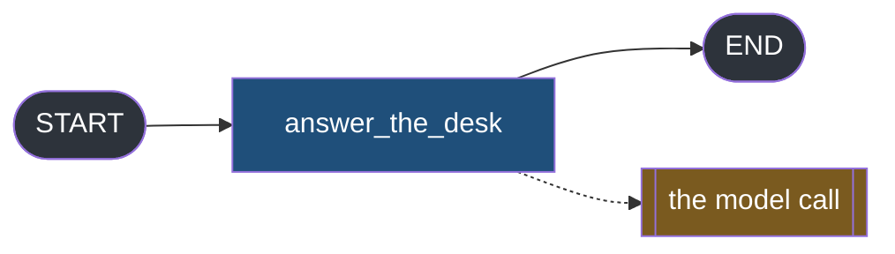
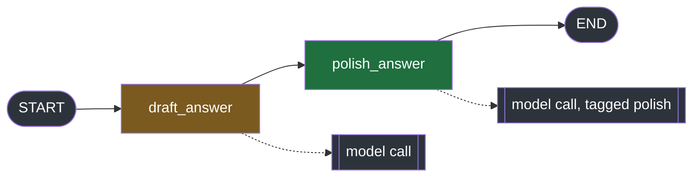
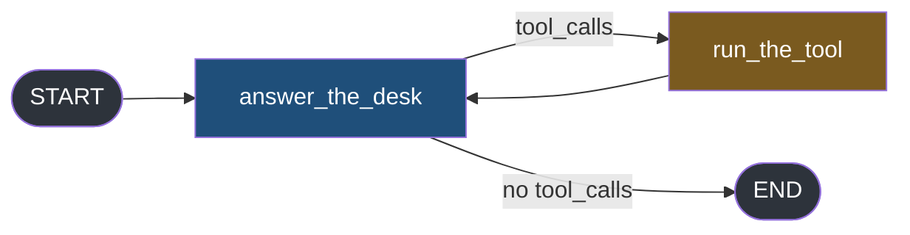

#langgraph #graphs #streaming #lab

**The other six modes report what the graph did.** This one reports what a model said while a node was still inside it, which makes it the only mode whose output depends on code the graph never sees.

# messages Mode

> [!info] Every other mode is a property of the graph. `messages` is a property of the model call, and asking for the mode changes how that call executes.

## The lab now has a model

Notes 1 to 8 needed no provider, because nothing in them depended on a model existing. This one cannot be run without one.

The lab uses Groq, with the key in a `.env` at the project root that is gitignored, loaded by `load_dotenv()`:

```
uv add langchain-groq python-dotenv
```

The model is `openai/gpt-oss-20b` at `reasoning_effort="low"`, which matters for what you are about to see — it is a reasoning model, so it emits two kinds of fragment, and the first several carry no answer text at all.

> [!note] Run these files yourself and some numbers will not match
> A model decides how long to reason and how many pieces to send its answer in, so the same file printed 69 items on one run and 44 on the next, with nothing changed. Any count that came from the model is like that.
>
> The counts that come from the framework do not move. Zero fragments from a `nostream` call is zero every time. One item from a model with streaming disabled is one every time. So is the number of message objects a node returns, and so is which node a fragment is labelled with.
>
> **When a number in this note is 0 or 1, it is a fact about LangGraph and it will reproduce. When it is 44 or 69, it is a fact about one run and yours will differ.**

## An item is a pair



`src/langgraph_lab/note09/a_messages_shape.py`:

```python
from typing import Annotated, Any, TypedDict

from dotenv import load_dotenv
from langchain_core.messages import AnyMessage, HumanMessage
from langchain_groq import ChatGroq
from langgraph.graph import END, START, StateGraph
from langgraph.graph.message import add_messages

load_dotenv()

model = ChatGroq(model="openai/gpt-oss-20b", reasoning_effort="low", max_tokens=250)


class DeskState(TypedDict):
    messages: Annotated[list[AnyMessage], add_messages]


def answer_the_desk(state: DeskState) -> dict:
    reply = model.invoke(state["messages"])
    return {"messages": [reply]}


builder = StateGraph(DeskState)  # ty: ignore[invalid-argument-type]
builder.add_node("answer_the_desk", answer_the_desk)
builder.add_edge(START, "answer_the_desk")
builder.add_edge("answer_the_desk", END)
graph = builder.compile()

QUESTION = "Reply to the reception desk in one sentence, using only these facts: Priya has 12 leave days left, and has already taken 3."
START_STATE: DeskState = {"messages": [HumanMessage(content=QUESTION)]}


if __name__ == "__main__":
    # annotated because stream() is typed loosely enough that ty reads items as dicts
    items: list[Any] = list(graph.stream(START_STATE, stream_mode="messages"))

    print("--- what one item is")
    first = items[0]
    print(f"    the item     {type(first).__name__} of {len(first)}")
    print(f"    element 0    {type(first[0]).__name__}")
    print(f"    element 1    {type(first[1]).__name__} with {len(first[1])} keys")

    print(f"\n--- {len(items)} items, and what each chunk carries")
    for chunk, metadata in items[:12]:
        reasoning = chunk.additional_kwargs.get("reasoning_content", "")
        print(f"    content={str(chunk.content)!r:<12} reasoning={str(reasoning)!r}")

    print("\n--- the text, rebuilt by joining every content in order")
    print(f"    {''.join(str(chunk.content) for chunk, metadata in items)!r}")
```

```
--- what one item is
    the item     tuple of 2
    element 0    AIMessageChunk
    element 1    dict with 13 keys
```

**A 2-tuple, and it is a 2-tuple with a single mode requested.** Note 6 established that a bare `stream_mode` **string** yields the payload alone, and every mode obeyed that. This one does not — `messages` is a tuple before any list or `subgraphs=True` is involved, because the metadata is not optional. A fragment without the metadata cannot be placed.

```
--- 69 items, and what each chunk carries
    content=''           reasoning=''
    content=''           reasoning='Need'
    content=''           reasoning=' one'
    content=''           reasoning=' sentence'
    content=''           reasoning=' reply'
    content=''           reasoning=' to'
    content=''           reasoning=' reception'
    content=''           reasoning=' desk'
    content=''           reasoning=','
    content=''           reasoning=' using'
    content=''           reasoning=' only'
    content=''           reasoning=' facts'

--- the text, rebuilt by joining every content in order
    'Priya has 12 leave days remaining, having already taken 3 days.'
```

Two things to take from that.

**The answer is the concatenation of the fragments, in arrival order.** No index, no reassembly, no sorting — `''.join(...)` over `content` gives the sentence back exactly.

**And the first fragments carry nothing.** `content` is empty while the model reasons, and the words land in `additional_kwargs["reasoning_content"]` instead. 

>A renderer that appends `content` to the screen for every item displays nothing at all for the first stretch and then starts abruptly — **which looks like a slow first token and is actually a stream that has been flowing the whole time.**

## Asking for the mode changes how the call runs

The node above calls `model.invoke(...)`. Not `.stream()`. And 69 fragments arrived.

**Take one rule from this section and it is this: `messages` is the only mode that can be switched off by the model object, from a file the graph never mentions.** Everything below is the demonstration of that.

`src/langgraph_lab/note09/b_the_mode_changes_the_call.py`:

```python
from typing import Annotated, Any, TypedDict

from dotenv import load_dotenv
from langchain_core.messages import AnyMessage, HumanMessage
from langchain_groq import ChatGroq
from langgraph.graph import END, START, StateGraph
from langgraph.graph.message import add_messages

load_dotenv()

streaming_allowed = ChatGroq(model="openai/gpt-oss-20b", reasoning_effort="low", max_tokens=250)
streaming_disabled = ChatGroq(
    model="openai/gpt-oss-20b", reasoning_effort="low", max_tokens=250, disable_streaming=True
)


class DeskState(TypedDict):
    messages: Annotated[list[AnyMessage], add_messages]


def answer_allowed(state: DeskState) -> dict:
    # note the method: invoke, not stream
    return {"messages": [streaming_allowed.invoke(state["messages"])]}


def answer_disabled(state: DeskState) -> dict:
    # the identical line, against a model built with disable_streaming=True
    return {"messages": [streaming_disabled.invoke(state["messages"])]}


allowed_builder = StateGraph(DeskState)  # ty: ignore[invalid-argument-type]
allowed_builder.add_node("answer_the_desk", answer_allowed)
allowed_builder.add_edge(START, "answer_the_desk")
allowed_builder.add_edge("answer_the_desk", END)
allowed_graph = allowed_builder.compile()

disabled_builder = StateGraph(DeskState)  # ty: ignore[invalid-argument-type]
disabled_builder.add_node("answer_the_desk", answer_disabled)
disabled_builder.add_edge(START, "answer_the_desk")
disabled_builder.add_edge("answer_the_desk", END)
disabled_graph = disabled_builder.compile()

QUESTION = "Reply to the reception desk in one sentence, using only these facts: Priya has 12 leave days left, and has already taken 3."
START_STATE: DeskState = {"messages": [HumanMessage(content=QUESTION)]}


if __name__ == "__main__":
    print("--- no graph at all: the two methods behave differently, as you would expect")
    one = streaming_allowed.invoke(QUESTION)
    many = list(streaming_allowed.stream(QUESTION))
    print(f"    invoke  gave 1 {type(one).__name__}")
    print(f"    stream  gave {len(many)} {type(many[0]).__name__}")

    print("\n--- inside a graph, stream_mode=messages, node calls invoke")
    allowed: list[Any] = list(allowed_graph.stream(START_STATE, stream_mode="messages"))
    print(f"    {len(allowed)} items, {set(type(chunk).__name__ for chunk, metadata in allowed)}")
    print(f"    text: {''.join(str(chunk.content) for chunk, metadata in allowed)!r}")

    print("\n--- the same graph, the same invoke, disable_streaming=True")
    disabled: list[Any] = list(disabled_graph.stream(START_STATE, stream_mode="messages"))
    print(f"    {len(disabled)} items, {set(type(chunk).__name__ for chunk, metadata in disabled)}")
    print(f"    text: {''.join(str(chunk.content) for chunk, metadata in disabled)!r}")

    print("\n--- and updates mode cannot tell the two graphs apart")
    for item in allowed_graph.stream(START_STATE, stream_mode="updates"):
        print(f"    allowed  {len(item['answer_the_desk']['messages'])} message returned")
    for item in disabled_graph.stream(START_STATE, stream_mode="updates"):
        print(f"    disabled {len(item['answer_the_desk']['messages'])} message returned")
```

The first block is the baseline, and it holds no surprises — outside any graph, the two methods do what their names say:

```
--- no graph at all: the two methods behave differently, as you would expect
    invoke  gave 1 AIMessage
    stream  gave 62 AIMessageChunk
```

Now the same `invoke`, called from inside a node:

```
--- inside a graph, stream_mode=messages, node calls invoke
    64 items, {'AIMessageChunk'}
    text: 'Priya has 12 leave days remaining and has already taken 3.'
```

**`invoke` produced fragments.** The line of code did not change, the method did not change, and the return value the node received is still one message. What changed is that somebody asked the graph for `messages` mode.

```
--- the same graph, the same invoke, disable_streaming=True
    1 items, {'AIMessage'}
    text: 'Priya currently has 12 leave days remaining and has already taken 3 of them.'
```

And back to one item, of a different class — `AIMessage`, a complete message rather than a fragment.

| Where the call happens | Items on the stream |
|---|---|
| outside a graph, plain `invoke` | 1 complete message |
| inside a graph, `messages` requested | 64 fragments |
| inside a graph, `disable_streaming=True` | 1 complete message |

Three contexts, one model, one method. The middle row is the odd one, and the mode is what put it there.

The reason is that `invoke` does not always call the model the slow way. It checks whether anything is listening for tokens, and takes the streaming path if something is — collecting the pieces, handing each one to the listener as it arrives, then gluing them together for its return value. **One call, two audiences**: the node gets the glued message, the stream gets the pieces.

Requesting `messages` is what puts a listener there. `disable_streaming=True` blocks the streaming path outright, so there is nothing for a listener to receive. The decision lives in `langchain_core`, not in LangGraph, which is worth remembering only for the day you have to go looking for it.

> [!important] This is the one mode a graph cannot promise
> The last block is the proof: `updates` reports one message returned in both graphs, because the graph did the same thing both times. Only `messages` moved. So a graph that streams beautifully in your test can go silent in production because of how somebody constructed a model object somewhere else.

## Where a fragment came from

Sixty-nine fragments with no way to tell them apart would be useless the moment a graph has two model calls. That is what the second element is for.



`src/langgraph_lab/note09/c_where_the_chunk_came_from.py`:

```python
from typing import Annotated, Any, TypedDict

from dotenv import load_dotenv
from langchain_core.messages import AnyMessage, HumanMessage
from langchain_groq import ChatGroq
from langgraph.graph import END, START, StateGraph
from langgraph.graph.message import add_messages

load_dotenv()

model = ChatGroq(model="openai/gpt-oss-20b", reasoning_effort="low", max_tokens=250)


class DeskState(TypedDict):
    messages: Annotated[list[AnyMessage], add_messages]
    draft: str


def draft_answer(state: DeskState) -> dict:
    reply = model.invoke(state["messages"])
    return {"draft": str(reply.content)}


def polish_answer(state: DeskState) -> dict:
    tagged = model.with_config(tags=["polish"])
    reply = tagged.invoke(f"Rewrite this in a friendlier tone, one sentence: {state['draft']}")
    return {"messages": [reply]}


builder = StateGraph(DeskState)  # ty: ignore[invalid-argument-type]
builder.add_node("draft_answer", draft_answer)
builder.add_node("polish_answer", polish_answer)
builder.add_edge(START, "draft_answer")
builder.add_edge("draft_answer", "polish_answer")
builder.add_edge("polish_answer", END)
graph = builder.compile()

QUESTION = "Reply in one sentence, using only these facts: Priya has 12 leave days left, and has already taken 3."
START_STATE: DeskState = {"messages": [HumanMessage(content=QUESTION)], "draft": ""}


if __name__ == "__main__":
    items: list[Any] = list(graph.stream(START_STATE, stream_mode="messages"))

    print("--- the metadata keys on one chunk")
    for key in sorted(items[0][1]):
        print(f"    {key}")

    print("\n--- how many chunks each node produced")
    per_node: dict[str, int] = {}
    for chunk, metadata in items:
        node = metadata["langgraph_node"]
        per_node[node] = per_node.get(node, 0) + 1
    for node, count in per_node.items():
        print(f"    {node:<15} {count}")


    print("\n--- the tags on a chunk from each node")
    for node in per_node:
        for chunk, metadata in items:
            if metadata["langgraph_node"] == node:
                print(f"    {node:<15} tags={metadata.get('tags')}")
                break

    print("\n--- only the polished text, selected by tag")
    polished = ""
    for chunk, metadata in items:
        if "polish" in (metadata.get("tags") or []):
            polished = polished + str(chunk.content)
    print(f"    {polished!r}")
```

```
--- the metadata keys on one chunk
    checkpoint_ns
    langgraph_checkpoint_ns
    langgraph_node
    langgraph_path
    langgraph_step
    langgraph_triggers
    lc_versions
    ls_integration
    ls_max_tokens
    ls_model_name
    ls_model_type
    ls_provider
    ls_temperature
```

Thirteen keys, on every single fragment. That is the cost of the pair — the same dictionary, repeated 69 times, to carry the two or three keys that are actually used.

```
--- how many chunks each node produced
    draft_answer    26
    polish_answer   28

--- the tags on a chunk from each node
    draft_answer    tags=None
    polish_answer   tags=['polish']

--- only the polished text, selected by tag
    'Priya still has 12 leave days left, and she’s already taken 3 of them.'
```

**Twenty-six of those fragments must never reach a screen.** The draft is an internal step; showing it would put a first attempt and a rewrite in front of the user, one after the other.

`metadata["langgraph_node"]` separates them by where they came from, and `metadata["tags"]` separates them by what the call was marked as. The tag is the better tool of the two, because it survives a node being renamed or split and it is set at the call site, next to the reason.

## The tag that turns a call off

Selecting on the way out works. There is also a way to stop a call from being reported at all.

`src/langgraph_lab/note09/d_nostream.py`:

```python
from typing import Annotated, Any, TypedDict

from dotenv import load_dotenv
from langchain_core.messages import AnyMessage, HumanMessage
from langchain_groq import ChatGroq
from langgraph.graph import END, START, StateGraph
from langgraph.graph.message import add_messages

load_dotenv()

model = ChatGroq(model="openai/gpt-oss-20b", reasoning_effort="low", max_tokens=250)


class DeskState(TypedDict):
    messages: Annotated[list[AnyMessage], add_messages]
    draft: str


def draft_answer(state: DeskState) -> dict:
    # the same call as before, with one tag added
    hidden = model.with_config(tags=["nostream"])
    reply = hidden.invoke(state["messages"])
    return {"draft": str(reply.content)}


def polish_answer(state: DeskState) -> dict:
    reply = model.invoke(f"Rewrite this in a friendlier tone, one sentence: {state['draft']}")
    return {"messages": [reply]}


builder = StateGraph(DeskState)  # ty: ignore[invalid-argument-type]
builder.add_node("draft_answer", draft_answer)
builder.add_node("polish_answer", polish_answer)
builder.add_edge(START, "draft_answer")
builder.add_edge("draft_answer", "polish_answer")
builder.add_edge("polish_answer", END)
graph = builder.compile()

QUESTION = "Reply in one sentence, using only these facts: Priya has 12 leave days left, and has already taken 3."
START_STATE: DeskState = {"messages": [HumanMessage(content=QUESTION)], "draft": ""}


if __name__ == "__main__":
    items: list[Any] = list(graph.stream(START_STATE, stream_mode="messages"))

    print("--- how many chunks each node produced now")
    per_node: dict[str, int] = {}
    for chunk, metadata in items:
        node = metadata["langgraph_node"]
        per_node[node] = per_node.get(node, 0) + 1
    print(f"    draft_answer    {per_node.get('draft_answer', 0)}")
    print(f"    polish_answer   {per_node.get('polish_answer', 0)}")

    print("\n--- but the draft was still produced, because the polish node used it")
    final = graph.invoke(START_STATE)
    print(f"    draft:  {final['draft']!r}")
    print(f"    answer: {final['messages'][-1].content!r}")
```

```
--- how many chunks each node produced now
    draft_answer    0
    polish_answer   31

--- but the draft was still produced, because the polish node used it
    draft:  'Priya has 12 leave days left and has already taken 3.'
    answer: 'Priya has 12 leave days remaining, and she’s already used 3 of them.'
```

**Zero fragments from the draft, and the draft still exists.** The call ran, the model answered, the polish node consumed it. Only the reporting was suppressed.

`nostream` is a plain string, spelled exactly like that, and it is checked once when the model call **starts**. A call carrying it is never registered, so nothing about it is reported later either — not its fragments, not its finished message.

That timing is the whole difference from a tag you filter on. `polish` is a label you read at the far end; `nostream` is a decision taken before the first token exists.

| | Filtering by tag | Tagging with `nostream` |
|---|---|---|
| Where the decision lives | the consumer | the call site |
| Fragments on the wire | all of them | none from that call |
| Changing your mind | edit the consumer | edit the node |

The second row is the one that decides it. Filtering leaves 26 fragments crossing the process boundary to be thrown away at the far end; `nostream` never sends them.

## The second source

Everything so far treats `messages` as a view of what a model said. It is not only that. It has a second source, and the second source is **node outputs** — a message a node returns can appear on this stream even though no model ever produced it as a fragment.

That is easy to miss, because on every graph so far the two sources agree. Here is a graph where they do not.

`src/langgraph_lab/note09/e_the_second_source.py`:

```python
from typing import Annotated, Any, TypedDict

from dotenv import load_dotenv
from langchain_core.messages import AIMessage, AnyMessage, HumanMessage
from langchain_groq import ChatGroq
from langgraph.graph import END, START, StateGraph
from langgraph.graph.message import add_messages

load_dotenv()

model = ChatGroq(model="openai/gpt-oss-20b", reasoning_effort="low", max_tokens=250)


class DeskState(TypedDict):
    messages: Annotated[list[AnyMessage], add_messages]


def returns_the_model_message(state: DeskState) -> dict:
    reply = model.invoke(state["messages"])
    return {"messages": [reply]}


def returns_a_new_message(state: DeskState) -> dict:
    reply = model.invoke(state["messages"])
    # the same words, in a message object the model never made
    return {"messages": [AIMessage(content=reply.content)]}


passthrough_builder = StateGraph(DeskState)  # ty: ignore[invalid-argument-type]
passthrough_builder.add_node("answer_the_desk", returns_the_model_message)
passthrough_builder.add_edge(START, "answer_the_desk")
passthrough_builder.add_edge("answer_the_desk", END)
passthrough_graph = passthrough_builder.compile()

repackaging_builder = StateGraph(DeskState)  # ty: ignore[invalid-argument-type]
repackaging_builder.add_node("answer_the_desk", returns_a_new_message)
repackaging_builder.add_edge(START, "answer_the_desk")
repackaging_builder.add_edge("answer_the_desk", END)
repackaging_graph = repackaging_builder.compile()

QUESTION = "Reply in one sentence, using only these facts: Priya has 12 leave days left, and has already taken 3."
START_STATE: DeskState = {"messages": [HumanMessage(content=QUESTION)]}


def count_types(items: list[Any]) -> dict[str, int]:
    kinds: dict[str, int] = {}
    for chunk, metadata in items:
        name = type(chunk).__name__
        kinds[name] = kinds.get(name, 0) + 1
    return kinds


if __name__ == "__main__":
    print("--- a message is an object with an id, not a string")
    reply = model.invoke("Say exactly: Priya has 12 leave days left.")
    rebuilt = AIMessage(content=reply.content)
    print(f"    the model's own      id={reply.id}")
    print(f"    a rebuilt one        id={rebuilt.id}")
    print(f"    same text?           {reply.content == rebuilt.content}")
    print(f"    same id?             {reply.id == rebuilt.id}")

    print("\n--- the node returns the model's own message object")
    passthrough: list[Any] = list(passthrough_graph.stream(START_STATE, stream_mode="messages"))
    print(f"    {len(passthrough)} items, {count_types(passthrough)}")

    print("\n--- the node returns a new AIMessage with the same words")
    repackaged: list[Any] = list(repackaging_graph.stream(START_STATE, stream_mode="messages"))
    print(f"    {len(repackaged)} items, {count_types(repackaged)}")

    print("\n--- what a consumer that joins every content would render")
    joined = ""
    for chunk, metadata in repackaged:
        joined = joined + str(chunk.content)
    print(f"    {joined!r}")
```

Start with the first block, because the rest follows from it.

```
--- a message is an object with an id, not a string
    the model's own      id=lc_run--01a08a8d-f22f-7b03-8060-d9bffcf82825-0
    a rebuilt one        id=None
    same text?           True
    same id?             False
```

**A message is not a string.** It is an object carrying an id alongside the text, and `AIMessage(content=reply.content)` reaches in, takes only the string, and builds a fresh object around it. Same words, and everything else about the original left behind — the id included.

Now the two nodes, which differ by exactly that:

```python
return {"messages": [reply]}                              # the object the model produced
return {"messages": [AIMessage(content=reply.content)]}   # a new one holding the same words
```

```
--- the node returns the model's own message object
    28 items, {'AIMessageChunk': 28}

--- the node returns a new AIMessage with the same words
    62 items, {'AIMessageChunk': 61, 'AIMessage': 1}

--- what a consumer that joins every content would render
    'Priya has 12 leave days left and has already taken 3.Priya has 12 leave days left and has already taken 3.'
```

**The answer, twice, in one string.**

The stream keeps a record of ids it has already sent. Every fragment the model produced carried the reply's id, so when the node hands that same object back, the id matches and the republish is recognised as a duplicate and dropped. A rebuilt message has no such id, nothing recognises it, and it goes out whole.

```
  model produces fragments  ──►  each tagged with the reply's id  ──►  sent, id remembered
  the node returns `reply`  ──►  same id                          ──►  recognised, dropped

  the node returns a rebuild ──►  a brand new id                  ──►  never seen, sent whole
```

**The words being identical is exactly what makes it invisible.** The check is on id, and the id is the one thing the rebuild threw away.

So the rule is small: **if a node calls a model and returns that reply, return the message object, not its text rewrapped.** Build an `AIMessage` yourself only when you mean a genuinely different message — a canned reply, an error notice, something no model produced. And when you need to change a reply's text, change it on the message you already have rather than constructing a replacement, so the id survives:

```python
reply.content = cleaned_text          # same object, same id
```

> [!warning] The duplicate is invisible in every other mode
> `updates` reports one message either way. `values` holds one message either way. The state is correct, the graph is correct, and only the stream is wrong — so the bug reproduces in the browser and not in any test that asserts on the final state.

## Break the filter: the tools node speaks

A second way for a non-fragment to reach the stream, and this one carries content nobody wrote for a human.



The tools node is written by hand rather than with `ToolNode`, because `langgraph-prebuilt` 1.0.13 cannot import against the pinned `langgraph==1.0.10`. Ten lines, and nothing about the lesson depends on the prebuilt version.

`src/langgraph_lab/note09/f_the_tools_node_speaks.py`:

```python
from typing import Annotated, Any, TypedDict

from dotenv import load_dotenv
from langchain_core.messages import AIMessage, AnyMessage, HumanMessage, ToolMessage
from langchain_core.tools import tool
from langchain_groq import ChatGroq
from langgraph.graph import END, START, StateGraph
from langgraph.graph.message import add_messages

load_dotenv()


@tool
def look_up_leave(name: str) -> str:
    """Look up the remaining leave balance for an employee."""
    return f"{name}|12|3|no_approval_required|record_id=EMP-4471"


model = ChatGroq(model="openai/gpt-oss-20b", reasoning_effort="low", max_tokens=250)
model_with_tools = model.bind_tools([look_up_leave])


class DeskState(TypedDict):
    messages: Annotated[list[AnyMessage], add_messages]


def answer_the_desk(state: DeskState) -> dict:
    return {"messages": [model_with_tools.invoke(state["messages"])]}


def run_the_tool(state: DeskState) -> dict:
    last = state["messages"][-1]
    assert isinstance(last, AIMessage)
    call = last.tool_calls[0]
    result = look_up_leave.invoke(call["args"])
    return {"messages": [ToolMessage(content=result, tool_call_id=call["id"])]}


def route(state: DeskState) -> str:
    if getattr(state["messages"][-1], "tool_calls", None):
        return "run_the_tool"
    return END


builder = StateGraph(DeskState)  # ty: ignore[invalid-argument-type]
builder.add_node("answer_the_desk", answer_the_desk)
builder.add_node("run_the_tool", run_the_tool)
builder.add_edge(START, "answer_the_desk")
builder.add_conditional_edges("answer_the_desk", route, {"run_the_tool": "run_the_tool", END: END})
builder.add_edge("run_the_tool", "answer_the_desk")
graph = builder.compile()

QUESTION = "How much leave does Priya have left? Use the tool, then answer in one sentence."
START_STATE: DeskState = {"messages": [HumanMessage(content=QUESTION)]}


if __name__ == "__main__":
    items: list[Any] = list(graph.stream(START_STATE, stream_mode="messages"))

    print("--- every item, grouped by node and object type")
    groups: dict[tuple[str, str], int] = {}
    for chunk, metadata in items:
        key = (metadata["langgraph_node"], type(chunk).__name__)
        groups[key] = groups.get(key, 0) + 1
    for key, count in groups.items():
        print(f"    {key[0]:<15} {key[1]:<15} {count}")

    print("\n--- everything that is not a chunk")
    for chunk, metadata in items:
        if "Chunk" not in type(chunk).__name__:
            print(f"    {metadata['langgraph_node']:<15} {type(chunk).__name__:<12} {str(chunk.content)[:60]!r}")

    print("\n--- what a consumer that joins every content would render")
    joined = ""
    for chunk, metadata in items:
        joined = joined + str(chunk.content)
    print(f"    {joined!r}")
```

```
--- every item, grouped by node and object type
    answer_the_desk AIMessageChunk  44
    run_the_tool    ToolMessage     1

--- everything that is not a chunk
    run_the_tool    ToolMessage  'Priya|12|3|no_approval_required|record_id=EMP-4471'

--- what a consumer that joins every content would render
    'Priya|12|3|no_approval_required|record_id=EMP-4471Priya has 12 days of leave left.'
```

**A pipe-delimited internal record, including a record id, rendered to the user before the answer.** Not an error, not a warning — a `ToolMessage` is a message, and `messages` mode reports messages.

The tool return value was never meant for a person. It was meant for the model, which read it and wrote the sentence that follows it.

## The filter is a conjunction

Two failures so far, and they are not the same failure — one is the wrong object from the right node, the other is the wrong node entirely. A filter that fixes one does not fix the other.

This graph has both at once: a draft node whose fragments are the wrong node, and a polish node that also emits a complete duplicate.

`src/langgraph_lab/note09/g_the_conjunction.py`:

```python
from typing import Annotated, Any, TypedDict

from dotenv import load_dotenv
from langchain_core.messages import AIMessage, AIMessageChunk, AnyMessage, HumanMessage
from langchain_groq import ChatGroq
from langgraph.graph import END, START, StateGraph
from langgraph.graph.message import add_messages

load_dotenv()

model = ChatGroq(model="openai/gpt-oss-20b", reasoning_effort="low", max_tokens=250)


class DeskState(TypedDict):
    messages: Annotated[list[AnyMessage], add_messages]
    draft: str


def draft_answer(state: DeskState) -> dict:
    # an internal call whose words the user should never see
    reply = model.invoke(state["messages"])
    return {"draft": str(reply.content)}


def polish_answer(state: DeskState) -> dict:
    reply = model.invoke(f"Rewrite this in a friendlier tone, one sentence: {state['draft']}")
    # a new message object, so the framework does not recognise it as already sent
    return {"messages": [AIMessage(content=reply.content)]}


builder = StateGraph(DeskState)  # ty: ignore[invalid-argument-type]
builder.add_node("draft_answer", draft_answer)
builder.add_node("polish_answer", polish_answer)
builder.add_edge(START, "draft_answer")
builder.add_edge("draft_answer", "polish_answer")
builder.add_edge("polish_answer", END)
graph = builder.compile()

QUESTION = "Reply in one sentence, using only these facts: Priya has 12 leave days left, and has already taken 3."
START_STATE: DeskState = {"messages": [HumanMessage(content=QUESTION)], "draft": ""}


if __name__ == "__main__":
    items: list[Any] = list(graph.stream(START_STATE, stream_mode="messages"))

    print("--- what is on the stream")
    groups: dict[tuple[str, str], int] = {}
    for chunk, metadata in items:
        key = (metadata["langgraph_node"], type(chunk).__name__)
        groups[key] = groups.get(key, 0) + 1
    for key, count in groups.items():
        print(f"    {key[0]:<15} {key[1]:<15} {count}")

    print("\n--- filter 1: everything")
    everything = ""
    for chunk, metadata in items:
        everything = everything + str(chunk.content)
    print(f"    {everything!r}")

    print("\n--- filter 2: the right node, any object")
    by_node = ""
    for chunk, metadata in items:
        if metadata["langgraph_node"] == "polish_answer":
            by_node = by_node + str(chunk.content)
    print(f"    {by_node!r}")

    print("\n--- filter 3: the right object, any node")
    by_type = ""
    for chunk, metadata in items:
        if isinstance(chunk, AIMessageChunk):
            by_type = by_type + str(chunk.content)
    print(f"    {by_type!r}")

    print("\n--- filter 4: the right node AND the right object")
    both = ""
    for chunk, metadata in items:
        if metadata["langgraph_node"] == "polish_answer" and isinstance(chunk, AIMessageChunk):
            both = both + str(chunk.content)
    print(f"    {both!r}")
```

```
--- what is on the stream
    draft_answer    AIMessageChunk  48
    polish_answer   AIMessageChunk  28
    polish_answer   AIMessage       1
```

Four filters over those 77 items:

```
--- filter 1: everything
    "Priya has 12 leave days left and has already taken 3.Priya has 12 leave days remaining, and she's already taken 3 of them.Priya has 12 leave days remaining, and she's already taken 3 of them."

--- filter 2: the right node, any object
    "Priya has 12 leave days remaining, and she's already taken 3 of them.Priya has 12 leave days remaining, and she's already taken 3 of them."

--- filter 3: the right object, any node
    "Priya has 12 leave days left and has already taken 3.Priya has 12 leave days remaining, and she's already taken 3 of them."

--- filter 4: the right node AND the right object
    "Priya has 12 leave days remaining, and she's already taken 3 of them."
```

| Filter | What gets through | What is wrong with it |
|---|---|---|
| everything | the answer three times | draft, answer, answer again |
| node name only | the answer twice | the complete message is from that node too |
| object type only | two different answers | the draft is also `AIMessageChunk` |
| node **and** type | the answer once | nothing |

**Each single condition is defeated by the failure the other one catches.** Node name admits the republished message because it genuinely came from that node. Object type admits the draft because it is genuinely a fragment. **Only the conjunction is correct,** and the reason is that the two problems are independent.

```python
if metadata["langgraph_node"] == "polish_answer" and isinstance(chunk, AIMessageChunk):
```

That line is the practical output of this note.

## Tool calls arrive here too, and the shape is the provider's

The last thing on this stream is the model's request to call a tool, which is not text and does not join.

`src/langgraph_lab/note09/h_tool_calls_stream_too.py`:

```python
from typing import Any

from langchain_core.messages import AIMessageChunk

from langgraph_lab.note09.f_the_tools_node_speaks import START_STATE, graph

if __name__ == "__main__":
    items: list[Any] = list(graph.stream(START_STATE, stream_mode="messages"))

    carrying = []
    for chunk, metadata in items:
        if isinstance(chunk, AIMessageChunk) and chunk.tool_call_chunks:
            carrying.append(chunk)

    print(f"--- {len(items)} items, of which {len(carrying)} carry tool_call_chunks")
    for chunk in carrying:
        print(f"    {chunk.tool_call_chunks}")

    print("\n--- what is complete on the first one")
    first = carrying[0].tool_call_chunks[0]
    print(f"    name   {first['name']!r}")
    print(f"    id     {first['id']!r}")
    print(f"    args   {first['args']!r}")
    print(f"    index  {first['index']!r}")

    print("\n--- adding the chunks together rebuilds the call")
    total = carrying[0]
    for chunk in carrying[1:]:
        total = total + chunk
    print(f"    tool_calls: {total.tool_calls}")
```

```
--- 38 items, of which 1 carry tool_call_chunks
    [{'name': 'look_up_leave', 'args': '{"name":"Priya"}', 'id': 'fc_9547d8f1-c663-4048-8d50-a34e086a0c42', 'index': 0, 'type': 'tool_call_chunk'}]

--- what is complete on the first one
    name   'look_up_leave'
    id     'fc_9547d8f1-c663-4048-8d50-a34e086a0c42'
    args   '{"name":"Priya"}'
    index  0

--- adding the chunks together rebuilds the call
    tool_calls: [{'name': 'look_up_leave', 'args': {'name': 'Priya'}, 'id': 'fc_9547d8f1-c663-4048-8d50-a34e086a0c42', 'type': 'tool_call'}]
```

**One chunk, everything complete, arguments not fragmented at all.** Groq sends the whole call in a single delta, so `args` arrives as a finished JSON string and `index` is `0`.

That is worth stating carefully, because it is a fact about this provider and not about LangGraph. Other providers fragment `args` across many chunks, and reports exist of `index` arriving as `None` rather than `0`. Nothing in the type says which you will get.

So the safe way to consume tool calls is the last block: **add the chunks together and read `tool_calls` off the sum.** `AIMessageChunk` implements `+`, and the accumulated message exposes `tool_calls` with `args` already parsed into a dict rather than a JSON string. That code is correct whether the provider sends one chunk or forty, and it never touches `index`.

> [!important] Print before believing
> Everything in this note that is about LangGraph held across every run. Everything about fragmentation — how many chunks, whether `args` splits, what `index` holds, how many fragments carry no content — came from the provider, and changing the model changes it. This is the one mode where reading the documentation is not enough to know what your consumer will receive.
