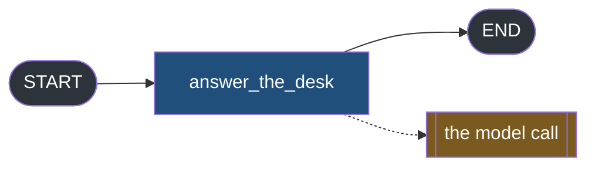
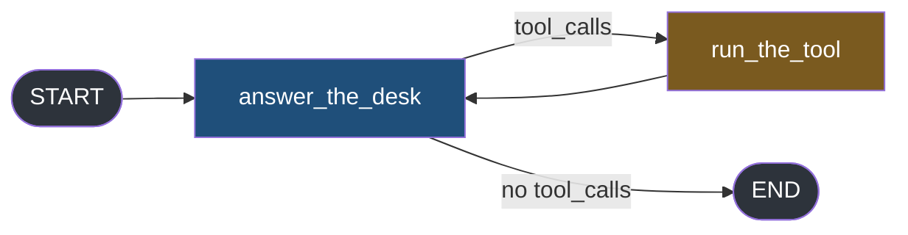

#langgraph #graphs #streaming #lab

**Everything in this folder has gone through one method.** There is a second one, it also streams, it also carries tokens, and choosing between them is a decision you make once and live with — because the two consumers share no code.

# astream Versus astream_events

> [!info] This note is a judgement rather than a fact. The numbers are here to argue with, not to memorise.

## Two APIs, not two modes

`stream_mode` selects between views. `astream` and `astream_events` are not two values of anything — they are different methods, returning differently shaped things, requiring different loops.



One graph, one question, both methods.

`src/langgraph_lab/note10/a_two_shapes.py`:

```python
import asyncio
from typing import Annotated, Any, TypedDict

from dotenv import load_dotenv
from langchain_core.messages import AnyMessage, HumanMessage
from langchain_groq import ChatGroq
from langgraph.graph import END, START, StateGraph
from langgraph.graph.message import add_messages

load_dotenv()

model = ChatGroq(model="openai/gpt-oss-20b", reasoning_effort="low", max_tokens=250)


class DeskState(TypedDict):
    messages: Annotated[list[AnyMessage], add_messages]


def answer_the_desk(state: DeskState) -> dict:
    return {"messages": [model.invoke(state["messages"])]}


builder = StateGraph(DeskState)  # ty: ignore[invalid-argument-type]
builder.add_node("answer_the_desk", answer_the_desk)
builder.add_edge(START, "answer_the_desk")
builder.add_edge("answer_the_desk", END)
graph = builder.compile()

QUESTION = "Reply in one sentence, using only these facts: Priya has 12 leave days left, and has already taken 3."
START_STATE: DeskState = {"messages": [HumanMessage(content=QUESTION)]}


async def main() -> None:
    print("--- astream, stream_mode=messages")
    items: list[Any] = [item async for item in graph.astream(START_STATE, stream_mode="messages")]
    first_item = items[0]
    print(f"    {len(items)} items")
    print(f"    an item is a {type(first_item).__name__} of {len(first_item)}")
    print(f"    element 0    {type(first_item[0]).__name__}")
    print(f"    element 1    {type(first_item[1]).__name__}")

    print("\n--- astream_events")
    events: list[Any] = [event async for event in graph.astream_events(START_STATE)]
    first_event = events[0]
    print(f"    {len(events)} events")
    print(f"    an event is a {type(first_event).__name__} with these keys:")
    for key in sorted(first_event):
        print(f"        {key}")

    print("\n--- the same token, reached two ways")
    for chunk, metadata in items:
        if chunk.content:
            print(f"    astream         chunk.content       = {chunk.content!r}")
            break
    for event in events:
        if event["event"] == "on_chat_model_stream" and event["data"]["chunk"].content:
            print(f"    astream_events  data['chunk'].content = {event['data']['chunk'].content!r}")
            break


if __name__ == "__main__":
    asyncio.run(main())
```

```
--- astream, stream_mode=messages
    45 items
    an item is a tuple of 2
    element 0    AIMessageChunk
    element 1    dict

--- astream_events
    34 events
    an event is a dict with these keys:
        data
        event
        metadata
        name
        parent_ids
        run_id
        tags
```

**A tuple against a dict of seven keys.** The `astream` item is the thing itself plus context. The event is an envelope: `event` names what happened, `data` holds whatever that kind of thing carries, and the rest says where in the run it came from.

The token is in both, at different depths:

```
--- the same token, reached two ways
    astream         chunk.content       = 'Pri'
    astream_events  data['chunk'].content = 'Pri'
```

Same three characters. One reached by unpacking a tuple, the other by naming an event type and then reaching into `data`.

> [!note] These are async, and that is not optional
> Every earlier note used `graph.stream(...)` in an ordinary `for` loop. Both methods here need `async for`, and the last section shows what happens when you look for a synchronous door.

## A firehose, measured

The interesting difference is not shape, it is volume. This graph has a tool call in it, so there is more than one kind of thing to report.



`src/langgraph_lab/note10/b_the_firehose.py`:

```python
import asyncio
from typing import Annotated, Any, TypedDict

from dotenv import load_dotenv
from langchain_core.messages import AIMessage, AnyMessage, HumanMessage, ToolMessage
from langchain_core.tools import tool
from langchain_groq import ChatGroq
from langgraph.graph import END, START, StateGraph
from langgraph.graph.message import add_messages

load_dotenv()


@tool
def look_up_leave(name: str) -> str:
    """Look up the remaining leave balance for an employee."""
    return f"{name}|12|3|record_id=EMP-4471"


model = ChatGroq(model="openai/gpt-oss-20b", reasoning_effort="low", max_tokens=250)
model_with_tools = model.bind_tools([look_up_leave])


class DeskState(TypedDict):
    messages: Annotated[list[AnyMessage], add_messages]


def answer_the_desk(state: DeskState) -> dict:
    return {"messages": [model_with_tools.invoke(state["messages"])]}


def run_the_tool(state: DeskState) -> dict:
    last = state["messages"][-1]
    assert isinstance(last, AIMessage)
    call = last.tool_calls[0]
    result = look_up_leave.invoke(call["args"])
    return {"messages": [ToolMessage(content=result, tool_call_id=call["id"])]}


def route(state: DeskState) -> str:
    if getattr(state["messages"][-1], "tool_calls", None):
        return "run_the_tool"
    return END


builder = StateGraph(DeskState)  # ty: ignore[invalid-argument-type]
builder.add_node("answer_the_desk", answer_the_desk)
builder.add_node("run_the_tool", run_the_tool)
builder.add_edge(START, "answer_the_desk")
builder.add_conditional_edges("answer_the_desk", route, {"run_the_tool": "run_the_tool", END: END})
builder.add_edge("run_the_tool", "answer_the_desk")
graph = builder.compile()

QUESTION = "How much leave does Priya have left? Use the tool, then answer in one sentence."
START_STATE: DeskState = {"messages": [HumanMessage(content=QUESTION)]}


async def main() -> None:
    print("--- what astream reports, per mode")
    for mode in ["updates", "values", "messages"]:
        items = [item async for item in graph.astream(START_STATE, stream_mode=mode)]
        print(f"    {mode:<10} {len(items)} items")

    print("\n--- what astream_events reports")
    events: list[Any] = [event async for event in graph.astream_events(START_STATE)]
    counts: dict[str, int] = {}
    for event in events:
        counts[event["event"]] = counts.get(event["event"], 0) + 1
    for name in sorted(counts):
        print(f"    {name:<24} {counts[name]}")
    print(f"    {'total':<24} {len(events)}")

    print("\n--- the events that carry no token at all")
    for event in events:
        if event["event"] != "on_chat_model_stream":
            print(f"    {event['event']:<24} name={event['name']}")


if __name__ == "__main__":
    asyncio.run(main())
```

```
--- what astream reports, per mode
    updates    3 items
    values     4 items
    messages   43 items

--- what astream_events reports
    on_chain_end             6
    on_chain_start           6
    on_chain_stream          6
    on_chat_model_end        2
    on_chat_model_start      2
    on_chat_model_stream     59
    on_tool_end              1
    on_tool_start            1
    total                    83
```

**Three items against eighty-three events**, for one turn of one graph.

> `astream` gives you **what the graph decided to publish.** `astream_events` gives you **every lifecycle boundary of every runnable inside the run**, and you decide what to throw away.

The list of non-token events is the clearest picture of what that means:

```
--- the events that carry no token at all
    on_chain_start           name=LangGraph
    on_chain_start           name=answer_the_desk
    on_chat_model_start      name=ChatGroq
    on_chat_model_end        name=ChatGroq
    on_chain_start           name=route
    on_chain_end             name=route
    on_chain_stream          name=answer_the_desk
    on_chain_end             name=answer_the_desk
    on_chain_stream          name=LangGraph
    on_chain_start           name=run_the_tool
    on_tool_start            name=look_up_leave
    on_tool_end              name=look_up_leave
    ...
```

Read the names. `LangGraph` is the graph itself, which starts and ends like everything else. `answer_the_desk` and `run_the_tool` are your nodes. `ChatGroq` is the model. `look_up_leave` is the tool.

**And `route` is your conditional edge function**, which you never thought of as a component and which reports a start and an end anyway. That is the character of this API in one line: everything callable is a runnable, and every runnable narrates itself.

## The same answer, two consumers

Both APIs can produce the answer. Putting the two loops side by side is the whole argument about switching later.

`src/langgraph_lab/note10/c_same_answer_two_ways.py`:

```python
import asyncio
from typing import Any

from langchain_core.messages import AIMessageChunk

from langgraph_lab.note10.b_the_firehose import START_STATE, graph


async def main() -> None:
    print("--- the answer, via astream")
    answer_one = ""
    items: list[Any] = [item async for item in graph.astream(START_STATE, stream_mode="messages")]
    for chunk, metadata in items:
        if metadata["langgraph_node"] == "answer_the_desk" and isinstance(chunk, AIMessageChunk):
            answer_one = answer_one + str(chunk.content)
    print(f"    {answer_one!r}")

    print("\n--- the answer, via astream_events")
    answer_two = ""
    events: list[Any] = [event async for event in graph.astream_events(START_STATE)]
    for event in events:
        if event["event"] != "on_chat_model_stream":
            continue
        if event["metadata"]["langgraph_node"] != "answer_the_desk":
            continue
        answer_two = answer_two + str(event["data"]["chunk"].content)
    print(f"    {answer_two!r}")

    print("\n--- the one thing only astream_events has")
    for event in events:
        if event["event"] == "on_tool_start":
            print(f"    tool started   {event['name']}  input={event['data']['input']}")
        if event["event"] == "on_tool_end":
            print(f"    tool finished  {event['name']}")


if __name__ == "__main__":
    asyncio.run(main())
```

```
--- the answer, via astream
    'Priya has 12 days of leave remaining.'

--- the answer, via astream_events
    'Priya has 12 days of leave remaining.'
```

Identical output. Now compare the two loops that produced it:

```python
for chunk, metadata in items:
    if metadata["langgraph_node"] == "answer_the_desk" and isinstance(chunk, AIMessageChunk):
        answer_one = answer_one + str(chunk.content)
```

```python
for event in events:
    if event["event"] != "on_chat_model_stream":
        continue
    if event["metadata"]["langgraph_node"] != "answer_the_desk":
        continue
    answer_two = answer_two + str(event["data"]["chunk"].content)
```

**No line survives the move.** The unpacking differs, the type test becomes a string comparison against an event name, and the payload moves from the loop variable to `event["data"]["chunk"]`. A consumer written for one is not adjusted into the other, it is rewritten.

That matters because this is usually not one function. It is a function, its tests, whatever transforms its output into your wire format, and the shape assumptions in all three.

And there is one thing the other side cannot do at all:

```
--- the one thing only astream_events has
    tool started   look_up_leave  input={'name': 'Priya'}
    tool finished  look_up_leave
```

**A tool starting, by name, with its arguments, before it has returned.** No `stream_mode` reports that. `updates` reports the tools node after it finishes; `messages` reports the `ToolMessage` it produced. Neither can tell a user we are looking that up now, at the moment it starts.

That is the honest case for the firehose, and it is narrower than it first appears — but when you need it, nothing else will do.

## The other version parameter

`astream_events` takes a `version`, and it is not related to anything else in this folder.

`src/langgraph_lab/note10/d_the_version_parameter.py`:

```python
import asyncio
import warnings
from typing import Any

from langgraph_lab.note10.a_two_shapes import START_STATE, graph


async def main() -> None:
    print("--- version left alone, which is what most code does")
    default: list[Any] = [event async for event in graph.astream_events(START_STATE)]
    print(f"    {len(default)} events")

    print("\n--- version='v2', spelled out")
    with warnings.catch_warnings(record=True) as caught:
        warnings.simplefilter("always")
        v2: list[Any] = [event async for event in graph.astream_events(START_STATE, version="v2")]
    print(f"    {len(v2)} events, {len(caught)} warnings")

    print("\n--- version='v1'")
    with warnings.catch_warnings(record=True) as caught:
        warnings.simplefilter("always")
        v1: list[Any] = [event async for event in graph.astream_events(START_STATE, version="v1")]
    print(f"    {len(v1)} events, {len(caught)} warnings")
    for warning in caught:
        print(f"    {warning.category.__name__}: {warning.message}")

    print("\n--- version='v3'")
    try:
        v3 = graph.astream_events(START_STATE, version="v3")
        async for event in await v3:
            print(event)
    except NotImplementedError as error:
        print(f"    NotImplementedError: {error}")

    print("\n--- and what compile() actually handed us")
    print(f"    {type(graph).__name__}")

    print("\n--- the synchronous door, for completeness")
    try:
        for event in graph.stream_events(START_STATE):
            print(event)
    except NotImplementedError as error:
        print(f"    NotImplementedError: {error}")


if __name__ == "__main__":
    asyncio.run(main())
```

```
--- version left alone, which is what most code does
    72 events

--- version='v2', spelled out
    33 events, 0 warnings

--- version='v1'
    34 events, 1 warnings
    LangChainDeprecationWarning: astream_events version='v1' is deprecated. Use version='v2' or astream instead.

--- version='v3'
    NotImplementedError: astream_events(version='v3') is only supported on Runnable subclasses that implement the v3 streaming protocol (BaseChatModel, CompiledGraph). Got: CompiledStateGraph

--- and what compile() actually handed us
    CompiledStateGraph
```

| Value | What happens |
|---|---|
| omitted | you get `v2`, which is the default |
| `"v2"` | identical to omitting it |
| `"v1"` | works, and warns that it is deprecated |
| `"v3"` | raises on a graph |

**`version="v2"` is the most copied line in LangChain examples and it changes nothing.** It is the default. Code carrying it looks deliberate and is not.

The `v3` failure is worth reading twice, because the message names `CompiledGraph` as supported and `compile()` hands you a `CompiledStateGraph`. Two class names one word apart, one of which works.

And the last block closes the door you would try next:

```
--- the synchronous door, for completeness
    NotImplementedError: stream_events(version='v2') is not supported. Use astream_events() for v1/v2, or stream_events(version='v3') on a supported subclass.
```

`stream_events` exists. It refuses `v1` and `v2` and points you at `v3`, which a graph does not support. **So on a LangGraph graph, events are asynchronous or nothing.**

> [!warning] Two parameters named `version`, on the two streaming APIs, meaning unrelated things
> `astream` has one in later releases, selecting the item shape. `astream_events` has this one, selecting the event schema. Both take strings that look like `"v1"` and `"v2"`. Somebody's `version="v2"` tells you nothing until you know which method it was passed to.

## Which one to pick

The rule is short, and everything above is the evidence for it.

**If the graph's own views answer your question, use `astream`. Reach for `astream_events` only when you need something no mode exposes.**

In practice that second clause means one thing more often than any other: **reporting a tool by name at the moment it starts.** Note 3 built `custom` for exactly this kind of progress reporting, and a writer inside the node is cheaper and more controllable — but it only reports what you remembered to write. Events report everything, including the calls you forgot about.

| | `astream` | `astream_events` |
|---|---|---|
| What arrives | what the graph publishes | every runnable's lifecycle |
| Volume, one turn | 3 to 43 items | 83 events |
| Consumer | unpack a tuple | match an event name, then index into `data` |
| Sync available | yes | no |
| Tool start, before the tool returns | no | yes |
| Filtering | pick a mode | write it yourself |

**The row that decides most cases is the volume one**, and not for bandwidth reasons — nobody sends events to a browser. It is that 83 events means 83 chances to write a condition slightly wrong, in a consumer nobody will revisit for a year.

## Write down why

This choice has a shelf life, which makes it different from the rest of the folder.

Modes are stable — `values` and `updates` have meant the same thing across every version this folder has touched. The two APIs are not. `astream_events` has already deprecated one of its own versions, added a third that graphs cannot use, and acquired a name collision with a parameter on the other API.

So whichever you pick, the thing that ages badly is not the code. It is the reason. Six months on, the loop still runs and nobody remembers whether events were chosen because they were needed or because a tutorial used them.

**Write one line next to the consumer**, naming what you needed that the other one could not give:

```python
# astream_events, not astream: we report tool starts by name, which no stream_mode exposes.
```

That sentence is what makes the choice reviewable. Without it the next person inherits a firehose consumer and no way to tell whether the firehose was ever the point.
