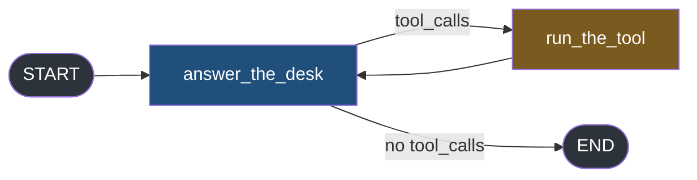
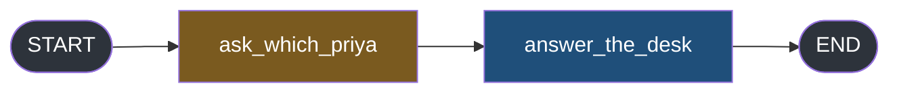

#langgraph #graphs #streaming #lab

**Ten notes of pieces, each proved on the smallest graph that could show it.** This one puts a tool call, a model, a duplicate and an interrupt on a single graph, and asks what actually comes out.

# Lab — Tokens Through The Graph

> [!info] Nothing new is introduced here. Everything is checked against one graph, and the numbers at the end are the note.

## One graph with every problem in it

The graph answers a desk question, calls a tool, and answers again. The second answer is deliberately rebuilt on the way out — note 9's duplicate, wired in on purpose.



`src/langgraph_lab/note11/a_one_graph_everything.py`:

```python
from typing import Annotated, Any, TypedDict

from dotenv import load_dotenv
from langchain_core.messages import AIMessage, AnyMessage, HumanMessage, ToolMessage
from langchain_core.tools import tool
from langchain_groq import ChatGroq
from langgraph.graph import END, START, StateGraph
from langgraph.graph.message import add_messages

load_dotenv()


@tool
def look_up_leave(name: str) -> str:
    """Look up the remaining leave balance for an employee."""
    return f"{name}|12|3|record_id=EMP-4471"


model = ChatGroq(model="openai/gpt-oss-20b", reasoning_effort="low", max_tokens=250)
model_with_tools = model.bind_tools([look_up_leave])


class DeskState(TypedDict):
    messages: Annotated[list[AnyMessage], add_messages]


def answer_the_desk(state: DeskState) -> dict:
    reply = model_with_tools.invoke(state["messages"])
    if reply.tool_calls:
        return {"messages": [reply]}
    # rebuilt on the way out, which is the duplicate from note 9
    return {"messages": [AIMessage(content=reply.content)]}


def run_the_tool(state: DeskState) -> dict:
    last = state["messages"][-1]
    assert isinstance(last, AIMessage)
    call = last.tool_calls[0]
    result = look_up_leave.invoke(call["args"])
    return {"messages": [ToolMessage(content=result, tool_call_id=call["id"])]}


def route(state: DeskState) -> str:
    if getattr(state["messages"][-1], "tool_calls", None):
        return "run_the_tool"
    return END


builder = StateGraph(DeskState)  # ty: ignore[invalid-argument-type]
builder.add_node("answer_the_desk", answer_the_desk)
builder.add_node("run_the_tool", run_the_tool)
builder.add_edge(START, "answer_the_desk")
builder.add_conditional_edges("answer_the_desk", route, {"run_the_tool": "run_the_tool", END: END})
builder.add_edge("run_the_tool", "answer_the_desk")
graph = builder.compile()

QUESTION = "How much leave does Priya have left? Use the tool, then answer in one sentence."
START_STATE: DeskState = {"messages": [HumanMessage(content=QUESTION)]}


if __name__ == "__main__":
    items: list[Any] = list(graph.stream(START_STATE, stream_mode="messages"))

    print(f"--- {len(items)} items, grouped by node and object type")
    groups: dict[tuple[str, str], int] = {}
    for chunk, metadata in items:
        key = (metadata["langgraph_node"], type(chunk).__name__)
        groups[key] = groups.get(key, 0) + 1
    for key, count in groups.items():
        print(f"    {key[0]:<16} {key[1]:<16} {count}")

    print("\n--- everything on this stream that is not a fragment")
    for chunk, metadata in items:
        if "Chunk" not in type(chunk).__name__:
            print(f"    {metadata['langgraph_node']:<16} {type(chunk).__name__:<12} {str(chunk.content)[:52]!r}")

    print("\n--- what a consumer with no filter renders")
    everything = ""
    for chunk, metadata in items:
        everything = everything + str(chunk.content)
    print(f"    {everything!r}")
```

```
--- 39 items, grouped by node and object type
    answer_the_desk  AIMessageChunk   37
    run_the_tool     ToolMessage      1
    answer_the_desk  AIMessage        1

--- everything on this stream that is not a fragment
    run_the_tool     ToolMessage  'Priya|12|3|record_id=EMP-4471'
    answer_the_desk  AIMessage    'Priya has 12 days of leave remaining.'

--- what a consumer with no filter renders
    'Priya|12|3|record_id=EMP-4471Priya has 12 days of leave remaining.Priya has 12 days of leave remaining.'
```

**Three kinds of thing, from two nodes, on one channel.** The last line is what an unfiltered consumer puts on a screen: an internal record with a record id, then the answer, then the answer again.

Both of note 9's exclusions are live at once here — the wrong node and the wrong object type — which is what makes this graph worth keeping for the rest of the note.

## Four numbers that are not the same number

The first thing people reach for when a token stream feels slow is a count, and there are several to choose from.

`src/langgraph_lab/note11/b_chunks_are_not_tokens.py`:

```python
from typing import Any

from langchain_core.messages import AIMessageChunk

from langgraph_lab.note11.a_one_graph_everything import START_STATE, graph

if __name__ == "__main__":
    items: list[Any] = list(graph.stream(START_STATE, stream_mode="messages"))

    fragments = []
    for chunk, metadata in items:
        if metadata["langgraph_node"] == "answer_the_desk" and isinstance(chunk, AIMessageChunk):
            fragments.append(chunk)

    with_text = []
    for chunk in fragments:
        if chunk.content:
            with_text.append(chunk)

    folded = fragments[0]
    for chunk in fragments[1:]:
        folded = folded + chunk

    answer = "".join(str(chunk.content) for chunk in fragments)

    print("--- four numbers people assume are the same number")
    print(f"    items on the stream           {len(items)}")
    print(f"    fragments from the answer     {len(fragments)}")
    print(f"    fragments carrying any text   {len(with_text)}")
    print(f"    characters of answer          {len(answer)}")

    print("\n--- and what the provider says it charged for")
    print(f"    {folded.usage_metadata}")
```

```
--- four numbers people assume are the same number
    items on the stream           64
    fragments from the answer     62
    fragments carrying any text   10
    characters of answer          37

--- and what the provider says it charged for
    {'input_tokens': 329, 'output_tokens': 91, 'total_tokens': 420, 'output_token_details': {'reasoning': 47}}
```

Five numbers now, and no two of them agree.

| Number | What it counts |
|---|---|
| 64 | everything on the stream, including the tool message and the duplicate |
| 62 | fragments from the answering node |
| 10 | fragments that carried a single character of answer |
| 37 | characters the user reads |
| 91 | tokens the provider billed, 47 of them reasoning |

**A chunk is not a token, and neither is a character.** The 52 fragments with no text are the reasoning pass, which cost 47 of the 91 billed tokens and produced nothing anyone will see.

That gap is the useful part. **A stream that looks slow at the start is not slow — it is being charged for thinking, silently, one empty fragment at a time.**

## Finding the duplicate without knowing it is there

Note 9 showed the duplicate by constructing it. On a graph you did not write, you need a test.

`src/langgraph_lab/note11/c_find_the_duplicate.py`:

```python
from typing import Any

from langchain_core.messages import AIMessageChunk

from langgraph_lab.note11.a_one_graph_everything import START_STATE, graph

if __name__ == "__main__":
    items: list[Any] = list(graph.stream(START_STATE, stream_mode="messages"))

    from_fragments = ""
    whole_messages = []
    for chunk, metadata in items:
        if metadata["langgraph_node"] != "answer_the_desk":
            continue
        if isinstance(chunk, AIMessageChunk):
            from_fragments = from_fragments + str(chunk.content)
        else:
            whole_messages.append(chunk)

    print("--- the answer, assembled from fragments")
    print(f"    {len(from_fragments)} characters  {from_fragments!r}")

    print("\n--- the whole messages that arrived on the same channel")
    for message in whole_messages:
        text = str(message.content)
        print(f"    {len(text)} characters  {text!r}")

    print("\n--- the test")
    for message in whole_messages:
        same = str(message.content) == from_fragments
        print(f"    {type(message).__name__} identical to the assembled answer: {same}")
```

```
--- the answer, assembled from fragments
    37 characters  'Priya has 12 days of leave remaining.'

--- the whole messages that arrived on the same channel
    37 characters  'Priya has 12 days of leave remaining.'

--- the test
    AIMessage identical to the assembled answer: True
```

**Assemble the fragments, then compare against every whole message from the same node.** Equal means the answer is on the stream twice, and a consumer that renders both will show it twice.

The character counts are the quick version and the equality is the real one — two different sentences of the same length would pass a length check and fail this.

## The fold, and the two things wrong with it

Adding the fragments together is the obvious way to get one message at the end. It works, and the result is not what it looks like.

`src/langgraph_lab/note11/d_the_fold.py`:

```python
from typing import Any

from langchain_core.messages import AIMessage, AIMessageChunk

from langgraph_lab.note11.a_one_graph_everything import START_STATE, graph

if __name__ == "__main__":
    items: list[Any] = list(graph.stream(START_STATE, stream_mode="messages"))

    fragments = []
    for chunk, metadata in items:
        if metadata["langgraph_node"] == "answer_the_desk" and isinstance(chunk, AIMessageChunk):
            fragments.append(chunk)

    folded = fragments[0]
    for chunk in fragments[1:]:
        folded = folded + chunk

    print("--- adding the fragments together")
    print(f"    type            {type(folded).__name__}")
    print(f"    isinstance AIMessage       {isinstance(folded, AIMessage)}")
    print(f"    isinstance AIMessageChunk  {isinstance(folded, AIMessageChunk)}")
    print(f"    content         {str(folded.content)[:52]!r}")

    print("\n--- what the fold carries besides the text")
    print(f"    usage_metadata  {folded.usage_metadata}")
    print(f"    finish_reason   {folded.response_metadata.get('finish_reason')}")
    print(f"    model_name      {folded.response_metadata.get('model_name')}")

    rebuilt = AIMessage(content=folded.content)
    print("\n--- the same words, rebuilt as a plain AIMessage")
    print(f"    type            {type(rebuilt).__name__}")
    print(f"    usage_metadata  {rebuilt.usage_metadata}")
    print(f"    response_metadata {rebuilt.response_metadata}")
```

```
--- adding the fragments together
    type            AIMessageChunk
    isinstance AIMessage       True
    isinstance AIMessageChunk  True
    content         'Priya has 12 days of leave remaining.'
```

**The fold of many chunks is still a chunk.** `AIMessageChunk` is a subclass of `AIMessage`, so the folded object passes `isinstance(x, AIMessage)` while being a fragment.

> [!warning] `isinstance(chunk, AIMessage)` does not separate fragments from whole messages
> It is `True` for both. Note 9's filter tests `isinstance(chunk, AIMessageChunk)` for exactly this reason — the narrow class is the one that discriminates, and the intuitive one admits everything.

The second problem is in the metadata:

```
--- what the fold carries besides the text
    usage_metadata  {'input_tokens': 329, 'output_tokens': 66, 'total_tokens': 395, 'output_token_details': {'reasoning': 22}}
    finish_reason   tool_callsstop
    model_name      openai/gpt-oss-20bopenai/gpt-oss-20b
```

Read `finish_reason` and `model_name` again. `tool_callsstop` is `tool_calls` and `stop` concatenated. `openai/gpt-oss-20bopenai/gpt-oss-20b` is the model name twice.

**This node ran the model twice** — once to request the tool, once to answer — and the fold added fragments from both calls together. Adding is defined field by field, and for strings adding means concatenating, so two perfectly good values became one meaningless one.

The `usage_metadata` numbers survived, because adding numbers is the right thing to do. Nothing warned that adding the strings was not.

So folding is safe only across fragments from **one** model call. Group by the run before folding, or fold as you go and reset when a call ends.

And the rebuild loses everything:

```
--- the same words, rebuilt as a plain AIMessage
    type            AIMessage
    usage_metadata  None
    response_metadata {}
```

`AIMessage(content=folded.content)` gives you the sentence and `None` for the token counts. If your cost tracking reads `usage_metadata` off the message your node returned, and your node rebuilds messages, **you are recording nothing and it looks like zero rather than an error.**

## Two modes at once, and the ordering that falls out

Note 6 proved combining is additive. What it did not say is what order the two series interleave in, which is the thing a renderer depends on.

`src/langgraph_lab/note11/e_the_ordering.py`:

```python
from typing import Any

from langchain_core.messages import AIMessageChunk

from langgraph_lab.note11.a_one_graph_everything import START_STATE, graph

if __name__ == "__main__":
    items: list[Any] = list(graph.stream(START_STATE, stream_mode=["updates", "messages"]))

    print(f"--- {len(items)} items, in arrival order, fragments collapsed")
    run = 0
    for mode, data in items:
        if mode == "messages":
            chunk, metadata = data
            if isinstance(chunk, AIMessageChunk):
                run = run + 1
                continue
            if run:
                print(f"    messages   {run} fragments")
                run = 0
            print(f"    messages   a whole {type(chunk).__name__} from {metadata['langgraph_node']}")
        else:
            if run:
                print(f"    messages   {run} fragments")
                run = 0
            for node_name in data:
                print(f"    updates    {node_name} finished")

    print("\n--- the rule, checked rather than eyeballed")
    last_message_index: dict[str, int] = {}
    update_index: dict[str, int] = {}
    for position, item in enumerate(items):
        mode, data = item
        if mode == "messages":
            chunk, metadata = data
            last_message_index[metadata["langgraph_node"]] = position
        else:
            for node_name in data:
                update_index[node_name] = position

    for node_name in update_index:
        last_message = last_message_index.get(node_name, -1)
        update = update_index[node_name]
        print(f"    {node_name:<16} last message at {last_message:>3}, update at {update:>3}, in order: {last_message < update}")
```

```
--- 31 items, in arrival order, fragments collapsed
    messages   9 fragments
    updates    answer_the_desk finished
    messages   a whole ToolMessage from run_the_tool
    updates    run_the_tool finished
    messages   17 fragments
    messages   a whole AIMessage from answer_the_desk
    updates    answer_the_desk finished

--- the rule, checked rather than eyeballed
    answer_the_desk  last message at  29, update at  30, in order: True
    run_the_tool     last message at  10, update at  11, in order: True
```

> **Every fragment for a node arrives before that node's update.** Read the collapsed view top to bottom and the pattern is the same three times: everything the node produced, then the node finishing.

That is not a coincidence, and note 1 already contains the reason. `updates` fires when a node returns; **fragments arrive from inside it while it is still running.** A thing that happens during cannot arrive after a thing that happens at the end.

Which makes a node's `updates` **item a usable boundary marker**: **when it arrives, that node has nothing more to say.** A renderer can close a bubble on it, stop a spinner, or flush a buffer, without tracking whether more fragments are coming.

## When the turn pauses instead

The last thing to check is that a token-streaming consumer does not lose the pause.



`src/langgraph_lab/note11/f_the_interrupt_still_lands.py`:

```python
from typing import Annotated, Any, TypedDict

from dotenv import load_dotenv
from langchain_core.messages import AnyMessage, HumanMessage
from langchain_core.runnables import RunnableConfig
from langchain_groq import ChatGroq
from langgraph.checkpoint.memory import InMemorySaver
from langgraph.graph import END, START, StateGraph
from langgraph.graph.message import add_messages
from langgraph.types import interrupt

load_dotenv()

model = ChatGroq(model="openai/gpt-oss-20b", reasoning_effort="low", max_tokens=250)


class DeskState(TypedDict):
    messages: Annotated[list[AnyMessage], add_messages]
    which_priya: str


def ask_which_priya(state: DeskState) -> dict:
    choice = interrupt({"question": "there are two people called Priya, which one?"})
    return {"which_priya": choice}


def answer_the_desk(state: DeskState) -> dict:
    reply = model.invoke(f"In one sentence: {state['which_priya']} has 12 leave days left.")
    return {"messages": [reply]}


builder = StateGraph(DeskState)  # ty: ignore[invalid-argument-type]
builder.add_node("ask_which_priya", ask_which_priya)
builder.add_node("answer_the_desk", answer_the_desk)
builder.add_edge(START, "ask_which_priya")
builder.add_edge("ask_which_priya", "answer_the_desk")
builder.add_edge("answer_the_desk", END)
graph = builder.compile(checkpointer=InMemorySaver())

QUESTION = "How much leave does Priya have left?"
START_STATE: DeskState = {"messages": [HumanMessage(content=QUESTION)], "which_priya": ""}


if __name__ == "__main__":
    config: RunnableConfig = {"configurable": {"thread_id": "t1"}}

    print("--- stream 1, with both modes on")
    items: list[Any] = list(graph.stream(START_STATE, stream_mode=["updates", "messages"], config=config))
    for mode, data in items:
        print(f"    {mode:<10} {data}")

    print("\n--- so the interrupt arrived on the updates series, not the messages one")
    print(f"    total items: {len(items)}")
```

```
--- stream 1, with both modes on
    updates    {'__interrupt__': (Interrupt(value={'question': 'there are two people called Priya, which one?'}, id='ed09805d...'),)}

--- so the interrupt arrived on the updates series, not the messages one
    total items: 1
```

> **One item in the whole turn, and it is on the `updates` series.** `messages` produced nothing at all, **because the pause happens before the model is ever called.**

Note 7 said the interrupt arrives under `__interrupt__` and the stream then ends, and requesting a second mode changes neither. This is that, from the token-streaming side, and it settles a design question: **interrupt handling cannot live in the fragment consumer.** A consumer watching only `messages` sees an empty stream that closes, which is indistinguishable from a model that returned nothing.

## The numbers

One graph, one turn, everything above in one place.

| Question | Answer |
|---|---|
| Items on a `messages` stream | 39 to 64, and it moves every run |
| Fragments carrying any text | 10, out of 62 |
| Characters the user reads | 37 |
| Output tokens billed | 91, of which 47 were reasoning |
| Copies of the answer on the stream | **2** — the fragments, and a rebuilt whole message |
| Kinds of thing on one channel | **3** — `AIMessageChunk`, `AIMessage`, `ToolMessage` |
| What the fold returns | an `AIMessageChunk`, which passes `isinstance(x, AIMessage)` |
| What the fold corrupts | any string field spanning two model calls |
| What a rebuild loses | `usage_metadata` and `response_metadata`, silently |
| Ordering of fragments against updates | every fragment before that node's update, always |
| Where an interrupt lands with both modes on | `updates`, and `messages` yields nothing |

**Two of those rows are the ones to carry.** The answer exists twice, on the same channel, in two different shapes — so a client filter is not optional. And a node's `updates` item is the only reliable signal that its fragments have finished.

The rest is arithmetic that changes with the model. Those two do not.
