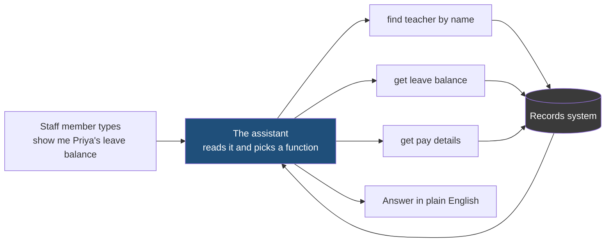
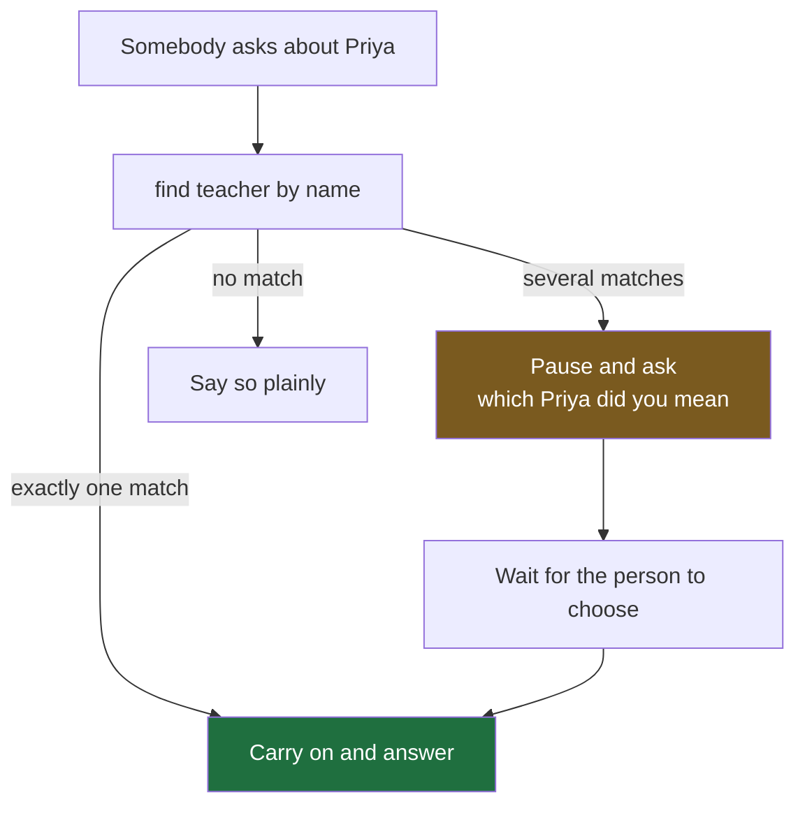
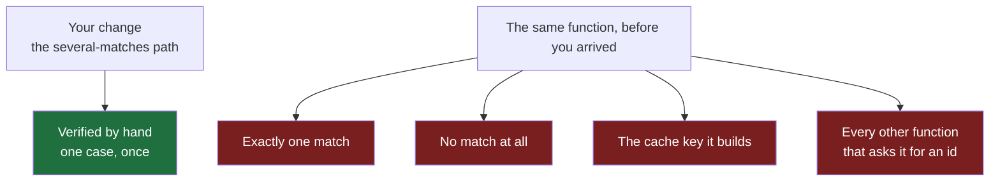
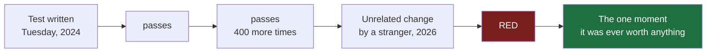
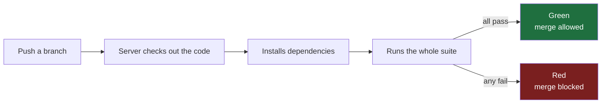
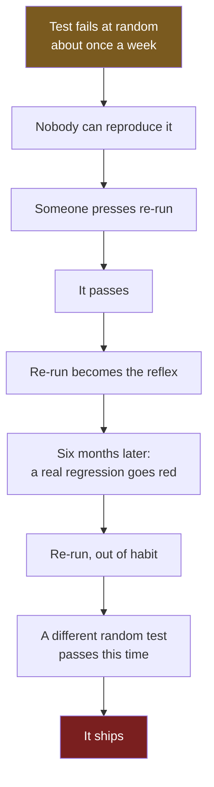

#testing #philosophy #ci #regression

**You change a service, check your change by hand, see it work, and ship.** Everyone does this, and it is safe only because somebody else's tests — the suite, meaning the whole collection of them, run together on every change — are quietly covering the ground you skipped. When nobody wrote those tests, nothing covers it, and a habit that felt careful for years turns out to have been borrowing safety from strangers.

# What Tests Are For

> [!info] A test is not a proof that code is correct. It is a tripwire, left behind by somebody who knew something, for somebody who does not — and its worth is decided entirely by the day it fails, never by the thousand days it passes.

## The system this note argues from

One example runs through the whole note, so it is worth setting up properly.

A school has a records system holding every teacher — pay, leave balance, department, start date. Staff used to look things up through a web form with a dozen dropdowns. It has been replaced by an AI assistant you talk to in plain English: somebody types show me Priya's leave balance, and an answer comes back.

The assistant cannot read the database itself. What it can do is call small functions somebody wrote for it, one per thing it might need, and those functions are the only way it ever touches real data.

Almost every request starts the same way. A person names a teacher, so before anything else can happen the assistant has to turn that name into an id — a number the records system uses internally, unique to one teacher — and every other function takes that id rather than the name. **The name-to-id function sits underneath nearly everything**, which is exactly why it is the interesting one to change and the frightening one to break.

One more thing about it, which matters later. People do not ask about one teacher at a time. Compare Priya and Rahul's leave is an ordinary request, and it means the assistant calls the name-to-id function twice in the same turn, once per name, before it can do anything else.

---

## The change you verified, and the ninety you did not

The function is also the busiest thing in the system, so it remembers what it has already looked up. Ask about Priya twice in a conversation and the second lookup does not hit the records system at all — the answer comes out of a small in-memory store, filed under a key built from the name. That store is called a cache, and the key is how it finds anything in it again.

The name-to-id function has a flaw nobody noticed for months. If two teachers share a name, it returns the first one it finds. The assistant then answers confidently about the wrong person, and nothing anywhere reports an error, because from the machine's point of view nothing went wrong.

So it gets rewritten. Instead of guessing, the function now reports that the name was ambiguous and lists the matches. A separate piece of code takes over, asks the staff member which teacher was meant, waits for the answer, and only then continues.

Seventy lines come out of the lookup function, and about a hundred go into two new files — one deciding when a pause is needed, one doing the asking.

You check it. You ask compare Priya and Rahul's leave, where both names happen to be shared by two teachers, so the assistant must ask twice — which Priya, then which Rahul.

The check is real, and it catches a genuine bug. The questions arrived in the wrong order: the assistant asked about Rahul first, while the person who typed the request was still thinking about Priya. Nothing crashed, no error was logged, and the answer at the end was correct. It was simply confusing to use, and the only way to find it was to sit there and use it.

Now the question worth sitting with.

> [!question] What did that check actually prove?
> That the several-matches path works **today**, for **two** shared names in **one** request, with **you watching**.

Here is everything it did not touch.

Green is what you checked. Red is what you did not, and **could not have**.

**Verifying every previous behaviour by hand, on every change, is not something a person can do.** Not because it is hard — because the work grows with the age of the codebase while the time available stays the same.

---

## A word first: regression

**A regression is when something that used to work stops working.**

Not a special kind of bug. A bug defined by its history — the code did the right thing yesterday, you changed something unrelated, and today it does the wrong thing. It went backwards.

| | Was it ever correct? | What it is |
|---|---|---|
| Two teachers share a name, the function never handled it, somebody hits that case today | No | An **existing bug**, newly discovered |
| The no-match case worked for a year, you rewrite the several-matches path, and no-match now raises an error | Yes | A **regression** |

The second is what a suite exists for. Bugs in the feature you are working on, you tend to find — you are looking straight at them. **Regressions are invisible to you specifically**, because they happen in the part of the system you are not thinking about.

Which is where the phrase regression testing comes from. Not a technique — a purpose. Running the old tests to check the old behaviour still holds, rather than new tests for the new feature.

---

## What a test is actually for

Code that works today is not the thing under threat. The thing under threat is code that still works **after the next change**.

So the value of a test is not that it passes now.

> [!important] It is that it fails later
> On a change whose consequences the author of that change did not see.

Close to the opposite of how tests are usually described. They get described as proof that code is correct. They are not proof of anything — a passing test says only that one path, with one set of inputs, behaved one way, once.

What a test really is, is a **tripwire**. A small piece of machinery lying across a path, doing nothing at all for years, and then going off.

---

## Its audience is a stranger

If the job is to fail later, the audience is whoever makes that later change.

That person has not read the ticket, does not know which edge case forced the odd-looking branch, and will not read your file before editing the one beside it.

Six months from now, that person is also you.

Which is why a test written as a note to yourself is worth so little, and one that fails loudly with a readable message is worth so much. **The failure message is the only part of a test anybody ever reads.**

> [!tip] Why good suites feel invisible
> A tripwire that works leaves no memory. A stranger's test catches your breaking change, you fix the change, you move on — and you never form a memory of the test that saved you. The only tests anyone remembers are the annoying ones. That is why suites are underrated by exactly the people they protect most.

---

## Noticing beats documenting

Not a test that documents correct behaviour. One that **notices when behaviour changes**.

The difference sounds like word play until you try to write both.

| | The question it must answer | What you need to know |
|---|---|---|
| Documenting | Is this **right**? | The code deeply enough to say what right means |
| Noticing | Is this **different from before**? | Only what it currently does |

> **The second you can write for code you do not fully understand** — which is most code, most of the time, especially code somebody else wrote.

That is the way into an untested codebase. You are not qualified to say whether the existing behaviour is correct. You are perfectly qualified to pin down what it currently does, so a future change cannot alter it silently.

---

## The machine that runs them

A tripwire nobody walks into catches nothing. Something has to run the tests, and it cannot be a person remembering.

**Continuous Integration** is that something: a machine that runs your tests automatically, every time you push.

Without it, tests run on the day they are written and then roughly never. With it, nobody has to remember, and nobody can skip it because they were in a hurry.

On GitHub the mechanism is usually GitHub Actions, configured by a YAML file under `.github/workflows/` listing the commands to run. That is the whole idea; the rest is detail and belongs in a deployment course.

What matters here is the consequence. Once a machine runs the suite on every change, two properties stop being niceties and become correctness requirements.

---

## Speed is the first

First, why a suite would ever be slow, because the code itself is not the slow part. Running a function a thousand times takes no time at all. What takes time is everything a test does around the code: **starting a real database, waiting on a real HTTP call to a real server, writing files to disk, or sleeping for two seconds to let something finish.** A test doing none of those runs in under a millisecond. A test doing one of them runs in hundreds of milliseconds, and a thousand of those is the forty-minute suite.

And a suite taking forty minutes gets skipped on a busy afternoon. Someone adds a flag to run only the fast half, then only their own directory, then not at all before a hotfix.

**A skipped tripwire is an absent tripwire.**

Slowness does not make a suite slightly worse in proportion to the seconds lost. It makes the suite stop existing at precisely the moment somebody is rushing — which is the moment it was built for.

That is why so much of what follows is about **keeping tests off the network, off the disk, and out of each other's way.** Those techniques get presented as good practice. They are really about staying fast enough to keep being run.

---

## The test that cries wolf is the second

Some tests fail for reasons that have nothing to do with the code they cover. The usual word for one of those is **flaky**: a test that passes or fails depending on something other than whether the code is correct.

Take the sharpest example. A test checks a report covering last month, and works out last month by subtracting thirty days from today. It passes all year. On the first of March it subtracts thirty days from a twenty-eight-day February, lands in January, and goes red — with nothing wrong in the code at all. Somebody spends an hour on it, finds nothing, reruns it on the second of March, and it passes.

Whatever the cause, the effect is identical. **A flaky test teaches everybody who sees it that red does not mean broken.**

> **A test that fails when nothing is wrong is worse than no test.** It does not merely fail to protect you — it trains the team to ignore the signal, and the training holds on the day the signal is right.

Which is why so much of what follows is about **isolation** — keeping each test's world entirely its own. Nearly every flaky test traces back to one test being affected by another, or by something outside the process it cannot control: the clock, a random number, a file on disk, the order the tests happened to run in.

---

## The two ways a suite can be wrong

Everything above collapses into a pair, and they are opposites.

| | Reality: something is broken | Reality: nothing is broken |
|---|---|---|
| **Suite says red** | Working correctly | **Noisy** — cries wolf |
| **Suite says green** | **Silent** — the dangerous one | Working correctly |

Almost every technique in this folder aims at one of the two, and several **trade one for the other**.

That is worth knowing in advance, because it explains why testing advice contradicts itself so often. Take one argument you will meet everywhere: whether to replace a test's real dependencies — the database, the outside services — with stand-ins that only pretend to be them. Doing that makes tests fast and predictable, which attacks the noisy corner. It also means the test is no longer exercising the real thing, so it can stay green while the real thing is broken, which feeds the silent corner. Both sides of that argument are right about the corner they are looking at, and neither side usually says which corner it is.

> [!danger] A silent suite is indistinguishable from a healthy one
> Both are green. No flaky test to complain about, no slow run to grumble at, no symptom of any kind. It reports success and everybody believes it — and the belief is the damage, because you then ship faster and check less carefully, on the strength of a green light that means nothing.

A noisy suite is annoying, and annoying is a symptom. Symptoms get fixed. **A silent suite has no symptom at all**, which is how it survives in a codebase for years.

> [!important] The discipline that matters most is not writing tests. It is proving a test can fail.
> A separate act from writing it. Write the test, watch it pass, then deliberately break the code it covers and watch it go red. If it stays green, the test was never connected to anything.

