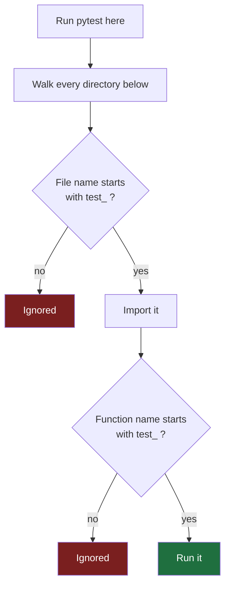
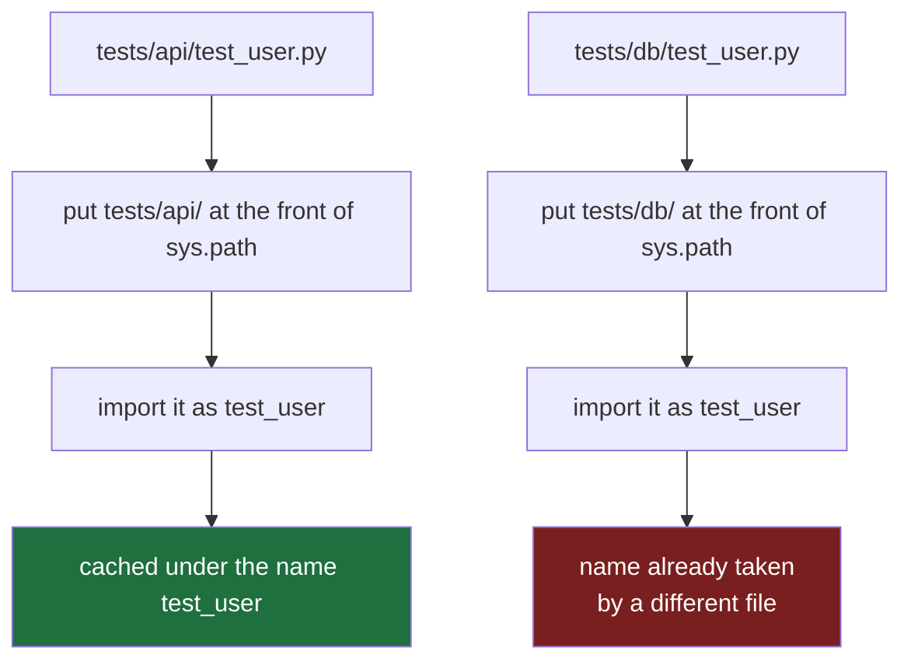

#testing #pytest #python #junit

**In Java, a test is a method in a class, marked with an annotation, asserting through a helper method.** In Python it is a plain function in a plain file, and every one of those four things is gone. Not shortened — absent, each for a reason worth knowing before you copy the shape.

# Your First Python Test

> [!info] pytest is a program you run from the terminal. It goes looking for your tests, runs them, and prints what happened. There is no annotation marking a test and no class holding it — the only thing that makes a function a test is its name.

## What pytest is

**A program you run from the terminal.** You type `pytest`, it finds your tests, runs them, and reports. It is not built into Python and not a library you import — it is an **installable package** like any other dependency.

In the Java world that job is split across two tools. In Python it is one.

| The job | Java | Python |
|---|---|---|
| Deciding what counts as a test, and asserting | JUnit | pytest |
| Finding the tests and running them | Gradle or Maven | pytest |

> **pytest is both halves at once.** No build tool is involved in running tests. One command and you are done.

Python does ship with its own testing tool, called `unittest`. It is JUnit-shaped — classes, inheritance, `assertEqual` methods — because it was ported from JUnit years ago. **Almost nobody starts a new project with it.** You will still meet it in older codebases, and pytest runs those tests too, so it is not a wall you hit.

---

## The same test, twice

Start from the version you already know.

```java
import org.junit.jupiter.api.Test;
import static org.junit.jupiter.api.Assertions.assertEquals;

class SalaryCalculatorTest {

    @Test
    void annualIsTwelveMonths() {
        SalaryCalculator calc = new SalaryCalculator();
        assertEquals(12000, calc.annualFromMonthly(1000));
    }
}
```

Four things are doing work there: two imports, a class, an annotation, and a helper method called `assertEquals`.

Now the same test in Python.

```python
from python_lab.salary import annual_from_monthly


def test_annual_is_twelve_months():
    assert annual_from_monthly(1000) == 12000
```

Four lines, and the only import is your own code.

> **No import of the test framework. No class. No annotation. No assertion helper.**

Each of those is genuinely absent rather than merely shortened, and each absence is a decision.

---

## What makes it a test, then

If there is no annotation, something else has to mark that function out. **It is the name.**

| | What marks it as a test |
|---|---|
| JUnit | The `@Test` annotation |
| pytest | The function name starts with `test_`, in a file whose name starts with `test_` |

> pytest **walks the directories from wherever you ran it**, imports every file whose name starts with `test_`, and runs every function inside whose name starts with `test_`.



> **Rename a test function and it silently stops being a test.** No error, no warning — it disappears from the run and the report simply counts one fewer. This is the first trap, and it is worth knowing before you write anything.

---

## Where the files go

```
python-lab/
  pyproject.toml
  src/
    python_lab/
      __init__.py
      salary.py
  tests/
    test_salary.py
```

**Tests live in `tests/`, beside `src/` rather than inside it.** They are not part of what ships, so they stay outside the package that does.

That layout is close to what Gradle already gives you — `src/main/java` and `src/test/java` — with one real difference. In Python the tests directory is not itself a package, so there is no mirrored folder structure to maintain and no import path pointing into it. Nothing ever imports a test file except pytest.

---

## Setting up a project from scratch

```
cd ~/Desktop/projects
uv init --vcs none --lib python-lab
cd python-lab
uv add --dev pytest
mkdir tests
```

Two of those flags are decisions rather than ceremony.

**`--vcs none`** stops uv creating a git repository. Without it, `uv init` runs `git init` for you, and an empty repository appears whether or not you wanted one.

**`--dev`** puts pytest in a separate dependency group. It is a tool you need while working, not something the code needs to run, so it stays out of what gets installed anywhere else.

---

## Running it

```
uv run pytest
```

```
========================= test session starts ==========================
platform darwin -- Python 3.14.7, pytest-9.1.1, pluggy-1.6.0
rootdir: /Users/home/Desktop/projects/python-lab
configfile: pyproject.toml
collected 1 item

tests/test_salary.py .                                            [100%]

============================== 1 passed in 0.01s ======================
```

**One character per test.** A dot passed. The rootdir line tells you where pytest decided your project starts, which matters the first time it looks in the wrong place.

---

## The error everybody gets first

Run plain `pytest` instead of `uv run pytest` and you are likely to see this:

```
ModuleNotFoundError: No module named 'python_lab'
```

Nothing in that message mentions tests, so it reads as unrelated to what you were doing.

Here is what actually happened. Your test imports `python_lab`, which lives under `src/`. Python cannot find it there unless the project has been installed into the environment. `uv run` installs the project before running anything, so the import works. Bare `pytest` does not, so it fails.

> **The habit that avoids this entirely is `uv run pytest`, always.** Not because bare `pytest` is wrong, but because it depends on an environment being correct in a way nothing reminds you of.


---

## Why there is no assertEquals

The assertion is the bare `assert` keyword. No matcher library, no helper, no import.

That looks like a downgrade until you see a failure. Change the expected value to something wrong and run it again.

```
=============================== FAILURES ===============================
_____________________ test_annual_is_twelve_months _____________________

    def test_annual_is_twelve_months():
>       assert annual_from_monthly(1000) == 11000
E       assert 12000 == 11000
E        +  where 12000 = annual_from_monthly(1000)

tests/test_salary.py:5: AssertionError
======================= 1 failed in 0.01s ==============================
```

A plain Python `assert` failing would say `AssertionError` and nothing more. Read the three lines that matter.

| Line | What it is |
|---|---|
| `>` | your source, marked where execution stopped |
| `E assert 12000 == 11000` | **both sides of the comparison**, with real values |
| `E + where 12000 = ...` | where the left value **came from** |

The `where` line is the one people do not expect. pytest keeps the intermediate values from the expression, so it can trace a result back to the call that produced it — and on a longer assertion it shows the value of every piece.

> That is strictly **more** than `assertEquals` gives you in Java, and it is the concrete payoff for having no assertion helpers at all.

**pytest rewrites your assert statements before running them.** It reads the test file, finds every `assert`, and replaces it with a version that captures the values on each side so it can show them when the comparison fails.

> That is the whole reason `assertEquals` **does not exist and is not missed.** The helper method existed in JUnit to produce a readable message; pytest produces one from the plain statement.

It also explains a rule that would otherwise look arbitrary. **Hide an assert inside a helper function of your own and you lose the diff** — the rewriting only reaches asserts pytest can see in a test file, so an assertion buried one call deeper fails with a bare `AssertionError` and no values.

---

## Reading the report

```
tests/test_salary.py ..F                                          [100%]
```

Three tests, in file order. Two dots passed, the `F` failed.

| Character | Means                                                      |
| --------- | ---------------------------------------------------------- |
| `.`       | passed                                                     |
| `F`       | failed — an assertion was false                            |
| `E`       | errored — the test raised something before it could finish |

`F` and `E` are genuinely different and the difference is the first thing to read off a report. **A failure means the code was wrong. An error means the test never got far enough to find out.**

When something fails, read the `E` line before the traceback. That line carries the rewritten assertion with real values in it, and it usually contains the whole answer.

---

## The project file, and where settings live

Everything a Python project knows about itself is in one file at its root.

```toml
[project]
name = "python-lab"
version = "0.1.0"
requires-python = ">=3.14"
dependencies = []

[build-system]
requires = ["uv_build>=0.12.3,<0.13.0"]
build-backend = "uv_build"

[dependency-groups]
dev = [
    "pytest>=9.1.1",
]
```

**`pyproject.toml` is Python's `build.gradle`.** The project's name, its dependencies, and the settings for every tool it uses. TOML is the format: a section header in square brackets, then `key = value` lines under it.

Three sections are already there. `[project]` is what the thing is **called** and what it **needs to run**. `[build-system]` is how it gets **packaged**. `[dependency-groups]` is where `uv add --dev pytest` put pytest, in a group the shipped code does not need.

**Any tool wanting settings gets a section named for it**, which is why one file replaces nine dotfiles at the root.

| Section | Belongs to |
|---|---|
| `[tool.pytest.ini_options]` | pytest |
| `[tool.ruff]` | the linter |
| `[tool.ty]` | the type checker |

The `ini_options` on the end is historical clutter. pytest's settings used to live in a separate `pytest.ini`, and when they moved into `pyproject.toml` the old name came along. There is no meaning in it — that is simply the key pytest looks for.

---

## Two settings worth having early

```toml
[tool.pytest.ini_options]
addopts = ["--import-mode=importlib"]
testpaths = ["tests"]
```

### addopts

A **flag** is a word typed after the command to change how it behaves. Here is the same project run twice, once with the `-q` flag and once without.

```
$ uv run pytest
============================= test session starts ==============================
platform darwin -- Python 3.14.7, pytest-9.1.1, pluggy-1.6.0
rootdir: /Users/home/Desktop/projects/python-lab
configfile: pyproject.toml
collected 1 item

tests/test_salary.py .                                                   [100%]

============================== 1 passed in 0.00s ===============================
```

```
$ uv run pytest -q
.                                                                        [100%]
1 passed in 0.00s
```

Now suppose the short version is the one you want every time. Nothing stops you typing it out on each run — but you will forget, a teammate will not know to, and an editor running the tests for you certainly will not.

So pytest lets the flag be written down once.

```toml
[tool.pytest.ini_options]
addopts = ["-q"]
```

After that, plain `uv run pytest` produces the short output. **pytest reads that line and behaves exactly as though you had typed the flag** — there is nothing more clever going on.

The name is **add** plus **opts**, short for options: options added to every run. 

> **Some flags cannot be left to memory.** `--import-mode=importlib` changes how pytest imports test files, so typing it sometimes and forgetting it other times means **the same suite behaves differently depending on how it was started.** That is a correctness setting rather than a convenience, and it belongs somewhere it cannot be missed.

### testpaths

**Look here and nowhere else.**

Without it, pytest starts at the project root and walks every directory below hunting for files that start with `test_`. That includes `.venv`, which holds thousands of installed files and, often, other people's test suites. It usually still works. It is slower than it needs to be, and it occasionally collects something surprising.

The other flag needs its own section, because it exists to solve a problem you have not met yet.

---

## Directory structure at any real size

The convention is to mirror the source, the same as Java: `tests/test_salary.py` covers `src/python_lab/salary.py`.

The difference is who enforces it. **In Java, package equals directory, so the compiler requires the path.** In Python nothing checks — you could put every test in one file and pytest would only object that the name does not start with `test_`. The mirror is a **discipline rather than a rule**.

And a trap follows from that, which is worth meeting properly because the error it produces points at the wrong thing.

Two files, same name, different folders.

```
tests/
  api/test_user.py
  db/test_user.py
```

```
collected 1 item / 1 error

ERROR collecting tests/db/test_user.py
import file mismatch:
imported module 'test_user' has this __file__ attribute:
  .../tests/api/test_user.py
which is not the same as the test file we want to collect:
  .../tests/db/test_user.py
HINT: ... use a unique basename for your test file modules
```

Not a failure — an **error during collection**, which stopped the entire run. Neither test executed, and both files are perfectly correct.

### What sys.path is

**The list of folders Python searches when you import something.** It is the classpath under a different name.

```python
import json
```

Python walks `sys.path` in order, looks for `json` in each folder, and takes the first match.

Alongside it sits `sys.modules` — a dictionary of everything already imported, **keyed by name**. That cache is why importing the same module twice is instant, and it is where the trouble starts: two different files cannot both be registered under the name `test_user`.

### Why the default collides

pytest's default mode is called `prepend`, and for each test file it does this.



**The folder is thrown away and only the filename survives.** Both files become `test_user`, the cache has one slot for that name, and pytest refuses rather than silently running the wrong file.

### The two fixes

| Fix | How it works | When you see it |
|---|---|---|
| `__init__.py` in every test directory | makes them packages, so the names become `tests.api.test_user` and `tests.db.test_user` | older codebases, still common |
| `--import-mode=importlib` | loads each file **directly from its path**, never touching `sys.path` and never registering a bare name | what pytest recommends for new projects |

The second one turns the same two files into this.

```
collected 2 items

tests/api/test_user.py .                                                 [ 50%]
tests/db/test_user.py .                                                  [100%]

============================== 2 passed in 0.00s ===============================
```

There is no shared name for the files to fight over, so the collision cannot arise at all.

> **The bad mode is still the default purely for backward compatibility.** Changing it would alter behaviour in a great many existing suites, so `prepend` stays. That is exactly why the flag belongs in `addopts` on day one, rather than being discovered at file number sixty.

This is also why Java never has the problem. Your class is `com.foo.api.UserTest`, and the package path is part of the name — so the folder is never thrown away.

---

## Mirroring versus splitting by kind

Two layouts, answering different questions.

**Mirror the source** when the question is where is the test for this file.

```
src/app/services/payroll.py     →  tests/services/test_payroll.py
src/app/api/routes.py           →  tests/api/test_routes.py
```

**Split by kind** when the question is what can I run in five seconds.

```
tests/
  conftest.py
  unit/            no network, no database, milliseconds
  integration/     a real database, slower
  e2e/             the whole application
```

The second matters more than it first appears. Once part of a suite needs Docker running, the rest of it has to stay runnable without Docker, or nobody runs anything.

> **The usual real answer is both** — split by kind at the top level, and mirror the source inside `unit/`.

---

## Three flags

| Flag | Does |
|---|---|
| `-q` | shrinks the report to almost nothing |
| `-x` | stops at the first failure instead of running everything |
| `-k` | selects tests whose name contains a substring, as in `-k salary` |

One last thing, and it is the only part of pytest a machine ever reads. **A run exits with code 0 when everything passed and non-zero when anything did not.** The report is for people; **the exit code is what a build server checks**.

> **Configure nothing else yet.** No `conftest.py`, no settings block, no plugins. One file, one function, one command is the whole of it for now.
