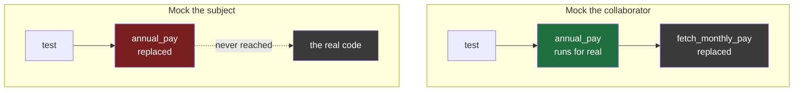

#testing #pytest #mocks #assertions

**A test can pass forever, including after the function it tests has been deleted.** It looks exactly like a working test, reports exactly like a working test, and proves nothing whatsoever. This is the failure mode every other technique in the folder defends against, and the report can never tell you it is happening.

# The Vacuous Test

> [!info] A green result is only evidence when the assertion is connected to the code. Nothing in a test report tells you whether it is — so proving a test can fail is a separate act from writing it, and it takes ten seconds.

## What makes an assertion mean anything

A test asserts something about a result. For that to carry information, **the result has to come from the code under test**.

```python
def test_annual_is_twelve_months():
    assert annual_from_monthly(1000) == 12000
```

Two sources meet here. The left side comes from the real function. The right side is a number worked out independently, by a person, on paper. The test compares **the code** against **an expectation**, and because those are different sources, disagreement is possible — which is the only reason agreement means anything.

Now the same shape with that property removed.

---

## A test that cannot fail

```python
def test_annual_is_twelve_months():
    expected = annual_from_monthly(1000)
    assert annual_from_monthly(1000) == expected
```

```
.                                                                        [100%]
1 passed in 0.00s
```

Green, and the function is correct. Now delete everything inside the function.

```python
def annual_from_monthly(monthly):
    pass
```

```
.                                                                        [100%]
1 passed in 0.00s
```

Both sides come from **the same source**. While the function worked it was `12000 == 12000`; with the body gone it is `None == None`. The comparison is asking whether the function agrees with itself, and a function always agrees with itself no matter what it does.

> **This test cannot fail.** Not it did not fail — it cannot. There is no implementation that turns it red.

| | The function | The report |
|---|---|---|
| Before | multiplies by twelve, correct | `1 passed` |
| After | does nothing whatsoever | `1 passed` |

Identical. Nothing in the output separates working code from deleted code, because the test was never looking at the code.

**One small thing made it vacuous: the expected value came from the code instead of from a person.** Every shape below is a variation on exactly that.

---

## Why anybody reaches for a mock

Nobody writes the example above deliberately. The versions that happen by accident all arrive through the same door.

```python
# records.py
def fetch_monthly_pay(teacher_id):
    """Calls the records system over the network. Slow, and needs a real server."""
    ...


# payroll.py
from records import fetch_monthly_pay


def annual_pay(teacher_id):
    monthly = fetch_monthly_pay(teacher_id)
    return monthly * 12
```

The logic under test is one line — multiply by twelve — but running it hits the network. **A test that needs a live server is slow and fails for reasons unrelated to the code, which are the two properties a suite cannot afford.**

So the network call is replaced with something fake. That thing is a **mock**.

| | Java | Python |
|---|---|---|
| Make a fake | `mock(RecordsClient.class)` | `MagicMock()` |
| Program a return | `when(x.fetch()).thenReturn(5000)` | `m.fetch.return_value = 5000` |
| Swap it in | injection, or `@Mock` | `patch("module.name")` |

---

## The property that causes all the trouble

Ask an unprogrammed mock for anything at all.

```python
from unittest.mock import MagicMock

m = MagicMock()
```

```
m()                  ->  <MagicMock name='mock()'>
m.anything()         ->  <MagicMock name='mock.anything()'>
m.does_not_exist()   ->  <MagicMock name='mock.does_not_exist()'>
m.a.b.c.d()          ->  <MagicMock name='mock.a.b.c.d()'>

bool(m())            ->  True
m() is not None      ->  True
```

**A mock never says no.** Ask for a method nobody defined and **it invents one**. Call that and it hands back another mock. Chain four attributes that do not exist and it **obliges**. Nothing raises and nothing warns.

The last two lines are the ones that matter here. Whatever comes back is **truthy** and **not None**, so any assertion loosely checking that something happened will pass against it.

That behaviour is deliberate, and Mockito is built the same way. A mock's job is to stand in for a collaborator without forcing you to specify every detail you do not care about.

> The cost is that **a mock cannot fail an assertion by accident.** It agrees with anything, forever.

---

## Where to point it

The rule is short: **mock the thing you do not want to run, but whose value you still need.**

```python
from unittest.mock import patch

from payroll import annual_pay


def test_annual_pay_is_twelve_months():
    with patch("payroll.fetch_monthly_pay", return_value=5000):
        assert annual_pay(7) == 60000
```

| Piece                                     | Job                                        |
| ----------------------------------------- | ------------------------------------------ |
| `patch("payroll.fetch_monthly_pay", ...)` | r**eplace the collaborator**               |
| `return_value=5000`                       | the value still needed                     |
| `annual_pay(7)`                           | the real function, **actually running**    |
| `== 60000`                                | arithmetic done independently, by a person |

The multiplication genuinely executes. The 60000 came from a head, not from the code. Two sources, exactly as required.

### Proving it

Writing the test is not the finish line. Break the implementation and demand red — change the `12` to an `11`.

```
>           assert annual_pay(7) == 60000
E           assert 55000 == 60000
E            +  where 55000 = annual_pay(7)

FAILED test_payroll.py::test_annual_pay_is_twelve_months - assert 55000 == 60000
1 failed in 0.01s
```

Red, with real numbers. The test is genuinely wired to the implementation, and that is now known rather than assumed.

---

## The accident: one layer too high

Restore the `12` and change a single word in the test.

```python
def test_annual_pay_is_twelve_months():
    with patch("payroll.annual_pay", return_value=60000):
        assert payroll.annual_pay(7) == 60000
```

```
.                                                                        [100%]
1 passed in 0.00s
```

Green. Now **delete the entire body** of `annual_pay`, so the function does nothing and no longer imports `records` at all.

```
.                                                                        [100%]
1 passed in 0.00s
```

```python
patch("payroll.fetch_monthly_pay", ...)   # the collaborator
patch("payroll.annual_pay", ...)          # the subject
```

One word apart. In the first, `annual_pay` runs for real. In the second **`annual_pay` is the mock** — the function never executes, and the assertion checks that a value handed to `return_value` comes back out of `return_value`.

The same disease as the first example, reached by a different road. Expected and actual trace back to one source.

> **Nobody types this on purpose.** It happens when a whole module is mocked, or a service class, or a client object that happens to contain the method under test — and the mock lands one layer too high, silently.



---

## What the report says about every version of this

| The code | The report |
|---|---|
| correct | `1 passed` |
| multiplied by 11 | `1 passed` |
| deleted entirely | `1 passed` |

**The test passes forever, including when the implementation is deleted**, and it is indistinguishable in the report from the working version written two minutes earlier.

Which is why the check that worked before is the only one that works here. The correct test went red when the `12` became an `11`. This one would not have.

---

## The shape with no subject at all

```python
from unittest.mock import MagicMock


def test_fetch_returns_the_pay():
    records = MagicMock()
    records.fetch_monthly_pay.return_value = 5000

    assert records.fetch_monthly_pay(7) == 5000
```

```
.                                                                        [100%]
1 passed in 0.01s
```

Green. And here is everything in that directory:

```
test_payroll.py
```

**There is no application.** No `payroll.py`, no `records.py`, nothing imported from the project at all. The test is complete and **passing against a codebase that does not exist.**

Read the two lines together: `return_value` is set to 5000, then the assertion checks that calling it gives 5000. **This is a test that `unittest.mock` works.** It does.

> The previous shape at least mentioned the subject before replacing it. Here nothing under test is named even once.

It sounds too silly to happen, and it is common in one particular situation: somebody mocks a client or a service, then writes the assertions against the mock rather than against the code that was supposed to use it. In a fifty-line test with fixtures and setup, those two lines sit far apart and read perfectly reasonably.

---

## An assertion that cannot be false

Every shape so far fakes the subject. This one leaves the subject entirely alone and weakens the assertion instead.

```python
def annual_pay(teacher_id):
    return "completely wrong"
```

```python
def test_returns_something():
    assert annual_pay(7)


def test_is_not_none():
    result = annual_pay(7)
    assert result is not None


def test_agrees_with_itself():
    assert annual_pay(7) == annual_pay(7)
```

```
...                                                                      [100%]
3 passed in 0.01s
```

The function runs for real and returns nonsense. Nothing is mocked. The assertions are simply **too weak to be false** — each asks a question that almost every possible return value answers yes to.

> And recall what a `MagicMock` gives back: **truthy**, and not None. So the first two assertions pass against a mock exactly as happily as against a string — they cannot even establish that a real value came back.

---

## An assertion that never runs

The subtlest one, because the assertion is perfectly strong. It simply does not execute.

```python
def teachers_due_a_rise(department):
    return []
```

```python
def test_everyone_due_a_rise_is_underpaid():
    for teacher in teachers_due_a_rise("science"):
        assert teacher.monthly_pay < 3000
        assert teacher.years_of_service > 2
```

```
.                                                                        [100%]
1 passed in 0.00s
```

The function returns an empty list, so **the loop body never ran once** and neither assertion was ever evaluated.

Those are good assertions — specific, strict, exactly what you would want. It makes no difference. Two excellent assertions inside a loop over nothing is identical to a test with no assertions at all.

The same thing happens with a conditional.

```python
if result:
    assert result.name == "Priya"
```

If `result` is falsy the test passes having checked nothing. **This shape is the one most likely to start working and then quietly stop** — the day a filter changes and the list comes back empty, the test carries on passing and now guards nothing.

---

## The five shapes

| Shape | What went wrong | Subject runs? |
|---|---|---|
| Comparing the code to itself | the expected value came from the code | yes, pointlessly |
| Mocking one layer too high | the subject **is** the mock | no |
| Asserting on the mock | there is no subject | no |
| An assertion too weak to be false | the question is too easy | yes |
| An assertion that never executes | the loop or branch is empty | yes |

Five different mistakes, arrived at five different ways. In the report, every one of them looks like this:

```
1 passed in 0.01s
```

---

## One check catches all five

**Break the code. Rerun. Demand red.**

There is no need to work out which of the five might have been committed, or to read the test looking for the flaw. Change the implementation to something wrong, and if the test does not fail then it was never connected — whatever the reason was.

It catches every one of them. Deleting the function body catches the first three. Returning garbage catches the fourth. Returning a list with one bad item in it catches the fifth.

> Ten seconds, and it is **the only direct evidence there will ever be** that an assertion is attached to the code. Everything else is inference.

---

## A test file that looks entirely competent

Everything above is small enough to see through. Real vacuity does not arrive in four lines — it arrives looking like this.

Here is the code under test. One method, containing exactly one piece of logic: multiply by twelve, subtract the tax.

```python
class PayrollService:
    def __init__(self, records_client, tax_client):
        self.records = records_client
        self.tax = tax_client

    def net_annual_pay(self, teacher_id):
        monthly = self.records.fetch_monthly_pay(teacher_id)
        gross = monthly * 12
        tax = self.tax.tax_for(gross)
        return gross - tax
```

Before the test file, three things in it that have not appeared yet.

### Fixtures

```python
@pytest.fixture
def records_client():
    client = MagicMock()
    client.fetch_monthly_pay.return_value = 5000
    return client


def test_something(records_client):
    ...
```

`@pytest.fixture` turns a function into **setup that other tests can ask for by name**. The test takes a parameter called `records_client`, pytest finds a fixture with exactly that name, runs it, and passes the return value in.

**The parameter name is the entire wiring.** There is no annotation on the test and nothing to register. A test that does not name the fixture never runs it, which is the difference from a `@BeforeEach` applying to everything in the class.

Fixtures can ask for other fixtures.

```python
@pytest.fixture
def service(records_client, tax_client):
    return PayrollService(records_client, tax_client)
```

So `service` pulls in the other two, and a test asking for `service` gets all three built in order. That is enough to read what follows — where fixtures run and how often has a note of its own later, because it is the most common source of tests that pass alone and fail together.

### A mock keeps a diary

A mock does two jobs. The first is standing in for something and returning what you programmed. The second is that **it writes down every call made to it**.

```python
client = MagicMock()

client.fetch_monthly_pay(7)
client.fetch_monthly_pay(8)
client.fetch_monthly_pay(department="science")
```

```
call_count      : 3
call_args_list  : [call(7), call(8), call(department='science')]
call_args       : call(department='science')
```

How many times, and with what, both readable afterwards.

`assert_called_once_with` is a shortcut for reading that record. These two say the same thing.

```python
assert client.fetch_monthly_pay.call_count == 1
assert client.fetch_monthly_pay.call_args == call(7)
```

```python
client.fetch_monthly_pay.assert_called_once_with(7)
```

**Called exactly once, with exactly 7.** Two calls fails, zero calls fails, one call with 8 fails. `assert_called_once()` is the same minus the arguments — called once, do not care what with — and it is weaker than it looks, since it passes whether the argument was sensible or nonsense.

### Why anyone asserts on a call at all

Every test so far checks a returned value. Some code has nothing to return.

```python
def notify_of_pay_rise(teacher_id, email_client):
    email_client.send(
        to=f"teacher{teacher_id}@school.example",
        subject="Your pay has been reviewed",
    )
```

This function returns nothing, so it has no answer to check. Its entire observable behaviour is **that an email was sent, once, to the right address** — and the call is the only thing there is to assert on.

```python
def test_notify_sends_one_email():
    email_client = MagicMock()

    notify_of_pay_rise(7, email_client)

    email_client.send.assert_called_once_with(
        to="teacher7@school.example",
        subject="Your pay has been reviewed",
    )
```

The `once` is load-bearing. A bug that sends the email twice is a real bug, and `call_count` is the only thing that can see it.

> **Assert on the call when the call is the behaviour. Assert on the value when there is a value.** Hold that distinction through the file below, because it is the whole reason those five tests protect nothing.

### The test file

And here is a test file for it. **Read it as a reviewer would** — would this be approved?

```python
from unittest.mock import MagicMock

import pytest

from payroll_service import PayrollService


@pytest.fixture
def records_client():
    client = MagicMock()
    client.fetch_monthly_pay.return_value = 5000
    return client


@pytest.fixture
def tax_client():
    client = MagicMock()
    client.tax_for.return_value = 6000
    return client


@pytest.fixture
def service(records_client, tax_client):
    return PayrollService(records_client, tax_client)


def test_net_annual_pay_returns_a_value(service):
    result = service.net_annual_pay(7)
    assert result is not None


def test_net_annual_pay_calls_records_client(service, records_client):
    service.net_annual_pay(7)
    records_client.fetch_monthly_pay.assert_called_once_with(7)


def test_net_annual_pay_calls_tax_client(service, tax_client):
    service.net_annual_pay(7)
    tax_client.tax_for.assert_called_once()


def test_records_client_returns_expected_pay(records_client):
    assert records_client.fetch_monthly_pay(7) == 5000


def test_tax_client_returns_expected_tax(tax_client):
    assert tax_client.tax_for(60000) == 6000
```

```
.....                                                                    [100%]
5 passed in 0.01s
```

Five tests, three fixtures, dependency injection, call verification. The surface is right.

### Break it once

Change `gross - tax` to `gross + tax`, so the service returns 66000 where it should return 54000.

```
.....                                                                    [100%]
5 passed in 0.01s
```

### Break it properly

Gut the method entirely so it returns the number 1.

```python
def net_annual_pay(self, teacher_id):
    self.records.fetch_monthly_pay(teacher_id)
    self.tax.tax_for(0)
    return 1
```

```
.....                                                                    [100%]
5 passed in 0.01s
```

### What each test was really checking

| Test | What it verifies | Catches a wrong calculation? |
|---|---|---|
| `returns_a_value` | the result is not None | no — 1 is not None |
| `calls_records_client` | the client was called with 7 | no |
| `calls_tax_client` | the tax client was called | no |
| `records_client_returns_expected_pay` | the fixture returns what the fixture set | no |
| `tax_client_returns_expected_tax` | the same, for the other fixture | no |

Two of these are not worthless, and precision matters here. `assert_called_once_with(7)` genuinely checks something — that the service handed the right id to its collaborator. Reading a mock's diary is a legitimate kind of assertion, and for the email function above it was the only kind available.

But `net_annual_pay` **does** return a value, and the value is the whole point of the function.

```python
tax_client.tax_for.assert_called_once()      # a conversation happened
assert service.net_annual_pay(7) == 54000    # the conclusion was correct
```

Gutting the method to `return 1` keeps the conversation and destroys the conclusion. So the first assertion carries on passing, and the second would not.

But look at what is absent. The method contains one piece of logic, and **not one of the five tests looks at the number it returns.**

The missing test is a single line.

```python
def test_net_annual_pay_subtracts_tax(service):
    assert service.net_annual_pay(7) == 54000
```

That one fails on both mutations. The other five never will.

---

## Why a generator produces this so readily

A tool given a subject and a mocking library writes files like the one above fluently, and the reasons are worth understanding rather than dismissing as carelessness.

**It optimises for plausible test code, and that is plausible test code.** Naming, fixtures, structure, every collaborator covered — the surface is correct. What it cannot do is check its own work, because the only way to check is to break the implementation and rerun.

**It mocks generously**, since mocking everything is the reliable way to make a test run at all without knowing the environment. Generosity with mocks is exactly how a subject ends up replaced.

**Nothing forces it to compute an expected value by hand.** 54000 requires actually doing the arithmetic. `is not None` does not, and passes.

### The genuinely new part is volume

None of these mistakes are new. The volume is.

Write three tests by hand and you will run them, watch one fail, fix it — **the red step comes for free**, because writing tests is iterative and the first version is usually wrong. Accept forty at once, read them, see green, and the red step never happens. Nobody breaks the implementation forty times.

That is the whole of it. Not that generated tests are bad, but that the one check they need is the one the workflow quietly removes.

> **The rule is narrow and mechanical: generated tests get the red step, at least once per behaviour.** Break the thing they claim to cover and require that something goes red. If nothing does, what you have is coverage without evidence — worse than no tests at all, because the report now says you are safe.
