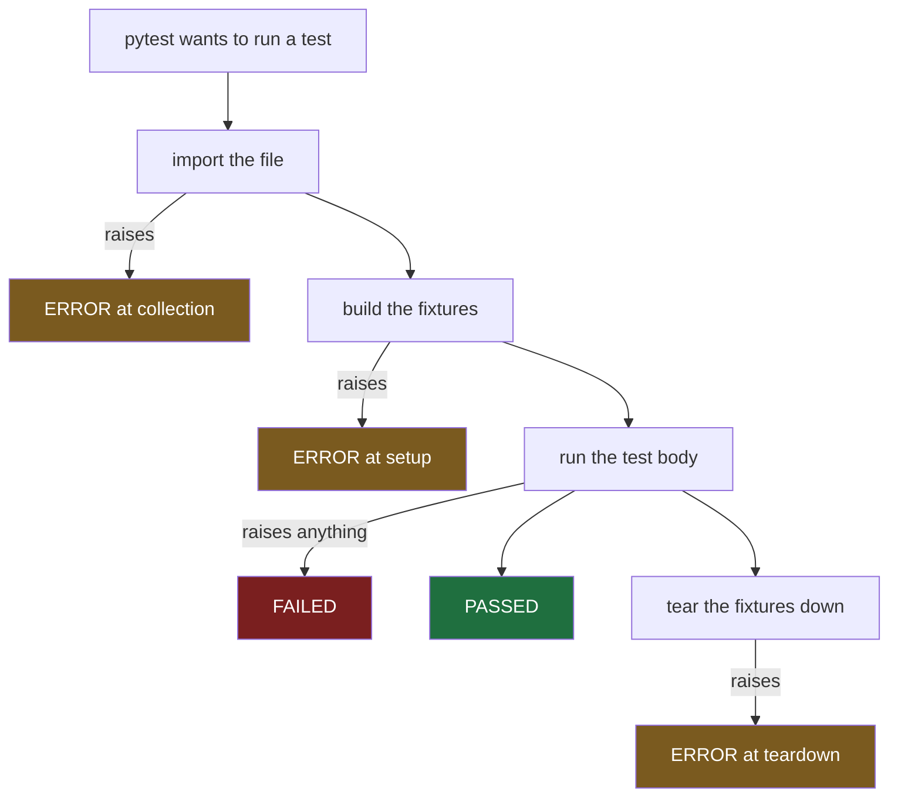
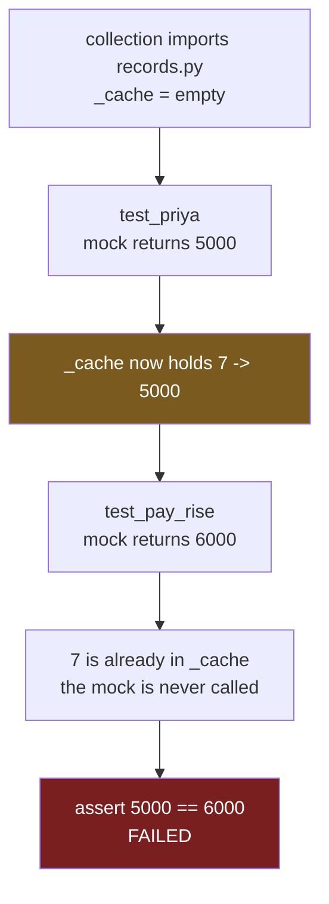
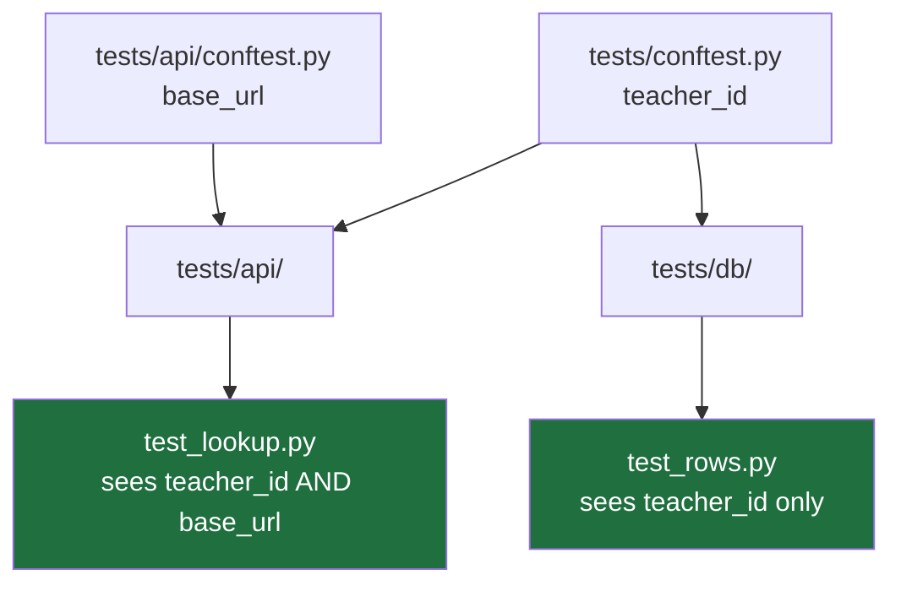

#testing #pytest #collection #isolation

**One file with a typo in its import, and a suite of two hundred tests refuses to run — reporting an error in a file you never touched.** Notes 2 and 3 were about a single test. This one is about what changes when many tests share one process, which is where most of the confusing behaviour lives.

# pytest's Model

> [!info] pytest imports every test file before it runs a single test, and every test in a run shares one process. Almost everything surprising about a suite follows from those two facts.

## Collection happens before anything runs

Two test files. One is perfectly fine, the other has a typo in its import.

```python
# test_salary.py — fine
from salary import annual_from_monthly


def test_annual():
    assert annual_from_monthly(1000) == 12000


def test_zero():
    assert annual_from_monthly(0) == 0
```

```python
# test_reports.py — one letter wrong
from salary import anual_from_monthly


def test_report():
    assert anual_from_monthly(1000) == 12000
```

```
_______________________ ERROR collecting test_reports.py _______________________
ImportError while importing test module '.../test_reports.py'.

test_reports.py:1: in <module>
    from salary import anual_from_monthly
E   ImportError: cannot import name 'anual_from_monthly' from 'salary'.
    Did you mean: 'annual_from_monthly'?
=========================== short test summary info ============================
ERROR test_reports.py
!!!!!!!!!!!!!!!!!!!! Interrupted: 1 error during collection !!!!!!!!!!!!!!!!!!!!
=============================== 1 error in 0.06s ===============================
```

Read the last line. **`1 error`, not `2 passed, 1 error`.**

The two tests in `test_salary.py` are correct and they did not run. Nothing was executed at all.

---

## Why one bad file stops everything

pytest works in two phases, and they are strictly separate.


> **Importing a file runs everything at its top level.** The `from salary import anual_from_monthly` line executes during collection, long before any test does, and it raised there.

pytest then stops rather than **running a partial suite**. It could not finish building the list of what to run, and a green report over a suite that had silently lost a file would be worse than an error.

### What this looks like from the inside

You break one file and the whole suite stops. The tests you were working on go from passing to not running, and **the error names a different file** — possibly one you have not touched today.

The instinct is that the change broke everything. It did not. One file failed to import, and the run never started.

> **When a report says error rather than failed, read the file the error names — not the tests you were writing.**

### The nastier version

Anything at the top level of a test file runs during collection. Not only imports.

```python
import os

API_KEY = os.environ["RECORDS_API_KEY"]      # runs at collection time


def test_something():
    ...
```

On a machine without that variable set, this raises `KeyError` while pytest is still building its list, so **the entire suite refuses to start** because one file wanted an environment variable it did not get.

That is the mechanism behind a rule that turns up later: configuration read at import time is a testability problem rather than a style preference.

---

## Failed and errored are different outcomes

Four tests, deliberately built to produce four different results.

```python
def test_passes():
    assert annual_from_monthly(1000) == 12000


def test_fails():
    assert annual_from_monthly(1000) == 11000


def test_errors():
    assert tax_for(60000) == 6000          # tax_for raises RuntimeError


@pytest.fixture
def broken_setup():
    raise ValueError("could not build the client")


def test_with_broken_fixture(broken_setup):
    assert 1 == 1
```

```
test_salary.py .FFE                                                      [100%]

FAILED test_salary.py::test_fails  - assert 12000 == 11000
FAILED test_salary.py::test_errors - RuntimeError: the tax service is down
ERROR  test_salary.py::test_with_broken_fixture - ValueError: could not build ...

===================== 2 failed, 1 passed, 1 error in 0.02s =====================
```

`.` `F` `F` `E` — four tests, four outcomes.

Notice that `test_errors` raised a `RuntimeError` rather than an assertion, and pytest still called it **failed**. The distinction is not about which exception was raised.

### The rule is about where, not what

| Where the exception came from | Outcome |
|---|---|
| Inside the test function — any exception, assertion or not | **F**, failed |
| A fixture, during setup | **E**, error |
| A fixture, during teardown | **E**, error |
| Importing the file, before anything ran | **E**, error at collection |

> **Failed means the test ran. Errored means it never got the chance.**



### Why it is worth reading off the report

The two point at different places, and confusing them wastes time.

**A failure is about the code.** The test ran, exercised the subject, and the subject behaved wrongly — either by returning a wrong value or by blowing up. `test_errors` failing with `RuntimeError: the tax service is down` is real information: `tax_for` raised, and it should not have.

**An error is about the test's surroundings.** The subject was never reached at all. A fixture could not build a client, a file was missing, an environment variable was absent. Nothing whatsoever has been learned about the code.

That is why the header counts them apart.

```
2 failed, 1 passed, 1 error
```

> **Fix errors before looking at failures.** An error means some tests produced no information, so the failures on screen may not be the whole picture — and errors usually trace back to one environmental problem affecting many tests at once.

### The connection back

An errored test proves nothing about the code. Neither does a vacuous one.

The difference is that **an error is loud**. It sits in its own category, coloured differently, counted separately. A vacuous test reports as `1 passed` and looks exactly like evidence.

The noisy failure mode announces itself. The silent one does not.

---

## Two tests that pass alone and fail together

A module with a cache in it — the same shape as the lookup function everything else in this folder has been built around.

```python
# records.py
_cache = {}


def _really_fetch(teacher_id):
    raise RuntimeError("this hit the real network")


def fetch_monthly_pay(teacher_id):
    if teacher_id not in _cache:
        _cache[teacher_id] = _really_fetch(teacher_id)
    return _cache[teacher_id]
```

```python
# test_records.py
def test_priya_earns_5000():
    with patch("records._really_fetch", return_value=5000):
        assert fetch_monthly_pay(7) == 5000


def test_after_a_pay_rise_she_earns_6000():
    with patch("records._really_fetch", return_value=6000):
        assert fetch_monthly_pay(7) == 6000
```

Each one on its own:

```
$ pytest -k priya
1 passed, 1 deselected in 0.01s

$ pytest -k pay_rise
1 passed, 1 deselected in 0.00s
```

`-k` is a filter — it picks tests whose name contains that text and does not run the rest. **Deselected** means excluded by the filter, never a candidate at all, which is worth separating from a word that turns up later.

| Word | Means |
|---|---|
| **deselected** | the filter excluded it. It was never a candidate |
| **skipped** | it was selected, then chose not to run — wrong platform, missing dependency, marked as skip |

Both together now, with nothing changed:

```
    def test_after_a_pay_rise_she_earns_6000():
        with patch("records._really_fetch", return_value=6000):
>           assert fetch_monthly_pay(7) == 6000
E           assert 5000 == 6000
E            +  where 5000 = fetch_monthly_pay(7)

========================= 1 failed, 1 passed in 0.01s ==========================
```

The second test asked for 6000 and got **5000 — the value the first test put there**.

### Step by step

`_cache` is created once, when the module is imported. Collection imports every test file before anything runs, so **that dictionary existed before the first test started, and there is exactly one of it for the whole session**.

**The first test runs**, because tests execute top to bottom within a file.

```python
with patch("records._really_fetch", return_value=5000):
    assert fetch_monthly_pay(7) == 5000
```

Inside `fetch_monthly_pay(7)`:

```python
if teacher_id not in _cache:                         # 7 is not in {}, so go in
    _cache[teacher_id] = _really_fetch(teacher_id)   # the mock, returns 5000
return _cache[teacher_id]                            # 5000
```

`assert 5000 == 5000` passes. Then the `with` block ends and `patch` puts the real `_really_fetch` back — that cleanup is automatic and correct.

But look at what is left behind.

```python
_cache == {7: 5000}
```

> **`patch` cleaned up after itself. The cache did not.** Nothing in the test touched `_cache`, so nothing put it back.

**The second test runs.**

```python
with patch("records._really_fetch", return_value=6000):
    assert fetch_monthly_pay(7) == 6000
```

Inside `fetch_monthly_pay(7)` this time:

```python
if teacher_id not in _cache:        # 7 IS in {7: 5000}, skip it all
    _cache[teacher_id] = _really_fetch(teacher_id)   # never runs
return _cache[teacher_id]                            # 5000
```

The mock returning 6000 is never called. It sits there, correctly patched, entirely unused.

```
E           assert 5000 == 6000
```

The second test does everything right and fails anyway, because **the state it depends on was set before it started, by a test that passed.**



---

## One process, for everything

**Every test in a run shares one process.** One interpreter, started once — not one per test, and not one per file.

> So anything living at **module level survives from one test into the next.**

- a cache, like the one above
- a registry that fills itself on import
- a connection or client created once and reused
- a `contextvar`, or anything set on a **singleton**
- environment variables a test changed
- a logging or warnings configuration
- a patched attribute nobody put back

> In Java a test class gets fresh instances per method by default, so the instinct is that state resets between tests. **Here nothing resets unless something resets it.**

### Two properties that make this nasty

**The failing test is not the guilty one.** `test_after_a_pay_rise` is correct — it mocks the right thing, asserts the right value, and passes in isolation. The damage was done by `test_priya`, which passed. The report points at the victim.

**It depends on order.** Swap those two tests and the failure moves to the other one. Run either alone and there is no failure at all.

That is the cry-wolf mechanism in a specific form: **a test failing according to what ran before it** teaches everybody that red does not mean broken.

### The version that is worse

The example above fails, which at least says something is wrong.

> **The dangerous case is leaked state that makes a test pass.** A test working only because an earlier test left a record in a cache, or logged something in, is green today and red the day a rename changes the order — with a failure that appears to come from nowhere, in a file nobody touched.

---

## The order, and what a rename does to it

Take the same two tests and put them in separate files.

```
test_current_pay.py     test_priya_earns_5000
test_pay_rises.py       test_after_a_pay_rise_she_earns_6000
```

```
test_current_pay.py::test_priya_earns_5000                PASSED
test_pay_rises.py::test_after_a_pay_rise_she_earns_6000    FAILED
```

> `c` before `p`, so `test_current_pay` runs first and fills the cache with 5000.

Now rename one file. No code changes at all — only the filename.

```
test_current_pay.py  ->  test_salaries.py
```

```
test_pay_rises.py::test_after_a_pay_rise_she_earns_6000    PASSED
test_salaries.py::test_priya_earns_5000                    FAILED
```

**The failure moved to the other test.** `p` now comes before `s`, so `test_pay_rises` runs first, fills the cache with 6000, and the other test gets 6000 where it wanted 5000.

### The order pytest uses

**Alphabetical by file path. Top to bottom within a file.**

That is the whole rule — no dependency graph, no cleverness, and no randomisation by default.

Which has a consequence worth sitting with. The order is **stable**, so an order dependence stays invisible for as long as nothing disturbs it. Green on every machine, green in CI, for months.

Then somebody renames a file. Or adds one whose name sorts in between. Or deletes a test.

> **Stability is what makes this dangerous rather than safe.** A random order would have shown the problem on day one. A stable order hides it until the day a rename exposes it — as a failure in a file nobody touched, in a test that has not changed since it was written.

---

## Finding order dependence on purpose

Reading will not find these. A leak can sit three files apart and travel through a library nobody in the room wrote. The only reliable method is to **run the tests in a different order and see what breaks**.

That is what `pytest-randomly` is for. It is a third-party plugin, and once installed it shuffles the order on every run and prints the seed it used.

```
Using --randomly-seed=1726048833
```

A suite that only passes in alphabetical order starts failing intermittently, which is exactly the information wanted. The seed is printed so **any failure can be reproduced** — running with `--randomly-seed=1726048833` repeats the same shuffle exactly.

And `-p no:randomly` turns the plugin off for a run. That flag exists because the shuffling is deliberately inconvenient.

> **This is worth knowing about and not worth installing yet.** A suite of two tests has no order to speak of. The reason to meet the plugin now is that the problem it solves is the one on the screen above.

### Shuffling finds the problem, it does not fix it

Randomising the order **exposes** an order dependence. It removes nothing.

The removal is a separate idea, and it is one sentence.

> **Isolation is something you arrange, not something pytest provides.**

Nothing in pytest resets that dictionary, and nothing ever will. If a test needs a clean cache, some code has to clean it.

---

## Arranging it: a fixture that resets

The mechanical fix is a fixture that empties the cache.

```python
@pytest.fixture
def clean_cache():
    records._cache.clear()
    yield
    records._cache.clear()


def test_priya_earns_5000(clean_cache):
    with patch("records._really_fetch", return_value=5000):
        assert fetch_monthly_pay(7) == 5000


def test_after_a_pay_rise_she_earns_6000(clean_cache):
    with patch("records._really_fetch", return_value=6000):
        assert fetch_monthly_pay(7) == 6000
```

```
..                                                                       [100%]
2 passed in 0.01s
```

Both pass, in any order.

### What the yield does

Earlier fixtures ended with `return`. This one uses `yield`, and that changes what a fixture is.

```python
records._cache.clear()      # runs before the test
yield                       # the test runs here
records._cache.clear()      # runs after the test, always
```

**Everything before the `yield` is setup, everything after it is teardown**, and the `yield` itself is the test executing.

That is a `@BeforeEach` and an `@AfterEach` pair written as one function — which is genuinely better, because the setup and the cleanup that undoes it sit together and cannot drift apart.

> **The teardown runs even when the test fails**. That matters: cleanup that only happens on success leaves the mess behind exactly when there is one.

Clearing at both ends is belt and braces. Clearing before protects this test from whatever ran earlier; clearing after protects the next test from this one. Either alone is usually enough, and both costs nothing.

### The awkward part

Every test touching that module now has to remember to name the fixture.

```python
def test_priya_earns_5000(clean_cache):
```

Forget it on one test and that test quietly goes back to being order-dependent. Nothing warns you.

There is a way to apply a fixture without naming it.

```python
@pytest.fixture(autouse=True)
def clean_cache():
    records._cache.clear()
    yield
    records._cache.clear()


def test_priya_earns_5000():
    with patch("records._really_fetch", return_value=5000):
        assert fetch_monthly_pay(7) == 5000


def test_after_a_pay_rise_she_earns_6000():
    with patch("records._really_fetch", return_value=6000):
        assert fetch_monthly_pay(7) == 6000
```

```
..                                                                       [100%]
2 passed in 0.01s
```

Both pass, and **neither test mentions `clean_cache` anywhere**. The cache is still emptied before and after each one — the fixture attached itself.

### What in scope means

`autouse` does not mean everywhere. It means **everything below wherever the fixture is defined**.

| Where the fixture lives | Which tests get it |
|---|---|
| In a test file | every test in that file |
| In `conftest.py` in a folder | every test in that folder and its subfolders |
| In `conftest.py` at the project root | every test in the suite |

The same three lines can affect two tests or two thousand depending only on which file they sit in. Worth knowing before writing one, because it is easy to drop a cleanup into the root `conftest.py` and slow down a suite that never needed it.

### What it costs

Open the test file in six months, or hand it to somebody else tomorrow.

```python
def test_priya_earns_5000():
    with patch("records._really_fetch", return_value=5000):
        assert fetch_monthly_pay(7) == 5000
```

That is the whole test. It looks self-contained. Nothing on screen says it depends on the cache being empty when it starts.

Now somebody moves it to another file, because this one is getting long. **It breaks** — and nothing about the test explains why. It did not change; the reason it worked stayed behind in the file it left.

With the explicit version the reason travels with the test.

```python
def test_priya_earns_5000(clean_cache):
```

Move that and it either works, or pytest says `fixture 'clean_cache' not found` — an error naming the missing thing, rather than a mystery.

### Which one to use

The question to ask is whether **the outcome of the test depends on the fixture**.

**Right for `autouse`** — things that make the environment neutral, where every test wants the same thing and no test's result depends on which one it got.

- clearing a cache or a registry
- resetting environment variables
- blocking real network calls
- freezing warnings or logging configuration

If a test forgetting it would be a bug, then it should not be optional, and `autouse` is correct.

**Wrong for `autouse`** — anything the assertions actually read.

```python
@pytest.fixture(autouse=True)
def a_teacher_in_the_database():
    db.insert(Teacher(id=7, name="Priya", pay=5000))
```

```python
def test_lookup():
    assert fetch_monthly_pay(7) == 5000       # where do 7 and 5000 come from?
```

That test is unreadable. Both numbers come from somewhere invisible and a reader has to go hunting. Worse, editing the fixture silently changes what a dozen unrelated tests are asserting.

> **Use `autouse` for what a test must not have to think about. Name the fixture for anything a test is actually about.**

Clearing a global cache is the first kind. Putting a teacher in a database is the second.

---

## The fix underneath the fix

Step back and look at what has been built. A test suite now reaches into a private module variable and empties it, by hand, before and after every test.

```python
records._cache.clear()
```

That line is a **workaround for a design problem**, not a solution to one. The problem is that `records` owns a piece of mutable state with no way to reset it and no way to have a second one.

The version with nothing to arrange is a cache passed in rather than owned.

```python
def fetch_monthly_pay(teacher_id, cache):
    if teacher_id not in cache:
        cache[teacher_id] = _really_fetch(teacher_id)
    return cache[teacher_id]
```

Each test now makes its own `{}` and there is nothing global to leak. No fixture, no `autouse`, no reaching into a private name.

> **This is the shape of nearly every isolation fix.** Something is global because it was convenient at the time, the test needs it not to be, and the fixture is the tax paid for keeping it global. Sometimes that tax is the right call — the code is somebody else's, or the change is too large today. **Knowing that it is a tax is the part that matters.**

Which is why testability and design keep turning out to be one subject. **Code that is hard to isolate is usually code holding state it never needed to hold.**

---

## Rerunning only what failed

A suite where two of five tests are red.

```
$ pytest -q
FAILED test_salary.py::test_net_pay      - assert 54000.0 == 99999
FAILED test_salary.py::test_net_pay_zero - assert 0.0 == 42
2 failed, 3 passed in 0.01s
```

```
$ pytest -q --lf
FAILED test_salary.py::test_net_pay      - assert 54000.0 == 99999
FAILED test_salary.py::test_net_pay_zero - assert 0.0 == 42
2 failed in 0.01s
```

**The three passing tests were not run.** `--lf` means last failed — rerun only what was red last time.

On five tests that saves nothing. On a suite of two thousand with four failures it is the difference between a forty-second wait on every attempted fix and a half-second one, which changes how often the tests get run at all.

### How it remembers

pytest wrote the answer down.

```
.pytest_cache/v/cache/lastfailed
```

```json
{
  "test_salary.py::test_net_pay": true,
  "test_salary.py::test_net_pay_zero": true
}
```

That is the entire mechanism — **the failing test ids are written to a file after every run**, and `--lf` reads them back.

Worth noticing given everything else here: pytest keeps state between runs, on disk, inside the project. That is the `.pytest_cache` folder that appears on the first run. It writes its own `.gitignore` inside itself so it never gets committed, and deleting it simply makes `--lf` fall back to running everything.

### The companion flag

```
pytest --ff
```

**Failed first.** Runs everything, but puts last time's failures at the front.

| Flag | Runs | Use when |
|---|---|---|
| `--lf` | only the failures | iterating on a fix |
| `--ff` | everything, failures first | you think it is fixed and want the whole suite, but want the answer quickly |

`--ff` gives the important part in the first second and the full picture eventually.

### The trap in --lf

Run `--lf`, fix the bug, see green, move on. **But the three passing tests never ran.** The fix could have broken any of them and the report would still have said `2 passed` and looked like success.

Which is this folder's subject arriving in a flag: a green result that is not evidence, because the thing needing to be checked was not checked.

### The loop that avoids it

Stack either flag with `-x`, which stops at the first failure. That gives one failing test and one traceback on screen and nothing else.

**While things are broken the two are identical:**

```
pytest --lf -x   ->  1 failed, stopping after 1 failures
pytest --ff -x   ->  1 failed, stopping after 1 failures
```

Naturally so. `--ff` puts the failures first and `-x` stops at the first one, so it never reaches the passing tests either.

**Once everything is fixed they diverge:**

```
pytest --lf -x   ->  2 passed        the other three never ran
pytest --ff -x   ->  5 passed        the whole suite confirmed
```

> **`--ff -x` is the better default.** Identical tight iteration while broken, and it runs the full suite by itself the moment the fix lands — so the confirmation happens without having to remember a second command.

The cost is paid on that final green run, where the whole suite executes. That is the run it was wanted on.

`--lf` keeps a narrower place: a suite whose passing tests take minutes and genuinely are not wanted, or debugging one specific failure in isolation.

---

## Sharing fixtures without importing anything

Two test files, in different folders, both needing the same fixture.

```
tests/conftest.py            teacher_id
tests/api/conftest.py        base_url
tests/api/test_lookup.py     uses both
tests/db/test_rows.py        uses teacher_id
```

```python
# tests/conftest.py
@pytest.fixture
def teacher_id():
    return 7
```

```python
# tests/api/conftest.py
@pytest.fixture
def base_url():
    return "http://records.example/api"
```

```python
# tests/api/test_lookup.py
def test_url_and_id(teacher_id, base_url):
    assert f"{base_url}/teachers/{teacher_id}" == "http://records.example/api/teachers/7"
```

```
..                                                                       [100%]
2 passed in 0.01s
```

Both pass, and **neither test file imports anything at all** — not pytest, not conftest, nothing.

### What conftest.py is

A file pytest looks for by name, whose fixtures become available to **every test in that folder and every folder below it**, with no import.



`test_rows.py` cannot see `base_url`, because that fixture lives in a sibling folder rather than a parent. **Fixtures flow downward, never sideways.**

This is the mechanism behind scope in the autouse section above. The same three lines affect two tests or two thousand purely according to which `conftest.py` they sit in.

### The rule that looks like a detail

**A `conftest.py` is never imported.** pytest finds it by name and registers what is inside it.

And it must not be imported from either.

```python
from conftest import teacher_id      # do not
```

That is a real **anti-pattern** with a real mechanism behind it. pytest has already loaded that file its own way; importing it by name loads it **a second time**, as a separate module, producing two copies of every fixture in it — and then resolution errors that read as impossible, because a fixture appears to exist and not exist at once.

> **If something in `conftest.py` needs importing, it does not belong in `conftest.py`.** Plain helper functions go in an ordinary module that gets imported normally. `conftest.py` is for **fixtures and pytest hooks**, and pytest should be the only thing that ever reads it.

---

## Why the configuration block is not optional

```toml
[tool.pytest.ini_options]
addopts = ["--import-mode=importlib"]
testpaths = ["tests"]
```

Two reasons, both of them from this note.

**Without it you are relying on defaults that differ across versions.** `--import-mode` is the clearest case: the default is the older `prepend` behaviour purely for backward compatibility, while pytest's own documentation recommends the other for new projects. A flag typed by hand sometimes and forgotten other times means **the same suite behaves differently depending on how it was started** — which is the order-dependence problem again, one level up.

**And its presence decides where the project root is.** That is the `rootdir` line in the report header, and it determines where `testpaths` is measured from and where `.pytest_cache` is written.
