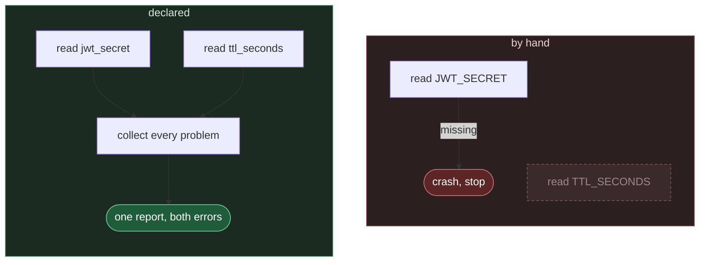
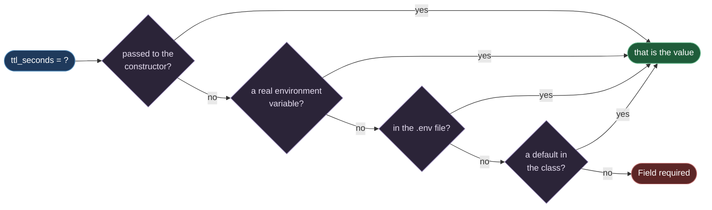
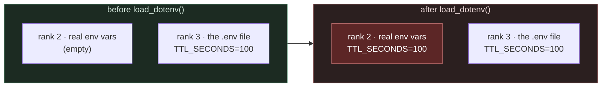

#config #pydantic #pydantic-settings #dotenv #docker #python

**Every service reads its settings from the environment, and `os.environ` already does that in one line.** So the question is never how to read configuration. It is what you give up by reading it that way — and the answer only shows up on the day something is wrong.

# Declared, Not Fetched

> [!info] A settings class is an ordinary class where each attribute is one configuration value. You never call it to go and fetch anything. You write down what the program needs, and the library fills those attributes in from the environment and checks them before any of your code runs.

## The simpler tool genuinely works

`src/config_lab/note01/a_by_hand.py`:

```python
import os

jwt_secret = os.environ["JWT_SECRET"]
ttl_seconds = int(os.environ.get("TTL_SECONDS", "900"))
raw_max_sessions = os.environ.get("MAX_SESSIONS")
max_sessions = int(raw_max_sessions) if raw_max_sessions is not None else None

print("jwt_secret   =", jwt_secret)
print("ttl_seconds  =", ttl_seconds, type(ttl_seconds))
print("max_sessions =", max_sessions, type(max_sessions))
```

```
$ JWT_SECRET=abc123 TTL_SECONDS=60 uv run python src/config_lab/note01/a_by_hand.py
jwt_secret   = abc123
ttl_seconds  = 60 <class 'int'>
max_sessions = None <class 'NoneType'>
```

Three settings, nothing to install, nothing to learn. One is required, one falls back to 900 when it is absent, and one is simply absent and allowed to be. On the happy path there is nothing wrong with this, and any case for replacing it has to come from somewhere other than the happy path.

Each of those three is read a different way, and that difference is the first thing to keep in view: `os.environ[...]` **for the one that must be there**, `.get(x, "900")` for the one with a fallback, and `.get(x)` plus a check against `None` for the one that may never arrive.

## It breaks one problem at a time

Give it two problems at once — no `JWT_SECRET`, and a `TTL_SECONDS` that is not a number. `MAX_SESSIONS` is unset as well, and that is not a problem, because it is optional.

The same three reads as above, with the crash caught so the message can be printed rather than filling the screen with a traceback.

`src/config_lab/note01/b_one_problem_at_a_time.py`:

```python
import os

try:
    jwt_secret = os.environ["JWT_SECRET"]
    ttl_seconds = int(os.environ.get("TTL_SECONDS", "900"))
    raw_max_sessions = os.environ.get("MAX_SESSIONS")
    max_sessions = int(raw_max_sessions) if raw_max_sessions is not None else None
    print("no problems found")
except (KeyError, ValueError) as exc:
    print(type(exc).__name__, ":", exc)
```

```
$ TTL_SECONDS=abc uv run python src/config_lab/note01/b_one_problem_at_a_time.py
KeyError : 'JWT_SECRET'
```

One error. It died on the first of the three reads and never reached the second, so it has no idea `TTL_SECONDS` is also broken. Fix that one, run again, meet the next one:

```
$ JWT_SECRET=abc123 TTL_SECONDS=abc uv run python src/config_lab/note01/b_one_problem_at_a_time.py
ValueError : invalid literal for int() with base 10: 'abc'
```

> **The cost is a round trip, and the round trip is rarely cheap.** A service with forty settings and a badly filled environment is up to forty runs. When you are finding out by watching a container crash and restart, each of those is a deploy.

And look at what that second message does not tell you.

> That is the error for a bad `TTL_SECONDS`, and it never names `TTL_SECONDS`. It tells you some integer conversion somewhere received the string `abc`.

## The same three settings, declared

`src/config_lab/note01/c_declared_same_job.py`:

```python
from pydantic_settings import BaseSettings


class SessionSettings(BaseSettings):
    jwt_secret: str
    ttl_seconds: int = 900
    max_sessions: int | None = None


settings = SessionSettings()

print("jwt_secret   =", settings.jwt_secret)
print("ttl_seconds  =", settings.ttl_seconds, type(settings.ttl_seconds))
print("max_sessions =", settings.max_sessions, type(settings.max_sessions))
```

Given the same environment as `a_by_hand.py`, the output is line for line identical:

```
$ JWT_SECRET=abc123 TTL_SECONDS=60 uv run python src/config_lab/note01/c_declared_same_job.py
jwt_secret   = abc123
ttl_seconds  = 60 <class 'int'>
max_sessions = None <class 'NoneType'>
```

**Nothing is gained on the happy path, which is the point.** Three statements became three declarations, the program does the same thing, and so far the only difference is where the rules are written down.

## Every problem in one report

The same broken environment as two sections ago, handed to both mechanisms in one run so the two reports can be read against each other.

`src/config_lab/note01/d_all_errors_at_once.py`:

```python
import os

from pydantic import ValidationError
from pydantic_settings import BaseSettings


class SessionSettings(BaseSettings):
    jwt_secret: str
    ttl_seconds: int = 900
    max_sessions: int | None = None


print("--- by hand ---")
try:
    jwt_secret = os.environ["JWT_SECRET"]
    ttl_seconds = int(os.environ.get("TTL_SECONDS", "900"))
    raw_max_sessions = os.environ.get("MAX_SESSIONS")
    max_sessions = int(raw_max_sessions) if raw_max_sessions is not None else None
    print("no problems found")
except (KeyError, ValueError) as exc:
    print(type(exc).__name__, ":", exc)

print()
print("--- BaseSettings ---")
try:
    settings = SessionSettings()
    print("no problems found")
except ValidationError as exc:
    print(type(exc).__name__)
    print(exc)
```

```
$ TTL_SECONDS=abc uv run python src/config_lab/note01/d_all_errors_at_once.py
--- by hand ---
KeyError : 'JWT_SECRET'

--- BaseSettings ---
ValidationError
2 validation errors for SessionSettings
jwt_secret
  Field required [type=missing, input_value={'ttl_seconds': 'abc'}, input_type=dict]
    For further information visit https://errors.pydantic.dev/2.13/v/missing
ttl_seconds
  Input should be a valid integer, unable to parse string as an integer [type=int_parsing, input_value='abc', input_type=str]
    For further information visit https://errors.pydantic.dev/2.13/v/int_parsing
```

**One run, and the two halves do not report the same number of problems.** By hand: one error, the first one it met. Declared: everything is read, everything is checked, and then one report lists every problem — each naming its field, what was expected, and what actually arrived.

> [!important] Why `ttl_seconds` is an error when it has a default of 900
> A default answers **absence**, not nonsense. In this run `TTL_SECONDS` is present — it is the string `abc` — so the field has a value to convert, the conversion fails, and that is the end of it. The `= 900` is never reached, because nothing was missing.
>
> **A default is what happens when nothing arrives. It is not a repair for something bad arriving.** A setting with a default is still validated exactly as strictly as one without, and the only thing the default changes is what an absent variable means.

Leave `TTL_SECONDS` out altogether instead, and the default does its job:

```
$ JWT_SECRET=abc123 uv run python src/config_lab/note01/c_declared_same_job.py
jwt_secret   = abc123
ttl_seconds  = 900 <class 'int'>
max_sessions = None <class 'NoneType'>
```

Absent gives 900. Present and malformed gives an error. Those are two different situations and the declaration treats them differently, which is the whole reason a default is worth having.

**Two errors, not three.** `max_sessions` is missing from that environment as well, and it is not in the report, because an absent optional value is not a problem — it quietly became `None` while the other two were being counted. Drop `TTL_SECONDS` from the command as well and the report falls to one error, for `jwt_secret` alone: two absent optional values, still nothing to complain about.



> `read TTL_SECONDS` is drawn faded because it never executes. **That single unreached line is the whole difference**.


## The declaration is the contract

This is the half that matters even when nothing is broken.

Three lines out of the file above, and each one is a complete description of one setting:

```python
jwt_secret: str                    # required, because there is no default
ttl_seconds: int = 900             # optional, an integer, 900 when absent
max_sessions: int | None = None    # optional, an integer, None when absent
```

Those same facts — name, type, required-or-default, allowed-to-be-absent — exist in the by-hand version too. They are just hidden inside the shape of the statements:

| Question | By hand, you infer it from | Declared, you read it from |
|---|---|---|
| Is it required? | `os.environ[x]` versus `os.environ.get(x, d)` | whether there is a default |
| What type is it? | the `int(...)` wrapper around the call | the annotation |
| What is the fallback? | the second argument to `.get` | the value after `=` |
| May it be absent altogether? | a separate `None` check after a bare `.get(x)` | the `= None` |

> [!warning] The annotation alone does not make a setting optional. `max_sessions: int | None` with no default is still **required** — it only says `None` is an allowed value, so an absent variable is reported as `Field required`. The `= None` is what makes it optional, and the two look almost the same on the page.

> **One line per setting, and the line says everything about it.** Forty settings become a forty-line list you can read top to bottom, instead of forty statements scattered across the modules that happen to need them.

## Environment variables are always strings

`TTL_SECONDS=60` is the string `"60"`, never the number `60`. Something has to convert it.

By hand that something is `int(...)`, which is both the conversion and the source of the unhelpful error. Declared, the annotation does it, and does it with a message that names the field. Nothing else changes — `type(settings.ttl_seconds)` is `<class 'int'>` either way.

> [!warning] A default written as a string is a trap worth avoiding early. `os.environ.get("TTL_SECONDS", "900")` returns a string that still needs converting, so the fallback path and the supplied path are two different code paths. In the declaration, `ttl_seconds: int = 900` is already an integer and there is only one path.

## Who wins when the file and the environment disagree

> **Nobody types a forty-variable command line, so settings go in a file.** 

That solves the typing and immediately creates a harder question: when the file says one thing and the environment says another, which one does the running program actually get? Getting this rule wrong does not produce an error. It produces a correct-looking answer that is wrong.

> [!important] A `.env` file is a plain text file of `NAME=value` lines sitting next to your project. It is not special to the operating system and the shell knows nothing about it — a library reads it and treats those names as if they had been set in the environment.
>  Because the file only imitates the environment, there is an ordering question, and the ordering is where the surprises live.

## One line moves them into a file

The file is plain text at the project root, one `NAME=value` per line. It says nothing about `MAX_SESSIONS`, which is how the fourth source gets its turn later in this note.

`.env`:

```
JWT_SECRET=from-the-dotenv-file
TTL_SECONDS=100
```

That file is deliberately not ignored by git in this lab. It holds invented values and it is the subject of the note — `e` and `f` below do not work without it.

`src/config_lab/note01/e_from_a_dotenv_file.py`:

```python
from pydantic_settings import BaseSettings, SettingsConfigDict


class SessionSettings(BaseSettings):
    model_config = SettingsConfigDict(env_file=".env")

    jwt_secret: str
    ttl_seconds: int = 900
    max_sessions: int | None = None


settings = SessionSettings()

print("jwt_secret   =", settings.jwt_secret)
print("ttl_seconds  =", settings.ttl_seconds)
print("max_sessions =", settings.max_sessions)
```

One line was added to the class — `model_config = SettingsConfigDict(env_file=".env")` — and nothing whatsoever is set on the command line:

```
$ uv run python src/config_lab/note01/e_from_a_dotenv_file.py
jwt_secret   = from-the-dotenv-file
ttl_seconds  = 100
max_sessions = None
```

Two values came out of the file. The third came from the default in the class, because the file never mentions it.

> [!warning] That path is relative to the directory you run from, not to the source file. Run the same script from one directory up and it silently finds no file, falls through to the defaults, and tells you `Field required` — a missing-value error for a value that is sitting right there in a file two lines long.

## Four places, checked in order

The value is looked for in four places. The first place it is found wins, and the rest are never consulted.



| Rank | Source | What it looks like |
|---|---|---|
| 1 | Passed to the constructor | `SessionSettings(ttl_seconds=7)` |
| 2 | A real environment variable | `TTL_SECONDS=60 python app.py` |
| 3 | The `.env` file | `TTL_SECONDS=100` |
| 4 | The default in the class | `ttl_seconds: int = 900` |

## Proving it

Three settings are enough to make all four ranks answer at once. `jwt_secret` is only in the file, `ttl_seconds` is in the file and can be overridden from the shell, `max_sessions` is nowhere at all, and one instance is built with an argument.

`src/config_lab/note01/f_who_wins.py`:

```python
import os

from pydantic_settings import BaseSettings, SettingsConfigDict


class SessionSettings(BaseSettings):
    model_config = SettingsConfigDict(env_file=".env")

    jwt_secret: str
    ttl_seconds: int = 900
    max_sessions: int | None = None


plain = SessionSettings()
with_argument = SessionSettings(ttl_seconds=7)

print("the .env file says     JWT_SECRET=from-the-dotenv-file, TTL_SECONDS=100")
print("the shell says         TTL_SECONDS=", os.environ.get("TTL_SECONDS"), sep="")
print()
print("SessionSettings()")
print("    jwt_secret     ->", plain.jwt_secret)
print("    ttl_seconds    ->", plain.ttl_seconds)
print("    max_sessions   ->", plain.max_sessions)
print()
print("SessionSettings(ttl_seconds=7)")
print("    ttl_seconds    ->", with_argument.ttl_seconds)
```

The same class and the same `.env`, run twice. Nothing is set in the shell the first time:

```
$ uv run python src/config_lab/note01/f_who_wins.py
the .env file says     JWT_SECRET=from-the-dotenv-file, TTL_SECONDS=100
the shell says         TTL_SECONDS=None

SessionSettings()
    jwt_secret     -> from-the-dotenv-file
    ttl_seconds    -> 100
    max_sessions   -> None

SessionSettings(ttl_seconds=7)
    ttl_seconds    -> 7
```

```
$ TTL_SECONDS=60 uv run python src/config_lab/note01/f_who_wins.py
the .env file says     JWT_SECRET=from-the-dotenv-file, TTL_SECONDS=100
the shell says         TTL_SECONDS=60

SessionSettings()
    jwt_secret     -> from-the-dotenv-file
    ttl_seconds    -> 60
    max_sessions   -> None

SessionSettings(ttl_seconds=7)
    ttl_seconds    -> 7
```

**One setting per rank, in the second run.** A constructor argument gave 7 and nothing else was consulted. A real environment variable beat the file, 60 against 100. The file answered for `jwt_secret`, which the shell never mentioned. And `max_sessions`, named by nobody anywhere, quietly became the default.

| Setting | Where the value came from |
|---|---|
| `ttl_seconds` in `SessionSettings(ttl_seconds=7)` | rank 1, the constructor |
| `ttl_seconds` in the second run | rank 2, a real environment variable |
| `jwt_secret` | rank 3, the `.env` file |
| `max_sessions` | rank 4, the default in the class |

## The rule that catches people

Ranks 2 and 3 are the dangerous pair, because a very common library call moves values from one to the other.

`load_dotenv()` does not hand values to your settings class. It reads the file and **sets every name in it as a real environment variable**. The values were rank 3 before the call and are rank 2 after it.

`src/config_lab/note01/g_load_dotenv_promotes.py`:

```python
import os

from dotenv import load_dotenv

print("before load_dotenv()")
print("    os.environ.get('JWT_SECRET')  =", os.environ.get("JWT_SECRET"))
print("    os.environ.get('TTL_SECONDS') =", os.environ.get("TTL_SECONDS"))

load_dotenv()

print("after load_dotenv()")
print("    os.environ.get('JWT_SECRET')  =", os.environ.get("JWT_SECRET"))
print("    os.environ.get('TTL_SECONDS') =", os.environ.get("TTL_SECONDS"))
```

```
$ uv run python src/config_lab/note01/g_load_dotenv_promotes.py
before load_dotenv()
    os.environ.get('JWT_SECRET')  = None
    os.environ.get('TTL_SECONDS') = None
after load_dotenv()
    os.environ.get('JWT_SECRET')  = from-the-dotenv-file
    os.environ.get('TTL_SECONDS') = 100
```

No settings class was involved in that run. One function call, and two names that the shell had never heard of are now part of the environment this process runs in.



Once a value is sitting at rank 2, pointing your settings at a **different** file cannot dislodge it. The other file is rank 3. It loses. There is no error, no warning, and no way to tell from the output that it happened.


`staging.env`:

```
JWT_SECRET=from-the-staging-file
TTL_SECONDS=777
```

> The class says `env_file=".env"`, so it normally reads `.env`. Passing `_env_file="staging.env"` when you create an object overrides that for that one object only: it reads `staging.env` instead, and the class itself does not change. That is how you check what the staging settings would be without writing a second class.
>
> The file below creates that object twice, with exactly the same line — once before `load_dotenv()` is called and once after. Nothing else changes between the two.

`src/config_lab/note01/h_the_file_that_loses.py`:

```python
import os

from dotenv import load_dotenv
from pydantic_settings import BaseSettings, SettingsConfigDict


class SessionSettings(BaseSettings):
    model_config = SettingsConfigDict(env_file=".env")

    jwt_secret: str
    ttl_seconds: int = 900
    max_sessions: int | None = None


before = SessionSettings(_env_file="staging.env")

print("before load_dotenv()")
print("    the shell says TTL_SECONDS=", os.environ.get("TTL_SECONDS"), sep="")
print("    SessionSettings(_env_file='staging.env')")
print("        jwt_secret  ->", before.jwt_secret)
print("        ttl_seconds ->", before.ttl_seconds)

load_dotenv()

after = SessionSettings(_env_file="staging.env")

print()
print("after load_dotenv()")
print("    the shell says TTL_SECONDS=", os.environ.get("TTL_SECONDS"), sep="")
print("    SessionSettings(_env_file='staging.env')")
print("        jwt_secret  ->", after.jwt_secret)
print("        ttl_seconds ->", after.ttl_seconds)
```

```
$ uv run python src/config_lab/note01/h_the_file_that_loses.py
before load_dotenv()
    the shell says TTL_SECONDS=None
    SessionSettings(_env_file='staging.env')
        jwt_secret  -> from-the-staging-file
        ttl_seconds -> 777

after load_dotenv()
    the shell says TTL_SECONDS=100
    SessionSettings(_env_file='staging.env')
        jwt_secret  -> from-the-dotenv-file
        ttl_seconds -> 100
```

**The same line of code, twice, with two different answers.** Before the call it read `staging.env` and gave 777. After it, the identical construction gave 100 — and look at `jwt_secret`, which says `from-the-dotenv-file` while the code says `staging.env`. Both fields came back from a file nobody asked for, and the object is perfectly well formed.

> **This is how you end up trusting a wrong answer.** Say you want to check what the staging settings are, so you write `SessionSettings(_env_file="staging.env")`. If anything earlier in the same program called `load_dotenv()`, you get the values from `.env` instead — 100, not 777 — while your code still says `staging.env`. Nothing fails and the numbers look normal, so nothing tells you to doubt them.

The defence is to have nothing promote values behind your back — no `load_dotenv()` anywhere, and one settings class that reads the file itself, so rank 3 stays rank 3.

## The same rule is your deploy story

Rank 2 beating rank 3 is not a quirk to work around. It is the feature that makes containers work.

An image ships with a `.env` baked in, holding the settings that are the same on every run. Anything that differs per run is passed in at start time as a real environment variable, and wins, without rebuilding the image.

```bash
docker run -e TTL_SECONDS=60 my-service      # beats whatever the baked-in .env says
```

> **One file for what is stable, environment variables for what varies.** Rank 2 above rank 3 is what makes that split hold.
