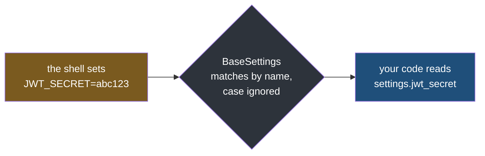
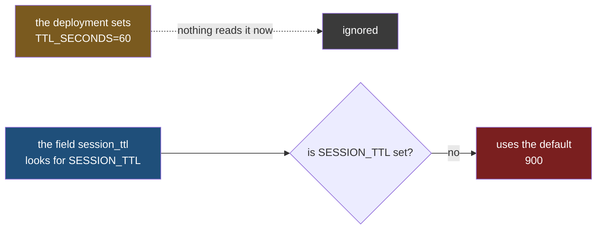
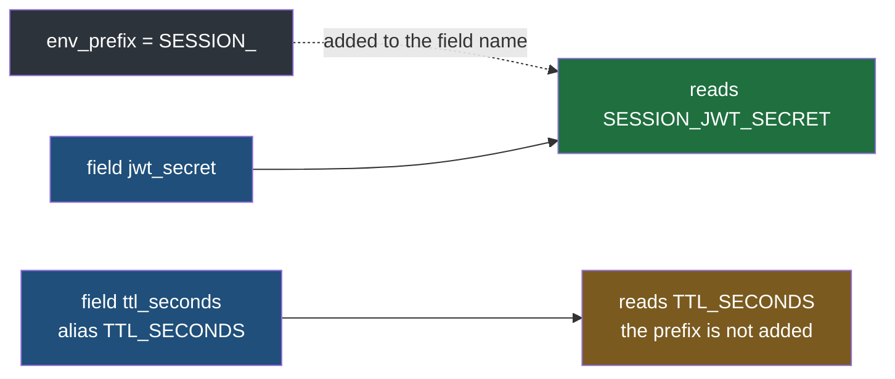

#config #pydantic #pydantic-settings #python

**Your code says `jwt_secret`, your deployment sets `JWT_SECRET`, and nobody ever wrote down that those two are the same setting.** The library connects them, and the rule it uses decides which variables your deployment has to set.

# Names And Types

> [!info] A field name is what your Python code uses. An environment variable name is what the shell and the deployment use. `BaseSettings` connects the two by name, and what counts as the same name is a rule worth knowing exactly. `BaseSettings` comes from **pydantic-settings**, the library this folder uses.

## One setting, two names



Neither side knows about the other. The shell has never seen your class, and your class never reads the shell on its own. `BaseSettings` sits between them: for each field, it looks for an environment variable with the same name.

`src/config_lab/note02/a_two_names.py`:

```python
from pydantic import ValidationError
from pydantic_settings import BaseSettings


class SessionSettings(BaseSettings):
    jwt_secret: str


try:
    settings = SessionSettings()
    print("jwt_secret =", settings.jwt_secret)
except ValidationError as exc:
    print(type(exc).__name__)
    print(exc)
```

Run it with one variable set at a time. Three spellings that match:

```
$ JWT_SECRET=abc123 uv run python src/config_lab/note02/a_two_names.py
jwt_secret = abc123

$ jwt_secret=abc123 uv run python src/config_lab/note02/a_two_names.py
jwt_secret = abc123

$ Jwt_Secret=abc123 uv run python src/config_lab/note02/a_two_names.py
jwt_secret = abc123
```

And two that do not:

```
$ SECRET=abc123 uv run python src/config_lab/note02/a_two_names.py
ValidationError
1 validation error for SessionSettings
jwt_secret
  Field required [type=missing, input_value={}, input_type=dict]
    For further information visit https://errors.pydantic.dev/2.13/v/missing

$ JWTSECRET=abc123 uv run python src/config_lab/note02/a_two_names.py
ValidationError
1 validation error for SessionSettings
jwt_secret
  Field required [type=missing, input_value={}, input_type=dict]
    For further information visit https://errors.pydantic.dev/2.13/v/missing
```

| What the shell set | Found by the field `jwt_secret`? |
|---|---|
| `JWT_SECRET=abc123` | yes |
| `jwt_secret=abc123` | yes |
| `Jwt_Secret=abc123` | yes |
| `SECRET=abc123` | no — `Field required` |
| `JWTSECRET=abc123` | no — `Field required` |

**The match is on the field name, with case ignored.** Upper, lower and mixed case all find it.

**Any other spelling finds nothing, even though the value is sitting in the environment.** To a person, `SECRET` and `JWTSECRET` look like obvious matches. To the library they are unrelated names. Look at `input_value={}` in the report: as far as the class is concerned, nothing arrived at all.

> [!important] You never wrote `JWT_SECRET` anywhere
> The only name in the code is `jwt_secret`, the field. The name your deployment has to set is worked out from it. That is convenient, and it also means the variable name is not written down anywhere a person would go looking for it.

## Rename the field and the variable follows

A rename inside Python feels like something only the code cares about. An editor does it in one click, and a reviewer reads it as harmless. **But the environment variable name is worked out from the field name, so renaming the field renames the variable the deployment has to set** — and nobody tells the deployment.

Two fields have been renamed — `jwt_secret` is now `signing_key`, and `ttl_seconds` is now `session_ttl`. The deployment has not been told, so it still sets `JWT_SECRET` and `TTL_SECONDS`. One of the renamed fields has no default, the other has one.

`src/config_lab/note02/b_rename_the_field.py`:

```python
from pydantic import ValidationError
from pydantic_settings import BaseSettings


class RenamedRequired(BaseSettings):
    signing_key: str


class RenamedWithDefault(BaseSettings):
    session_ttl: int = 900


print("--- the renamed field with no default")
try:
    required = RenamedRequired()
    print("signing_key =", required.signing_key)
except ValidationError as exc:
    print(type(exc).__name__)
    print(exc)

print()
print("--- the renamed field with a default")
with_default = RenamedWithDefault()
print("session_ttl =", with_default.session_ttl)
```

```
$ JWT_SECRET=abc123 TTL_SECONDS=60 uv run python src/config_lab/note02/b_rename_the_field.py

--- the renamed field with no default
ValidationError
1 validation error for RenamedRequired
signing_key
  Field required [type=missing, input_value={}, input_type=dict]
    For further information visit https://errors.pydantic.dev/2.13/v/missing

--- the renamed field with a default
session_ttl = 900
```



| The renamed field | What happens when the old variable is still set |
|---|---|
| `signing_key: str`, no default | the service refuses to start — `Field required` |
| `session_ttl: int = 900`, has a default | the service starts and runs with 900, not the 60 the deployment set |

The first one is the lucky case. It fails on the first run, before anyone depends on it.

> [!warning] The second one ships
> The deployment says 60. The service runs with 900. `TTL_SECONDS` is still set and still holds 60, and nothing reads it any more — no error, no warning, and no log line saying a variable was set and never used. A default is meant for a value nobody supplied. Here it quietly replaces a value somebody did supply, because the rename made the two stop matching.

## Pin the name with an alias

The fix is to stop the variable name being worked out from the field name at all. `validation_alias` **writes the variable name down in the code**, right next to the field it feeds.

`src/config_lab/note02/c_pin_the_name.py`:

```python
from pydantic import Field
from pydantic_settings import BaseSettings


class SessionSettings(BaseSettings):
    session_ttl: int = Field(900, validation_alias="TTL_SECONDS")


settings = SessionSettings()
print("session_ttl =", settings.session_ttl)
```

```
$ TTL_SECONDS=60 uv run python src/config_lab/note02/c_pin_the_name.py
session_ttl = 60

$ SESSION_TTL=60 uv run python src/config_lab/note02/c_pin_the_name.py
session_ttl = 900
```

**The first run read `TTL_SECONDS` into a field that is not called that.** The field is `session_ttl`, the variable is `TTL_SECONDS`, and the alias is why the two are connected.

**The second run shows the field's own name no longer finds anything.** `SESSION_TTL` would have matched before the alias existed. Now it is ignored, and the default comes back. The alias replaces the name worked out from the field; it does not add a second one.

| Where the variable name comes from | Rename the field, and the variable |
|---|---|
| worked out from the field name | is renamed with it, silently |
| written in `validation_alias` | stays exactly where it is |

So the two names are now each written down once, in the same line, and changing one no longer changes the other. The same tool covers the other common case: a variable whose name you do not get to choose — one a library reads for itself, like `GOOGLE_API_KEY`, or one your deployment platform injects.

## A `.env` file catches the leftover name

For values that live in a `.env` file there is a second safety net, and it is switched on by default: **a key in the file that no field declares is an error.**

The `.env` at the lab root sets `JWT_SECRET` and `TTL_SECONDS=100`. The classes below declare only `session_ttl`, so both of those keys are leftovers — which is exactly what the old name looks like after a rename.

The line `model_config = SettingsConfigDict(...)` is where a class's own options go: which file to read, how strict to be about what it finds there. The fields underneath it are the settings themselves.

`src/config_lab/note02/d_leftover_in_the_file.py`:

```python
from pydantic import ValidationError
from pydantic_settings import BaseSettings, SettingsConfigDict


class StrictAboutLeftovers(BaseSettings):
    model_config = SettingsConfigDict(env_file=".env")

    session_ttl: int = 900


class IgnoresLeftovers(BaseSettings):
    model_config = SettingsConfigDict(env_file=".env", extra="ignore")

    session_ttl: int = 900


print("--- the default: a leftover key in the file is an error")
try:
    strict = StrictAboutLeftovers()
    print("session_ttl =", strict.session_ttl)
except ValidationError as exc:
    print(type(exc).__name__)
    print(exc)

print()
print("--- extra='ignore': leftover keys are skipped")
relaxed = IgnoresLeftovers()
print("session_ttl =", relaxed.session_ttl)
```

```
$ uv run python src/config_lab/note02/d_leftover_in_the_file.py

--- the default: a leftover key in the file is an error
ValidationError
2 validation errors for StrictAboutLeftovers
jwt_secret
  Extra inputs are not permitted [type=extra_forbidden, input_value='from-the-dotenv-file', input_type=str]
    For further information visit https://errors.pydantic.dev/2.13/v/extra_forbidden
ttl_seconds
  Extra inputs are not permitted [type=extra_forbidden, input_value='100', input_type=str]
    For further information visit https://errors.pydantic.dev/2.13/v/extra_forbidden

--- extra='ignore': leftover keys are skipped
session_ttl = 900
```

The file's keys are matched with case ignored, exactly as in the first section, and the report prints them lowercased — so `ttl_seconds` in that message is the `TTL_SECONDS` line in the file.

> **By default the service refuses to start**, and the report names both leftover keys with the values they held. A rename that left `TTL_SECONDS` behind in the file is caught on the first run.

> **`extra="ignore"` switches the net off**, and the silent 900 from the rename section is back.

| Where the leftover name lives | By default | With `extra="ignore"` |
|---|---|---|
| a real environment variable | ignored, silently | ignored, silently |
| a key in the `.env` file | **error, startup refused** | ignored, silently |

> [!important] Only the file gets this check
> A real environment variable that no field reads is never an error, because a shell holds dozens of variables that belong to nothing — `PATH`, `HOME`, whatever the terminal set — and the library cannot treat them as mistakes. That is why `TTL_SECONDS=60` in the shell went unnoticed in the rename run, while the same name left in the file stops startup. For a value that arrives from the shell, nothing checks the name for you, so the protection is either an alias pinning the name, or a field with no default, which at least refuses to start.

## A prefix names a whole group

In a service with many settings, field names start to repeat across classes: one class for the session, another for a cache, both wanting a `ttl_seconds`. A prefix puts one shared name in front of every field in a class, so the variables of two such classes can never collide.



`src/config_lab/note02/e_share_a_prefix.py`:

```python
from pydantic import Field
from pydantic_settings import BaseSettings, SettingsConfigDict


class SessionSettings(BaseSettings):
    model_config = SettingsConfigDict(env_prefix="SESSION_")

    jwt_secret: str = "unset"
    ttl_seconds: int = Field(900, validation_alias="TTL_SECONDS")


settings = SessionSettings()
print("jwt_secret  =", settings.jwt_secret)
print("ttl_seconds =", settings.ttl_seconds)
```

The default `"unset"` on `jwt_secret` is there only so the file keeps running when no variable matches: you see `unset` printed, instead of the run stopping with `Field required`.

Run it four times, with one variable set each time:

```
$ JWT_SECRET=abc123 uv run python src/config_lab/note02/e_share_a_prefix.py
jwt_secret  = unset
ttl_seconds = 900

$ SESSION_JWT_SECRET=abc123 uv run python src/config_lab/note02/e_share_a_prefix.py
jwt_secret  = abc123
ttl_seconds = 900

$ TTL_SECONDS=60 uv run python src/config_lab/note02/e_share_a_prefix.py
jwt_secret  = unset
ttl_seconds = 60

$ SESSION_TTL_SECONDS=60 uv run python src/config_lab/note02/e_share_a_prefix.py
jwt_secret  = unset
ttl_seconds = 900
```

| What the shell set | `jwt_secret` came out as | `ttl_seconds` came out as |
|---|---|---|
| `JWT_SECRET=abc123` | `unset` — not found | 900 |
| `SESSION_JWT_SECRET=abc123` | **`abc123`** | 900 |
| `TTL_SECONDS=60` | `unset` | **60** |
| `SESSION_TTL_SECONDS=60` | `unset` | 900 — not found |

**The prefix is added to the field name, and the plain name stops working.** `jwt_secret` reads `SESSION_JWT_SECRET`, and `JWT_SECRET` no longer matches. One line in `model_config` did that for every field in the class, instead of `SESSION_` being written out on each one.

**The prefix is never added to an alias.** `ttl_seconds` reads `TTL_SECONDS` and nothing else. `SESSION_TTL_SECONDS` — the name that looks obvious inside a `SESSION_` class — finds nothing, and the default comes back.

> [!danger] `env_prefix` has no effect on a field with an alias
> ```
> TTL_SECONDS=60          ->  ttl_seconds = 60     the alias is read
> SESSION_TTL_SECONDS=60  ->  ttl_seconds = 900    not found, the default is used
> ```
> The prefix is only applied when the library has to work the name out from the field name. An alias replaces that step, so there is nothing for `SESSION_` to be put in front of — the alias is the complete name, exactly as typed.
>
> So one class can read two variables that look nothing alike: `jwt_secret` reads `SESSION_JWT_SECRET`, and `ttl_seconds` reads `TTL_SECONDS`. Inside a prefixed class it is tempting to read every variable as `SESSION_` plus the field name, and the aliased fields are the exceptions — with nothing in the variable names themselves to hint that one of them is different.

## The report names what it matched on

`int` is not a comment for the reader. It does work: it converted `60` in every run so far, and when it cannot convert, it refuses and says what it received — the same `Input should be a valid integer` report as in [[01-Declared-Not-Fetched]]. The new question is which name it puts in front of that message, because by now a field and its variable can have quite different names.

Three classes, all wanting an integer, each fed a value that is not a number through whichever variable actually feeds it.

`src/config_lab/note02/f_which_name_in_the_error.py`:

```python
from pydantic import Field, ValidationError
from pydantic_settings import BaseSettings, SettingsConfigDict


class Plain(BaseSettings):
    ttl_seconds: int = 900


class Aliased(BaseSettings):
    session_ttl: int = Field(900, validation_alias="TTL_SECONDS")


class Prefixed(BaseSettings):
    model_config = SettingsConfigDict(env_prefix="SESSION_")

    ttl_seconds: int = 900


print("--- Plain, the field name is the variable name")
try:
    print("   ", Plain())
except ValidationError as exc:
    print("   ", type(exc).__name__)
    print("   ", str(exc).splitlines()[1].strip())

print()
print("--- Aliased, the variable name is written in the alias")
try:
    print("   ", Aliased())
except ValidationError as exc:
    print("   ", type(exc).__name__)
    print("   ", str(exc).splitlines()[1].strip())

print()
print("--- Prefixed, the variable name is the prefix plus the field name")
try:
    print("   ", Prefixed())
except ValidationError as exc:
    print("   ", type(exc).__name__)
    print("   ", str(exc).splitlines()[1].strip())
```

```
$ TTL_SECONDS=abc uv run python src/config_lab/note02/f_which_name_in_the_error.py
--- Plain, the field name is the variable name
    ValidationError
    ttl_seconds

--- Aliased, the variable name is written in the alias
    ValidationError
    TTL_SECONDS

--- Prefixed, the variable name is the prefix plus the field name
    ttl_seconds=900

$ SESSION_TTL_SECONDS=abc uv run python src/config_lab/note02/f_which_name_in_the_error.py
--- Plain, the field name is the variable name
    ttl_seconds=900

--- Aliased, the variable name is written in the alias
    session_ttl=900

--- Prefixed, the variable name is the prefix plus the field name
    ValidationError
    ttl_seconds
```

Each run breaks one class and leaves the other two on their defaults, which is the rule from the first section of this note repeating: a class only ever reads the name it was told to read.

| The class | The variable that feeds it | The name in the report |
|---|---|---|
| plain field `ttl_seconds` | `TTL_SECONDS` | `ttl_seconds` |
| aliased `session_ttl` | `TTL_SECONDS` | **`TTL_SECONDS`**, the alias |
| prefixed `ttl_seconds` | `SESSION_TTL_SECONDS` | **`ttl_seconds`**, not the variable |

**The report names whatever the library matched on.** The alias where there is one, the field name otherwise. A prefix is never part of that name, so `SESSION_` appears nowhere in the message.

> [!important] Only one of those three reports can be acted on without opening the code
> The aliased one, because `TTL_SECONDS` is exactly the variable somebody set. The plain one happens to be close enough to guess, and only because no alias and no prefix were in play. The prefixed one is the trap: it reports `ttl_seconds`, the deployment sets `SESSION_TTL_SECONDS`, and whoever goes looking for `TTL_SECONDS` finds nothing — or finds another block's `TTL_SECONDS` and changes the wrong one.

## An empty value is an error, not false

`bool` accepts a generous list of spellings, and case never matters. Anything outside that list stops the service instead of becoming false.

`src/config_lab/note02/g_bool_values.py`:

```python
from pydantic import ValidationError
from pydantic_settings import BaseSettings


class Flags(BaseSettings):
    onboarding_enabled: bool = False


try:
    flags = Flags()
    print("onboarding_enabled =", flags.onboarding_enabled)
except ValidationError as exc:
    print(type(exc).__name__)
    print(exc)
```

```
$ ONBOARDING_ENABLED=true uv run python src/config_lab/note02/g_bool_values.py
onboarding_enabled = True

$ ONBOARDING_ENABLED=yes uv run python src/config_lab/note02/g_bool_values.py
onboarding_enabled = True

$ ONBOARDING_ENABLED=off uv run python src/config_lab/note02/g_bool_values.py
onboarding_enabled = False

$ ONBOARDING_ENABLED=2 uv run python src/config_lab/note02/g_bool_values.py
ValidationError
1 validation error for Flags
onboarding_enabled
  Input should be a valid boolean, unable to interpret input [type=bool_parsing, input_value='2', input_type=str]
    For further information visit https://errors.pydantic.dev/2.13/v/bool_parsing

$ ONBOARDING_ENABLED= uv run python src/config_lab/note02/g_bool_values.py
ValidationError
1 validation error for Flags
onboarding_enabled
  Input should be a valid boolean, unable to interpret input [type=bool_parsing, input_value='', input_type=str]
    For further information visit https://errors.pydantic.dev/2.13/v/bool_parsing

$ uv run python src/config_lab/note02/g_bool_values.py
onboarding_enabled = False
```

`true`, `True`, `TRUE`, `yes`, `y`, `on`, `t` and `1` all give `True`. `false`, `False`, `no`, `off`, `f`, `n` and `0` all give `False`. Nobody has to remember one blessed spelling, and `off` works as readily as `false`.

**Anything outside those lists is an error rather than false.** `2` reads as true to anyone who has written C, and `enabled` reads as true to a person. Both refuse.

| What the shell set | What the field became |
|---|---|
| `ONBOARDING_ENABLED=off` | `False` |
| `ONBOARDING_ENABLED=2` | error, `bool_parsing` |
| `ONBOARDING_ENABLED=` | **error**, `bool_parsing`, with `input_value=''` |
| not set at all | `False`, the default |

> [!warning] A variable set to nothing is not the same as a variable that is not set
> The last two rows are the pair that costs time. An unset variable gives you the default and the service starts. A variable set to nothing at all is an error and the service does not start — and the line that did it, `ONBOARDING_ENABLED=` in a compose file or a cleared value in a deployment tool, looks exactly like no setting at all.
>
> So the report complains about a field nobody thinks they touched. `input_value=''` is the tell: something did arrive, and it was empty. Clearing a value is also how many people believe they are turning a feature off, which makes this an easy mistake to make twice.

## A fixed set of values refuses the typo

A string accepts anything, and `env` is the setting everything else branches on. Both classes below read `ENV`. One takes whatever arrives; the other takes only the four names that were written down.

`src/config_lab/note02/h_a_fixed_set.py`:

```python
from typing import Literal

from pydantic import ValidationError
from pydantic_settings import BaseSettings


class Loose(BaseSettings):
    env: str = "local"


class Fixed(BaseSettings):
    env: Literal["local", "dev", "staging", "prod"] = "local"


print("--- env: str, anything is accepted")
loose = Loose()
print("    env =", repr(loose.env))
print("    is this production?", loose.env == "prod")

print()
print("--- env: Literal[...], only the four")
try:
    fixed = Fixed()
    print("    env =", fixed.env)
except ValidationError as exc:
    print("   ", type(exc).__name__)
    print("   ", str(exc).splitlines()[2].strip())
```

```
$ ENV=prod uv run python src/config_lab/note02/h_a_fixed_set.py
--- env: str, anything is accepted
    env = 'prod'
    is this production? True

--- env: Literal[...], only the four
    env = prod

$ ENV=production uv run python src/config_lab/note02/h_a_fixed_set.py
--- env: str, anything is accepted
    env = 'production'
    is this production? False

--- env: Literal[...], only the four
    ValidationError
    Input should be 'local', 'dev', 'staging' or 'prod' [type=literal_error, input_value='production', input_type=str]

$ ENV= uv run python src/config_lab/note02/h_a_fixed_set.py
--- env: str, anything is accepted
    env = ''
    is this production? False

--- env: Literal[...], only the four
    ValidationError
    Input should be 'local', 'dev', 'staging' or 'prod' [type=literal_error, input_value='', input_type=str]
```

**The string field started every time.** `production` is the word a person would naturally write, and the empty one is the cleared value from the previous section. Both ran, and `is this production?` came back false in both — so a service that believes it is not production went live, with every stricter behaviour switched off by a spelling.

**The fixed set refused both, and the message lists the legal values.** Whoever set the variable is told what was allowed without having to find this class.

| What the shell set | `env: str` | `env: Literal[...]` |
|---|---|---|
| `ENV=prod` | `prod`, and production checks match | `prod` |
| `ENV=production` | `production`, and every check quietly goes false | error, legal values listed |
| `ENV=` | `''`, same silence | error, legal values listed |

> [!important] A fixed set is case-sensitive, and `bool` is not
> `ENV=Prod` is refused here, while `ONBOARDING_ENABLED=TRUE` was accepted in the previous section. Two types in the same file, two different rules about case. The deployment that capitalises one variable will be told about it; the one that capitalises the other will not.

## A map arrives as JSON, and it can fail in two places

Some settings are not a single value. One address per customer is a map, and an environment variable holds only text, so there is one way to carry it: JSON inside the value.

`src/config_lab/note02/i_json_in_one_variable.py`:

```python
from pydantic import ValidationError
from pydantic_settings import BaseSettings, SettingsError


class Hrms(BaseSettings):
    base_url_map: dict[str, str] = {}


try:
    hrms = Hrms()
    print("base_url_map =", hrms.base_url_map)
except (ValidationError, SettingsError) as exc:
    print("raised             ", type(exc).__name__)
    print("a ValidationError? ", isinstance(exc, ValidationError))
    print("its parents        ", [cls.__name__ for cls in type(exc).__mro__[:4]])
    print("message            ", str(exc).splitlines()[0])
```

```
$ BASE_URL_MAP='{"acme": "https://acme.example"}' uv run python src/config_lab/note02/i_json_in_one_variable.py
base_url_map = {'acme': 'https://acme.example'}

$ BASE_URL_MAP='{oops' uv run python src/config_lab/note02/i_json_in_one_variable.py
raised              SettingsError
a ValidationError?  False
its parents         ['SettingsError', 'ValueError', 'Exception', 'BaseException']
message             error parsing value for field "base_url_map" from source "EnvSettingsSource"

$ BASE_URL_MAP='["a", "b"]' uv run python src/config_lab/note02/i_json_in_one_variable.py
raised              ValidationError
a ValidationError?  True
its parents         ['ValidationError', 'ValueError', 'Exception', 'BaseException']
message             1 validation error for Hrms
```

| What the variable holds | What happens | Raised |
|---|---|---|
| `{"acme": "https://acme.example"}` | parsed into a real dict | — |
| `{oops`, not JSON at all | refused **before** any field is checked | `SettingsError` |
| `["a", "b"]`, valid JSON of the wrong shape | refused by the field check | `ValidationError` |

**Broken JSON never reaches the field check.** The text has to become a value before a field can judge it, and that parse happens where the value was read — the message says so: `from source "EnvSettingsSource"`. Valid JSON of the wrong shape is the opposite case: it parsed fine, so it is the field that objects, in the ordinary report with a field name and an `input_value`.

So the two failures come from two different places in the library, and they are not the same class. `isinstance(exc, ValidationError)` is `False` for the malformed one.

> [!important] What a service should catch at startup
> Both classes, by name — `ValidationError` and `SettingsError`. Code that catches only `ValidationError` to print one clean configuration message misses malformed JSON entirely, and the process dies with an unhandled exception instead of the message.
>
> `ValueError` sits above both and would catch them together in one line. Naming the two is still better: it records in the code that configuration can fail in two unrelated places, which is the thing a reader would never guess.
