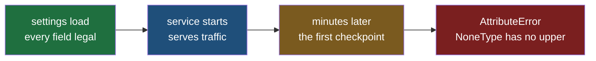
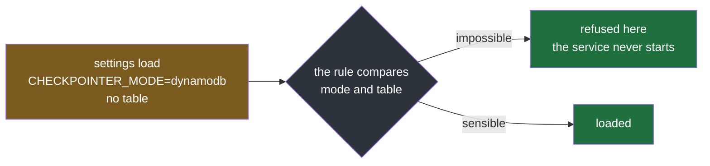
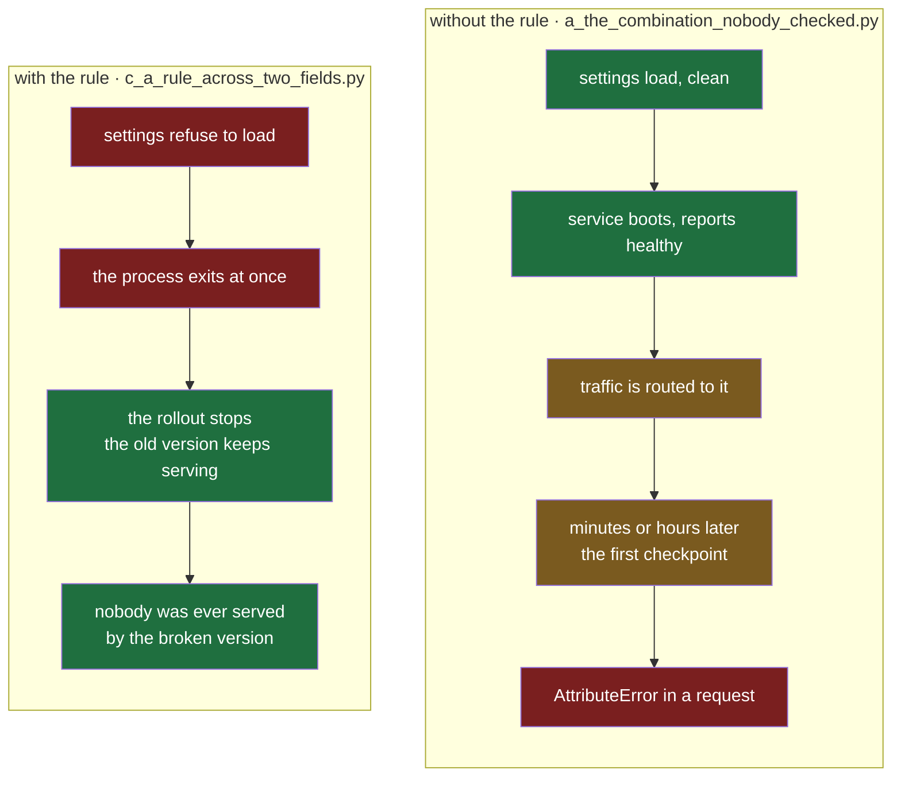

#config #pydantic #pydantic-settings #python

**Every setting can be individually legal and the configuration still impossible.** A type judges one value, on its own, with no idea what the others say — so the pairs that make no sense together sail through loading and fail later, somewhere far less convenient.

# Refuse To Start

> [!info] A type is a rule about one value: this must be an integer, this must be one of four words. A rule you write yourself is different — it runs while the settings are being loaded, and it can look at more than the value in front of it, including the other fields.

## Every value legal, the combination impossible

Two fields, both carrying everything [[02-Names-And-Types]] taught. `mode` is a fixed set, so a typo cannot happen. `table` is optional, because in memory mode there is nothing to name.

`src/config_lab/note03/a_the_combination_nobody_checked.py`:

```python
from typing import Literal

from pydantic_settings import BaseSettings, SettingsConfigDict


class CheckpointerSettings(BaseSettings):
    model_config = SettingsConfigDict(env_prefix="CHECKPOINTER_")

    mode: Literal["memory", "dynamodb"] = "memory"
    table: str | None = None


settings = CheckpointerSettings()
print("settings loaded:", settings)
print("the service starts, serves traffic, and later needs to save a checkpoint")
print("writing to table:", settings.table.upper())  # ty: ignore[unresolved-attribute]
```

The pair that makes sense:

```
$ CHECKPOINTER_MODE=dynamodb CHECKPOINTER_TABLE=xarvis-checkpoints uv run python src/config_lab/note03/a_the_combination_nobody_checked.py
settings loaded: mode='dynamodb' table='xarvis-checkpoints'
the service starts, serves traffic, and later needs to save a checkpoint
writing to table: XARVIS-CHECKPOINTS
```

The same class with the table left out:

```
$ CHECKPOINTER_MODE=dynamodb uv run python src/config_lab/note03/a_the_combination_nobody_checked.py
settings loaded: mode='dynamodb' table=None
the service starts, serves traffic, and later needs to save a checkpoint
Traceback (most recent call last):
  File "src/config_lab/note03/a_the_combination_nobody_checked.py", line 35, in <module>
    print("writing to table:", settings.table.upper())  # ty: ignore[unresolved-attribute]
                               ^^^^^^^^^^^^^^^^^^^^
AttributeError: 'NoneType' object has no attribute 'upper'
```

**The settings loaded.** `dynamodb` is a legal mode and `None` is a legal table, so nothing a type can check was violated — and the pair is still nonsense, because dynamodb mode has nowhere to write.



**Look at where the failure landed.** Not at the line that loads the settings, where a configuration problem belongs, but at the line that first uses the table — which in a real service is minutes or hours later, inside a request, in front of a user. The traceback names `NoneType`, not a variable anybody could go and set, and it names the file that happened to use the value rather than the file that defined it.

**Most real configuration mistakes have this shape.** Both halves are separately valid and the pair is not:

| The configuration | Each value on its own | Together |
|---|---|---|
| a storage mode with no destination | a legal mode, an empty table name | nowhere to write |
| a database address with no password | a legal address, no password given | the connection is refused at first use |
| a feature switched on with none of its settings filled in | a legal `true`, legal empty fields | the feature fails the first time it runs |

Each one starts cleanly and breaks later, and in every case the information needed to catch it was sitting in the settings object the whole time.

## A rule can fix a value before the type judges it

[[02-Names-And-Types]] established that a fixed set is case-sensitive. Now a deployment writes the log level the way everybody writes log levels, in lower case, and the service refuses to start. That refusal is correct and unhelpful: the value is not wrong, its spelling is.

A rule attached to one field can tidy the value first. `mode="before"` is the whole mechanism — it runs **before** the type check, so what the fixed set judges is not what the shell sent.

`src/config_lab/note03/b_fix_the_value_first.py`:

```python
from typing import Literal

from pydantic import ValidationError, field_validator
from pydantic_settings import BaseSettings


class Strict(BaseSettings):
    log_level: Literal["DEBUG", "INFO", "WARNING", "ERROR"] = "INFO"


class Normalising(BaseSettings):
    log_level: Literal["DEBUG", "INFO", "WARNING", "ERROR"] = "INFO"

    @field_validator("log_level", mode="before")
    @classmethod
    def _tidy(cls, value: object) -> object:
        return value.strip().upper() if isinstance(value, str) else value


print("--- no rule")
try:
    print("    log_level =", Strict().log_level)
except ValidationError as exc:
    print("   ", type(exc).__name__)
    print("   ", str(exc).splitlines()[2].strip())

print()
print("--- stripped and uppercased first")
try:
    print("    log_level =", Normalising().log_level)
except ValidationError as exc:
    print("   ", type(exc).__name__)
    print("   ", str(exc).splitlines()[2].strip())
```

```
$ LOG_LEVEL="info" uv run python src/config_lab/note03/b_fix_the_value_first.py
--- no rule

    ValidationError
    Input should be 'DEBUG', 'INFO', 'WARNING' or 'ERROR' [type=literal_error, input_value='info', input_type=str]

--- stripped and uppercased first
    log_level = INFO

$ LOG_LEVEL=" info " uv run python src/config_lab/note03/b_fix_the_value_first.py
--- no rule

    ValidationError
    Input should be 'DEBUG', 'INFO', 'WARNING' or 'ERROR' [type=literal_error, input_value=' info ', input_type=str]

--- stripped and uppercased first
    log_level = INFO

$ LOG_LEVEL="nonsense" uv run python src/config_lab/note03/b_fix_the_value_first.py
--- no rule
    ValidationError
    Input should be 'DEBUG', 'INFO', 'WARNING' or 'ERROR' [type=literal_error, input_value='nonsense', input_type=str]

--- stripped and uppercased first
    ValidationError
    Input should be 'DEBUG', 'INFO', 'WARNING' or 'ERROR' [type=literal_error, input_value='NONSENSE', input_type=str]
```

| What the shell set | No rule | Stripped and uppercased first |
|---|---|---|
| `LOG_LEVEL=INFO` | `INFO` | `INFO` |
| `LOG_LEVEL=info` | error | `INFO` |
| `LOG_LEVEL=" info "` | error | `INFO` |
| `LOG_LEVEL=debug` | error | `DEBUG` |
| `LOG_LEVEL=nonsense` | error | **error** |

**Three spellings that a person would call correct now load.** The service stops rejecting `info` for being lower case, and stops rejecting a value that a copied line left a space around.

**The check did not get weaker.** The last row is the proof: `nonsense` is still refused, and the report now shows `input_value='NONSENSE'` — the tidied value, because the rule ran first and the type judged what came out of it. A rule that normalises feeds the check rather than replacing it.

> [!important] A rule fixes exactly what you wrote it to fix
> `value.upper()` on its own left `" info "` failing, with an error saying the value should be one of four words while the screen showed a value that looked like one of them. Adding `.strip()` closed that. Nothing warns you which tidying you left out — the next value to trip it will be one with an inner space, or a quote a deployment tool wrapped around it, and the rule will keep passing the problem to a check that can only say no.

## A rule that sees every field at once

The previous rule was attached to one field and could only ever see that field's value. The combination from the first section needs two values compared, so the rule has to run somewhere that both of them exist.

`mode="after"` is that somewhere: it runs once **every field has been set**, so the rule receives a finished settings object and `self.mode` and `self.table` are both there to look at.

`src/config_lab/note03/c_a_rule_across_two_fields.py`:

```python
from typing import Literal

from pydantic import ValidationError, model_validator
from pydantic_settings import BaseSettings, SettingsConfigDict


class CheckpointerSettings(BaseSettings):
    model_config = SettingsConfigDict(env_prefix="CHECKPOINTER_")

    mode: Literal["memory", "dynamodb"] = "memory"
    table: str | None = None

    @model_validator(mode="after")
    def _dynamodb_needs_a_table(self) -> "CheckpointerSettings":
        if self.mode == "dynamodb" and not self.table:
            raise ValueError(
                "CHECKPOINTER_MODE=dynamodb requires CHECKPOINTER_TABLE to be set"
            )
        return self


try:
    settings = CheckpointerSettings()
    print("loaded:", settings)
except ValidationError as exc:
    print(type(exc).__name__)
    print(exc)
```

```
$ CHECKPOINTER_MODE=memory uv run python src/config_lab/note03/c_a_rule_across_two_fields.py
loaded: mode='memory' table=None

$ CHECKPOINTER_MODE=dynamodb CHECKPOINTER_TABLE=xarvis-checkpoints uv run python src/config_lab/note03/c_a_rule_across_two_fields.py
loaded: mode='dynamodb' table='xarvis-checkpoints'

$ CHECKPOINTER_MODE=dynamodb uv run python src/config_lab/note03/c_a_rule_across_two_fields.py
ValidationError
1 validation error for CheckpointerSettings
  Value error, CHECKPOINTER_MODE=dynamodb requires CHECKPOINTER_TABLE to be set [type=value_error, input_value={'mode': 'dynamodb'}, input_type=dict]
    For further information visit https://errors.pydantic.dev/2.13/v/value_error
```

**The two legal configurations still load.** Memory mode with no table is fine, and so is dynamodb with one. A rule that refuses a combination has to leave every sensible combination alone, or it is just a new way to break startup.

**The impossible one never starts.** This is the same configuration that loaded happily in the first section and then died at `settings.table.upper()` minutes later. Five lines moved that failure from a request in front of a user to the line that loads the settings.



Refusing to start is drawn green on purpose. A service that will not boot is the good outcome here: it fails where the problem is, with nobody watching, and the configuration that caused it is the only thing that has to change.

Two details of that report are worth keeping.

**There is no field name above the message.** A bad integer prints `ttl_seconds` on its own line first; this one does not, because the complaint belongs to the whole object rather than to one field. So the sentence you write is the only place a name can appear — which is why the message names `CHECKPOINTER_TABLE` and not `table`.

**You raise a plain `ValueError` and the library wraps it.** It arrives as `Value error, ...` inside an ordinary `ValidationError`, so whatever already catches a malformed integer at startup catches this too, with no new exception type to handle.

## What the rule actually buys

Adding a rule sounds like tidiness. It is not — it moves the failure, and everything that matters follows from where it lands.

The same broken configuration, `CHECKPOINTER_MODE=dynamodb` with no table, under the two files above:



**Who finds it.** Without the rule, a person using the service finds it, inside a request. With it, the deployment finds it: a new version starts as a new process, that process exits immediately with a non-zero code, so it never comes up healthy — the rollout stalls or rolls back, the previous version keeps serving, and the message is in the deploy log of whoever pressed the button, seconds after they pressed it.

**When.** The gap is not seconds. The crash needs the first checkpoint, the first lookup, the first retry — whatever path touches that setting. A setting used only on an error path can sit broken for weeks, which is how a deploy nobody remembers becomes an outage.

**What the message names.** `'NoneType' object has no attribute 'upper'` names a Python type and the file that happened to use the value. The refusal names the variable to set. One of those is a debugging session; the other is a one-line fix.

**How much is running.** A service that boots with impossible configuration is lying: it reports healthy, accepts work, and fails only the paths that touch the broken part. Half-working is harder to diagnose than not working, and it happens in front of people.

| | Without the rule | With the rule |
|---|---|---|
| Found by | a user, in a request | the deployment, before any traffic |
| Found when | first use of that setting, possibly weeks later | at startup, every time |
| The message says | `NoneType` has no attribute | which variable to set |
| Meanwhile | a healthy-looking service serving broken paths | the previous version, serving normally |

The rule costs nothing to run — once, while the settings load, not per request. So the trade is simple: **every impossible combination you can describe becomes a startup refusal, and the ones you cannot describe stay as crashes.**
