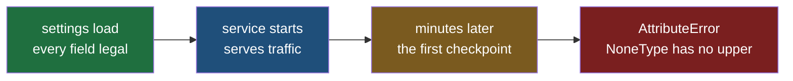
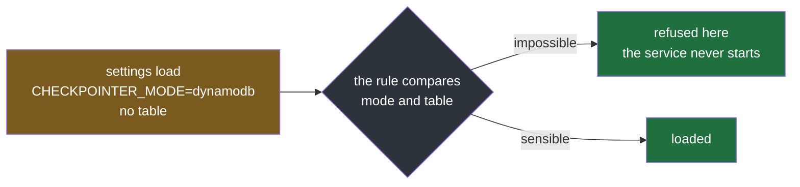
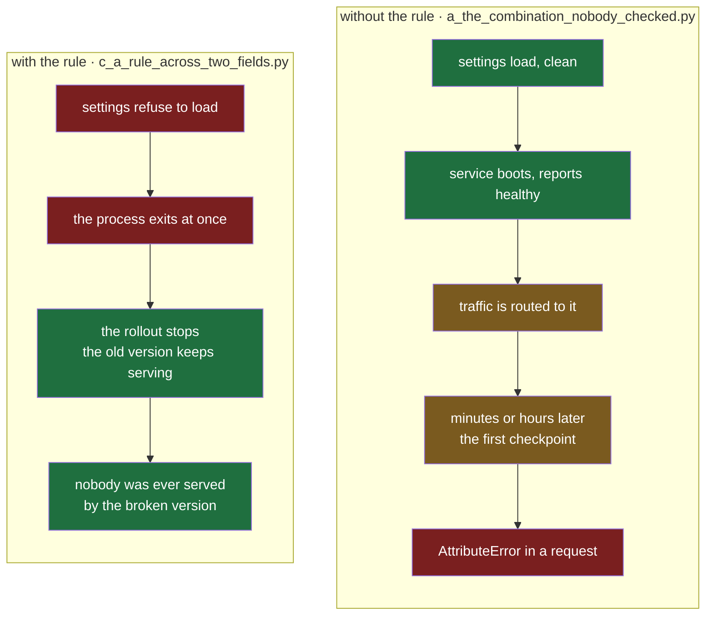

#config #pydantic #pydantic-settings #python

**Every setting can be individually legal and the configuration still impossible.** A type judges one value, on its own, with no idea what the others say — so the pairs that make no sense together sail through loading and fail later, somewhere far less convenient.

# Refuse To Start

> [!info] A type is a rule about one value: this must be an integer, this must be one of four words. A rule you write yourself is different — it runs while the settings are being loaded, and it can look at more than the value in front of it, including the other fields. Both kinds come from **pydantic-settings** and **pydantic**, the libraries this folder uses.

## Every value legal, the combination impossible

Two fields, both carrying everything [[02-Names-And-Types]] taught. `mode` is a fixed set, so a typo cannot happen. `table` is optional, because in memory mode there is nothing to name.

`src/config_lab/note03/a_the_combination_nobody_checked.py`:

```python
from typing import Literal

from pydantic_settings import BaseSettings, SettingsConfigDict


class CheckpointerSettings(BaseSettings):
    model_config = SettingsConfigDict(env_prefix="CHECKPOINTER_")

    mode: Literal["memory", "dynamodb"] = "memory"
    table: str | None = None


settings = CheckpointerSettings()
print("settings loaded:", settings)
print("the service starts, serves traffic, and later needs to save a checkpoint")
print("writing to table:", settings.table.upper())  # ty: ignore[unresolved-attribute]
```

The comment on the last line tells the type checker to allow it. The checker can see that `table` may be `None` and that `None` has no `.upper()` — being wrong there is exactly what this file is for, so the check is switched off for that one line.

The pair that makes sense:

```
$ CHECKPOINTER_MODE=dynamodb CHECKPOINTER_TABLE=xarvis-checkpoints uv run python src/config_lab/note03/a_the_combination_nobody_checked.py
settings loaded: mode='dynamodb' table='xarvis-checkpoints'
the service starts, serves traffic, and later needs to save a checkpoint
writing to table: XARVIS-CHECKPOINTS
```

The same class with the table left out:

```
$ CHECKPOINTER_MODE=dynamodb uv run python src/config_lab/note03/a_the_combination_nobody_checked.py
settings loaded: mode='dynamodb' table=None
the service starts, serves traffic, and later needs to save a checkpoint
Traceback (most recent call last):
  File "src/config_lab/note03/a_the_combination_nobody_checked.py", line 35, in <module>
    print("writing to table:", settings.table.upper())  # ty: ignore[unresolved-attribute]
                               ^^^^^^^^^^^^^^^^^^^^
AttributeError: 'NoneType' object has no attribute 'upper'
```

**The settings loaded.** `dynamodb` is a legal mode and `None` is a legal table, so nothing a type can check was violated — and the pair is still nonsense, because dynamodb mode has nowhere to write.



**Look at where the failure landed.** Not at the line that loads the settings, where a configuration problem belongs, but at the line that first uses the table — which in a real service is minutes or hours later, inside a request, in front of a user. The traceback names `NoneType`, not a variable anybody could go and set, and it points at the line that used the value rather than the line that declared it. In this small file those are a few lines apart; in a service they are different modules, written by different people.

**Most real configuration mistakes have this shape.** Both halves are separately valid and the pair is not:

| The configuration | Each value on its own | Together |
|---|---|---|
| a storage mode with no destination | a legal mode, an empty table name | nowhere to write |
| a database address with no password | a legal address, no password given | the connection is refused at first use |
| a feature switched on with none of its settings filled in | a legal `true`, legal empty fields | the feature fails the first time it runs |

Each one starts cleanly and breaks later, and in every case the information needed to catch it was sitting in the settings object the whole time.

## A rule can fix a value before the type judges it

[[02-Names-And-Types]] established that a fixed set is case-sensitive. Now a deployment writes the log level the way everybody writes log levels, in lower case, and the service refuses to start. That refusal is correct and unhelpful: the value is not wrong, its spelling is.

A rule attached to one field can tidy the value first. `mode="before"` is the whole mechanism — it runs **before** the type check, so what the fixed set judges is not what the shell sent.

That `mode` is an argument to the decorator and has nothing to do with the `mode` field in the checkpointer class above. The two names collide by accident, and both appear in this note.

`src/config_lab/note03/b_fix_the_value_first.py`:

```python
from typing import Literal

from pydantic import ValidationError, field_validator
from pydantic_settings import BaseSettings


class Strict(BaseSettings):
    log_level: Literal["DEBUG", "INFO", "WARNING", "ERROR"] = "INFO"


class Normalising(BaseSettings):
    log_level: Literal["DEBUG", "INFO", "WARNING", "ERROR"] = "INFO"

    @field_validator("log_level", mode="before")
    @classmethod
    def _tidy(cls, value: object) -> object:
        return value.strip().upper() if isinstance(value, str) else value


print("--- no rule")
try:
    print("    log_level =", Strict().log_level)
except ValidationError as exc:
    print("   ", type(exc).__name__)
    print("   ", str(exc).splitlines()[2].strip())

print()
print("--- stripped and uppercased first")
try:
    print("    log_level =", Normalising().log_level)
except ValidationError as exc:
    print("   ", type(exc).__name__)
    print("   ", str(exc).splitlines()[2].strip())
```

```
$ LOG_LEVEL="info" uv run python src/config_lab/note03/b_fix_the_value_first.py
--- no rule
    ValidationError
    Input should be 'DEBUG', 'INFO', 'WARNING' or 'ERROR' [type=literal_error, input_value='info', input_type=str]

--- stripped and uppercased first
    log_level = INFO

$ LOG_LEVEL=" info " uv run python src/config_lab/note03/b_fix_the_value_first.py
--- no rule
    ValidationError
    Input should be 'DEBUG', 'INFO', 'WARNING' or 'ERROR' [type=literal_error, input_value=' info ', input_type=str]

--- stripped and uppercased first
    log_level = INFO

$ LOG_LEVEL="nonsense" uv run python src/config_lab/note03/b_fix_the_value_first.py
--- no rule
    ValidationError
    Input should be 'DEBUG', 'INFO', 'WARNING' or 'ERROR' [type=literal_error, input_value='nonsense', input_type=str]

--- stripped and uppercased first
    ValidationError
    Input should be 'DEBUG', 'INFO', 'WARNING' or 'ERROR' [type=literal_error, input_value='NONSENSE', input_type=str]
```

| What the shell set | No rule | Stripped and uppercased first |
|---|---|---|
| `LOG_LEVEL=INFO` | `INFO` | `INFO` |
| `LOG_LEVEL=info` | error | `INFO` |
| `LOG_LEVEL=" info "` | error | `INFO` |
| `LOG_LEVEL=debug` | error | `DEBUG` |
| `LOG_LEVEL=nonsense` | error | **error** |

**Three spellings that a person would call correct now load.** The service stops rejecting `info` for being lower case, and stops rejecting a value that a copied line left a space around.

**The check did not get weaker.** The last row is the proof: `nonsense` is still refused, and the report now shows `input_value='NONSENSE'` — the tidied value, because the rule ran first and the type judged what came out of it. A rule that normalises feeds the check rather than replacing it.

> [!important] A rule fixes exactly what you wrote it to fix
> `value.upper()` on its own left `" info "` failing, with an error saying the value should be one of four words while the screen showed a value that looked like one of them. Adding `.strip()` closed that. Nothing warns you which tidying you left out — the next value to trip it will be one with an inner space, or a quote a deployment tool wrapped around it, and the rule will keep passing the problem to a check that can only say no.

## A rule that sees every field at once

The previous rule was attached to one field and could only ever see that field's value. The combination from the first section needs two values compared, so the rule has to run somewhere that both of them exist.

`mode="after"` is that somewhere: it runs once **every field has been set**, so the rule receives a finished settings object and `self.mode` and `self.table` are both there to look at.

`src/config_lab/note03/c_a_rule_across_two_fields.py`:

```python
from typing import Literal

from pydantic import ValidationError, model_validator
from pydantic_settings import BaseSettings, SettingsConfigDict


class CheckpointerSettings(BaseSettings):
    model_config = SettingsConfigDict(env_prefix="CHECKPOINTER_")

    mode: Literal["memory", "dynamodb"] = "memory"
    table: str | None = None

    @model_validator(mode="after")
    def _dynamodb_needs_a_table(self) -> "CheckpointerSettings":
        if self.mode == "dynamodb" and not self.table:
            raise ValueError(
                "CHECKPOINTER_MODE=dynamodb requires CHECKPOINTER_TABLE to be set"
            )
        return self


try:
    settings = CheckpointerSettings()
    print("loaded:", settings)
except ValidationError as exc:
    print(type(exc).__name__)
    print(exc)
```

```
$ CHECKPOINTER_MODE=memory uv run python src/config_lab/note03/c_a_rule_across_two_fields.py
loaded: mode='memory' table=None

$ CHECKPOINTER_MODE=dynamodb CHECKPOINTER_TABLE=xarvis-checkpoints uv run python src/config_lab/note03/c_a_rule_across_two_fields.py
loaded: mode='dynamodb' table='xarvis-checkpoints'

$ CHECKPOINTER_MODE=dynamodb uv run python src/config_lab/note03/c_a_rule_across_two_fields.py
ValidationError
1 validation error for CheckpointerSettings
  Value error, CHECKPOINTER_MODE=dynamodb requires CHECKPOINTER_TABLE to be set [type=value_error, input_value={'mode': 'dynamodb'}, input_type=dict]
    For further information visit https://errors.pydantic.dev/2.13/v/value_error
```

**The two legal configurations still load.** Memory mode with no table is fine, and so is dynamodb with one. A rule that refuses a combination has to leave every sensible combination alone, or it is just a new way to break startup.

**The impossible one never starts.** This is the same configuration that loaded happily in the first section and then died at `settings.table.upper()` minutes later. The rule moved that failure from a request in front of a user to the line that loads the settings.



Refusing to start is drawn green on purpose. A service that will not boot is the good outcome here: it fails where the problem is, with nobody watching, and the configuration that caused it is the only thing that has to change.

Two details of that report are worth keeping.

**There is no field name above the message.** A bad integer prints `ttl_seconds` on its own line first; this one does not, because the complaint belongs to the whole object rather than to one field. So the sentence you write is the only place a name can appear — which is why the message names `CHECKPOINTER_TABLE` and not `table`.

**You raise a plain `ValueError` and the library wraps it.** It arrives as `Value error, ...` inside an ordinary `ValidationError`, so whatever already catches a malformed integer at startup catches this too, with no new exception type to handle.

## What the rule actually buys

Adding a rule sounds like tidiness. It is not — it moves the failure, and everything that matters follows from where it lands.

The same broken configuration, `CHECKPOINTER_MODE=dynamodb` with no table, under the two files above:



**Who finds it.** Without the rule, a person using the service finds it, inside a request. With it, the **deployment** finds it: a new version starts as a new process, that process exits immediately with a non-zero code, so it never comes up healthy — the rollout stalls or rolls back, the previous version keeps serving, and the message is in the deploy log of whoever pressed the button, seconds after they pressed it.

**When.** The gap is not seconds. The crash needs the first checkpoint, the first lookup, the first retry — whatever path touches that setting. A setting used only on an error path can sit broken for weeks, which is how a deploy nobody remembers becomes an outage.

**What the message names.** `'NoneType' object has no attribute 'upper'` names a Python type and the file that happened to use the value. The refusal names the variable to set. One of those is a debugging session; the other is a one-line fix.

**How much is running.** A service that boots with impossible configuration is lying: it reports healthy, accepts work, and fails only the paths that touch the broken part. Half-working is harder to diagnose than not working, and it happens in front of people.

| | Without the rule | With the rule |
|---|---|---|
| Found by | a user, in a request | the deployment, before any traffic |
| Found when | first use of that setting, possibly weeks later | at startup, every time |
| The message says | `NoneType` has no attribute | which variable to set |
| Meanwhile | a healthy-looking service serving broken paths | the previous version, serving normally |

The rule costs nothing to run — once, while the settings load, not per request. So the trade is simple: **every impossible combination you can describe becomes a startup refusal, and the ones you cannot describe stay as crashes.**

## The refusal has to say what to do

The rule now fires at the right moment. What it says when it fires is a separate decision, and it is entirely yours: the library prints your sentence and adds nothing to it.

`src/config_lab/note03/d_say_what_to_do.py`:

```python
from typing import Literal

from pydantic import ValidationError, model_validator
from pydantic_settings import BaseSettings, SettingsConfigDict


class Vague(BaseSettings):
    model_config = SettingsConfigDict(env_prefix="CHECKPOINTER_")

    mode: Literal["memory", "dynamodb"] = "memory"
    table: str | None = None

    @model_validator(mode="after")
    def _dynamodb_needs_a_table(self) -> "Vague":
        if self.mode == "dynamodb" and not self.table:
            raise ValueError("invalid checkpointer configuration")
        return self


class Actionable(BaseSettings):
    model_config = SettingsConfigDict(env_prefix="CHECKPOINTER_")

    mode: Literal["memory", "dynamodb"] = "memory"
    table: str | None = None

    @model_validator(mode="after")
    def _dynamodb_needs_a_table(self) -> "Actionable":
        if self.mode == "dynamodb" and not self.table:
            raise ValueError(
                "CHECKPOINTER_MODE=dynamodb requires CHECKPOINTER_TABLE to be set"
            )
        return self


print("--- the vague message")
try:
    print("   ", Vague())
except ValidationError as exc:
    print("   ", str(exc).splitlines()[1].strip())

print()
print("--- the actionable message")
try:
    print("   ", Actionable())
except ValidationError as exc:
    print("   ", str(exc).splitlines()[1].strip())
```

```
$ CHECKPOINTER_MODE=dynamodb uv run python src/config_lab/note03/d_say_what_to_do.py
--- the vague message
    Value error, invalid checkpointer configuration [type=value_error, input_value={'mode': 'dynamodb'}, input_type=dict]

--- the actionable message
    Value error, CHECKPOINTER_MODE=dynamodb requires CHECKPOINTER_TABLE to be set [type=value_error, input_value={'mode': 'dynamodb'}, input_type=dict]
```

Everything around the sentence is identical — same class shape, same `value_error`, same `input_value`. **The only difference between a one-line fix and a twenty-minute hunt is the string that was typed.**

Read the vague one as the person on call. It says a subsystem is unhappy. It does not say which setting, which value caused it, or what to type next, so the next step is to open the code, find the class, read the rule, and work out that `table` is fed by `CHECKPOINTER_TABLE` — which [[02-Names-And-Types]] showed is not guessable from the field name, because a prefix and an alias each change it.

Three things the actionable version carries, each doing a job:

| Part of the message | What it prevents |
|---|---|
| `CHECKPOINTER_MODE=dynamodb` — the condition | somebody turning the mode off to make the error go away, without knowing why the other setting became required |
| `CHECKPOINTER_TABLE` — the variable, with its prefix | hunting through the class to translate a field name into the name the deployment actually sets |
| `requires ... to be set` — the verb | reading a description of a problem and still not knowing the action |

> [!important] A model-level report has no field name line
> A bad integer prints `ttl_seconds` above its message, because a field is complaining. Here the object is complaining, so nothing is printed above the sentence. Whatever name the reader needs has to be inside it.

> [!warning] The variable name in that message is a copy, and nothing checks it
> Six months later, somebody pins the table to the name the deployment already uses, and does not touch the message:
>
> ```python
> table: str | None = Field(None, validation_alias="DYNAMODB_TABLE")
> ```
>
> The class now reads `DYNAMODB_TABLE`. The message still says `CHECKPOINTER_TABLE`, and here is what that does to whoever meets it:
>
> ```
> $ CHECKPOINTER_MODE=dynamodb ...
> Value error, CHECKPOINTER_MODE=dynamodb requires CHECKPOINTER_TABLE to be set
>
> $ CHECKPOINTER_MODE=dynamodb CHECKPOINTER_TABLE=xarvis-checkpoints ...
> Value error, CHECKPOINTER_MODE=dynamodb requires CHECKPOINTER_TABLE to be set
>
> $ CHECKPOINTER_MODE=dynamodb DYNAMODB_TABLE=xarvis-checkpoints ...
> loaded: mode='dynamodb' table='xarvis-checkpoints'
> ```
>
> **The second run is the damage.** They did exactly what the refusal told them to do, redeployed, and got the same refusal back — so now the message looks broken and so does the service. A vague message would at least have sent them to read the class. This one sent them to the wrong variable and kept its story straight the whole way.
>
> The duplication is still worth accepting. It sits in the same file as the alias, so the drift window is one screen, and the damage is a misleading message rather than wrong behaviour. In a service it earns a test: build the impossible configuration and assert the message contains the variable the class actually reads. Deriving the name in code reads worse than the duplicate it removes.

## A rule that is security, not correctness

Same mechanism as the rule two sections ago — one that sees every field — and a completely different reason for existing.

`src/config_lab/note03/e_a_rule_that_is_security.py`:

```python
from typing import Literal

from pydantic import ValidationError, model_validator
from pydantic_settings import BaseSettings


class Unguarded(BaseSettings):
    env: Literal["local", "dev", "staging", "prod"] = "local"
    skip_session_auth: bool = False


class Guarded(BaseSettings):
    env: Literal["local", "dev", "staging", "prod"] = "local"
    skip_session_auth: bool = False

    @model_validator(mode="after")
    def _no_auth_bypass_outside_development(self) -> "Guarded":
        if self.skip_session_auth and self.env not in {"local", "dev"}:
            raise ValueError(
                f"SKIP_SESSION_AUTH=true is not allowed with ENV={self.env}"
            )
        return self


print("--- no rule")
unguarded = Unguarded()
print("    loaded:", unguarded)
print("    requests are served with auth checks skipped:", unguarded.skip_session_auth)

print()
print("--- with the rule")
try:
    guarded = Guarded()
    print("    loaded:", guarded)
except ValidationError as exc:
    print("   ", str(exc).splitlines()[1].strip())
```

```
$ ENV=prod SKIP_SESSION_AUTH=true uv run python src/config_lab/note03/e_a_rule_that_is_security.py
--- no rule
    loaded: env='prod' skip_session_auth=True
    requests are served with auth checks skipped: True

--- with the rule
    Value error, SKIP_SESSION_AUTH=true is not allowed with ENV=prod [type=value_error, input_value={'env': 'prod', 'skip_session_auth': 'true'}, input_type=dict]

$ ENV=prod uv run python src/config_lab/note03/e_a_rule_that_is_security.py
--- no rule
    loaded: env='prod' skip_session_auth=False
    requests are served with auth checks skipped: False

--- with the rule
    loaded: env='prod' skip_session_auth=False
```

**Read the unguarded run again.** It loaded. It would keep loading, and the service would run perfectly: every request served, nothing in the logs, no crash on any path. This configuration does not fail. It serves production traffic with the authentication check switched off.

That is what separates this rule from every earlier one in this note. The rule across two fields moved a crash that was coming anyway, and the crash was the symptom. **Here there is no symptom to move.** The only evidence that anything is wrong sits in the settings object, which is exactly where this rule reads it.

It also settles where the check belongs. The code is byte-identical in both deployments, so there is nothing wrong in the diff for a reviewer to catch, and no test fails. The danger appears at deploy time, when two variables land together — often because a development env file was copied as a starting point. **A reviewer never sees the environment. The configuration does.**

Now the condition itself, which is the part worth arguing over:

```python
if self.skip_session_auth and self.env not in {"local", "dev"}:
```

```
$ ENV=staging SKIP_SESSION_AUTH=true uv run python src/config_lab/note03/e_a_rule_that_is_security.py
--- with the rule
    Value error, SKIP_SESSION_AUTH=true is not allowed with ENV=staging
```

The rule lists where the bypass **is** allowed, so staging is refused too. The other natural way to write it is `self.env == "prod"`, and it reads as obviously correct — production is the place that matters.

| The condition | Refuses in prod | Refuses in staging | Refuses in an environment added next year |
|---|---|---|---|
| `env == "prod"` | yes | **no** | **no** |
| `env not in {"local", "dev"}` | yes | yes | yes |

> [!danger] Name where it is allowed, not where it is forbidden
> A list of forbidden places is wrong the moment somebody adds a place. `env == "prod"` leaves the authentication bypass available in staging today, and in whatever environment is created next — each of which usually holds real customer data, and none of which anybody revisits this rule for.
>
> A list of allowed places fails the other way: a new environment is refused until somebody decides it belongs on the list. That is the direction you want a mistake to point: when a safety check meets something it was never told about, the safe answer is no.

## A named question, defined once

Three places in one service all want the same answer — is the graph database configured? — and each asks it slightly differently, because each was written on a different day.

`src/config_lab/note03/f_three_call_sites_disagree.py`:

```python
from pydantic_settings import BaseSettings, SettingsConfigDict


class Neo4jSettings(BaseSettings):
    model_config = SettingsConfigDict(env_prefix="NEO4J_")

    uri: str | None = None
    username: str = "neo4j"
    password: str | None = None


settings = Neo4jSettings()

print("settings:", settings)
print(
    "  the startup path asks    if settings.uri                       ->",
    bool(settings.uri),
)
print(
    "  the health check asks    if settings.uri and settings.password ->",
    bool(settings.uri and settings.password),
)
print(
    "  the background job asks  if settings.password                  ->",
    bool(settings.password),
)
```

```
$ NEO4J_URI=bolt://localhost:7687 uv run python src/config_lab/note03/f_three_call_sites_disagree.py
settings: uri='bolt://localhost:7687' username='neo4j' password=None
  the startup path asks    if settings.uri                       -> True
  the health check asks    if settings.uri and settings.password -> False
  the background job asks  if settings.password                  -> False

$ NEO4J_URI=bolt://localhost:7687 NEO4J_PASSWORD=secret uv run python src/config_lab/note03/f_three_call_sites_disagree.py
settings: uri='bolt://localhost:7687' username='neo4j' password='secret'
  the startup path asks    if settings.uri                       -> True
  the health check asks    if settings.uri and settings.password -> True
  the background job asks  if settings.password                  -> True
```

**One settings object, three answers.** The startup path opens a connection pool, the health check reports the feature as off, and the background job never runs — from the same configuration, in the same process.

Nobody wrote a bug. Each condition is reasonable on its own, and they agree on both tidy configurations. They disagree only on the half-filled one, which is the configuration that actually happens: somebody set the address and forgot the password.

`src/config_lab/note03/g_a_named_question.py`:

```python
from pydantic import ValidationError, model_validator
from pydantic_settings import BaseSettings, SettingsConfigDict


class Neo4jSettings(BaseSettings):
    model_config = SettingsConfigDict(env_prefix="NEO4J_")

    uri: str | None = None
    username: str = "neo4j"
    password: str | None = None

    @property
    def configured(self) -> bool:
        return self.uri is not None

    @model_validator(mode="after")
    def _uri_needs_a_password(self) -> "Neo4jSettings":
        if self.uri and not self.password:
            raise ValueError("NEO4J_URI is set but NEO4J_PASSWORD is not")
        return self


try:
    settings = Neo4jSettings()
    print("settings:", settings)
    print("  every call site asks  settings.configured ->", settings.configured)
except ValidationError as exc:
    print(" ", str(exc).splitlines()[1].strip())
```

```
$ uv run python src/config_lab/note03/g_a_named_question.py
settings: uri=None username='neo4j' password=None
  every call site asks  settings.configured -> False

$ NEO4J_URI=bolt://localhost:7687 uv run python src/config_lab/note03/g_a_named_question.py
  Value error, NEO4J_URI is set but NEO4J_PASSWORD is not [type=value_error, input_value={'uri': 'bolt://localhost:7687'}, input_type=dict]

$ NEO4J_URI=bolt://localhost:7687 NEO4J_PASSWORD=secret uv run python src/config_lab/note03/g_a_named_question.py
settings: uri='bolt://localhost:7687' username='neo4j' password='secret'
  every call site asks  settings.configured -> True
```

`configured` is a property: it is read like an attribute — `settings.configured`, with no parentheses — and runs that function every time it is read.

**The property gives the question one name and one definition.** Every call site reads `settings.configured`, so there is nothing left to re-derive and nothing to drift. It also renames the idea: call sites stop talking about whether a URI is present and start talking about whether the feature is on, which is what they meant all along.

**The rule is what keeps that definition short.** `return self.uri is not None` can be one comparison only because the half-filled case no longer exists — the middle run refuses it at startup. Without the rule, `configured` would have to mention the password too, and every reader would be back to wondering which fields belong in the answer.

So the two halves of this note meet here: **the rule deletes the impossible states, and the named question describes what is left.**

## Why that is a property and not a field

`configured: bool = False` would read as a tidier way to write the same thing. It is not, and one run says why.

`src/config_lab/note03/h_why_not_a_field.py`:

```python
from pydantic_settings import BaseSettings, SettingsConfigDict


class AsAField(BaseSettings):
    model_config = SettingsConfigDict(env_prefix="NEO4J_")

    uri: str | None = None
    configured: bool = False


class AsAProperty(BaseSettings):
    model_config = SettingsConfigDict(env_prefix="NEO4J_")

    uri: str | None = None

    @property
    def configured(self) -> bool:
        return self.uri is not None


as_a_field = AsAField()
print("as a field    ", as_a_field, "  configured ->", as_a_field.configured)

as_a_property = AsAProperty()
print("as a property ", as_a_property, "  configured ->", as_a_property.configured)
```

```
$ NEO4J_CONFIGURED=true uv run python src/config_lab/note03/h_why_not_a_field.py
as a field     uri=None configured=True   configured -> True
as a property  uri=None   configured -> False
```

**A field is read from the environment.** So a field named `configured` can be set by somebody who has no database at all, and the object then carries an answer that contradicts the very fields it claims to summarise: `uri=None configured=True`. Every call site that trusts it goes down the configured path and fails at the first connection.

A property has no such door. It cannot be assigned, it is worked out from the fields each time it is read, and it therefore cannot disagree with them or go stale if a value is ever replaced.

| | A field `configured: bool` | A property `configured` |
|---|---|---|
| Where the answer comes from | whatever `NEO4J_CONFIGURED` says | the fields, every time it is read |
| Can it contradict the fields | **yes**, as above | no |
| Can something set it | yes, including the environment | no |
| Shows up in the settings dump | yes, as data | no, it is derived |

> [!important] Derived answers are computed, never stored
> The test is simple: if the answer can be worked out from other fields, it must not be a field. A stored copy of a derived fact is a second source of truth, and configuration already has enough of those — this note began with a class whose two fields disagreed, and ended by removing the last place where an answer could disagree with the values it came from.
